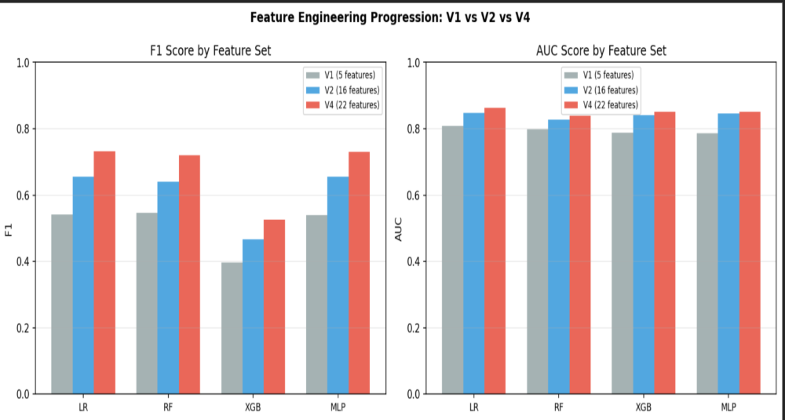
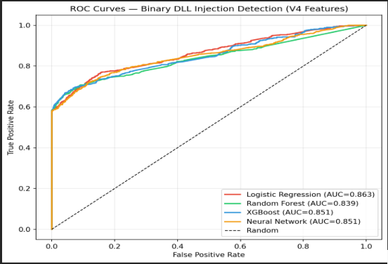
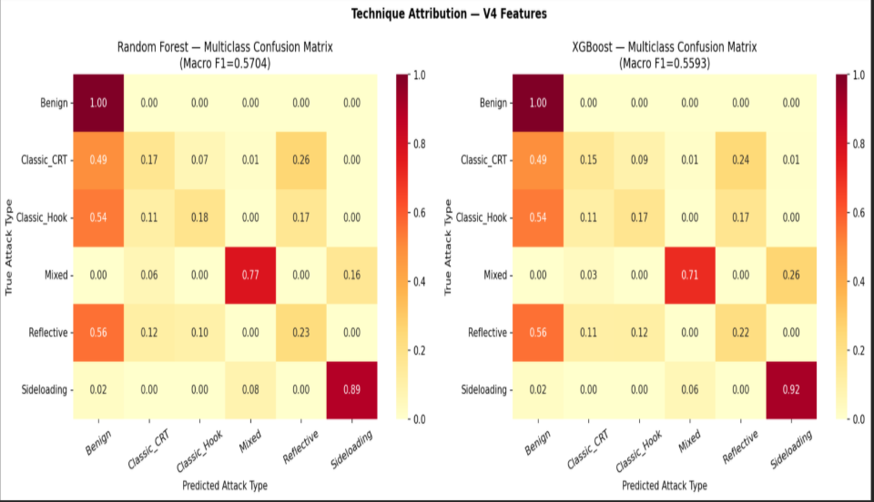
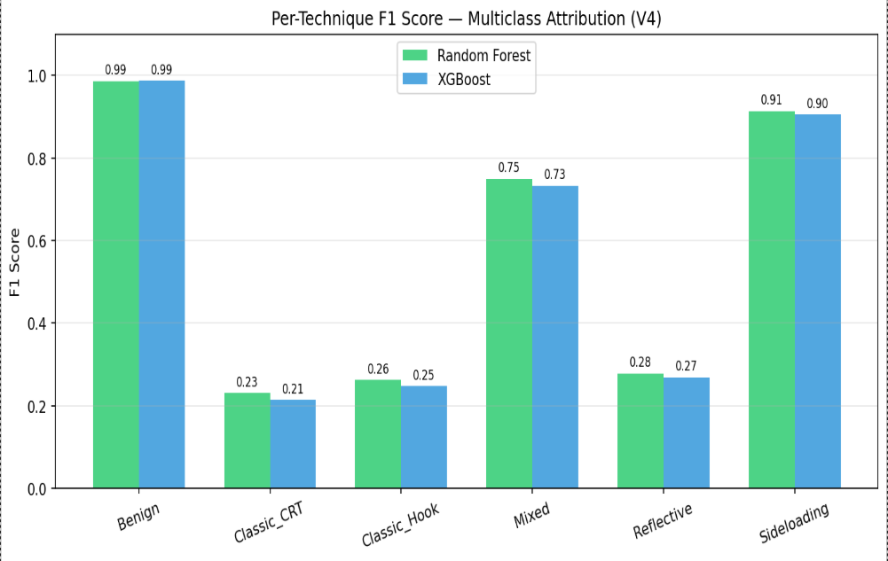
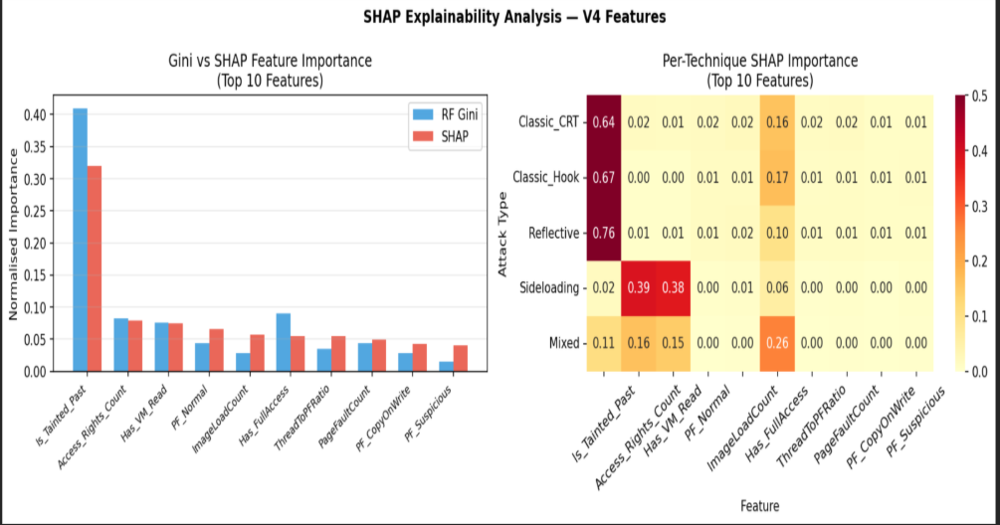
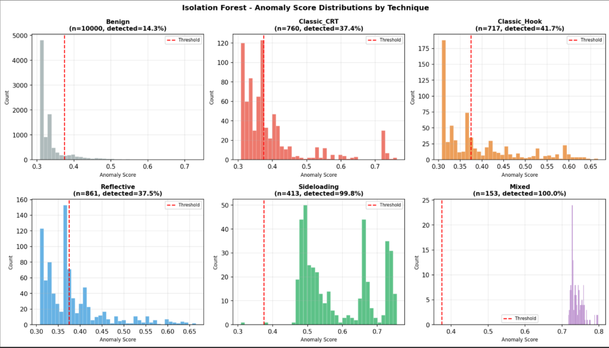
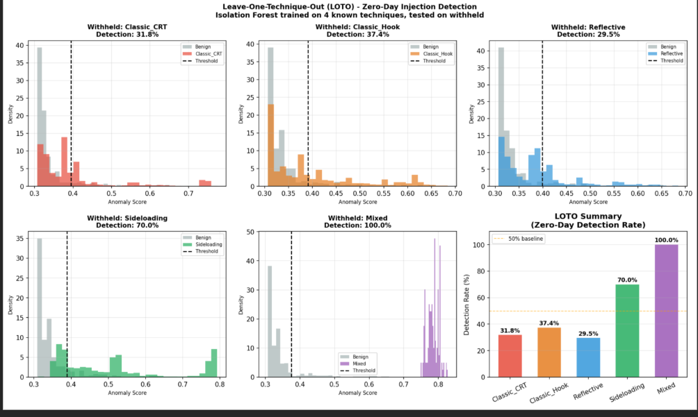

How I built an ML-based detection pipeline using ETW and Sysmon, what worked, what broke, and the architectural ceiling I didn't see coming.

## Why I Built This

Process injection is one of the most persistent problems in defensive security. Attackers don't drop files anymore  they slide malicious code into legitimate processes like explorer.exe or svchost.exe, run entirely in memory, and leave almost no trace. Conti ransomware used it. Duqu 2.0 used it. The Maranhão Stealer campaign in May 2025 used reflective DLL injection to bypass AppBound encryption in Chrome and Edge.
The problem isn't just that it happens  it's that traditional detection consistently fails. Signature-based antivirus needs known patterns. Manual forensic analysis takes hours. Neither scales.
My question was simple: can we do better using tools that are already on every Windows machine?

No commercial EDR. No expensive licensing. Just Event Tracing for Windows (ETW) and Sysmon  and machine learning trained on the telemetry they produce.

## The Lab Setup

Everything ran in an isolated Windows 10 virtual machine with no network access. Two monitoring tools ran concurrently during every session:

**Sysmon v15** with a comprehensive SwiftOnSecurity-based configuration covering 30 event types including:
- Process creation (EID 1)
- Remote thread creation (EID 8)
- Process access (EID 10)
- Image loads (EID 7)
- Network connections (EID 3)
```
https://github.com/swiftonsecurity/sysmon-config
```

**Sealighter** - an ETW consumer producing structured JSON output from kernel providers, capturing:

- Page fault events (normal, copy-on-write, suspicious, large region)
- Thread creation and termination with external thread flags
- Image load events with signature level and file path metadata

The two sources complement each other perfectly. Sysmon gives you structured, human-readable process-level events. ETW gives you low-level memory subsystem signals that Sysmon doesn't capture. Combined, they give a complete behavioural picture.

I collected **12 benign sessions** (normal Windows activity  browsing, file management, document editing) and **79 malicious sessions** across five injection technique categories.

## The Five Attack Techniques
I deliberately chose techniques that span from noisy and detectable to near-invisible:

**Classic CreateRemoteThread (Classic_CRT)** The canonical T1055 sequence: OpenProcess → VirtualAllocEx → WriteProcessMemory → CreateRemoteThread. This is the textbook injection  loud, observable, leaves process access events with granted access 0x1FFFFF. Implemented using  the Pinjectra library and atomic red .

**Classic Hook Injection (Classic_Hook)** Instead of creating a new remote thread, this technique injects into existing threads using SetWindowsHookEx or NtQueueApcThread. The target process loads the malicious code when processing Windows messages or APC callbacks - avoiding the CreateRemoteThread signal entirely. Implemented using PSInject and custom hook tools.

**Reflective DLL Injection (Reflective)** The technique that makes defenders lose sleep. The injected DLL contains its own PE loader - it maps itself into the target process without invoking the Windows loader. No DLL file on disk. No entry in the PEB loader lists. No Sysmon EID 7 image load events. Almost invisible from the event stream. Implemented using Stephen Fewer's ReflectiveDLLInjection framework and Donut shellcode generation.

**DLL Sideloading (Sideloading)** Exploits the Windows DLL search order by placing a malicious DLL with the same name as a legitimate dependency in the application directory. The signed legitimate process loads it automatically on startup  no cross-process writes required. Implemented using Atomic Red Team T1574.001 test cases. Used by APT41 and Lazarus Group extensively.

**Mixed Multi-Stage (Mixed)** Compound attack chains combining multiple techniques  typically Classic_CRT for initial access followed by hook establishment for persistence.

## Building the Dataset

Each session produced two files: an ETW JSON log from Sealighter and a Sysmon CSV. The first challenge was timestamp alignment ETW logs in UTC, Sysmon in local time. I computed the timezone offset by comparing the first matching event across both sources and applying the nearest whole-hour correction.

Then I aggregated everything into 5-second fixed-duration observation windows per process ID. Why 5 seconds? Injection sequences OpenProcess through CreateRemoteThread  typically complete within 1-3 seconds. Five seconds captures the full mechanics while providing enough event accumulation for meaningful feature computation.
Each window became one row in the dataset. Windows with zero events were discarded.
For labelling, Sysmon EID 10 Process Access events with the LikelyInjection flag identified injection events. The target process name, access rights profile, and injection timestamp were extracted. Any window belonging to an injected process was labelled malicious.

**Final dataset: 51,736 observations**
- 48,832 benign (94.4%)
- 2,904 malicious (5.6%)
- Class imbalance ratio: 16.8:1
- Malicious breakdown: Reflective (861), Classic_CRT (760), Classic_Hook (717), Sideloading (413), Mixed (153)

## Feature Engineering: Where the Real Work Happened

Raw logs are noise. The signal lives in engineered features. I built three progressively enriched feature sets to empirically measure the contribution of each addition.

**V1 - Basic ETW (5 features)**

- PageFaultCount
- ThreadCount
- ImageLoadCount
- ThreadToPFRatio
- Is_Tainted_Past _(more on this below)_

**V2 - Rich ETW Signals (16 features)** Extended V1 with granular decomposition:

- Page fault types: PF_Normal, PF_Suspicious, PF_LargeRegion, PF_CopyOnWrite
- Thread origin: Thread_External (distinguishes externally-created threads from internal ones - a direct injection indicator)
- Image load characteristics: Image_Unsigned, Image_SuspiciousPath
- Sysmon binary indicators: Has_InjectionPattern, Has_CreateThread, Has_UnknownCallTrace, Has_FullAccess

**V4 - Access Mask Features (22 features)** Extended V2 with six access mask features derived from Sysmon EID 10 AccessDecoded field:
- Has_VM_Write
- Has_VM_Read
- Has_VM_Operation
- Has_CreateThread_Right
- Has_InjPattern_Right
- Access_Rights_Count

These encode exactly what memory operation rights were requested during process access events  directly discriminating between injection techniques with different memory profiles.
## Finding and Fixing Data Leakage

During initial feature engineering two features caught my attention: CallTrace_Depth and CallTrace_Unknown_Count.
Both produced AUC=1.000. Perfect score. Suspiciously perfect.
I investigated and found the problem immediately - both features are structurally zero for every single benign window, because call trace data only appears in Sysmon injection event CSVs. It never gets populated in ETW benign logs. The model wasn't learning injection behaviour. It was learning a data collection artefact.
I removed both features and reran everything. AUC dropped to 0.863 - a real number reflecting genuine detection capability.
## Is_Tainted_Past: One of the important feature on the dataset

This was my biggest original contribution and the most important feature in the final model.
**The problem:** injection mechanics complete quickly usually within seconds. Once the attacker's code is running inside the legitimate process, the process looks completely normal again. No more cross-process writes. No suspicious thread creation. The post-injection activity phase is essentially invisible to event-driven detection.
Commercial EDR products solve this through continuous process lifecycle monitoring  tracking every process from creation to termination. They maintain persistent behavioural context so that even if a process looks clean five minutes after injection, it's still flagged.

I adapted this concept for native ETW telemetry. When Sysmon EID 10 identifies a process access event matching injection criteria for a given target PID, that PID is added to a taint watchlist. All subsequent 5-second windows for that PID within 300 seconds of the injection event are assigned Is_Tainted_Past=1  regardless of whether any injection-specific signals are still present.

Multiple injection events to the same PID reset the taint clock from the most recent event.
The 300-second window covers typical shellcode execution durations while avoiding permanent misclassification from transient legitimate cross-process access.

SHAP analysis later confirmed this was the globally dominant feature at 31.9% contribution weight. Without it, the post-injection phase would have been systematically mislabelled as benign and recall would have been catastrophically low

## The Class Imbalance Question

Before running the main experiments, I tested four imbalance handling strategies on V2 features with Random Forest:

| **Strategy**         | **F1**  | **FPR**  |
| -------------------- | ------- | -------- |
| No correction        | 0.640 | 0.34% |
| SMOTE only           | 0.578 | 2.90% |
| Class weight only    | 0.539 | 4.40% |
| SMOTE + class weight | 0.578 | 2.90% |



SMOTE reduced F1 by 0.062 and increased FPR nearly ten-fold from 0.34% to 2.90%. The reason: at 16.8:1 imbalance with n=51,736 total samples and 2,904 real malicious examples, tree-based models already have sufficient minority class coverage. SMOTE generates synthetic samples by interpolating between existing minority instances  but at this scale it creates thousands of synthetic points that land in feature space regions occupied by benign observations, artificially widening the malicious class boundary and flooding the model with false positives.
All subsequent experiments used no imbalance correction for Random Forest. XGBoost used the native scale_pos_weight parameter.

## Trained Models

Four classifiers were trained and evaluated across all three feature sets:

**Logistic Regression**  linear baseline, features standardised with StandardScaler, C=1.0 **Random Forest**  200 trees, bootstrapped feature subsets, no scaling required, n_estimators=200 **XGBoost** gradient boosting with L1/L2 regularisation, scale_pos_weight set to benign/malicious ratio **MLP Neural Network** two hidden layers (64, 32 units), ReLU activations, early stopping
All trained on an 80/20 stratified split with fixed random seed (random_state=42) for reproducibility.

|**Model**|**Features**|**F1**|**Precision**|**Recall**|**AUC**|**FPR**|
|---|---|---|---|---|---|---|
|Rule-Based (Human)|T1055|0.286|0.363|0.236|0.587|2.50%|
|Logistic Regression|V1|0.542|0.978|0.375|0.808|0.05%|
|Random Forest|V1|0.547|0.845|0.405|0.798|0.44%|
|Logistic Regression|V2|0.656|0.983|0.492|0.847|0.05%|
|Random Forest|V2|0.640|0.898|0.497|0.827|0.34%|
|Logistic Regression|V4|0.732|0.985|0.582|0.863|0.05%|
|Neural Network|V4|0.730|0.985|0.580|0.851|0.05%|
|Random Forest|V4|0.720|0.934|0.585|0.839|0.25%|
|XGBoost|V4|0.527|0.433|0.673|0.851|5.30%|



**Best model: Logistic Regression with V4 features**

- F1: 0.732
- Precision: 0.985  fewer than 15 false positives per 1,000 alerts
- AUC: 0.863
- FPR: 0.05%  fewer than one false alert per 2,000 benign process windows

That's operationally viable. A real SOC could deploy this.

Three different model architectures  Logistic Regression, Neural Network, Random Forest converged at similar V4 performance. This tells you something important: the feature set, not the model architecture, is the primary determinant of detection capability at this telemetry level.** The discriminative boundary in V4 feature space is largely linear.
XGBoost is the outlier  higher recall (0.673) but FPR of 5.30%, 106 times higher than Logistic Regression. Its scale_pos_weight aggressively penalises false negatives, which shifts the operating point toward recall. Useful in some contexts, but not for continuous process monitoring where alert volume matters.


## The Attribution Ceiling: Where It Gets Humbling

Binary detection worked. Attribution did not  at least not fully.

| **Technique** | **V2 F1** | **V4 F1** | **Change** |
| ------------- | --------- | --------- | ---------- |
| Benign        | 0.984   | 0.987   | +0.003   |
| Sideloading   | 0.389   | 0.914   | +0.525   |
| Mixed         | 0.742   | 0.750   | +0.008   |
| Reflective    | 0.288   | 0.279   | -0.009   |
| Classic_Hook  | 0.271   | 0.263   | -0.008   |
| Classic_CRT   | 0.257   | 0.231   | -0.026   |




Classic_CRT, Classic_Hook and Reflective are essentially **indistinguishable**. F1 scores of 0.231, 0.263, 0.279  regardless of model architecture or feature enrichment.

Per-technique SHAP analysis revealed exactly why

|**Technique**|**Feature 1**|**SHAP %**|**Feature 2**|**SHAP %**|
|---|---|---|---|---|
|**Classic_CRT**|Is_Tainted_Past|63.7%|Has_FullAccess|16.2%|
|**Classic_Hook**|Is_Tainted_Past|67.1%|Has_FullAccess|17.0%|
|**Reflective**|Is_Tainted_Past|76.1%|Has_FullAccess|9.8%|
|**Sideloading**|Access_Rights_Count|39.2%|Has_VM_Read|37.9%|





All three indistinguishable techniques are dominated by the same feature  Is_Tainted_Past  at 63-76%. The model detects that injection happened but can't determine which mechanism was used, because the technique-distinguishing signals (whether a remote thread was explicitly created vs hijacked vs self-loaded) exist for brief windows of time and generate sparse ETW events that rarely align with a given 5-second window.

	NOTE :- This is not a modelling failure. It's an architectural  
	ceiling.


ETW captures discrete observable events. It does not capture persistent process memory state. The signal that distinguishes reflective injection from classic injection  whether the injected DLL appears in the PEB loader list  simply isn't visible from the event stream.

Breaking through this ceiling requires Volatility memory forensics: ldrmodules to check PEB loader lists, malfind to find unbacked executable memory, vadinfo to examine Virtual Address Descriptor anomalies. That's future work.

**The exception: Sideloading**
DLL Sideloading jumped from F1=0.389 to F1=0.914 with V4 features. The reason is that sideloading has a unique memory access signature: Has_VM_Read is present in 98.5% of sideloading windows, while no other technique produces this pattern consistently. The V4 access mask features gave the model a reliable structural signature for sideloading that simply wasn't available before

## SHAP vs Gini: Why Feature Importance Metrics Matter

Global SHAP importance vs Gini importance for top feature

| **Rank** | **Feature**         | **SHAP %** | **Gini %** | **Agreement** |
| -------- | ------------------- | ---------- | ---------- | ------------- |
| 1      | Is_Tainted_Past     | 31.9%   | 41.0%   | LOW           |
| 2      | Access_Rights_Count | 7.9%    | 6.1%    | HIGH          |
| 3      | Has_VM_Read         | 7.5%    | 5.8%    | HIGH          |
| 4      | PF_Normal           | 6.6%    | 5.2%    | HIGH          |
| 7      | PF_CopyOnWrite      | 4.3%    | 2.9%    | LOW           |




Gini overestimated Is_Tainted_Past by 9.1 percentage points. The reason: Gini measures split frequency weighted by impurity reduction. Is_Tainted_Past is a binary feature used at the top of many trees it fires frequently and reduces impurity a lot, inflating its score. But its actual marginal contribution across feature combinations is lower than Gini suggests.

**PF_CopyOnWrite** shows the opposite  Gini underestimates it because its contribution is conditional on Thread_External. SHAP captures this interaction; Gini can't.
If Id used Gini alone I'd have concluded the model relies almost entirely on one engineered feature. SHAP showed the real distributed picture  and more importantly, revealed _why_ certain techniques are hard to attribute, not just that they are...

## Zero-Day Simulation: The Unsupervised Experiment

I also ran Isolation Forest anomaly detection no labels, no training on malicious examples  to simulate zero-day detection capability.



Mixed and Sideloading are detectable even without labels they're structurally distinct enough from normal behaviour that anomaly detection flags them reliably.

|**Withheld Technique**|**Detection Rate**|**Verdict**|
|---|---|---|
|Mixed|100.0%|**Detectable**|
|Sideloading|70.0%|**Detectable**|
|Classic_Hook|37.4%|**Evasive**|
|Classic_CRT|31.8%|**Evasive**|
|Reflective|29.5%|**Most evasive**|



Reflective injection at 29.5% is consistent with its design: no CreateRemoteThread, no PEB loader entry, minimal ETW footprint. The prediction that follows: section mapping via NtMapViewOfSection would approach near-zero detection with this pipeline. It bypasses VirtualAllocEx entirely, generates no ETW remote memory events by default, and is increasingly used in advanced persistent threat campaigns. That's a detection gap worth taking seriously.

The convergence of supervised and unsupervised methods on the same technique-level boundary independently confirms this is a data architecture problem, not a modelling problem.

## What's Next or Future Work

**Volatility integration** - ldrmodules, malfind, vadinfo alongside the ETW pipeline to provide technique-distinguishing persistent memory state signals.

**Adaptive taint windows** - the fixed 300-second window is vulnerable to attackers who delay post-injection activity. Cobalt Strike beacon intervals can exceed 300 seconds. An adaptive window calibrated per technique would close this evasion path.

**LSTM/recurrent architectures** - learning temporal injection patterns automatically rather than relying on the manually engineered Is_Tainted_Past feature.

**Section mapping** - validating the near-zero detection prediction empirically by collecting labelled NtMapViewOfSection samples.


## Dataset & Code

The full dataset, feature engineering pipeline, and trained models are available on GitHub:

[ Process Injection Detection — GitHub Repository](https://github.com/fxF61/Process_Injection-Mitigation)

The repository includes the dataset, the feature extraction scripts, and the trained Random Forest and XGBoost models.
