Today lets try to understand how does loadliberary work under the hood one of the basics for reflective DLL injection and DLL injecton 

Lets uncover the secrets of LoadLibrary () , 

Lets start reversing a function call is by analyzing the DLL file that contains the function `LoadLibraryA()` first we need identify the DLL which contains its implementation we will be using `kernel32.dll`
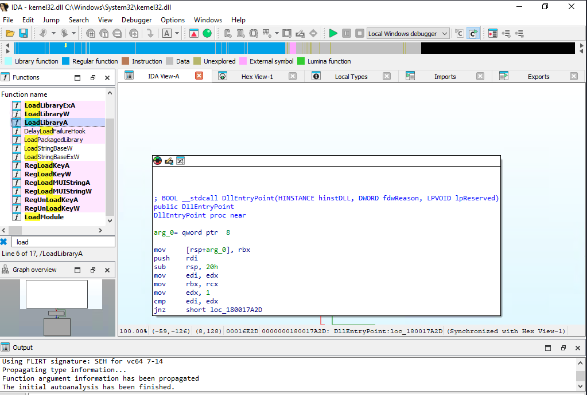

Once we double click the function name , we cam see the implementation of `LoadLibraryA()` where we can see the `LoadLibraryA()` function calling itself `LoadLibraryA_0` which indicates hat this version of `LoadLibraryA` is not present in the current DLL (`kernel32.dll`). Instead, this version of the function is imported from an external DLL.
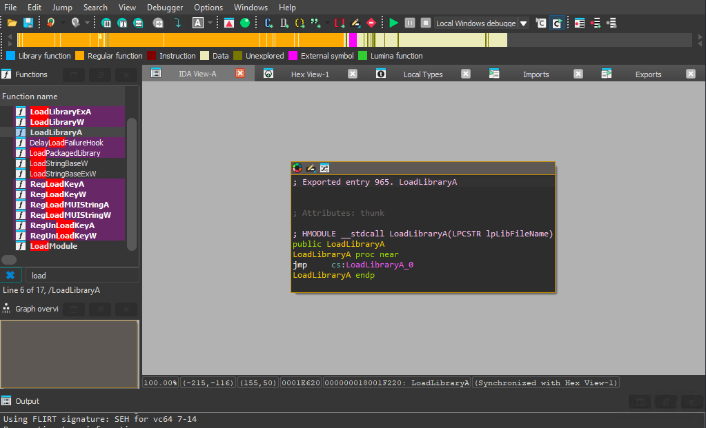

From the import table of `kernel32.dll` we can click on the `Imports` tabs to view the imported version of function.
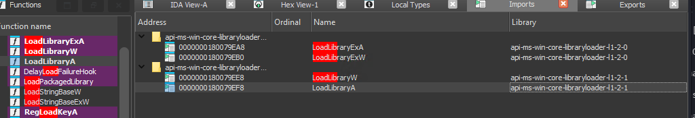

On analyzing windows binaries , we can notices imported functions do not always come from familiar DLLs like `kernel32.dll`. Instead we can see something like `api-ms-win-core-libraryloader-l1-2-1` which acts as an abstraction layer between application and actual of windows API

#### Why do we need API sets

API Sets were introduced by Microsoft to simplify API management and maintain compatibility across different versions of Windows. Instead of applications directly calling functions from specific system DLLs, they call functions through an API Set contract.

**Advantages of API sets**
1. **Backward compatibility** – Applications compiled for older Windows versions continue to work.
2. **Modular architecture** – Microsoft can move implementations between DLLs without breaking applications.
3. **Cleaner dependency management** – Applications depend on logical API contracts rather than specific DLL files.

```XML
Program
   ↓
API Set (api-ms-win-core-libraryloader-l1-2-1)
   ↓
kernel32.dll / kernelbase.dll
   ↓
LoadLibraryA implementation
```

We can simply check this using powershell
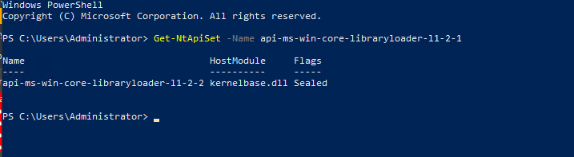
The output from the command `Get-NtApiSet` shows that the API set `api-ms-win-core-libraryloader-l1-2-1` resolves to the `kernelbase.dll` library.

To view the code we can use `Export` tab from the IDA to inspect the function
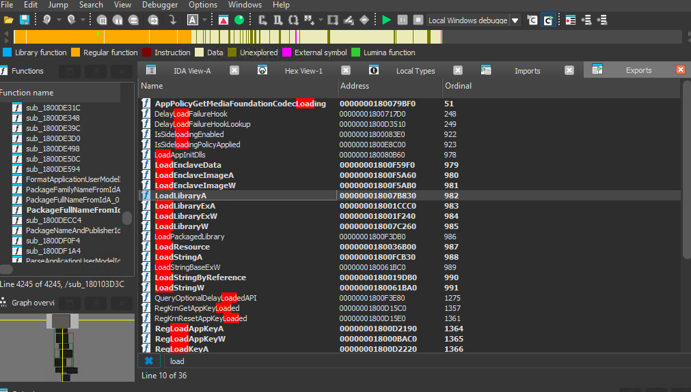

Now we can see the code base in graph mode , When we look at the assembly for `LoadLibraryA`, the first thing we notice isn't the loading of a file it’s the validation.
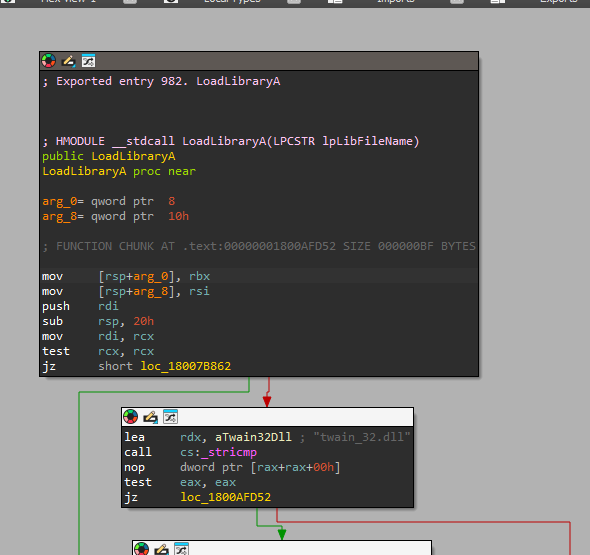

the `LoadLibraryA` function start by saving the state of the registers and checking the inputs, we see a test rcx rcx followed by `jz` if the string matches it jumps to the location , 
if they dont match moves `twan_32.dll` . Using `_stricmp` (a case-insensitive string comparison), the function checks if you are trying to load an old TWAIN scanner driver. If the strings match, the logic takes a **green arrow** to a specialized blocks.
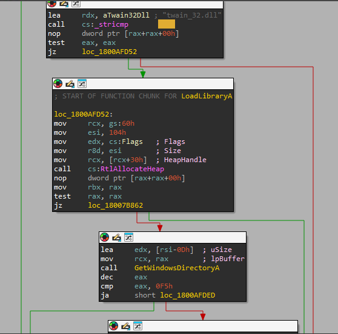

**Why does this exist?** 
Windows is famous for backward compatibility. Old drivers like TWAIN often need "special handling" so they don't crash modern system

Lets  get back to  `LoadLibraryA` function as main objective of the post is to be understanding `LoadLibraryA` function 

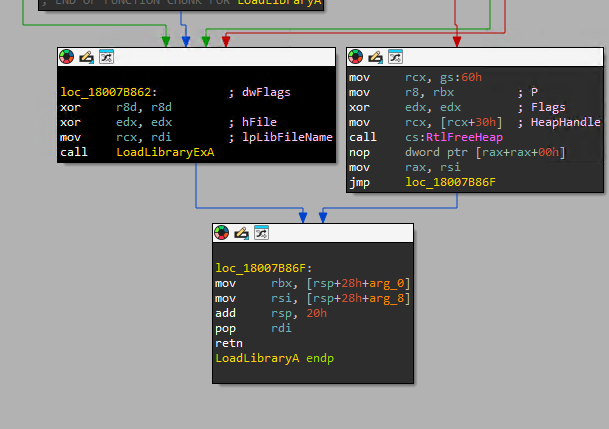
After the string comparisons and path construction are finished, the code reaches `loc_18007B862`. 

We can start inspecting `LoadLibraryExA` function for further understanding 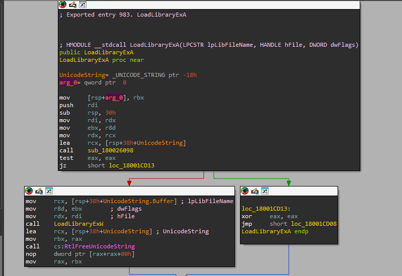

Before deep-diving lets understand the basics of ANSI and Unicode difference
ANSI is a 8-bit standard , where each character hold 1 bytes , so it can only represent total of 256 character in total (2^8) which isn't enough ! because if we take an ANSI string from UK it works for English not same for any other language which is often called Mojibake

Where Unicode which is 16-bit standard where each character is at least 2 bytes so it represents around 1.1 million character which eleminates the Mojibake issue 

but how does it store 1.1 million since 2^16 = 65,536 character , (this group is called BMP which includes all the modern languages) , To represent characters beyond 65,536 like emoji , Windows use Surrogate pair in which windows set aside a specific range of numbers within those 65,536 slots (specifically `0xD800` to `0xDFFF`) and promises **never** to put a single character there.

When a Windows function sees a value in this Reserved Zone,it knows: Wait, this isn't a character it then grabs the next 2 bytes and combines them with the first to form a single 32-bit character.

`LoadLibraryExA` inside the function we can see the ANSI to Unicode string then loads the library using its Unicode version,

We can start analyzing the `LoadLibraryExW`

Since i am using IDA community edition to decode using assembly , i am not an expert or assembly user ! but i did learn some baics from openSecurity https://p.ost2.fyi/courses/course-v1:OpenSecurityTraining2+Arch1001_x86-64_Asm+2021_v1/about 

we can cross compare the assembly insutruction with ghirda decompiled Pseudocode from C
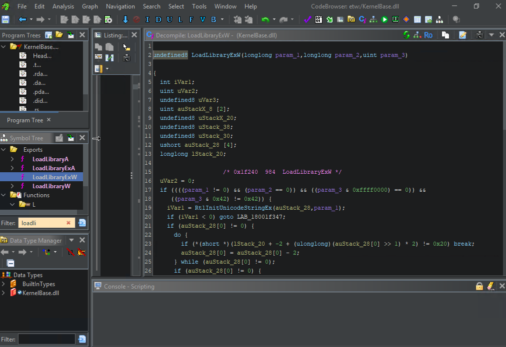

it should look somewhat like this
i pasted the pseudo code down so we can understadn it further easily
```C

undefined8 LoadLibraryExW(longlong param_1,longlong param_2,uint param_3)

{
  int iVar1;
  uint uVar2;
  uint auStackX_8 [2];
  ulonglong uStackX_20;
  undefined8 uStack_38;
  ulonglong uStack_30;
  ushort uStack_28;
  longlong lStack_20;
  
                    /* 0x1f240  984  LoadLibraryExW */
  uVar2 = 0;
  if (((param_1 != 0) && (param_2 == 0)) && ((param_3 & 0xffff0000) == 0)) {
    if ((((param_3 & 0x42) != 0x42) &&
        (iVar1 = RtlInitUnicodeStringEx(&uStack_28,param_1), -1 < iVar1)) && (uStack_28 != 0)) {
      do {
        if (*(short *)(lStack_20 + -2 + (ulonglong)(uStack_28 >> 1) * 2) != 0x20) break;
        uStack_28 = uStack_28 - 2;
      } while (uStack_28 != 0);
      if (uStack_28 != 0) {
        uStackX_20 = 0;
        if ((param_3 & 0x62) == 0) {
          auStackX_8[0] = 0;
          if ((param_3 & 1) != 0) {
            uVar2 = 2;
            auStackX_8[0] = 2;
          }
          if ((char)param_3 < '\0') {
            uVar2 = uVar2 | 0x800000;
            auStackX_8[0] = uVar2;
          }
          if ((param_3 & 4) != 0) {
            uVar2 = uVar2 | 4;
            auStackX_8[0] = uVar2;
          }
          if ((param_3 >> 0xf & 1) != 0) {
            auStackX_8[0] = uVar2 | 0x80000000;
          }
          iVar1 = LdrLoadDll(param_3 & 0x7f08 | 1,auStackX_8,&uStack_28,&uStackX_20);
        }
        else {
          iVar1 = LdrGetDllPath(lStack_20,param_3 & 0x7f08,&uStack_38,&uStack_30);
          if (iVar1 < 0) goto LAB_18001f347;
          iVar1 = FUN_18001cef0((uint *)&uStack_28,uStack_38,uStack_30,param_3,&uStackX_20);
          if ((((iVar1 + 0x80000000U & 0x80000000) == 0) && (iVar1 != -0x3ffffff1)) &&
             (((param_3 & 0x20) != 0 && ((param_3 & 0x42) != 0)))) {
            iVar1 = FUN_18001cef0((uint *)&uStack_28,uStack_38,uStack_30,param_3 & 0x42,&uStackX_20)
            ;
          }
          RtlReleasePath(uStack_38);
        }
        if (-1 < iVar1) {
          return uStackX_20;
        }
      }
    }
  }
LAB_18001f347:
  FUN_18001f900();
  return 0;
}
```


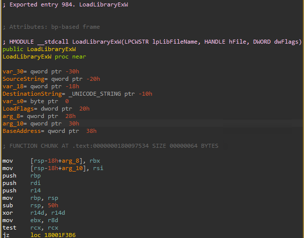

before heading into explanation lets dive through some assmebly so smoothly we can understand all the functionality of the code
	Note - In x64 Windows certain registers such as rbx,rsi ,rdi ,rbp and r14 ) are non-volatile , if we want to use these registers we need to save the previos state

```asm
mov     [rsp-18h+arg_8], rbx
mov     [rsp-18h+arg_10], rsi
push    rbp
push    rdi
push    r14
```
Before modifying any registers, the function must save "Non-Volatile" registers.  `rbx` and `rsi` into the Shadow Space provided by the caller and pushes `rbp`, `rdi`, and `r14` onto the stack. These are stored at **Positive Offsets** (like `arg_8` at +28h) relative to the final stack pointer, as they belong to the caller's frame.

The `50h`  Before the code was even shipped to our computers, the compiler calculated exactly how many variables `LoadLibraryExW` needed to hold. It added up the 32-byte mandatory 'Shadow Space,' the size of the Unicode structures, and a bit of padding for alignment. The result was 80 bytes or `50h` (5x16 + 0x16) in hex. By subtracting this from the Stack Pointer (`RSP`), the function 'claims' that territory for itself.

```asm
mov     rbp, rsp
```

then copy the stack pointer (`rsp`)into base pointer (`rbp`)This allows the function to reference its local variables using **Negative Offsets**

```asm
xor     r14d, r14d
mov     ebx, r8d
test    rcx, rcx
jz      loc_18001F3B6
```

the first instruction used when we need 0 or NULL to compare things , Any number XORed by itself is 0

then we move the value stored in r8d moved to ebx (non-volatile register) because value of r8d (primary registers `rcx`, `rdx`, `r8`, `r9`which store the parameter of function )can be changed later

then test weather the first argument rcx holds the first argument`lpLibFileName` the test operator performs a  AND but doesnt change the value , it only update the CPU flag , if its true it jumps to location 
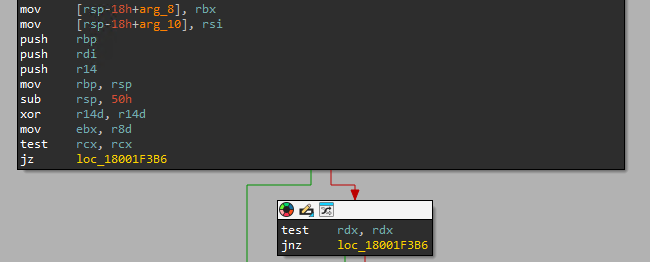
if not If the filename was valid, the code immediately checks the second argument (`rdx`), which is the **`hFile`** if it isn't 0 NULL it will exit 
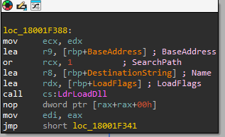
In Summary `LoadLibraryExW` function determine how the DLL should be loaded considering aspects such as load behavior, access rights, and checks various conditions (such as debug flags) to ensure the loading is permitted. If the conditions are met, it initializes the DLL path and calls the next function, `LdrpLoadDll`, to load the DLL.


Lets inspect the `LdrLoadDLL` function but to inspect the function we load the ntdll.dll in IDA from export table
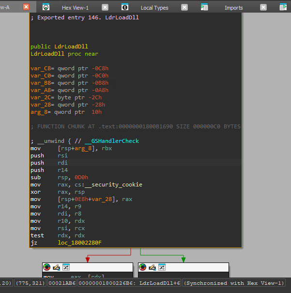
The function `LdrpLoadDll` is another internal function used by the loader that first logs the state of the DLL loading process. It then preprocesses the DLL name using the `LdrpPreprocessDllName` function, which handles tasks such as resolving aliases and applying redirections. If the preprocessing is successful, it calls another internal function, `LdrpLoadDllInternal()`, to perform the further loading of the DLL.

```C
__int64 __fastcall LdrpLoadDllInternal(
        __int64 a1,
        int a2,
        unsigned int a3,
        int a4,
        __int64 a5,
        __int64 a6,
        __int64 *a7,
        int *a8)
{
  __int64 result; // rax
  int *v12; // rbx
  char v13; // di
  int v14; // eax
  __int64 v15; // rdx
  __int64 v16; // rax
  int v17; // eax
  int v18; // eax
  __int64 v19; // [rsp+48h] [rbp-30h] BYREF

  if ( (LdrpDebugFlags & 9) != 0 )
    LdrpLogDbgPrint(
      (unsigned int)"minkernel\\ntdll\\ldrapi.c",
      425,
      (unsigned int)"LdrpLoadDllInternal",
      3,
      "DLL name: %wZ\n",
      a1);
  *a7 = 0;
  v19 = 0;
  result = LdrpFastpthReloadedDll(a1, a3, a6, a7);
  if ( (int)result < 0 )
  {
    if ( (NtCurrentTeb()->SameTebFlags & 0x1000) != 0 )
    {
      v13 = 1;
    }
    else
    {
      v13 = 0;
      LdrpDrainWorkQueue(0);
    }
    if ( !a6 || v13 || (_DWORD *)((_QWORD *)(a6 + 152) + 24LL) )
    {
      LdrpDetectDetour();
      v12 = a8;
      v14 = LdrpFindOrPrepareLoadingModule(a1, a2, a3, a4, a5, (_int64)&v19, (_int64)a8);
      if ( v14 == -1073741515 )
      {
        LOBYTE(v15) = 1;
        LdrpProcessWork(*(_QWORD *)(v19 + 176), v15);
      }
      else if ( v14 != -1073741267 && v14 < 0 )
      {
        *a8 = v14;
      }
    }
    else
    {
      v12 = a8;
      *a8 = -1073741515;
    }
    result = LdrpDrainWorkQueue(1);
    if ( v19 )
    {
      v16 = LdrpHandleReplacedModule();
      *a7 = v16;
      if ( v19 != v16 )
      {
        LdrpFreeReplacedModule();
        v19 = *a7;
      }
      if ( *(_QWORD *)(v19 + 176) )
        LdrpCondenseGraph(*(_QWORD *)(v19 + 152));
      if ( *v12 >= 0 )
      {
        v17 = LdrpPrepareModuleForExecution(v19, v12);
        *v12 = v17;
        if ( v17 >= 0 )
        {
          v18 = LdrpBuildForwarderLink(a6, v19);
          *v12 = v18;
          if ( v18 >= 0 && !LdrInitState )
            LdrpPinModule(v19);
        }
      }
      result = LdrpFreeLoadContextOfNode(*(_QWORD *)(v19 + 152), v12);
      if ( *v12 < 0 )
      {
        *a7 = 0;
        LdrpDecrementModuleLoadCountEx(v19, 0);
        result = LdrpDereferenceModule(v19);
      }
    }
    else
    {
      *v12 = -1073741801;
    }
    if ( !v13 )
      result = LdrpDropLastInProgressCount();
  }
  else
  {
    v12 = a8;
    *a8 = result;
  }
  if ( (LdrpDebugFlags & 9) != 0 )
    return LdrpLogDbgPrint(
             (unsigned int)"minkernel\\ntdll\\ldrapi.c",
             655,
             (unsigned int)"LdrpLoadDllInternal",
             4,
             "Status: 0x%08lx\n",
             *v12);
  return result;
}

Pseudocode from IDA
```

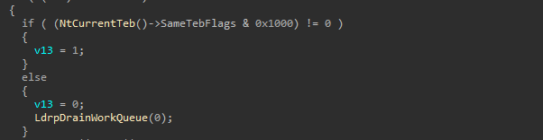
this function checks whether the operation led to a deadlock if no safe to drain the work queue first process any pending load work other threads posted. 
#### So, what does the deadlock mean here? 
When a thread wants to load an DLL, it requests a key (loader Lock) , gets the key load the DLL, give back the key done but when When a thread want to load an DLL (considers as A.dll) and that DLL wants to load anthore DLL called b.dll its requires an key but the thread already holding the key which will create an indefinite waiting period  

So, to avoid this Microsoft implemented work Queue system, here the thread that's need to load the DLL holds the key and it posts a WORK ITEM to a queue to load the DLL, then WAITS for the work to be done by the loader's worker thread pool picks up the work item signals Thread 1 that it's done and its continues

The next internal function, `LdrpLoadDllInternal`, calls various functions such as `LdrpFindOrPrepareLoadingModule` and `LdrpPrepareModuleForExecution`, which prepare the module for execution, build forwarder links, pin the module if needed, and free the load context of the node. It also calls `LdrpFindKnownDll` to check whether the DLL is in the list of "KnownDlls." To view the list of known DLLs, we can query the `HKEY_LOCAL_MACHINE\SYSTEM\CurrentControlSet\Control\Session Manager\KnownDLLs` registry key.

If the DLL is not already loaded, it continues to load the DLL into memory using `LdrpMapDllWithSectionHandle`.


```C
_int64 __fastcall LdrpMapDllNtFileName(_int64 a1, UNICODE_STRING *a2)
{
  __int64 v3; // rbx
  int v5; // esi
  __int64 v6; // r12
  ULONG v7; // eax
  __int64 v8; // r15
  __int64 v9; // rcx
  __int64 v10; // r14
  NTSTATUS v11; // eax
  int v12; // r9d
  int v13; // ebx
  int v14; // eax
  int v16; // r8d
  int v17; // r9d
  char *v18; // rcx
  int v19; // r8d
  int v20; // r9d
  HANDLE FileHandle; // [rsp+40h] [rbp-59h] BYREF
  HANDLE Handle; // [rsp+48h] [rbp-51h] BYREF
  __int64 v23; // [rsp+50h] [rbp-49h]
  _QWORD v24[2]; // [rsp+58h] [rbp-41h] BYREF
  UNICODE_STRING v25; // [rsp+68h] [rbp-31h] BYREF
  OBJECT_ATTRIBUTES ObjectAttributes; // [rsp+78h] [rbp-21h] BYREF
  struct _IO_STATUS_BLOCK IoStatusBlock; // [rsp+A8h] [rbp+Fh] BYREF
  char v28; // [rsp+100h] [rbp+67h] BYREF
  char v29; // [rsp+110h] [rbp+77h] BYREF
  char v30; // [rsp+118h] [rbp+7Fh] BYREF

  v3 = *(_QWORD *)(a1 + 56);
  v23 = *(_QWORD *)(a1 + 168);
  v5 = 0;
  if ( !(unsigned __int8)LdrpCheckForRetryLoading(a1, 0) )
  {
    v6 = v3 + 72;
    LdrpLogDllState(*(_QWORD *)(v3 + 48), v3 + 72, 5285);
    v7 = 64;
    ObjectAttributes.Length = 48;
    if ( !LdrpUseImpersonatedDeviceMap )
      v7 = 2112;
    ObjectAttributes.RootDirectory = 0;
    ObjectAttributes.Attributes = v7;
    ObjectAttributes.ObjectName = a2;
    *(_OWORD *)&ObjectAttributes.SecurityDescriptor = 0;
    v8 = 2147353476;
    if ( (unsigned int)RtlGetCurrentServiceSessionId() )
      v9 = (__int64)NtCurrentPeb()->SharedData + 554;
    else
      v9 = 2147353476;
    v10 = 2147353477;
    if ( *(_BYTE *)v9 && (NtCurrentPeb()->TracingFlags & 4) != 0 )
    {
      v18 = (unsigned int)RtlGetCurrentServiceSessionId()
          ? (char *)NtCurrentPeb()->SharedData + 555
          : (char *)2147353477;
      if ( (*v18 & 0x20) != 0 )
      {
        LOBYTE(v17) = -1;
        LOBYTE(v16) = -1;
        LdrpLogEtwEvent(5253, -1, v16, v17, 0, 0);
      }
    }
    if ( (NtCurrentPeb()->NtGlobalFlag & 0x40000) != 0 )
    {
      v25 = *a2;
      ZwSystemDebugControl(38, &v25, 16);
    }
    while ( 1 )
    {
      v11 = NtOpenFile(&FileHandle, 0x100021u, &ObjectAttributes, &IoStatusBlock, 5u, 0x60u);
      v13 = v11;
      if ( v11 >= 0 )
        break;
      if ( v11 == -1073741772 || v11 == -1073741766 )
      {
        v13 = -1073741515;
        break;
      }
      if ( v11 != -1073741790 )
        break;
      if ( v5 || !(unsigned __int8)LdrpCheckComponentOnDemandEtwEvent(a1) )
        return (unsigned int)v13;
      v5 = 1;
    }
    if ( v13 < 0 )
      return (unsigned int)v13;
    if ( LdrpAuditIntegrityContinuity )
    {
      v13 = LdrpValidateIntegrityContinuity(a1, FileHandle);
      if ( v13 < 0 )
      {
        if ( LdrpEnforceIntegrityContinuity )
          goto LABEL_22;
      }
    }
    if ( (*(_DWORD *)(a1 + 32) & 0x1000000) != 0 && (NtCurrentPeb()->BitField & 0x10) == 0 )
    {
      LOBYTE(v12) = 8;
      v13 = LdrpSetModuleSigningLevel((DWORD)FileHandle, *(_QWORD *)(a1 + 56), (unsigned int)&v29, v12, (_int64)&v28);
      if ( v13 < 0 )
        goto LABEL_22;
    }
    v14 = NtCreateSection(&Handle, 13, 0);
    v13 = v14;
    if ( v14 < 0 )
    {
      if ( v14 == -1073740702 || (unsigned int)(v14 + 1073740674) <= 1 )
      {
        v13 = LdrAppxHandleIntegrityFailure((unsigned int)v14);
      }
      else if ( v14 != -1073741801 && v14 != -1073741670 && v14 != -1073741523 )
      {
        v24[0] = v6;
        v24[1] = v14;
        if ( (int)NtRaiseHardError(3221225595LL, 2, 1, v24, 1, &v30) >= 0 && LdrInitState != 3 )
          ++LdrpFatalHardErrorCount;
      }
      LdrpLogError((unsigned int)v13, 5253, 0, v6);
      goto LABEL_22;
    }
    if ( (unsigned int)RtlGetCurrentServiceSessionId() )
      v8 = (__int64)NtCurrentPeb()->SharedData + 554;
    if ( *(_BYTE *)v8 && (NtCurrentPeb()->TracingFlags & 4) != 0 )
    {
      if ( (unsigned int)RtlGetCurrentServiceSessionId() )
        v10 = (__int64)NtCurrentPeb()->SharedData + 555;
      if ( (*(_BYTE *)v10 & 0x20) != 0 )
      {
        LOBYTE(v20) = -1;
        LOBYTE(v19) = -1;
        LdrpLogEtwEvent(5254, -1, v19, v20, 0, 0);
      }
    }
    if ( !UseWOW64 && (*(_DWORD *)(a1 + 32) & 0x100) == 0 )
    {
      if ( !LdrpAdvapi32DllHandle )
        goto LABEL_20;
      v13 = ((_int64 (fastcall *)(HANDLE, UNICODE_STRING *))(ROR8_(
                                                                  LdrpSaferIsDllAllowedRoutine,
                                                                  64 - (MEMORY[0x7FFE0330] & 0x3Fu))
                                                              ^ MEMORY[0x7FFE0330]))(
              FileHandle,
              a2);
      if ( v13 == -1073741275 )
        v13 = 0;
    }
    if ( v13 < 0 )
    {
LABEL_21:
      NtClose(Handle);
LABEL_22:
      NtClose(FileHandle);

      return (unsigned int)v13;
    }
LABEL_20:
    v13 = LdrpMapDllWithSectionHandle(a1, Handle);
    if ( v23 && v13 >= 0 )
    {
      *(_QWORD *)(a1 + 176) = FileHandle;
      *(_QWORD *)(a1 + 24) = Handle;
      return (unsigned int)v13;
    }
    goto LABEL_21;
  }
  return 3221226029LL;
}

Pseudocode from IDA
```


 #### **LdrpMapDllNtFileName** What does this function do? Lets uncover it 

Breaking down the name:
  Ldrp        = private loader function
  Map         = load into memory
  Dll            = working with a DLL
  NtFileName = using NT namespace filename
               not Win32 path like 
               C:\Windows\System32\ntdll.dll
               but NT path like
               \Device\HarddiskVolume3\Windows\

So this function maps the DLL using the NT file system. which include happens 4 steps using functions such as 

#### **NtOpenFile()**
opens the native DLL file on disk gives us a file handle

#### **NtCreateSection**()
creates a memory section object a chunk of memory that backs the DLL

But before NtCreateSection is even called the DLL has to pass through a security gauntlet. Three checks that every DLL must clear or the load is aborted.
Every DLL must pass all **three** checks before it gets mapped into memory. Any failure aborts the load completely

**Check 1 - LdrpValidateIntegrityContinuity** 
ntegrity = has DLL been tampered with? 
Continuity = is it consistent with what was originally approved?
catches cases where someone replaced a legitimate DLL with a malicious one with the same name 
two modes: 
audit only = just logs the failure 
enforced = aborts the load

**Check 2 - LdrpSetModuleSigningLevel**

assigns a trust level to the DLL based on its signature: 
0 = unsigned 
4 = authenticode signed 
6 = Microsoft signed 
8 = Windows component (highest) 
higher signing level = more trusted 
if check fails load is aborted

**Check 3 — LdrpSaferIsDllAllowedRoutine**
checks weather DLL is allowed to load based on Windows Software Restriction Policy (SRP) called through an encrypted pointer: decode = ROR(pointer, key) XOR key why encrypted — if malware overwrites the pointer , decode produces garbage and crashes instead of calling malicious code , anti-tamper protection

	Note :-  NtCreateSection is only called AFTER all three checks 
	pass. The DLL is never mapped into memory unless it clears the 
	entire gauntlet.
###### **LdrpMapDllWithSectionHandle**()
maps the section into process virtual memory , this is where the DLL actually appears in memory

#### **NtClose()**** 
closes handles we no longer need cleanup

	But wait  why does Windows create a Section Object as a middle 
	step instead of just reading the file bytes directly into memory?

Section object is referencing a part of memory where other processes can access it , a form of IPC.

**Three reasons Windows uses section objects:**

**SHARING** 
multiple processes map the same section notepad.exe , chrome.exe , calc.exe all share the SAME physical ntdll pages saves huge amounts of RAM

**LAZY LOADING** 
pages only loaded from disk when your code actually touches them called demand paging

**BACKED BY THE FILE**
Windows can throw away pages anytime because it can reload from disk no need to save them anywhere

	 if the  load succeeds the handles are stored instead of closed. 
	 Why would Windows keep them open?

If they close the handle they lose referencing. FileHandle - keeps file on disk locked prevents someone modifying the DLL while its loaded in memory stops DLL tampering
SectionHandle - keeps section object alive if closed Windows might free the backing memory , the DLL would disappear from process mid-execution stored inside the modules own entry in the loader list , stay open as long as DLL is loaded , closed when FreeLibrary is called.

	Why this matters for Reflective DLL injection ?

Reflective DLL injection bypasses this entire gauntlet by mapping the DLL manually without calling these loader functions , that is why it works even with unsigned DLLs.


So far we have uncovered how LoadLibrary works under the hood , starting from the simple LoadLibraryA call all the way down to how Windows physically maps a DLL into memory through LdrpMapDllNtFileName , we also discovered why the security gauntlet exists and how reflective DLL injection bypasses it entirely.

In the next part we will be diving into the PE format , the structure behind every .exe and .dll on Windows , understanding the PE format is what connects everything we learned here to how reflective injection actually works under the hood.


#### References

	1.https://academy.hackthebox.com/app/module/266
	2.https://learn.microsoft.com/en-
	us/windows/win32/api/libloaderapi/nf-libloaderapi-loadlibrarya
	3.https://cocomelonc.github.io/malware/2023/04/27/malware-tricks-
	27.html
