## Enumeration

```bash
sudo nmap -sV -sC 10.129.232.128 -p- -Pn -A -T4
```

Lets start Enumerating the open ports

### SMB

Lets start with authentication using given credentials

```bash
smbmap -R -H 10.129.232.128 -u "rose" -p "KxEPkKe6R8su"
```

using smbmap to with recursive parameter to view all the file , and we found some intersting file in it


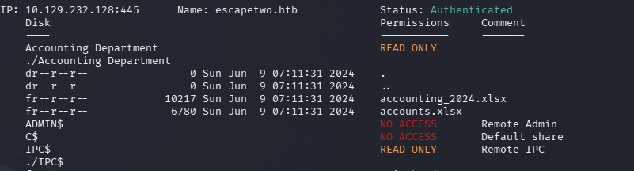

we can use smbclient to download the file  and inspect the file


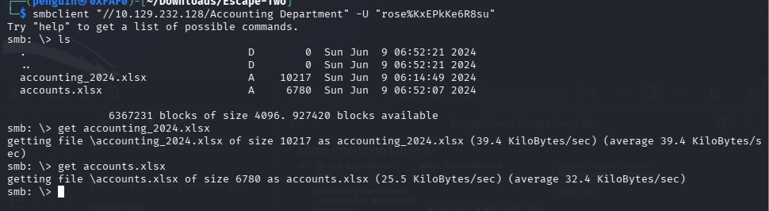
one more Intersting findings while enumerating with **rpcclient** found some users it may help us 


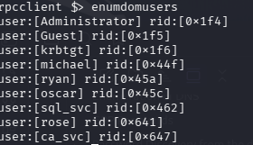

when i was inspecting the given file i found some intersting username and password 


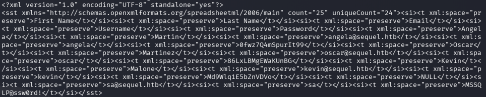

lets make it readable so we can make  a user list


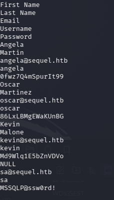
Lets make a userlist from the rpcclient and xml file we found , Lets use kerbrute to enumerate the user


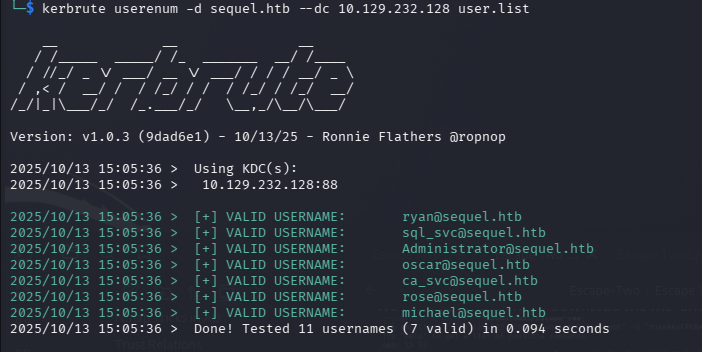

we found 7 vaild  users  and lets use the give user list and password list from the xlm file to further enumerate other protocol

Lets use NetExec for the further  enumeration

**LDAP**
```bash
 nxc ldap sequel.htb -u user.list -p password.list 
```

we found nothing lets enumerate other open ports

**SMB**

We found an user on SMB


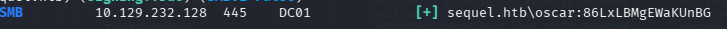
**MSSQL**

we found an valid user as expected 


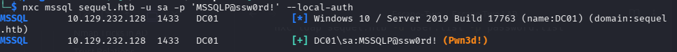

Since we got some valid credential on **SMB** and **MSSQL** services 
```
oscar:86LxLBMgEWaKUnBG
```
```
sa:MSSQLP@ssw0rd!
```
## Foothold

Lets start enumerating with **MSSQL**

we can use tool **impacket**-**mssqlclient** or other tools like **sqsh**

Here i am using  **mssqlclient** let see if have access to xp_cmdshell , 


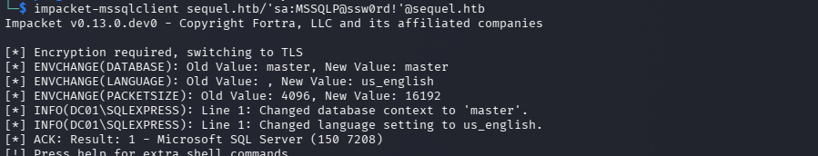


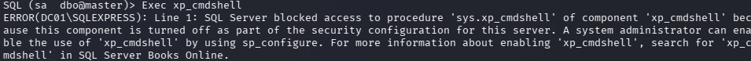

as we can see from the screenshot we are able to execute the xp_cmdshell by configuring it 

lets start configuring

```sql
# Check if xp_cmdshell is enabled SELECT * FROM sys.configurations WHERE name = 'xp_cmdshell';

# This turns on advanced options and is needed to configure
 xp_cmdshell sp_configure 'show advanced options', '1'
 
# This enables xp_cmdshell sp_configure  
RECONFIGURE 'xp_cmdshell', '1' 
RECONFIGURE

# checking the configurtion works
SQL (sa  dbo@master)> EXEC master..xp_cmdshell 'whoami'
output           
--------------   
sequel\sql_svc   

NULL             


```

We got the shell lets try to create  reverse shell using https://www.revshells.com/ (create reverse shell using PowerShell#3 (Base64)) then execute using
the xp_cmdshell we configured earlier and start net cat listner on our  attack host


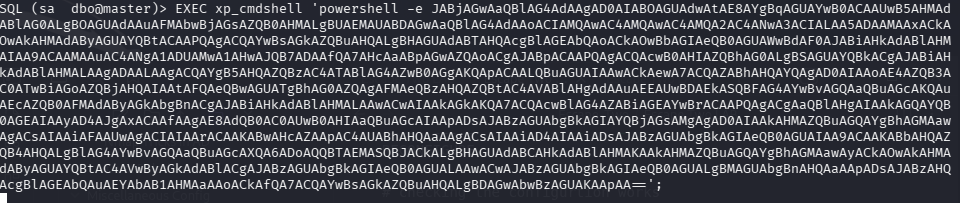

netcat Listner


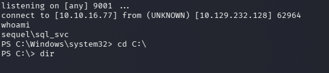

on further enumeration in we did find some intersting file


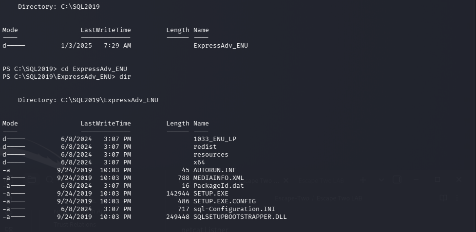
for futher enumeration on each file we found some credentials from configuration.ini file 

for futher information  please refer 
```https://learn.microsoft.com/en-us/sql/database-engine/install-windows/install-sql-server-using-a-configuration-file?view=sql-server-ver17```

the credentials we found from the file


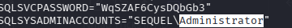

Lets use this password to enumerate the open ports which and see which all users can be pawned!

we got lucky with smb ,winrm , ldap


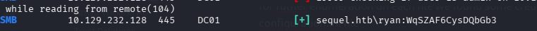


Lets use evil-winrm to access the user see if can capture the flag


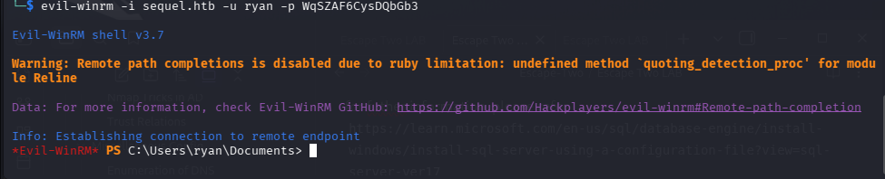

Here we got the access powerhsell lets enumerate 


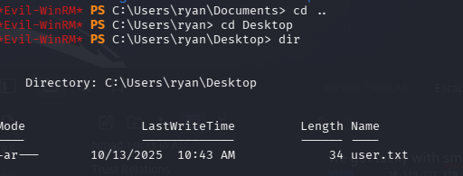

First ! user flag Bingo 

The next phase involves utilizing the data collected by the `bloodhound-python` utility to conduct a thorough domain enumeration and develop an optimized path for privilege escalation and attack planning.


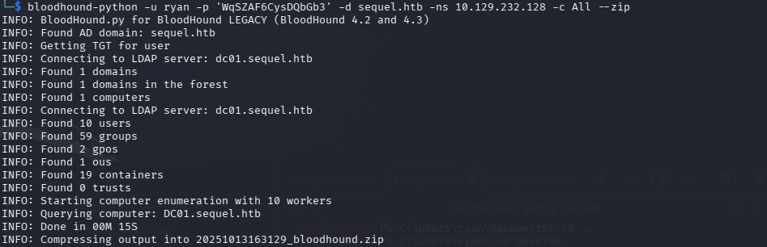

Lets run the bloodhound GUI from the attacker system


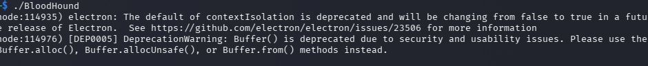


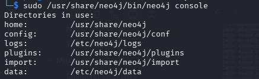

With Bloodhound we found ryan as the writeOwner access ca_svc account


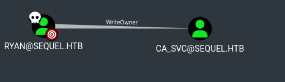
lets start abusing this privilege

Lets start with  Targeted Kerberoast we can use the tool called [targetedKerberoast.py](https://github.com/ShutdownRepo/targetedKerberoast). which will give us the hash for the user **ca_svc**


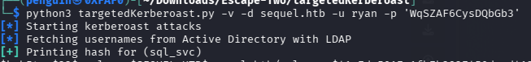


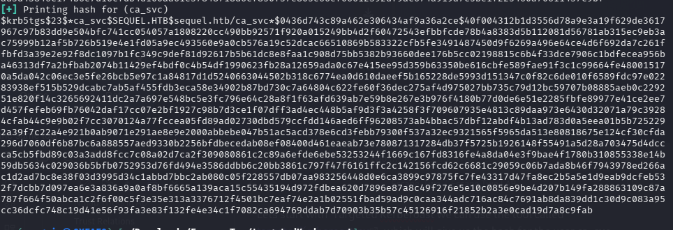

Lets try to crack the hash with hashcat


No luck in breaking the hash lets try Shadow credential method using pywhisker.py


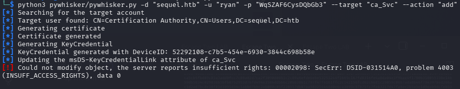

Before executing pywhisker we need ti change the ownership of ca_svc account 


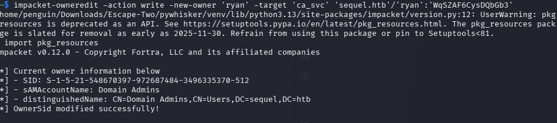
change the permission as well


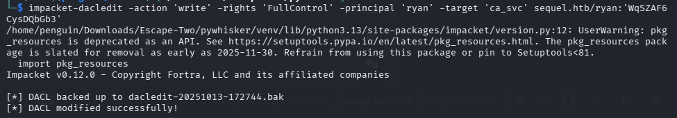

Lets run pywhisker again 


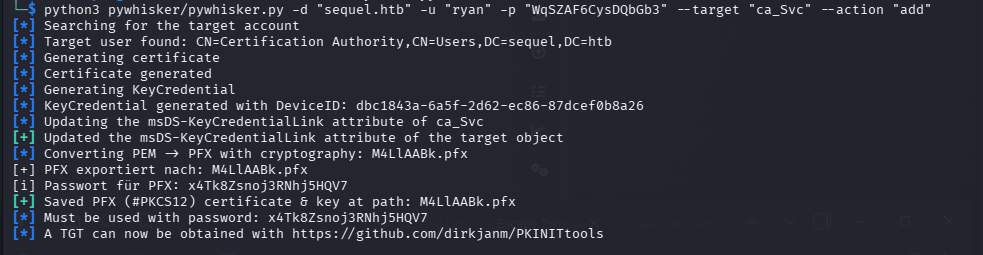
Yes we created the certificate ! we need to obtain the tgt hash lets start digging 
we need to download this tool to obtain TGT ticket
https://github.com/dirkjanm/PKINITtools


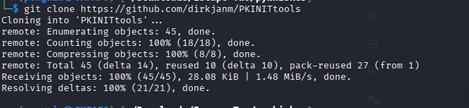
lets export the certificate
```bash
python3 gettgtpkinit.py -cert-pem ../M4LlAABk_cert.pem -key-pem ../M4LlAABk_priv.pem sequel.htb/ca_svc ca_svc.ccache

```

the tgt would be saved to file which we can use to get NTLM hash 


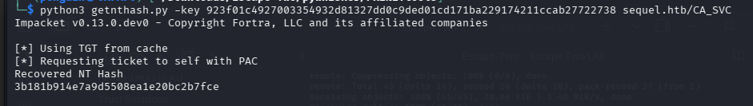

Next we can use certipy to perform authenticated enumeration it uses unprivileged domain credential to print out vulnerable templated and and CA's


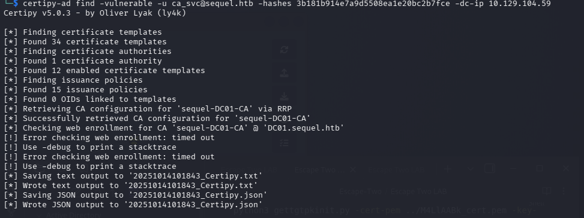


Lets inspect the text file


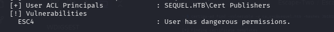
upon inpection of text file we can see its list ESC4 vulnerablity , A template is vulnerable when the user have write permission on it , this gives the right to modify the template configuration allowing an attacker to make it vulnerable to ECS1 


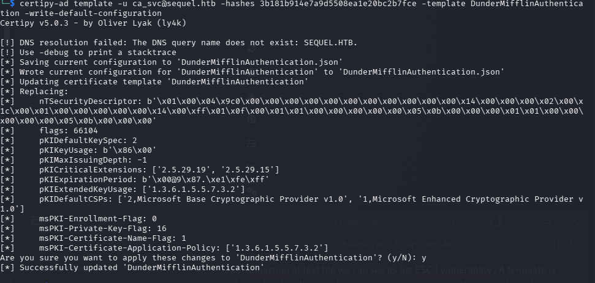
Now we can start exploiting the template    with req command 


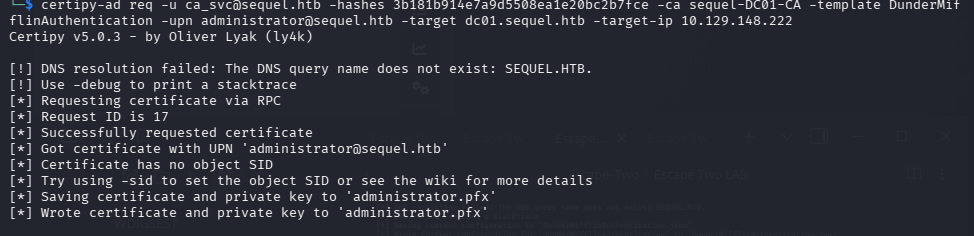
Here we got administrator pfx with which should be able authenticate as an administrator


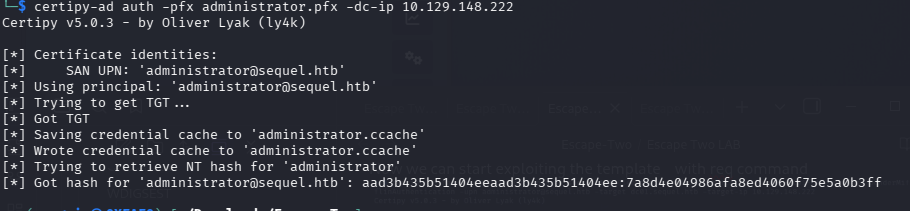

we got the NTLM hash for the adimistrator

Login as  Admin using impacket-psexec then find the root.txt


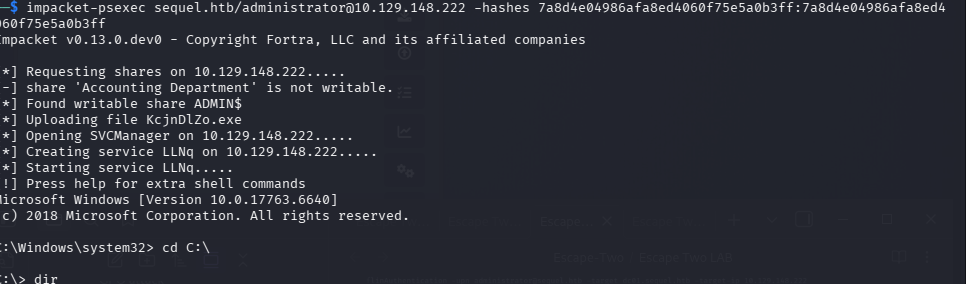

