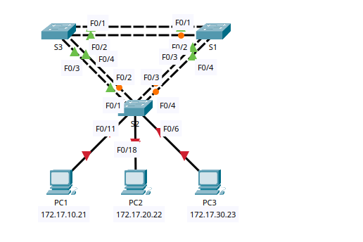
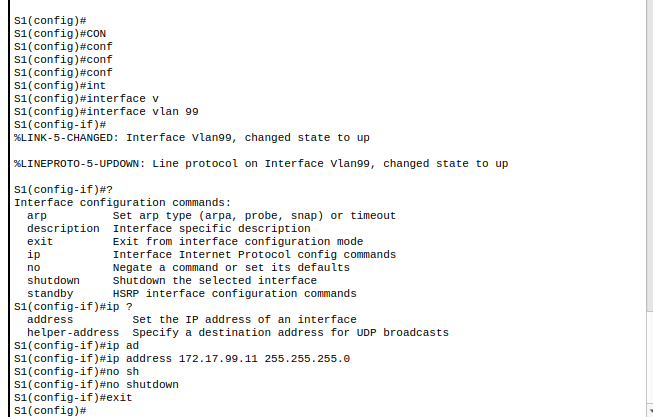

**Improvements in RSTP**:
- **Convergence:** < 1 second
- **Port Roles:** Root, Designated, Alternate, Backup
- **Port States:** Discarding, Learning, Forwarding
- **Edge Ports (PortFast):** Immediate forwarding for end devices

## Objectives

- Part 1: Configure VLANs
- Part 2: Configure Spanning Tree Rapid PVST+ & Load Balancing
- Part 3: Configure PortFast & BPDU Guard


### Part 1: VLAN Configuration
#### Enable User Ports in Access Mode

**On S2 ( PC-facing-ports)**
```Cisco
S2> enable  
S2# configure terminal  
  
S2(config)# interface range f0/6, f0/11, f0/18  
S2(config-if-range)# switchport mode access  
S2(config-if-range)# no shutdown  
S2(config-if-range)# exit
```

#### Assign VLANs to Access Ports (S2)
```CISCO
S2(config)#
S2(config)#interface f0/11
S2(config-if)# switchport access vlan 10
S2(config-if)# exit
S2(config)#
S2(config)#interface f0/18
S2(config-if)# switchport access vlan 20
S2(config-if)# exit
S2(config)#
S2(config)#interface f0/6
S2(config-if)# switchport access vlan 30
S2(config-if)# exit
S2(config)#
```

#### Saving Configuration
```CIsco
copy running-config startup-config
```
#### Verify VLANs
```Cisco
S2#show vlan brief 

VLAN Name                             Status    Ports
---- -------------------------------- --------- -------------------------------
1    default                          active    Fa0/1, Fa0/2, Fa0/3, Fa0/4
                                                Fa0/5, Fa0/7, Fa0/8, Fa0/9
                                                Fa0/10, Fa0/12, Fa0/13, Fa0/14
                                                Fa0/15, Fa0/16, Fa0/17, Fa0/19
                                                Fa0/20, Fa0/21, Fa0/22, Fa0/23
                                                Fa0/24, Gig0/1, Gig0/2
10   VLAN0010                         active    Fa0/11
20   VLAN0020                         active    Fa0/18
30   VLAN0030                         active    Fa0/6
40   VLAN0040                         active    
50   VLAN0050                         active    
60   VLAN0060                         active    
70   VLAN0070                         active    
80   VLAN0080                         active    
99   VLAN0099                         active    
1002 fddi-default                     active    
1003 token-ring-default               active    
1004 fddinet-default                  active    
1005 trnet-default                    active    
```

#### Create VLANs on All Switches (S1, S2, S3

```cisco
S1(config)#vlan 10
S1(config-vlan)#vlan 20
S1(config-vlan)#vlan 30
S1(config-vlan)#vlan 40
S1(config-vlan)#vlan 50
S1(config-vlan)#vlan 60
S1(config-vlan)#vlan 70
S1(config-vlan)#vlan 80
S1(config-vlan)#vlan 99
S1(config-vlan)#exit
S1(config)#
```

#### Configuring trunks and native Vlan 99 in all switches

```CISCO
configure terminal

interface range f0/1 - 4
 switchport mode trunk
 switchport trunk native vlan 99
 exit
```


##### Configure Management VLAN 9

**on S1** 
```CISCO
configure terminal
interface vlan 99
 ip address 172.17.99.11 255.255.255.0
 no shutdown
exit
```



**On S2**
```Cisco
S2(config-if)#ip address 172.17.99.12 255.255.255.0
S2(config-if)#exit
S2(config)#inte
S2(config)#interface vl
S2(config)#interface vlan 99
S2(config-if)#ip address 172.17.99.12 255.255.255.0
S2(config-if)#no sh
S2(config-if)#no shutdown 
S2(config-if)#exit
S2(config)#
```

**On S3**
```CISCO
S3(config-if)#ip address 172.17.99.13 255.255.255.0
S3(config-if)#no sh
S3(config-if)#no shutdown 
S3(config-if)#exit
S3(config)#
```

#### Verify Connectivity
```CISCO
S3>ping 172.17.99.11

Type escape sequence to abort.
Sending 5, 100-byte ICMP Echos to 172.17.99.11, timeout is 2 seconds:
!!!!!
Success rate is 100 percent (5/5), round-trip min/avg/max = 0/1/8 ms

S3>ping 172.17.99.12

Type escape sequence to abort.
Sending 5, 100-byte ICMP Echos to 172.17.99.12, timeout is 2 seconds:
!!!!!
Success rate is 100 percent (5/5), round-trip min/avg/max = 0/0/0 ms

S3>ping 172.17.99.13
```

SImilarly on other switches as well

Part 2: Rapid Spanning Tree PVST+ Load Balancing

### Part-2 Enabling Rapid PVST+ on all Swtiches
```CISCO
S2(config)#spanning-tree 
S2(config)#spanning-tree m
S2(config)#spanning-tree mode 
S2(config)#spanning-tree mode ?
  pvst        Per-Vlan spanning tree mode
  rapid-pvst  Per-Vlan rapid spanning tree mode
S2(config)#spanning-tree mode r
S2(config)#spanning-tree mode rapid-pvst 
S2(config)#exit
```


#### Configure Root Bridges

**S1-Primary Roots**
```CISCO
S1#configure 
Configuring from terminal, memory, or network [terminal]? terminal
Enter configuration commands, one per line.  End with CNTL/Z.
S1(config)#
S1(config)#spa
S1(config)#spanning-tree vla
S1(config)#spanning-tree vlan 1,10,30,50,70 root primary
S1(config)#exit
S1#
%SYS-5-CONFIG_I: Configured from console by console

```

**S3-Primary Roots**
```CISCO
S3(config)#spanning-tree vlan 20,40,60,80,99 r
S3(config)#spanning-tree vlan 20,40,60,80,99 root 
S3(config)#spanning-tree vlan 20,40,60,80,99 root ?
  primary    Configure this switch as primary root for this spanning tree
  secondary  Configure switch as secondary root
S3(config)#spanning-tree vlan 20,40,60,80,99 root pr
S3(config)#spanning-tree vlan 20,40,60,80,99 root primary 
S3(config)#
```

**Secondry root as S2 (All VLANs)**

```CISCO
S2(config)#spanning-tree vlan 1-99 root
S2(config)#spanning-tree vlan 1-99 root sec
S2(config)#spanning-tree vlan 1-99 root secondary 
S2(config)#exit
S2#
%SYS-5-CONFIG_I: Configured from console by console

S2#
```


### Part-3 PortFast & BPDU Guard (S2 only)

#### PortFast (S2 – PC Ports)
**Purpose:**  
Skips Listening/Learning → Immediate Forwarding
```CISCO
configure terminal
interface range f0/6, f0/11, f0/18
 spanning-tree portfast
exit
```
⚠ **Only for access ports connected to end devices**

#### Enable BPDU Guard on PC ports (S2)
**Purpose:**  
Protects the network from rogue switches.
```CISCO
configure terminal
interface range f0/6, f0/11, f0/18
 spanning-tree bpduguard enable
exit
```
#### What happens if a BPDU is received?
- Port enters **err-disabled**
- Loop is prevented
- Network stability preserved

#### Verification
```CISCO
2#show running-config
Building configuration...

Current configuration : 1837 bytes
!
version 12.2
no service timestamps log datetime msec
no service timestamps debug datetime msec
no service password-encryption
!
hostname S2
!
!
!
!
vtp mode transparent
!
!
!
spanning-tree mode rapid-pvst
spanning-tree extend system-id
spanning-tree vlan 1-99 priority 28672
!
	
S2#show spanning-tree interface f0/6 detail

Port 6 (FastEthernet0/6) of VLAN0030 is designated forwarding
  Port path cost 19, Port priority 128, Port Identifier 128.6
  Designated root has priority 24606, address 0050.0F68.146E
  Designated bridge has priority 28702, address 00E0.F7AE.7258
  Designated port id is 128.6, designated path cost 19
  Timers: message age 16, forward delay 0, hold 0
  Number of transitions to forwarding state: 1
  The port is in the portfast mode
  Link type is point-to-point by default

S2# 
```