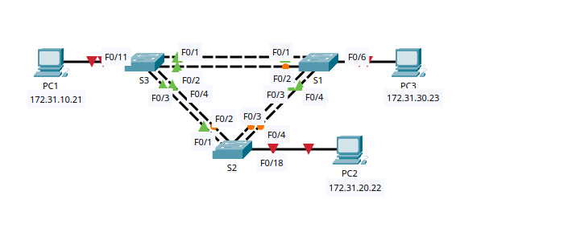
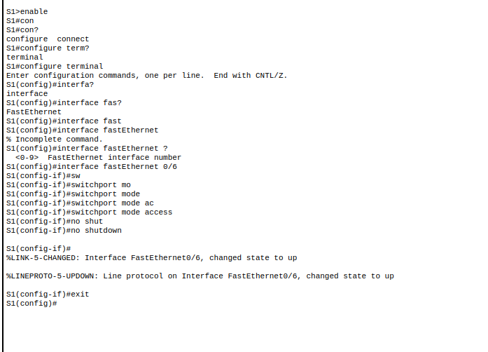
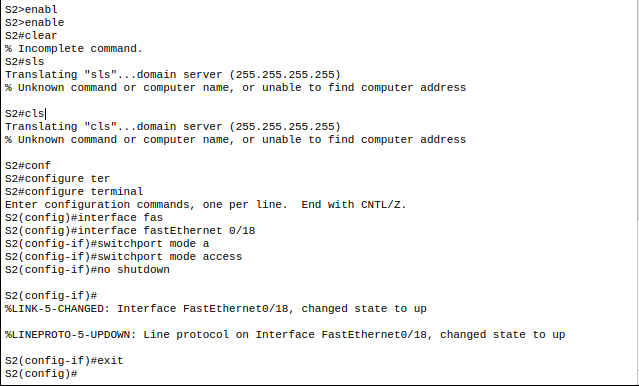
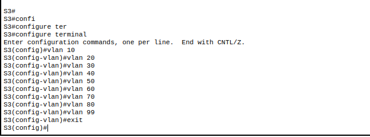
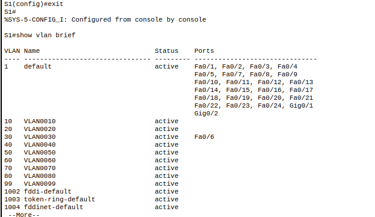
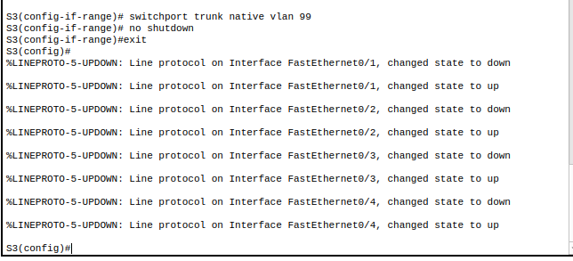
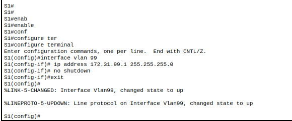
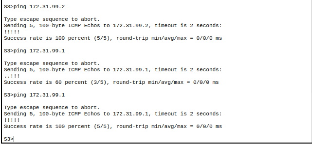
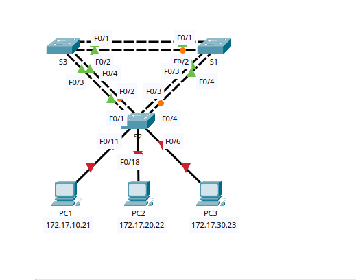

# **Spanning-tree-algorithm**
## 1. The Problem: Layer 2 Redundancy

While redundancy is good for reliability, Layer 2 (Ethernet) has no "safety valve" like Layer 3 (IP) has.

- **No TTL:** Unlike IP packets, Ethernet frames do not have a "Time to Live" (TTL). If a frame gets into a loop, it will circulate **forever** until a link is broken or a switch is turned off.
### Consequences of Loops:

1. **Broadcast Storms:** Broadcasts (like ARP) are forwarded out every port. In a loop, they multiply exponentially, saturating the links and crashing the CPU of every switch in the network.
2. **MAC Table Instability:** A switch sees the same frame arriving from different ports. This causes the MAC address table to "flap" or constantly update, preventing the switch from knowing where to send data.
3. **Multiple Frame Delivery:** A single piece of data might arrive at the destination computer multiple times, confusing the application.
## 2. The Solution: STP (Spanning Tree Protocol)

**Purpose:** To create a loop-free logical topology by calculating a path where only one active route exists between any two points. It keeps redundant links in a "standby" (blocking) mode.

### The Technical Tools:

- **BPDU (Bridge Protocol Data Unit):** The "Heartbeat" of STP. These are special frames switches send to each other every 2 seconds to share information about themselves and the network.
- **BID (Bridge ID):** The "Name Tag" used to elect a leader.
    - **Composition:** Bridge Priority (Default 32,768) + MAC Address.
    - **Rule:** The **lowest** BID wins.

## 3. The STP Election Process (The 4 Steps)

To build the "Tree," the switches go through this specific order:

1. **Elect the Root Bridge:** This is the "Boss" of the network. The switch with the **lowest BID** becomes the Root Bridge. All decisions are measured based on distance to this switch.
2. **Elect Root Ports (RP):** Every _non-root_ switch must pick **one** port that is the "cheapest" (fastest) path to the Root Bridge.
3. **Elect Designated Ports (DP):** On every cable segment, the port with the best path to the Root Bridge is "Designated." This port is allowed to forward traffic.
    - _Note: All ports on the Root Bridge are always Designated Ports._    
4. **Identify Alternate (Blocking) Ports:** Any port that is not an RP or a DP is put into the **Blocking state** to break the loop.

## 4. Path Cost (Distance)

STP doesn't count "hops" (how many switches); it counts **Cost** based on speed.

- **10 Gbps:** Cost 2
- **1 Gbps:** Cost 4
- **100 Mbps:** Cost 19
- **10 Mbps:** Cost 100
- _Rule: Lower total cost = Better path._
## 5. STP Port States (The Timer Process)

When a switch port is plugged in, it doesn't turn on immediately. It cycles through states to ensure no loop is formed:

1. **Blocking:** Only listens for BPDUs. Does not send data.
2. **Listening:** (15 sec) Cleans out old MAC entries.
3. **Learning:** (15 sec) Starts building the MAC table but still doesn't send data.
4. **Forwarding:** Normal operation. Sends and receives data.

- **Total Convergence Time:** Usually **30 to 50 seconds**.

## 6. Evolution: RSTP (802.1w)

 **Rapid Spanning Tree**. This is the modern standard.

- **Faster:** Converges in **less than 1 second** (compared to 50 seconds for STP).
    
- **Port Roles:** Adds "Alternate" and "Backup" roles.
    
- **PortStates:** Simplifies into three states: **Discarding, Learning, and Forwarding.**
    
- **Edge Ports (PortFast):** Allows ports connected to PCs to skip the 30-second wait and go straight to "Forwarding."

## 7. Expanded ARP Section

- **ARP is a "Necessary Evil":** Networks need ARP to function, but because ARP requests are **broadcasts**, they are the primary fuel for Broadcast Storms if STP is not working.
- **In IPv6:** ARP is replaced by **Neighbor Discovery Protocol (NDP)**, which uses Multicast. This is more efficient because it doesn't "shout" at every single device on the network.
# LAB 001 Packet Tracer – Configuring PVST+


## Objectives
Part 1: Configure VLANs
Part 2: Configure Spanning Tree PVST+ and Load Balancing
Part 3: Configure PortFast and BPDU Guar

# Part 1 

##  Enable the user ports on S1, S2, and S3 in access mode
S1-> Configuring

```Cisco IOS
enable
configure terminal
interface fastEthernet 0/6
 switchport mode access
 no shutdown
exit
```

S2 
```Cisco
enable
configure terminal
interface fastEthernet 0/18
 switchport mode access
 no shutdown
exit

```



Similiarly we can config S3 as well
```Cisco
S3>enable
S3#conf
S3#configure term
S3#configure terminal
Enter configuration commands, one per line. End with CNTL/Z.
S3(config)#intera
S3(config)#interf
S3(config)#interface ter
S3(config)#interface fas
S3(config)#interface fastEthernet 0/11
S3(config-if)#switch
S3(config-if)#switchport mode a
S3(config-if)#switchport mode access
S3(config-if)#no shutdown
S3(config-if)#
%LINK-5-CHANGED: Interface FastEthernet0/11, changed state to up
%LINEPROTO-5-UPDOWN: Line protocol on Interface FastEthernet0/11, changed state to up
S3(config-if)#exit
S3(config)#
```

##  Creating VLAN on each switch
```Cisco
configure terminal
vlan 10
vlan 20
vlan 30
vlan 40
vlan 50
vlan 60
vlan 70
vlan 80
vlan 99
exit
```


SImiliarly we can configure on all switches 

## Assign VLANs to switch ports
```Cisco
S2(config)#interface fas
S2(config)#interface fastEthernet 0/6
S2(config-if)#swir
S2(config-if)#swi
S2(config-if)#switchport ac
S2(config-if)#switchport access vlan
S2(config-if)#switchport access vlan 30
S2(config-if)#exit
```
Similiarly we can assign  VLAN to other switch ports
```Cisco
S1(config)#interface fastEthernet 0/6
S1(config-if)# switchport access vlan 30
S1(config-if)#exit
S1(config)#
```

We can Verify the VLAN assigned on the switch

**S1**


## Configure trunk ports (F0/1–F0/4) & Native VLAN 99
```Cisco
configure terminal
interface range fastEthernet 0/1 - 4
 switchport mode trunk
 switchport trunk native vlan 99
 no shutdown
exit
```
we can configure trunk port on each switches S1 ,S2 and S3 , after that we can assign trunk ports to native **VLAN** **99**

```Ciso
interface vlan 99
 ip address 172.31.99.1 255.255.255.0
 no shutdown
exit
```



Verify that the switches are correctly configured by pinging between them.


## Part 2: Configure STP PVST+ & Load Balancing

|Feature|STP (802.1D)|PVST (Cisco)|
|---|---|---|
|**VLAN Support**|Single spanning tree for all VLANs|Separate spanning tree per VLAN|
|**Root Bridge**|One root for entire network|Can have different root for each VLAN|
|**Port Blocking**|Some links blocked, may waste bandwidth|Blocks per VLAN, allows load balancing|
|**Convergence**|Slower (30–50 sec)|Same as STP, but per VLAN|
###  Configure Spanning Tree PVST+ load balancing
Enabling PVST+ on all the switches
```Cisco
configure terminal
spanning-tree mode pvst
exit
```

	Configuring ROOT BRIDGES
	S1- Primary Root for VLAN 1,10,30,50,70

```Cisco
S1(config)#spanning-tree vlan 1,10,30,50,70 root primary
S1(config)#exit
```
	Configuring ROOT BRIDGES
	S3- Primary Root for VLAN 20,40,60,80,99

```Cisco
S3(config)#spanning-tree vlan 20,40,60,80,99 root primary
S3(config)#exit
```

	Configuring Secondry ROOT BRIDGES
	S3- Primary Root for VLAN 20,40,60,80,99
	
```Cisco
S2(config)#spanning-tree vlan 1-99 root secondary
S2(config)#exit
```
Verifying STP
```shell
S2#show spanning-tree
VLAN0001
  Spanning tree enabled protocol ieee
  Root ID    Priority    24577
             Address     0050.0F68.146E
             Cost        19
             Port        3(FastEthernet0/3)
             Hello Time  2 sec  Max Age 20 sec  Forward Delay 15 sec

  Bridge ID  Priority    28673  (priority 28672 sys-id-ext 1)
             Address     00E0.F7AE.7258
             Hello Time  2 sec  Max Age 20 sec  Forward Delay 15 sec
             Aging Time  20

Interface        Role Sts Cost      Prio.Nbr Type
---------------- ---- --- --------- -------- --------------------------------
Fa0/4            Altn BLK 19        128.4    P2p
Fa0/1            Desg FWD 19        128.1    P2p
Fa0/2            Desg FWD 19        128.2    P2p
Fa0/3            Root FWD 19        128.3    P2p
Fa0/18           Desg FWD 19        128.18   P2p

VLAN0010
  Spanning tree enabled protocol ieee
  Root ID    Priority    24586
             Address     0050.0F68.146E
             Cost        19
             Port        3(FastEthernet0/3)
             Hello Time  2 sec  Max Age 20 sec  Forward Delay 15 sec

  Bridge ID  Priority    28682  (priority 28672 sys-id-ext 10)
             Address     00E0.F7AE.7258
             Hello Time  2 sec  Max Age 20 sec  Forward Delay 15 sec
             Aging Time  20

Interface        Role Sts Cost      Prio.Nbr Type
---------------- ---- --- --------- -------- --------------------------------
Fa0/4            Altn BLK 19        128.4    P2p
Fa0/1            Desg FWD 19        128.1    P2p
Fa0/2            Desg FWD 19        128.2    P2p
Fa0/3            Root FWD 19        128.3    P2p

VLAN0020
  Spanning tree enabled protocol ieee
  Root ID    Priority    24596
             Address     0030.F20D.D6B1
             Cost        19
             Port        1(FastEthernet0/1)
             Hello Time  2 sec  Max Age 20 sec  Forward Delay 15 sec

  Bridge ID  Priority    28692  (priority 28672 sys-id-ext 20)
             Address     00E0.F7AE.7258
             Hello Time  2 sec  Max Age 20 sec  Forward Delay 15 sec
             Aging Time  20

Interface        Role Sts Cost      Prio.Nbr Type
---------------- ---- --- --------- -------- --------------------------------
Fa0/4            Desg FWD 19        128.4    P2p
Fa0/1            Root FWD 19        128.1    P2p
Fa0/2            Altn BLK 19        128.2    P2p
Fa0/3            Desg FWD 19        128.3    P2p

VLAN0030
  Spanning tree enabled protocol ieee
  Root ID    Priority    24606
             Address     0050.0F68.146E
             Cost        19
             Port        3(FastEthernet0/3)
             Hello Time  2 sec  Max Age 20 sec  Forward Delay 15 sec

  Bridge ID  Priority    28702  (priority 28672 sys-id-ext 30)
             Address     00E0.F7AE.7258
             Hello Time  2 sec  Max Age 20 sec  Forward Delay 15 sec
             Aging Time  20

Interface        Role Sts Cost      Prio.Nbr Type
---------------- ---- --- --------- -------- --------------------------------
Fa0/4            Altn BLK 19        128.4    P2p
Fa0/1            Desg FWD 19        128.1    P2p
Fa0/2            Desg FWD 19        128.2    P2p
Fa0/3            Root FWD 19        128.3    P2p

VLAN0040
  Spanning tree enabled protocol ieee
  Root ID    Priority    24616
             Address     0030.F20D.D6B1
             Cost        19
             Port        1(FastEthernet0/1)
             Hello Time  2 sec  Max Age 20 sec  Forward Delay 15 sec

  Bridge ID  Priority    28712  (priority 28672 sys-id-ext 40)
             Address     00E0.F7AE.7258
             Hello Time  2 sec  Max Age 20 sec  Forward Delay 15 sec
             Aging Time  20

Interface        Role Sts Cost      Prio.Nbr Type
---------------- ---- --- --------- -------- --------------------------------
Fa0/4            Desg FWD 19        128.4    P2p
Fa0/1            Root FWD 19        128.1    P2p
Fa0/2            Altn BLK 19        128.2    P2p
Fa0/3            Desg FWD 19        128.3    P2p

VLAN0050
  Spanning tree enabled protocol ieee
  Root ID    Priority    24626
             Address     0050.0F68.146E
             Cost        19
             Port        3(FastEthernet0/3)
             Hello Time  2 sec  Max Age 20 sec  Forward Delay 15 sec

  Bridge ID  Priority    28722  (priority 28672 sys-id-ext 50)
             Address     00E0.F7AE.7258
             Hello Time  2 sec  Max Age 20 sec  Forward Delay 15 sec
             Aging Time  20

Interface        Role Sts Cost      Prio.Nbr Type
---------------- ---- --- --------- -------- --------------------------------
Fa0/4            Altn BLK 19        128.4    P2p
Fa0/1            Desg FWD 19        128.1    P2p
Fa0/2            Desg FWD 19        128.2    P2p
Fa0/3            Root FWD 19        128.3    P2p

VLAN0060
  Spanning tree enabled protocol ieee
  Root ID    Priority    24636
             Address     0030.F20D.D6B1
             Cost        19
             Port        1(FastEthernet0/1)
             Hello Time  2 sec  Max Age 20 sec  Forward Delay 15 sec

  Bridge ID  Priority    28732  (priority 28672 sys-id-ext 60)
             Address     00E0.F7AE.7258
             Hello Time  2 sec  Max Age 20 sec  Forward Delay 15 sec
             Aging Time  20

Interface        Role Sts Cost      Prio.Nbr Type
---------------- ---- --- --------- -------- --------------------------------
Fa0/4            Desg FWD 19        128.4    P2p
Fa0/1            Root FWD 19        128.1    P2p
Fa0/2            Altn BLK 19        128.2    P2p
Fa0/3            Desg FWD 19        128.3    P2p

VLAN0070
  Spanning tree enabled protocol ieee
  Root ID    Priority    24646
             Address     0050.0F68.146E
             Cost        19
             Port        3(FastEthernet0/3)
             Hello Time  2 sec  Max Age 20 sec  Forward Delay 15 sec

  Bridge ID  Priority    28742  (priority 28672 sys-id-ext 70)
             Address     00E0.F7AE.7258
             Hello Time  2 sec  Max Age 20 sec  Forward Delay 15 sec
             Aging Time  20

Interface        Role Sts Cost      Prio.Nbr Type
---------------- ---- --- --------- -------- --------------------------------
Fa0/4            Altn BLK 19        128.4    P2p
Fa0/1            Desg FWD 19        128.1    P2p
Fa0/2            Desg FWD 19        128.2    P2p
Fa0/3            Root FWD 19        128.3    P2p

VLAN0080
  Spanning tree enabled protocol ieee
  Root ID    Priority    24656
             Address     0030.F20D.D6B1
             Cost        19
             Port        1(FastEthernet0/1)
             Hello Time  2 sec  Max Age 20 sec  Forward Delay 15 sec

  Bridge ID  Priority    28752  (priority 28672 sys-id-ext 80)
             Address     00E0.F7AE.7258
             Hello Time  2 sec  Max Age 20 sec  Forward Delay 15 sec
             Aging Time  20

Interface        Role Sts Cost      Prio.Nbr Type
---------------- ---- --- --------- -------- --------------------------------
Fa0/4            Desg FWD 19        128.4    P2p
Fa0/1            Root FWD 19        128.1    P2p
Fa0/2            Altn BLK 19        128.2    P2p
Fa0/3            Desg FWD 19        128.3    P2p

VLAN0099
  Spanning tree enabled protocol ieee
  Root ID    Priority    24675
             Address     0030.F20D.D6B1
             Cost        19
             Port        1(FastEthernet0/1)
             Hello Time  2 sec  Max Age 20 sec  Forward Delay 15 sec

  Bridge ID  Priority    28771  (priority 28672 sys-id-ext 99)
             Address     00E0.F7AE.7258
             Hello Time  2 sec  Max Age 20 sec  Forward Delay 15 sec
             Aging Time  20

Interface        Role Sts Cost      Prio.Nbr Type
---------------- ---- --- --------- -------- --------------------------------
Fa0/4            Desg FWD 19        128.4    P2p
Fa0/1            Root FWD 19        128.1    P2p
Fa0/2            Altn BLK 19        128.2    P2p
Fa0/3            Desg FWD 19        128.3    P2p

S2#  
```

# Part 3: PortFast & BPDU Guard

	 Enabling PortFast on PC ports
	 
Normally, STP ports go through **Listening → Learning → Forwarding** states 
**PortFast** skips Listening/Learning on **end-device ports**, so PCs/servers come online immediately.
**Important:** Only enable on **access ports connected to end devices**, never on trunk ports. 
**Why not** because 
Trunk ports connect other switches.
If you enable PortFast on a trunk:
The port goes straight to Forwarding.
STP doesn’t have time to detect a loop.
If there’s a loop in the network, it can cause broadcast storms, multiple frame copies, and network meltdown.


```Cisco
S2(config)#interface fastEthernet 0/18
S2(config-if)# spanning-tree portfast
%Warning: portfast should only be enabled on ports connected to a single
host. Connecting hubs, concentrators, switches, bridges, etc... to this
interface  when portfast is enabled, can cause temporary bridging loops.
Use with CAUTION
%Portfast has been configured on FastEthernet0/18 but will only
have effect when the interface is in a non-trunking mode.
S2(config-if)#exit
S2(config)#
```

Similarly we can assign  PortFast on each PC ports

	Enable BPDU Guard on PC Ports
```shell
S1(config)#interface fastEthernet 0/6
S1(config-if)# spanning-tree bpduguard enable
S1(config-if)#exit
S1(config)#
```

Purpose of BPDU guard Protects the network from unauthorized switches or loops.
If a PortFast port receives a BPDU, BPDU Guard shuts the port (err-disabled) to prevent STP disruption

# Lab003 Configuring Rapid PVST


Objectives

Part 1: Configure VLANs
Part 2: Configure Rapid Spanning Tree PVST+ Load balancing
Part 3: Configure PortFast and BPDU Guard


Updating soon !!!!!
